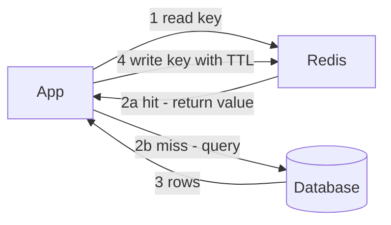
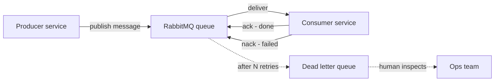
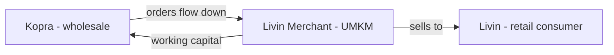

# Bank Mandiri DDL — Round 3: Team Lead Interview

- **Written:** 2026-07-28
- **Round:** Interview 3 of 3 — with a **Team Lead**
- **Round 1 status:** ✅ done (Department Head, simple introduction)
- **Previous round:** [Round 2 — Project Manager](bank-mandiri-ddl-round2-project-manager.md) *(different interview, different preparation)*
- **Companion notes:** [DDL company prep](bank-mandiri-ddl-interview-prep.md) · [technical question bank](bank-mandiri-ddl-technical-user-interview-questions.md)

> ⚠️ **This note is only for the Team Lead round.** This is the deep technical round and probably your future direct manager. Process, estimation, and delivery questions belong to the [PM round note](bank-mandiri-ddl-round2-project-manager.md).

## TL;DR

- This is **the real technical gate**. The Team Lead decides whether you can actually build on their team.
- Confirmed stack: **Java, Redis, RabbitMQ, Sentry, Elastic** backend · **Kotlin/Swift** mobile · **Angular/React** web.
- **You don't need Java to sound senior here.** Redis, RabbitMQ, Elastic, and Sentry are language-independent concepts you already understand. Talk tradeoffs, not syntax.
- **RabbitMQ is your strongest bridge** — it does the same job as the Azure Service Bus you used at Unloan.
- **Lead with the mechanism.** Your recorded weakness from the 2026-07-28 mock: you buried a strong idempotency answer behind vague framing for three follow-ups. Fix that here.
- Never bluff in this round. A Team Lead detects it instantly, and "I don't know, here's how I'd find out" scores higher than a confident wrong answer.
- **"SMI" is SME** — Bank Mandiri's Small and Medium Enterprise segment. **Your DBO platform is structurally the same product**, which makes this your strongest fit story of the entire process. See section 6b.

---

## 1. Who you are talking to, and what they want

A Team Lead is a working engineer who runs a team. They will likely be your direct manager. They are asking two questions at once:

1. **"Can this person build things on my team?"** — real technical judgment, not trivia.
2. **"Will this person make my team better or worse?"** — code review, mentoring, how you handle being wrong.

**What separates a mid-level answer from a senior one here:** juniors describe *what* they did; seniors describe *why they chose it and what it cost*. Every technical answer should end with a tradeoff.

---

## 2. The stack — deep dive, with the questions they'd ask

Learn the **why and the tradeoff** for each. Nobody will ask you to write Java on a whiteboard in this round; they will ask whether you understand what these tools are for.

### 2.1 Java — the honest position

Handle this **early and calmly**. If you wait to be caught, it looks like you were hiding it.

> "Terus terang, pengalaman produksi backend saya di Node.js dan TypeScript, bukan Java. Yang saya bawa adalah konsep arsitekturnya — microservices, message queue, caching, idempotency untuk operasi uang — dan itu semua sudah saya kerjakan langsung di production.
>
> Saya juga sudah pernah membuktikan bisa pindah ekosistem: saya belajar .NET dan C# dari nol untuk satu technical assessment, dari background Node/TypeScript, dan lolos tahap teknisnya. Java secara konsep lebih dekat lagi ke .NET — strongly typed, OOP, ekosistem enterprise. Jadi yang perlu saya kejar sintaks dan tooling-nya, bukan cara berpikirnya."

**If they push: "berapa lama Anda butuh untuk produktif di Java?"**
> "Untuk mulai mengerjakan task yang jelas dengan code review, saya perkirakan beberapa minggu. Untuk benar-benar nyaman dengan ekosistemnya — Spring, build tool, konvensi tim — realistisnya beberapa bulan. Saya lebih suka kasih angka yang jujur daripada menjanjikan langsung bisa."

**Concepts worth knowing by name** (so you can follow the conversation, not to claim expertise):
- **Spring / Spring Boot** — the dominant Java framework for building services. Handles dependency injection, HTTP endpoints, database access.
- **Dependency injection** — objects receive their dependencies from outside instead of creating them. Makes testing far easier. You've met the same idea in NestJS or via constructor injection patterns.
- **JVM** — the runtime Java compiles to. Relevant because memory tuning and garbage collection pauses are real production concerns in banks.

### 2.2 Redis — the fast in-memory store

**What it is:** a database that keeps data in RAM instead of on disk. Reads take microseconds instead of milliseconds.

**Why a bank channel uses it:**

| Use | Example in a bank |
|---|---|
| **Caching** | Store the result of a slow core-banking lookup so the next request doesn't hit the core again |
| **Session storage** | Who is logged in, shared across many app servers |
| **Rate limiting** | How many OTP requests this phone number made in the last minute |
| **Distributed lock** | Make sure only one server processes a given job at a time |

**The cache-aside pattern** — the most common way to use a cache. Notice the app, not the cache, decides what to do on a miss:

**The tradeoffs to raise — this is where you sound senior:**

- **Stale data.** A cache holds a copy. If the underlying data changes, the copy is wrong until it expires or you delete it. In banking this is dangerous.
- **TTL (time to live)** — how long before an entry expires automatically. Short TTL = fresher but more database load. Long TTL = faster but staler.
- **Invalidation** — actively deleting the cached entry when the data changes. Harder than TTL, but necessary for anything that must be correct immediately.
- **Cache stampede** — when a popular key expires and hundreds of requests all hit the database at the same instant. Mitigated by staggering expiry or letting only one request rebuild the entry.

**Likely question — "Kapan Anda pakai cache, dan apa risikonya?"**

> "Saya pakai cache untuk data yang sering dibaca, jarang berubah, dan boleh sedikit basi — misalnya konfigurasi, daftar produk, atau kurs. Itu memangkas beban ke database dan ke core system.
>
> Yang tidak saya cache: data yang harus akurat saat itu juga. Contoh paling jelas di banking, saldo setelah transaksi. Kalau user baru transfer lalu lihat saldo lama, itu masalah kepercayaan — lebih buruk daripada lambat setengah detik.
>
> Kalau memang harus di-cache tapi juga harus akurat, saya invalidate cache-nya begitu transaksi commit, bukan mengandalkan TTL. Dan satu hal yang perlu diperhatikan: cache tidak boleh jadi sumber kebenaran — kalau Redis mati, sistem harus tetap jalan meski lebih lambat, bukan ikut mati."

That last sentence is a strong senior signal.

### 2.3 RabbitMQ — the message queue (your strongest bridge)

**What it is:** a message broker. A producer drops a message into a queue; a consumer picks it up later. The two services never call each other directly.

**Your bridge — say this early:**
> "Di Unloan saya pakai Azure Service Bus, dan fungsinya sama seperti RabbitMQ — message broker untuk komunikasi asynchronous antar service. Konsepnya identik: producer, queue, consumer, retry, dead-letter queue. Yang berbeda cuma nama produknya."

**The flow, including what happens when processing fails:**

**Vocabulary that signals real experience:**

- **Ack / nack** — the consumer tells the queue "processed" or "failed". Ack too early and a crash loses the message.
- **Dead-letter queue (DLQ)** — where a message goes after failing repeatedly, so it stops blocking the queue and a human can inspect it.
- **At-least-once delivery** — the broker guarantees a message arrives, but it may arrive **more than once**. Therefore the consumer **must be idempotent**. This connects straight to your best story.
- **Ordering** — queues don't guarantee global order once you have multiple consumers. If order matters (transaction sequence for one account), you need a partition key or single consumer for that account.
- **Backpressure** — what happens when messages arrive faster than they're consumed. The queue grows; you need monitoring and alerts on queue depth.

**Likely question — "Kapan pakai message queue, kapan panggil API langsung?"**

> "Synchronous kalau user sedang menunggu jawabannya sekarang — cek saldo, login, konfirmasi transaksi. User butuh hasilnya di layar.
>
> Queue kalau pekerjaannya boleh selesai beberapa saat kemudian — kirim notifikasi, generate laporan, sinkronisasi ke sistem lain — atau kalau saya butuh sistem tetap jalan meski service tujuannya sedang mati. Pesannya menunggu di queue, tidak hilang.
>
> Tapi queue itu menambah kompleksitas: harus memikirkan pesan ganda, urutan, monitoring queue depth, dan penanganan pesan yang gagal terus. Jadi saya tidak pakai queue kalau tidak ada alasan yang jelas — panggilan langsung yang sederhana lebih mudah di-debug."

**Likely question — "Bagaimana menangani pesan duplikat?"** → **This is your single best question.** See section 3.1.

### 2.4 Elasticsearch — search and logs

**What it is:** a search engine that indexes text so you can search millions of records quickly and rank results by relevance.

**Two distinct uses in a bank — know both:**

1. **Product search** — transaction history search, merchant lookup. Fast text search across large datasets.
2. **Log aggregation** — every service ships its logs into one searchable place (often the ELK stack: Elasticsearch, Logstash, Kibana). This is how you investigate a failure at 2 AM across ten services.

**The critical point to make:**
> "Elasticsearch itu salinan untuk pencarian, bukan sumber kebenaran. Database tetap yang benar. Salinan di Elastic bisa tertinggal beberapa detik karena proses indexing-nya asynchronous. Jadi untuk menampilkan hasil pencarian, itu cukup. Tapi untuk menampilkan saldo atau memutuskan sebuah transaksi, saya selalu baca dari database."

**Banking-specific angle worth one sentence:**
> "Dan untuk logging, satu hal yang saya jaga: data nasabah tidak masuk ke log dalam bentuk terbuka. Di Unloan kalau perlu debug, kami pakai loan ID atau user ID, bukan data pribadinya."

### 2.5 Sentry — production error tracking

**What it is:** catches errors in production, groups identical errors together, and alerts the team — with the stack trace, the release version, and how many users were affected.

**Why it matters:** without it, you learn about bugs from angry customers.

**What to say:**
> "Sentry membuat error produksi kelihatan segera, bukan menunggu laporan user. Yang paling berguna buat saya: error dikelompokkan, jadi kelihatan mana yang paling sering dan paling luas dampaknya — bukan sekadar daftar panjang. Dan bisa dilacak muncul sejak release mana, jadi cepat ketahuan perubahan mana yang menyebabkannya.
>
> Untuk aplikasi perbankan, satu hal yang harus dijaga: pastikan data nasabah tidak ikut terkirim ke error report. Stack trace kadang membawa isi request, dan itu perlu di-filter."

That last point is rare and lands well.

---

## 3. Core technical questions — with model answers

### 3.1 Idempotency and duplicate handling — your strongest topic

**Q: "Kalau ada pesan duplikat dari queue, atau user retry request-nya, bagaimana Anda mencegah proses ganda?"**

⚠️ **Lead with the mechanism in the first sentence.** In your 2026-07-28 mock you opened with "event driven architecture" and needed three follow-ups before giving the real answer. Don't repeat that.

> "Prinsipnya idempotency — request yang sama diproses dua kali harus menghasilkan efek yang sama seperti diproses sekali. Konkretnya saya pakai tiga lapis:
>
> **Pertama, idempotency key.** Setiap request bawa UUID unik. Server simpan key itu; kalau key yang sama datang lagi, kembalikan hasil yang tersimpan, jangan proses ulang.
>
> **Kedua, unique constraint di database.** Ini jaminan struktural — meski logika aplikasinya bocor, database menolak baris duplikat. Ini yang paling saya andalkan karena tidak bergantung pada kode yang benar.
>
> **Ketiga, duplicate detection di message broker.** Di Unloan kami pakai Azure Service Bus yang bisa menolak pesan duplikat dalam time window tertentu.
>
> Yang saya pelajari dari insiden nyata: duplicate delivery itu bukan bug pengirim — itu memang kontraknya. Penerima yang harus idempotent."

**Follow-up they will likely ask: "Ceritakan insiden nyatanya."** → the TADA story:

> "Di platform B2B yang saya bangun, ada dua event webhook duplikat dari partner yang masuk hampir bersamaan. Keduanya mengecek 'sudah diproses belum?' sebelum salah satunya sempat commit — jadi keduanya merasa belum. Akibatnya toko menerima poin dua kali lipat: harusnya 100, jadi 200.
>
> Yang saya lakukan: telusuri lewat point history, ketemu dua event identik terpaut milidetik. Saya koreksi saldo yang terdampak, lalu tambahkan row-level locking supaya pengecekan dan penulisan terjadi atomic. Dan saya sampaikan ke client secara terbuka, tidak diam-diam diperbaiki.
>
> Kalau membangun ulang sekarang, saya akan tambah lapisan lagi: dedupe berdasarkan event ID, guarded state transition, dan ledger yang append-only supaya setiap perubahan saldo bisa ditelusuri."

**Why this is your best answer:** it's about money correctness, integrity, and fixing the class of bug — exactly what a bank cares about.

### 3.2 Architecture walkthrough

**Q: "Ceritakan arsitektur sistem yang pernah Anda bangun dan kenapa Anda memilih desain itu."**

Structure: problem → pieces → **why each split** → what you'd change now.

> "Di DBO, sistemnya melayani tiga frontend — aplikasi mobile untuk toko, CMS untuk admin, dan panel verifikasi — plus integrasi ke tiga sistem pihak ketiga untuk pembayaran poin, order, dan OTP.
>
> Saya pisahkan service berdasarkan kebutuhan operasional, bukan karena ingin microservices. Contohnya: service integrasi pihak ketiga saya pisah karena kegagalan di sana tidak boleh menjatuhkan API utama, dan karena pola bebannya berbeda — banyak menunggu jaringan. Queue saya pisah karena pekerjaannya asynchronous dan perlu di-scale terpisah.
>
> Kalau ditanya apa yang akan saya ubah: sebagian pemisahan sebenarnya belum perlu di awal. Untuk skala kami saat itu, monolith yang tertata rapi mungkin lebih mudah dioperasikan, dan pemisahan bisa dilakukan belakangan waktu bebannya sudah jelas. Memisahkan terlalu awal itu menambah biaya operasional tanpa manfaat yang sepadan."

**Admitting the over-split is a senior signal** — it shows judgment, not dogma.

### 3.3 Production debugging

**Q: "Ada bug di production yang tidak bisa direproduksi di lokal. Bagaimana Anda mencarinya?"**

A structured method beats a clever guess:

> "Pertama, kumpulkan bukti sebelum menebak — log dari Elastic, error report dari Sentry, berapa banyak user yang terdampak, dan sejak kapan mulai muncul. 'Sejak kapan' penting, karena biasanya mengarah ke release atau perubahan konfigurasi tertentu.
>
> Kedua, cari apa yang berbeda antara production dan lokal. Biasanya salah satu dari: volume data jauh lebih besar, respons pihak ketiga yang asli berbeda dari mock, concurrency — banyak request bersamaan, atau konfigurasi yang berbeda.
>
> Ketiga, buat satu hipotesis dan uji itu dulu. Kesalahan yang sering terjadi adalah mengubah banyak hal sekaligus, lalu tidak tahu mana yang sebenarnya berpengaruh.
>
> Keempat, kalau bisa, reproduksi dengan data yang menyerupai production.
>
> Terakhir, setelah ketemu, saya perbaiki dan tambahkan test untuk kasus itu supaya tidak balik lagi diam-diam.
>
> Satu hal lagi: kalau dampaknya besar ke user, saya mitigasi dulu — rollback atau matikan fiturnya — baru investigasi. Jangan biarkan user terus terdampak sementara kita masih mencari."

That final paragraph is the part most candidates forget, and it's the part a bank cares about most.

### 3.4 Database and PostgreSQL

**Q: "Bagaimana Anda menangani query yang lambat?"**

> "Pertama saya lihat dulu apa yang sebenarnya terjadi — pakai EXPLAIN untuk melihat rencana eksekusinya, apakah dia melakukan sequential scan di tabel besar padahal seharusnya bisa pakai index.
>
> Penyebab paling sering yang saya temui: tidak ada index di kolom yang dipakai untuk filter atau join, atau query-nya mengambil jauh lebih banyak data daripada yang dibutuhkan.
>
> Tapi index bukan gratis — setiap insert dan update harus ikut memperbarui index-nya. Jadi di tabel yang sangat sering ditulis, menambah index ada biayanya. Itu tradeoff yang perlu ditimbang, bukan asal tambah index."

**Q: "Apa itu N+1 query dan bagaimana Anda mengatasinya?"**

> "N+1 itu ketika kita mengambil satu daftar — misalnya 100 order — lalu untuk setiap order kita query lagi datanya satu-satu. Jadi bukan 1 query, tapi 101. Di GraphQL ini sangat sering terjadi karena setiap field bisa memicu query sendiri.
>
> Solusinya batching — kumpulkan dulu semua ID yang dibutuhkan, lalu ambil sekaligus dalam satu query. Di ekosistem yang saya pakai, DataLoader melakukan itu. Konsepnya sama di framework mana pun."

**Q: "Bagaimana Anda melakukan migrasi schema tanpa downtime?"**

> "Pakai pola expand-migrate-contract. Tidak pernah mengubah kolom secara langsung dalam satu langkah.
>
> Contohnya kalau mau ganti nama kolom: pertama tambahkan kolom baru — aplikasi lama masih jalan karena kolom lama masih ada. Lalu tulis ke keduanya sambil memindahkan data lama. Setelah semua instance aplikasi sudah pakai kolom baru, baru kolom lama dihapus.
>
> Prinsipnya: setiap tahap harus kompatibel dengan versi aplikasi yang sedang berjalan, karena saat deploy ada momen di mana versi lama dan baru jalan bersamaan."

### 3.5 Frontend — React (your home ground)

DDL's web stack is Angular/React. Be specific and confident here; this is where you're strongest.

**Q: "Bagaimana Anda menangani performa di aplikasi React yang besar?"**

> "Pertama saya ukur dulu, tidak menebak — pakai React DevTools Profiler untuk lihat komponen mana yang re-render berlebihan dan berapa lama.
>
> Penyebab paling sering: state ditaruh terlalu tinggi di tree, jadi satu perubahan kecil memicu re-render seluruh halaman. Solusinya sering cukup dengan memindahkan state lebih dekat ke komponen yang memakainya.
>
> Setelah itu baru teknik lain: memo untuk komponen yang mahal, useMemo untuk perhitungan berat, virtualization untuk daftar panjang supaya hanya yang terlihat di layar yang dirender, dan code splitting supaya bundle awalnya kecil.
>
> Tapi saya tidak membungkus semuanya dengan useMemo dan useCallback secara default — itu ada biayanya sendiri dan membuat kode lebih sulit dibaca. Saya pakai kalau memang terbukti ada masalah."

**Q: "Kesalahan apa yang sering terjadi dengan hooks?"**

> "Yang paling sering: dependency array yang tidak lengkap di useEffect, sehingga effect-nya memakai nilai lama — stale closure. Gejalanya aneh: fungsi jalan tapi datanya versi sebelumnya.
>
> Kedua, fetch data di useEffect tanpa cleanup. Kalau komponennya sudah unmount atau parameternya berubah sebelum request selesai, hasilnya bisa datang terlambat dan menimpa data yang lebih baru — race condition. Solusinya cleanup function atau AbortController.
>
> Ketiga, membuat objek atau fungsi baru di setiap render lalu dipakai sebagai dependency — itu membuat effect-nya jalan terus setiap render."

**Q: "Bagaimana Anda memilih state management?"**

> "Saya mulai dari yang paling sederhana. State lokal dulu kalau cuma dipakai satu komponen. Kalau perlu dibagi ke beberapa komponen dalam satu area, angkat ke parent atau pakai context.
>
> Tapi yang penting dibedakan: server state dan client state itu masalah berbeda. Data yang datang dari API punya masalah caching, refetching, dan sinkronisasi — itu lebih cocok ditangani library seperti Apollo, yang sudah saya pakai, atau React Query. Global store baru saya pakai untuk client state yang benar-benar lintas halaman."

### 3.6 Security

**Q: "Bagaimana Anda mengamankan API?"**

Cover authentication, authorization, and transport — and never say "encrypt the password":

> "Autentikasi dan otorisasi saya bedakan dulu: autentikasi itu memastikan siapa dia, otorisasi itu apa yang boleh dia lakukan. Banyak celah keamanan muncul karena autentikasinya benar tapi otorisasinya tidak dicek — user yang valid bisa mengakses data user lain hanya dengan mengganti ID di request.
>
> Password disimpan dengan hashing — satu arah, pakai algoritma yang memang dirancang lambat seperti bcrypt atau Argon2, bukan enkripsi, karena enkripsi bisa dibalik.
>
> Token punya masa berlaku pendek. Untuk JWT, tradeoff utamanya adalah pencabutan: token tetap valid sampai kedaluwarsa kecuali kita simpan daftar token yang dicabut — dan begitu melakukan itu, sebagian keuntungan statelessness-nya hilang.
>
> Lalu rate limiting, terutama di endpoint OTP — itu bukan cuma soal penyalahgunaan, tapi juga biaya, karena setiap SMS ada harganya. Dan data pribadi tidak masuk log dalam bentuk terbuka."

### 3.7 Possible hands-on portion

Some Team Lead rounds include a small coding or design exercise. Nothing in Bank Mandiri candidate reports confirms a LeetCode-style test for this track, but be ready for something light:

- **Code reading** — "what's wrong with this function?" Look for: missing error handling, race conditions, N+1 queries, missing input validation, unclosed resources.
- **Small design** — "design an OTP verification flow" or "design transaction history with search". Start with requirements and constraints before drawing. Mention rate limiting, expiry, idempotency, and where the data actually lives.
- **Your own code walkthrough** — be ready to screen-share and explain a piece of DBO or Unloan. Explain the *why*, not line by line.

---

## 4. People and ways-of-working questions

The Team Lead cares about this almost as much as the technical part.

**Q: "Bagaimana Anda melakukan code review, terutama ke junior?"**

> "Saya mulai dengan menyebut yang sudah bagus, bukan langsung daftar koreksi — itu bukan basa-basi, tapi supaya jelas mana yang memang sudah benar dan tidak perlu diubah.
>
> Untuk perubahan, saya jelaskan alasannya, bukan cuma perintahnya. 'Ini sebaiknya diubah' tanpa alasan tidak membuat orang belajar. Dan saya lebih sering bertanya daripada memerintah — 'kalau input-nya kosong bagaimana?' biasanya lebih efektif daripada 'tambahkan validasi'.
>
> Saya juga pisahkan mana yang harus diperbaiki sebelum merge dan mana yang cuma saran, supaya orangnya tidak kewalahan dan tahu prioritasnya.
>
> Dan kalau feedback-nya banyak atau menyangkut desain, saya ngobrol langsung — bukan meninggalkan 30 komentar. Tulisan panjang gampang terasa lebih keras dari maksudnya."

**Q: "Ada anggota tim yang bug-nya berulang terus. Apa yang Anda lakukan?"**

⚠️ In the mock this stayed abstract. **Add a concrete outcome this time.**

> "Saya cari akar masalahnya dulu sebelum memberi solusi, karena bug berulang biasanya bukan soal 'kurang teliti' — ada gap yang spesifik.
>
> Cara saya: ajak pair programming sekali, lihat bagaimana dia menerjemahkan task jadi kode. Dari situ biasanya kelihatan — apakah dia belum paham produknya, belum terbiasa dengan tool-nya, atau belum punya mental model untuk pola tertentu.
>
> Waktu di DBO ada kasus seperti ini, dan setelah pair programming ternyata masalahnya di pemahaman konkurensi — dia belum terbayang dua request bisa masuk bersamaan. Jadi saya tunjukkan langsung bagaimana saya menangani kasus serupa dan kenapa saya pakai locking di titik tertentu.
>
> Beberapa sprint berikutnya jenis bug itu tidak muncul lagi dari dia, dan yang lebih bagus, dia mulai menandai hal serupa waktu review kode orang lain."

**Q: "Bagaimana kalau Anda tidak setuju dengan keputusan teknis saya sebagai lead?"**

> "Saya sampaikan keberatannya dengan alasan dan tradeoff-nya, bukan preferensi. Dan biasanya saya tanya dulu, karena sering ada batasan yang saya belum tahu — apalagi di bank, banyak keputusan dipengaruhi keamanan, regulasi, atau sistem lama yang tidak kelihatan dari kodenya.
>
> Kalau setelah diskusi keputusannya tetap berbeda, saya jalankan sepenuhnya. Yang tidak saya lakukan: setuju di depan lalu mengerjakan dengan setengah hati."

**Q: "Apa yang Anda lakukan kalau tidak tahu sesuatu?"**

> "Saya bilang tidak tahu, lalu jelaskan bagaimana saya akan mencarinya. Untuk pekerjaan sehari-hari, saya kasih batas waktu untuk riset sendiri — misalnya setengah hari — lalu kalau masih mentok saya tanya, bukan menghabiskan dua hari diam-diam. Dan hasilnya saya catat supaya orang berikutnya tidak mengulang."

**Never bluff in this round.** A Team Lead will follow up, and a collapsing answer costs more than an honest "I don't know."

---

## 5. Red flags — what not to do in this round

| Don't | Why it hurts | Do instead |
|---|---|---|
| Bluff about Java or Kotlin | They will follow up and it will collapse | Own the gap, pivot to concepts + the .NET proof |
| Say "event-driven architecture" as a reliability answer | It's a category, not a mechanism | Name the mechanism first: idempotency key, unique constraint, dedup |
| Say "encrypt the password" | Red flag in any bank | Hashing — one-way, bcrypt or Argon2 |
| Describe only *what* you built | Sounds mid-level | End every answer with the tradeoff |
| Claim the architecture was perfect | Sounds inexperienced | Name one thing you'd do differently |
| Claim deep SME banking expertise | You have the product shape, not the banking domain | "Bentuknya mirip yang saya bangun, tapi skala dan regulasinya yang ingin saya pelajari" |
| Answer an adjacent question | Your recorded mock weakness | Restate the question mentally, then answer *that* |

---

## 6. Questions to ask the Team Lead (pick 2–3)

This round deserves technical and team questions — this person knows the actual work.

- ⭐ **"Untuk engineer yang datang dari background Node/TypeScript, biasanya onboarding ke ekosistem Java di tim ini seperti apa?"** — acknowledges your gap honestly and shows you're already planning to close it. Strong move.
- "Kalau saya bergabung, saya masuk ke area yang mana — Retail, Segment Internal, atau SME? Dan di layer mana, backend atau web?"
- "Tantangan teknis terbesar tim dalam 1–2 tahun ke depan apa — skala, keandalan, atau kecepatan rilis?"
- "Bagaimana proses code review dan deployment di tim ini? Berapa sering rilis ke production?"
- "Menurut Anda, apa yang membedakan engineer yang berkembang cepat di tim ini dengan yang biasa saja?"

> ✅ **"SMI" resolved — it's SME.** See section 6b below. It's Bank Mandiri's Small and Medium Enterprise segment, and it's the best fit story you have.

---

## 6b. SME — the project area that fits you best

**SME = Small and Medium Enterprise** (UMKM in Indonesian). It's one of Bank Mandiri's three official business segments, alongside **Wholesale** and **Retail** — which means your three project areas map directly onto how the bank is organized.

### Why this matters more than the other two areas

**Your DBO platform is structurally the same product.** This is not a stretch — it's a direct match:

| What Bank Mandiri's SME ecosystem does | What DBO did |
|---|---|
| SMEs receive orders from larger counterparties | Material stores ordered stock from brands |
| SMEs collect payments | Point/payment integration you built |
| SMEs manage stock | Order and inventory flows |
| SMEs access working capital | The gap you already identified in your product idea |
| Small businesses served through a mobile app | Your mobile app for toko |

You built a B2B commerce platform where **small businesses order from a larger supplier, pay, and track it** — used by tens of thousands of stores. That is exactly the shape of SME banking, minus the banking license.

### The numbers to know (June 2026)

Pick one or two — quoting all of them sounds rehearsed.

| Figure | Value | Why it matters |
|---|---|---|
| **Euromoney award** | **Asia's best SME banking ecosystem 2026** | Bank Mandiri is genuinely proud of this — worth one mention |
| Kopra registered users | ~354,000 (June 2026), +26.8% YoY | **~84% are UMKM players** |
| Livin' Merchant users | ~2.6 million (March 2025), +35% YoY | The UMKM-facing app, launched June 2023 |
| Micro business credit | Rp 31.3 trillion, +15.7% YoY | The lending side is growing fast |
| Commercial credit outstanding | Rp 343 trillion (June 2026), +15.1% YoY | Scale of the segment |
| Strategic target | **SME to reach 30% of total loans by 2026** | This segment is a priority, not a side project |

### The three connected platforms — know how they fit together

Bank Mandiri deliberately links three platforms so a business never has to leave the bank's ecosystem:

- **Kopra by Mandiri** — wholesale/corporate. Large companies, suppliers, distributors.
- **Livin' Merchant** — the UMKM-facing app: manage transactions, accept payments, run business operations.
- **Livin' by Mandiri** — the retail consumer app.

The strategy: an SME can receive orders, collect payments, manage stock, and access working capital **without leaving Bank Mandiri's infrastructure**.

### How to say it — the fit story

Use this if SME comes up, or when they ask which area interests you:

> "Kalau boleh jujur, area SME yang paling menarik buat saya — karena bentuknya paling dekat dengan yang sudah saya kerjakan. Platform B2B yang saya bangun di DBO itu persis pola ini: toko material — yang secara ukuran memang UMKM — memesan stok dari brand, bayar lewat sistem, dan semuanya lewat aplikasi mobile. Sekarang dipakai puluhan ribu toko.
>
> Jadi masalah-masalah yang muncul di sana sudah saya alami langsung: integrasi pembayaran, konsistensi data order, dan yang paling sering — arus kas toko, karena mereka harus bayar stok di depan sebelum barangnya laku. Yang saya lihat di ekosistem Mandiri, itu yang dijawab lewat akses modal kerja di dalam platform yang sama.
>
> Bedanya di skala dan di sisi regulasinya — dan itu justru yang ingin saya pelajari."

**Why this lands:** you're not claiming banking expertise. You're saying "I've built this exact product shape for real users, at a smaller scale" — which is credible, specific, and immediately useful to them.

### One optional deeper point, if the conversation opens

Your supply-chain-financing idea from the earlier prep now has a confirmed home:

> "Satu hal yang saya perhatikan waktu membangun platform B2B: kita punya seluruh riwayat transaksi toko — berapa sering pesan, berapa besar, seberapa lancar bayar. Itu sebenarnya data penilaian kredit yang jauh lebih relevan daripada agunan, terutama untuk usaha kecil yang tidak punya aset besar. Dan datanya sudah ada di sistem, tidak perlu diminta lagi ke nasabah."

Keep it to 30 seconds. It's a thinking sample, not a proposal.

---

## 7. Cheatsheet — read 10 minutes before this round

**Lead with the mechanism. Always.**
Reliability question → "idempotency key, unique constraint di database, dan duplicate detection di broker." That sentence first, explanation after.

**Your three bridges into their stack:**
1. **RabbitMQ ← Azure Service Bus** (Unloan) — same concepts, different product name.
2. **React ← your daily work** — the web side is a direct match.
3. **Idempotency & money correctness ← TADA + Unloan** — your single strongest topic.

**One-line definitions:**
- **Redis** — in-memory store. Fast. Risk: stale data. Never the source of truth. Never cache a post-transaction balance.
- **TTL** — how long a cached entry lives before expiring.
- **Cache-aside** — app checks cache, on miss reads DB and writes back to cache.
- **RabbitMQ** — message broker. Producer → queue → consumer.
- **DLQ** — where messages go after repeated failure, so they don't block the queue.
- **At-least-once** — messages may arrive twice → **consumer must be idempotent**.
- **Elasticsearch** — fast search + log aggregation. A lagging copy, never the source of truth.
- **Sentry** — production error tracking, grouped by issue and release. Keep PII out of it.
- **Expand-migrate-contract** — add new, migrate data, remove old. Never break in one step.

**End every technical answer with a tradeoff.** That's the difference between mid and senior.

**The Java answer, short version:**
Node/TypeScript in production, not Java — but the same architecture concepts, and proven ability to switch ecosystems (.NET from zero, passed the technical round).

**Honesty beats confidence:** "Saya belum pernah pakai itu, tapi cara saya mencari tahunya begini" scores higher than a wrong confident answer.

---

## 8. Before the interview

1. Practice the **idempotency answer** leading with the mechanism — say it out loud until the first sentence is the mechanism, not the framing. This was your recorded mock weakness.
2. Practice the **Java gap answer** until it's calm, not apologetic.
3. Read the **Redis and RabbitMQ tradeoffs** once — understand the *why*, not commands.
4. Prepare the **DBO architecture walkthrough**, including one thing you'd do differently.
5. Have the **mentoring story with its concrete outcome** ready.
6. Write your questions where you can see them.

Want to rehearse this round live? Run `/mock-interview bank mandiri team lead`.

---

## Sources

- Candidate's own notes from Round 1 (Department Head, 2026-07-28) — stack and project areas stated directly by the interviewer
- [Technical Lead Interview Questions — Workable](https://resources.workable.com/technical-lead-interview-questions) — code quality, mentoring, architecture
- [22 Senior Software Engineer Interview Questions — CodeSignal](https://codesignal.com/blog/22-senior-software-engineer-interview-questions-and-answers/) — production debugging scenarios
- [Tech Lead Interview Questions 2026 — Haystack](https://haystackapp.io/interview-questions/hire-tech-leadership) — leadership and team-dynamics questions
- [50 Technical Team Lead Interview Questions — DigitalDefynd](https://digitaldefynd.com/IQ/technical-team-lead-interview-questions/) — team quality and process questions
- [RabbitMQ vs Redis — AWS](https://aws.amazon.com/compare/the-difference-between-rabbitmq-and-redis/) — broker vs cache, when each fits
- [Top 40 RabbitMQ Interview Questions — Mindmajix](https://mindmajix.com/rabbitmq-interview-questions) — ack, DLQ, delivery guarantees
- [RabbitMQ vs Redis comparative analysis — Krybot](https://blog.krybot.com/t/rabbitmq-vs-redis-a-comparative-analysis-of-message-queueing-and-caching/31702) — durability and routing tradeoffs
- [Bank Mandiri — Profil Perusahaan](https://www.bankmandiri.co.id/en/profil-perusahaan) — Wholesale, SME, Retail business segments
- Related workspace notes: [Round 2 — Project Manager](bank-mandiri-ddl-round2-project-manager.md), [DDL technical question bank](bank-mandiri-ddl-technical-user-interview-questions.md), [DBO case study](../dbo-b2b-platform-system-design-case-study.md), [mock interview 2026-07-28](mock-interview-bank-mandiri-2026-07-28.md)
- [Asia's best SME banking ecosystem 2026: Bank Mandiri — Euromoney](https://www.euromoney.com/article/3mmme4u5dx2c8g4o4ccok84kw/corporate-banking/asias-best-sme-banking-ecosystem-2026-bank-mandiri/) — SME award, the three-platform ecosystem, working capital inside the platform
- [Bank Mandiri Perkuat Sinergi Ekosistem dan Kredit di Kuartal II 2026 — CNN Indonesia](https://www.cnnindonesia.com/ekonomi/20260724161501-625-1384577/bank-mandiri-perkuat-sinergi-ekosistem-dan-kredit-di-kuartal-ii-2026) (24 July 2026) — Kopra 354k users, 84% UMKM, micro credit Rp 31.3T
- [Bank Mandiri: Kredit komersial capai Rp343 triliun — ANTARA News](https://www.antaranews.com/berita/5662881/bank-mandiri-kredit-komersial-capai-rp343-triliun-npl-063-persen) (June 2026) — commercial credit scale
- [Bank Mandiri: Building the Digital Backbone of Indonesia's Economy — Global Finance](https://gfmag.com/transaction-banking/bank-mandiri-building-the-digital-backbone-of-indonesias-economy/) — Livin' Merchant UMKM users, platform linkage
