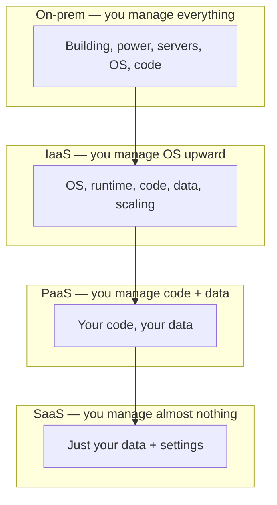
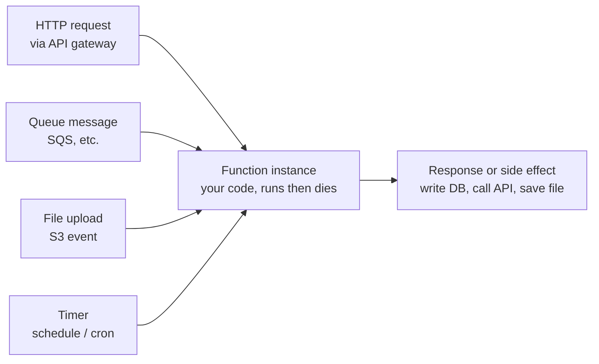
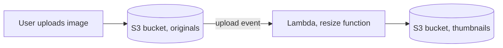

# Cloud Computing Models (IaaS, PaaS, SaaS, FaaS) + Serverless in Depth

- **Researched:** 2026-07-08
- **Target:** Software Engineer / Senior Software Engineer (general readiness, no specific company)
- **Sources freshness:** mostly 2025–2026
- **How to read this note:** Part 1 is the service-model ladder (IaaS→SaaS). Part 2 maps it to YOUR real setup (CapRover, Vercel, Hasura). Part 3 is the serverless deep dive — the core of the note. End with the cheatsheet.
- **Related notes (don't duplicate, link):** [`load-balancers-microservices-online-shop.md`](load-balancers-microservices-online-shop.md) has a serverless-vs-containers decision card. [`dbo-b2b-platform-system-design-case-study.md`](dbo-b2b-platform-system-design-case-study.md) is your real system. [`system-design-basics-senior-fullstack-interview.md`](system-design-basics-senior-fullstack-interview.md) covers edge/serverless trends.

## TL;DR

- The models are a ladder of "who manages what." **IaaS** = you rent a bare computer. **PaaS** = you push code, they run it. **SaaS** = you just log in and use finished software. **FaaS/serverless** = you upload one function, they run it only when it is called.
- **Pizza analogy:** IaaS = take-and-bake (they give ingredients, you cook). PaaS = delivery (cooked, you supply the table). SaaS = dining out (you do nothing but eat). Make-at-home = on-prem (your own servers).
- **Your real setup already spans the ladder:** CapRover on a VPS = IaaS plus a self-hosted PaaS layer ("I run my own mini-Heroku"). Vercel for Next.js = PaaS with serverless functions. Hasura Cloud = SaaS. Say this in interviews.
- **Serverless does not mean "no servers."** Servers exist. You just never see or manage them. Key traits: scale-to-zero, pay-per-invocation, event-driven. You already use it: every Next.js API route on Vercel IS a serverless function.
- **Two things bite you with serverless.** Cold starts (a new function instance takes ~100–500ms to boot) and the Postgres connection explosion (each instance opens its own DB connection). Both have known fixes.

---

## Part 1 — The Service Models (one ladder, one example)

### The problem the ladder solves

Running software needs a stack of things: a physical machine, an operating system, a runtime (like Node.js), your code, and your data. Someone has to own each layer. The models differ only in **where the line is drawn** between "the provider handles this" and "you handle this."

**The everyday analogy — pizza (memorize this):**

- **Make it at home (on-prem):** you buy the oven, the ingredients, everything. Full control, full work.
- **Take-and-bake (IaaS):** they sell you dough and toppings. You still bake it in your oven. — *You get a machine, you install and run everything on it.*
- **Delivery (PaaS):** the pizza arrives cooked. You supply the table, drinks, and plates. — *You supply code; they cook and run it.*
- **Dining out (SaaS):** you show up and eat. No cooking, no dishes. — *You just use finished software.*

### The "who manages what" ladder

Term first: a **managed** layer means the cloud provider takes care of it for you. An **unmanaged** layer means it is your job.

Diagram — read bottom-up. Notice: your responsibility shrinks as you climb. The provider's grows.



### IaaS — Infrastructure as a Service

- **Plain words:** you rent a computer (a virtual machine) over the internet. It boots up empty. You install the operating system updates, Node.js, your app, everything.
- **You manage:** OS patches, runtime, your app, scaling, restarts, backups.
- **Provider manages:** the physical hardware, the data center, the network, the virtualization layer (the software that slices one big machine into many virtual ones).
- **Real products:** AWS EC2, DigitalOcean Droplet, Google Compute Engine (GCE), Hetzner, Linode.
- **Monthly cost feel:** a small always-on VPS is ~$5–$40/month, flat, whether or not anyone uses it. You pay for the machine being on, not for traffic.
- **Deploy a Node/Express API here:** SSH into the box. Install Node. `git clone` your repo. Run `npm install`. Start it with a process manager like PM2 or a Docker container. Set up nginx in front. Configure HTTPS yourself. You own every step.

### PaaS — Platform as a Service

- **Plain words:** you give the platform your code (usually with `git push`). It builds it, runs it, and keeps it alive. You never touch the operating system.
- **You manage:** your code, your environment variables, your data.
- **Provider manages:** OS, runtime, building, scaling, HTTPS certificates, health checks, restarts.
- **Real products:** Heroku, Vercel, Railway, Fly.io, Render, AWS App Runner.
- **Monthly cost feel:** often free to start, then ~$5–$25/service, plus usage. You pay more per unit than raw IaaS, but you save huge operations time.
- **Deploy the same Express API here:** connect your Git repo. `git push`. Done. The platform detects Node, runs `npm install` and `npm start`, gives you a URL with HTTPS. No SSH, no nginx, no cert setup.

### SaaS — Software as a Service

- **Plain words:** finished software you log into and use. You write no deployment code at all.
- **You manage:** only your data and your account settings.
- **Provider manages:** literally everything else — the code, the servers, the updates.
- **Real products:** Gmail, Notion, Slack, Stripe (payments as a service), Hasura Cloud, Auth0.
- **Monthly cost feel:** per-seat or per-usage subscription. Predictable.
- **"Deploy an API" here:** you do not. SaaS *is* the finished product. The closest developer version is Hasura Cloud: you point it at a database and it hands you a working GraphQL API — you built no server.

### FaaS / Serverless — Function as a Service

- **Plain words:** you upload one function. The provider runs it only when something triggers it (an HTTP request, a queue message, a file upload, a timer). When idle, nothing runs and you pay nothing.
- **You manage:** just your function code and its configuration.
- **Provider manages:** everything else, plus automatic scaling from zero to thousands of copies and back.
- **Real products:** AWS Lambda, Cloudflare Workers, Vercel Functions, Google Cloud Functions, Azure Functions.
- **Monthly cost feel:** pay per invocation and per millisecond of run time. Often literally $0 at low traffic. Can get expensive at sustained high traffic (see the cost-flip below).
- **Deploy the same Express API here:** wrap it so each HTTP request maps to a function call. On Vercel, drop files in the `api/` folder — each becomes a function. On AWS, use a framework (SST, Serverless Framework, or `serverless-http` to adapt Express). No server process runs between requests.

### The shared responsibility model (one table)

Term first: the **shared responsibility model** is the cloud provider's official split of "we secure/manage this, you secure/manage that." Getting the split wrong is how data leaks happen.

| Layer | On-prem | IaaS | PaaS | SaaS / FaaS |
|---|---|---|---|---|
| Physical hardware | You | Provider | Provider | Provider |
| Patch the OS | You | **You** | Provider | Provider |
| Runtime (Node.js) | You | You | Provider | Provider |
| Scaling | You | You | Provider | Provider (auto) |
| Your app code | You | You | You | You |
| **Your data + access rules** | You | You | You | **You (always)** |

**The one line that matters:** no matter which model, *securing your own data and access rules is always your job.* The provider never does that for you.

---

## Part 2 — Where YOUR real setup fits (the most useful part)

You have touched more of this ladder than you might say out loud. Map it explicitly. These are strong interview lines because they come from real experience, not a textbook.

### CapRover on a VPS = IaaS + a self-hosted PaaS layer

- The **VPS is IaaS.** You rented a raw Linux machine. You own the OS.
- **CapRover is a PaaS layer you host yourself.** It sits on top of Docker Swarm. It gives you `git push`-to-deploy, automatic HTTPS via Let's Encrypt, an nginx load balancer, and one-click app deploys.
- **The interview line:** *"On my DBO project I run CapRover on a VPS. It's essentially my own self-hosted Heroku — a PaaS experience, but I control the underlying machine, so I keep IaaS-level control and cost."*
- **Why this is a senior signal:** it shows you understand the tradeoff. You chose to own the OS (more work, less cost, no vendor lock-in) but still gave yourself a PaaS developer experience.

### Vercel for Next.js = PaaS with serverless functions underneath

- Vercel is PaaS: you `git push`, it builds and hosts.
- But underneath, each Next.js API route and each server-rendered request runs as a **serverless function**.
- **The interview line:** *"If you use Next.js on Vercel, you already ship serverless without calling it that. Every API route is a function that scales to zero."*

### Hasura Cloud = SaaS (a managed GraphQL API)

- You did not deploy a GraphQL server. You pointed Hasura Cloud at a Postgres database and it produced a working API.
- That is SaaS for the API layer. (Self-hosting Hasura on your own CapRover would move it down to the PaaS/IaaS layer — a good tradeoff point to raise.)

### Your DBO queue+worker vs the serverless version

- In DBO you run **BullMQ workers** (long-running Node processes on Redis) for email, points, and webhooks. That is the *container* approach: processes that stay alive.
- The serverless version of the same idea: a queue message triggers a Lambda that runs, then dies. We compare these directly in Part 3.

### One-line definitions of the "-aaS" cousins

- **CaaS (Container as a Service):** you give the platform a Docker container; it runs and scales it. No OS to manage, but you keep container-level control. Examples: AWS ECS/Fargate, Google Cloud Run. *This is the sweet spot between PaaS and serverless — and it is closest to what CapRover does for you.*
- **DBaaS (Database as a Service):** a managed database. They handle backups, patching, failover. Examples: AWS RDS, Neon, Supabase, PlanetScale.
- **BaaS (Backend as a Service):** a ready-made backend (auth, database, storage, functions) behind an SDK. Examples: Firebase, Supabase. Good for MVPs and mobile.
- **On-prem vs cloud types (one line each):**
  - **On-prem:** your own servers in your own building. Full control, full cost, full work.
  - **Public cloud:** shared provider infrastructure (AWS, GCP). Cheap, elastic, you don't own it.
  - **Private cloud:** cloud-style infrastructure dedicated to one company. For strict compliance.
  - **Hybrid cloud:** mix of on-prem and public cloud, connected together.
  - **Multi-cloud:** using more than one public provider on purpose (e.g. AWS + Cloudflare) to avoid lock-in or use the best of each.

---

## Part 3 — Serverless Deep Dive (the core)

### What "serverless" really means

**The problem:** with a normal server, you rent a machine that runs 24/7. At 3am with zero users, you still pay. You also have to guess how big to make it. Too small and it crashes under a spike. Too big and you waste money.

**The solution — serverless:** you upload a function. The platform runs a copy only when a request arrives, and can run 1,000 copies at once during a spike, then drop back to zero when idle. You pay only for actual run time.

- **Servers still exist.** The name is misleading. It means *you* never see, patch, or scale a server. The provider hides all of it.
- **Analogy:** a normal server is renting an apartment — you pay rent every month even when away. Serverless is a hotel room billed by the minute — you pay only while you are in it, and the hotel finds you a room instantly no matter how many guests arrive.
- **Three defining traits:**
  - **Scale-to-zero:** no traffic, no running instances, no cost.
  - **Pay-per-invocation:** billed per call and per millisecond of compute.
  - **Event-driven:** a function runs in response to an event (a request, a message, a file, a timer).

### FaaS anatomy — trigger, instance, response

Term first: a **trigger** is the event that causes a function to run. An **instance** is one running copy of your function. Serverless creates and destroys instances automatically.

Diagram — the four common triggers into a function, then the response. Notice: the function itself is the same; only the trigger changes.



- **API gateway** = the front door that turns an HTTP request into a function call. On AWS it is literally called API Gateway. On Vercel it is built in.
- The instance handles the event, returns a result, and is then frozen or destroyed. It keeps no memory between calls.

### Cold starts — explained properly

**The problem:** when a request arrives and no warm instance exists, the platform must create a fresh one. That means: find a server, load your code, start the runtime, run any top-level setup. This first-time delay is a **cold start**.

- **Analogy:** a cold start is starting a car on a freezing morning — the first turn of the key takes longer. Once running (a "warm" instance), the next requests are instant.
- **Why it happens:** a brand-new instance must boot from nothing. A warm instance is already booted and waiting, so it skips all that.
- **Typical numbers:**
  - AWS Lambda (Node.js): ~**100–500ms** cold start. Worse inside a **VPC** (a private network — attaching a network interface adds time).
  - Cloudflare Workers: ~**0–5ms**, effectively no cold start. Reason below.
  - Vercel Edge Functions: ~**50–250ms**. Vercel Node functions: ~**200–800ms**.
- **Why Workers barely have cold starts:** Lambda boots a small container (a whole mini-machine) per instance. Workers use **V8 isolates** instead. An isolate is a lightweight sandbox inside one shared JavaScript engine — starting one is like opening a new browser tab, not booting a computer. Thousands of isolates share one process, so startup is under a few milliseconds.
- **Mitigations (know these for interviews):**
  - **Provisioned concurrency (Lambda):** pay to keep N instances always warm. Kills cold starts, costs money even when idle.
  - **SnapStart (Lambda):** takes a snapshot of a booted instance and restores it fast. **Important 2025 fact: SnapStart does NOT support Node.js** — only Java, Python 3.12+, and .NET 8. So for your JS/TS stack, SnapStart is not an option.
  - **Keep functions small:** less code to load = faster boot. Import only the AWS SDK v3 clients you need, not the whole SDK.
  - **Use edge isolates (Workers, Vercel Edge):** the architecture avoids the problem instead of patching it.
  - **Scheduled "warming" pings:** a cron hits the function every few minutes to keep one warm. A hack, not a real fix.

### The Postgres connection problem (your world)

**The problem:** Postgres handles a limited number of open connections (often ~100 by default). Each connection also costs memory. A normal server opens a small pool of connections once and reuses them. Serverless breaks this: each function instance opens its **own** connection. During a spike you might have 500 instances, so 500 connections — and Postgres falls over. This is the **connection explosion**.

- **Analogy:** it is like 500 people each drilling their own private water pipe into one small tank, instead of sharing a few taps.
- **Why serverless causes it:** instances are created independently and cannot share an in-memory pool, because they do not share memory.
- **The fixes (you already know the shape of these from PgBouncer):**
  - **A connection pooler in front of Postgres.** It multiplexes many client connections onto a few real ones. **PgBouncer** is the classic. **AWS RDS Proxy** is the managed AWS version. (Caveat you can cite: Prisma uses prepared statements, so RDS Proxy gives little benefit with Prisma — a real gotcha.)
  - **A serverless database driver.** Neon's driver talks to Postgres over HTTP/WebSocket instead of a raw TCP connection, so it fits the request-response shape of functions. Prisma now supports this through **driver adapters** (`@prisma/adapter-neon`).
  - **Prisma Accelerate:** a hosted connection pool plus cache that sits between your function and the database.
  - **Serverless Postgres itself:** Neon and Aurora Serverless v2 are built with a built-in pooler for exactly this pattern.
- **The interview line:** *"Serverless plus a relational database is a known trap: connection explosion. I'd put RDS Proxy or PgBouncer in front, or use a serverless driver like Neon's. It's the same reason I use PgBouncer-style pooling in my container setup, just more urgent."*

### Statelessness rules (what you cannot do)

Because instances die and do not share memory, serverless forces rules:

- **No in-memory sessions.** You cannot store a logged-in user in the instance's memory — the next request may hit a different instance. Use a JWT or an external store (Redis).
- **No local files that must persist.** The disk vanishes when the instance dies. Save uploads to object storage like **S3** (S3 = a service that stores files by key, served over HTTP).
- **Execution time limits.** A function must finish fast. **AWS Lambda's hard limit is 15 minutes.** Long jobs must be split or moved to a container/worker.

### Real-life examples of how to use serverless (you asked for these)

**(a) Image resize on upload.** User uploads a photo to an S3 bucket. That upload fires an event. The event triggers a Lambda that reads the image, resizes it, and writes the result to a second bucket.



*Compare to your DBO approach:* you would enqueue a BullMQ job and a long-running worker would resize it. The serverless version needs no always-on worker — it runs only when an image arrives. Tradeoff: cold starts on the first image after idle; no server to babysit.

**(b) Webhook receiver.** A third party (Stripe, a courier, WhatsApp) sends you webhooks in unpredictable bursts. A serverless function is a near-perfect fit: it sits at zero cost when quiet, then scales up instantly during a burst. (In DBO you receive webhooks into an always-on service — that works too, but you pay for it 24/7.)

**(c) Scheduled job (cron).** A timer triggers a function once a day to clean up data or send a report. This replaces a dedicated always-on cron service. In DBO you run a cron *service*; the serverless version is a schedule that wakes a function and then everything shuts off again.

**(d) LLM/API proxy at the edge.** Put a small function at the edge (Cloudflare Workers or Vercel Edge) to sit between your frontend and an AI/API provider. It adds the secret API key, does rate limiting, and streams the response back — close to the user, with near-zero cold start.

**(e) Next.js on Vercel — you already do this.** Every API route (`app/api/.../route.ts`) and every server component render on Vercel runs as a serverless function. **The interview line:** *"I've shipped serverless in production without labeling it — every Next.js API route on Vercel is a function that scales to zero."*

### When serverless wins vs containers (extends the load-balancer note's decision)

This extends the "Serverless vs Containers" card in [`load-balancers-microservices-online-shop.md`](load-balancers-microservices-online-shop.md).

**Serverless wins when:**
- Traffic is **spiky or low.** Admin panels, webhooks, occasional jobs. You pay nothing while idle.
- The task is **event glue** — small code reacting to an S3 upload, a queue message, a timer.
- You want **zero operations.** No servers to patch, scale, or restart.

**Containers (or your CapRover setup) win when:**
- You need **long-lived connections** like WebSockets. Functions are short-lived and cannot hold a socket open cheaply.
- You are **cold-start-sensitive** on p99 latency (p99 = the slowest 1% of requests; cold starts land here and hurt).
- You need **tight database connection control** — a long-lived process manages its pool cleanly.
- Runtimes are **heavy** (large dependencies, big memory) — slow to cold-start.
- Traffic is **predictable and high** — here the cost flips (below).

**The cost-flip insight (say this — it reads as senior):**
- Serverless is cheap at low volume and can get **expensive at sustained high volume.**
- Rough break-even: around **~50,000 invocations/day**, and above that the *hidden* costs pile up — data transfer, NAT Gateway fees, CloudWatch logs, provisioned concurrency. Real reports show Lambda compute being only ~20% of the bill, the rest being those extras.
- **The line:** *"Serverless is cheapest at low or spiky volume. Under steady high load a container on EC2/Fargate is often several times cheaper, because you're not paying the per-invocation premium."*

### Vendor lock-in, honestly

**The problem:** serverless ties your code to one provider's specific shapes. Moving away can mean a rewrite.

- **What locks you in:** the event formats (a Lambda `event` object is AWS-specific), the identity/permissions system (AWS IAM), orchestration tools (AWS Step Functions), and provider-only triggers.
- **What reduces it:**
  - **Hexagonal boundaries** — keep your business logic in plain functions that know nothing about Lambda. The Lambda handler is a thin wrapper that calls them. Then only the wrapper is provider-specific.
  - **Containers-on-serverless** — deploy a normal Docker container to Cloud Run, Fargate, or App Runner. You get scale-to-zero-ish behavior but your code stays a portable container. This is the **serverless-containers convergence** (see What's Current).
- **The honest line:** *"I keep domain logic provider-agnostic and put only the trigger glue in the handler. If lock-in is a real worry, I'd run a container on Cloud Run instead of raw Lambda — same scaling story, portable artifact."*

---

## What's Current (2025–2026)

- **Serverless-containers convergence is the big trend.** You no longer must choose "function" or "always-on server." Give a Docker container to **Google Cloud Run**, **AWS Fargate**, or **AWS App Runner** and it scales up on traffic and down toward zero — serverless behavior, portable container. Cloud Run added GPU support for AI workloads (2025). App Runner is the AWS answer closest to Cloud Run: give it a repo or image, it runs it.
- **Lambda cold-start / billing changes (2025):**
  - **SnapStart still does not support Node.js** (only Java, Python 3.12+, .NET 8). Do not claim it as a JS mitigation in interviews.
  - **As of August 2025, AWS bills the INIT (cold-start) phase** the same as invocation time — so cold starts now cost money, not just latency.
  - **Lambda managed instances (December 2025):** a new option that blends Lambda's model with renting specific EC2 instance types at discounted, committed prices — aimed at high-volume users hit by the cost-flip.
- **Edge computing is mature (2026):** Cloudflare Workers (V8 isolates, ~0ms starts), Vercel Edge, and Lambda@Edge run code close to users. **Vercel's "Fluid Compute"** keeps function instances warm longer to cut cold starts and let one instance serve concurrent requests.
- **Serverless Postgres is production-ready:**
  - **Neon** scales to zero and resumes in ~300–500ms. In late 2025 it dropped storage from $1.75 to $0.35/GB-month (~80% cut) and removed the monthly minimum.
  - **Aurora Serverless v2** can now scale to **0 ACUs** (fully pause) and wake in ~15 seconds — much slower to resume than Neon, but inside AWS.
- **Wrangler (Cloudflare's CLI) is on major version 4** in 2026. `wrangler dev` runs Workers fully locally with no account needed — see the runnable example below.
- **Prisma driver adapters are generally available:** `@prisma/adapter-neon` lets Prisma use a serverless HTTP driver instead of raw TCP — the modern fix for serverless + Postgres.

---

## Likely Interview Questions

### Q: Explain IaaS vs PaaS vs SaaS with examples.

**Answer outline:**
- It is a ladder of who manages what. IaaS = rent a machine (EC2, a DigitalOcean droplet), you manage the OS up. PaaS = push code, they run it (Heroku, Vercel, Railway). SaaS = finished software you log into (Gmail, Hasura Cloud, Stripe).
- Use the pizza analogy: take-and-bake, delivery, dining out.
- Anchor to your setup: *"CapRover on my VPS is IaaS plus a self-hosted PaaS layer; Vercel is PaaS; Hasura Cloud is SaaS."*

### Q: What is serverless, really?

**Answer outline:**
- Servers still exist — you just never see or manage one. Traits: scale-to-zero, pay-per-invocation, event-driven.
- The provider runs one copy of your function per event and scales to thousands during spikes, back to zero when idle.
- Concrete: every Next.js API route on Vercel is a serverless function — I already use it.

### Q: What is a cold start and how do you reduce it?

**Answer outline:**
- A cold start is the delay to boot a brand-new instance (find a server, load code, start runtime). Node Lambda ~100–500ms, worse in a VPC.
- Mitigations: provisioned concurrency (keep instances warm), keep functions small, import only what you need. Note SnapStart does NOT cover Node.js.
- Or avoid it structurally with edge isolates — Cloudflare Workers start in ~0–5ms because they use V8 isolates, not containers.

### Q: How do you use a relational database like Postgres from serverless?

**Answer outline:**
- Name the trap first: connection explosion. Each instance opens its own connection, so a spike can exhaust Postgres.
- Fix with a pooler (PgBouncer, RDS Proxy) or a serverless driver (Neon's HTTP driver, Prisma driver adapters), or use serverless Postgres (Neon, Aurora Serverless v2) which has pooling built in.
- Tie to experience: *"Same reason I use PgBouncer-style pooling in my container setup — serverless just makes it urgent."*

### Q: When would you NOT use serverless?

**Answer outline:**
- Long-lived connections (WebSockets/chat) — functions are short-lived.
- p99-latency-sensitive paths where cold starts hurt.
- Predictable high, steady traffic — the cost flips; a container on EC2/Fargate is cheaper.
- Heavy runtimes with slow cold starts.

### Q: How do you handle serverless vendor lock-in?

**Answer outline:**
- What locks you in: event formats, IAM, Step Functions.
- Keep business logic provider-agnostic (hexagonal); the handler is a thin wrapper.
- If lock-in matters, run a container on Cloud Run / Fargate — serverless scaling, portable artifact.

### Q: Your app has a 50-request/day admin panel and a spiky webhook endpoint. Architecture?

**Answer outline:**
- Both are ideal serverless workloads — near-zero traffic and unpredictable bursts. Pay nothing while idle.
- Put the admin panel and webhook receiver on functions (Vercel Functions or Lambda). Verify webhook signature, dedupe on an idempotency key, enqueue heavy work, return 200 fast.
- Guard the database with a pooler / serverless driver so the webhook burst doesn't exhaust Postgres.
- Keep any long-lived or WebSocket work on a container instead.

### Q: Walk me through the cost reasoning for serverless vs a server.

**Answer outline:**
- Serverless: cheap-to-free at low/spiky volume; you pay per call and per millisecond.
- Cost flips around ~50k invocations/day; hidden costs (data transfer, NAT, logs, provisioned concurrency) can dwarf compute.
- Steady high load → a right-sized EC2/Fargate container is often several times cheaper. Decide by traffic shape, not fashion.

---

## Tradeoffs to Be Ready For

- **IaaS vs PaaS:** IaaS = more control, less cost, more ops work. PaaS = less control, higher per-unit cost, near-zero ops. Your CapRover choice buys the PaaS *experience* on IaaS *economics* — a strong, defensible middle.
- **Serverless vs Containers:** serverless wins on spiky/low traffic and zero ops; containers win on long-lived connections, p99 latency, DB connection control, and steady high load. State the cost-flip.
- **Lambda vs Cloudflare Workers:** Lambda = full Node runtime, big ecosystem, but real cold starts and 15-min limit. Workers = near-zero cold start via V8 isolates, global edge, but a limited runtime (a subset of Node APIs) and tighter CPU limits.
- **Managed PaaS (Vercel/Heroku) vs your own CapRover:** managed = zero ops, higher bill, some lock-in. CapRover = you own the OS, cheaper, but you patch and monitor it. Say which you'd pick for a given team size.
- **DBaaS (Neon/RDS) vs self-hosted Postgres:** DBaaS = backups, failover, scaling handled, serverless-friendly pooling — costs more, less control. Self-hosted = cheapest, full control, but you own backups and uptime.
- **Aurora Serverless v2 vs Neon:** both scale to zero. Neon resumes in ~300–500ms and is cheaper for bursty/idle workloads; Aurora resumes in ~15s but keeps you inside AWS.

---

## Real-World Cases to Cite

- **Vercel / Next.js — serverless without the label:** every Next.js API route and server render on Vercel is a serverless function. Cite it to show serverless is already mainstream in frontend stacks.
- **Cloudflare Workers — V8 isolates, no cold start:** Workers proved you can run code globally at the edge with sub-5ms starts by using isolates instead of containers. The canonical "why no cold start" example.
- **Neon — serverless Postgres that truly scales to zero:** resumes in ~300–500ms and (2025) cut storage ~80%. Cite for the serverless + relational DB answer.
- **AWS Lambda image-resize pattern:** the textbook event-driven serverless job — S3 upload event triggers a resize function to a second bucket. Cite as the "hello world" of FaaS.
- **Shopify / your CapRover — self-managed platform over raw infra:** running your own platform layer (CapRover) on rented machines mirrors how large teams keep control and cost while getting a PaaS developer experience. Cite your DBO project directly.
- **AWS Lambda cost-flip reports (2025):** documented cases where Lambda compute was ~20% of the bill and data transfer/NAT/logs were the rest — the evidence behind "serverless gets expensive at scale."

## Cheatsheet

> **Visual version:** open [cloud-computing-models-serverless-guide-cheatsheet.html](cloud-computing-models-serverless-guide-cheatsheet.html) in your browser — concept cards, the who-manages-what ladder as an SVG, a numbers table, decision verdicts, and real cases, all visible at a glance with progress ticks. No hidden/flip content.

**One-liners:**

- **IaaS** — rent a raw machine; you manage the OS up (EC2, droplet, GCE).
- **PaaS** — push code, they run it (Heroku, Vercel, Railway, App Runner).
- **SaaS** — finished software you log into (Gmail, Hasura Cloud, Stripe).
- **FaaS/serverless** — upload a function; it runs only on an event, scales to zero (Lambda, Workers, Vercel Functions).
- **CaaS** — give them a container, they run and scale it (Cloud Run, Fargate).
- **DBaaS** — managed database (RDS, Neon, Supabase).
- **Cold start** — the delay to boot a brand-new function instance.
- **Scale-to-zero** — no traffic, no instances, no cost.
- **Connection explosion** — each function instance opens its own DB connection; a spike exhausts Postgres.
- **V8 isolate** — a lightweight sandbox (like a browser tab) that starts in ~ms — why Workers have no cold start.

**At a glance — serverless vs containers:**

| | Serverless (Lambda/Workers) | Containers (your CapRover/Fargate) |
|---|---|---|
| Best for | Spiky/low traffic, event glue, zero ops | Long-lived conns, steady high load, DB control |
| Weakness | Cold starts, 15-min limit, cost-flip at scale | You manage scaling/ops; pay while idle |
| DB connections | Needs pooler / serverless driver | Normal pool in a long-lived process |
| Pick when | Webhooks, cron, admin panels, image jobs | WebSockets, p99-sensitive, predictable load |

**Snippet to remember (the serverless HTTP handler shape):**

```ts
// A serverless function = one handler per event. No server process persists.
export async function POST(req: Request): Promise<Response> {
  const body = await req.json();
  // business logic stays provider-agnostic (call a plain function here)
  await handleWebhook(body);      // dedupe on idempotency key inside
  return new Response("ok", { status: 200 }); // answer fast, enqueue heavy work
}
```

**Memory hooks:**

- **Pizza ladder:** on-prem = cook at home; IaaS = take-and-bake; PaaS = delivery; SaaS = dining out. *(Plain: the more they cook, the higher the model.)*
- **"Serverless has servers"** — you just never meet them. Like a hotel: rooms exist, you don't own or clean one.
- **Cold start = cold car** — first key-turn on a freezing morning is slow; the next ones are instant.
- **Connection explosion = 500 private pipes into one small tank** — fix with a shared tap (PgBouncer/RDS Proxy).
- **Cost-flip rule of thumb:** *"cheap when quiet, pricey when busy"* — serverless below ~50k calls/day, container above.

## Sources

- [Top 50+ Cloud Service Models Interview Questions (2025)](https://www.webasha.com/blog/top-50-cloud-service-models-interview-questions-and-answers) — 2025
- [The Shared Responsibility Model Explained — Wiz](https://www.wiz.io/academy/cloud-security/shared-responsibility-model) — 2025
- [Improving startup performance with Lambda SnapStart — AWS docs](https://docs.aws.amazon.com/lambda/latest/dg/snapstart.html) — 2025 (SnapStart runtimes: Java/Python/.NET, not Node)
- [AWS Lambda Cold Start Optimization in 2025: What Actually Works — Zircon](https://zircon.tech/blog/aws-lambda-cold-start-optimization-in-2025-what-actually-works/) — 2025
- [AWS debuts Lambda managed instances on EC2 — DevClass](https://devclass.com/2025/12/01/aws-debuts-lambda-managed-instances-on-ec2-more-control-lower-cost-for-high-volume-users/) — Dec 2025
- [Serverless Containers: Fargate vs Cloud Run vs Azure Container Apps — Quabyt](https://quabyt.com/blog/serverless-containers-platforms) — 2025
- [Cloudflare Workers vs Vercel Functions 2026 — Kunal Ganglani](https://www.kunalganglani.com/blog/cloudflare-workers-vs-vercel-2026) — 2026
- [Aurora Serverless v2 Scales to Zero: Now What? — Neon](https://neon.com/blog/aurora-serverless-v2-scales-to-zero-now-what) — 2025
- [Amazon Aurora vs Neon: Serverless Postgres Pricing — Vantage](https://www.vantage.sh/blog/neon-vs-aws-aurora-serverless-postgres-cost-scale-to-zero) — 2025
- [Support for Serverless Database Drivers in Prisma ORM — Prisma blog](https://www.prisma.io/blog/serverless-database-drivers-KML1ehXORxZV) — 2024/2025
- [AWS Lambda vs EC2 Cost Comparison — Trek10](https://www.trek10.com/blog/lambda-cost) — 2025
- [Lambda vs Containers: When Pay-Per-Use Costs 3x More — byteiota](https://byteiota.com/lambda-vs-containers-when-pay-per-use-costs-3x-more/) — 2025
- [Wrangler — Cloudflare Workers docs](https://developers.cloudflare.com/workers/wrangler/) — 2026 (v4)
