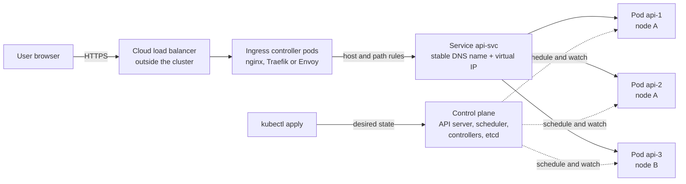
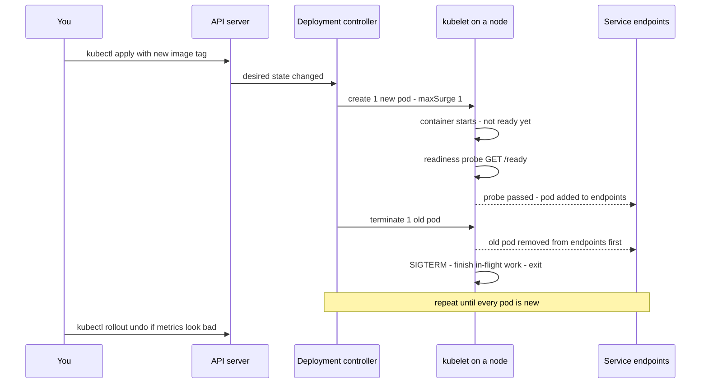

# Container Orchestration — From Docker and CapRover/Swarm to Kubernetes

- **Researched:** 2026-07-28
- **Target:** Software Engineer / Senior Software Engineer at enterprise and fintech employers (Bank Mandiri IT Digital Channel Delivery, PayPay) where Kubernetes is the standard
- **Sources freshness:** mostly 2025–2026
- **Written for:** an engineer who already ships Docker containers on a VPS with CapRover, and has **never run Kubernetes in production**. The goal is not to pretend. The goal is to explain orchestration credibly, know Kubernetes properly, and describe your real Swarm experience honestly.
- **How to read this note:** Part 1 is why orchestration exists. Part 2 is the ladder you are already standing on. Part 3 is Kubernetes concepts — the biggest part. Parts 4–6 are operations, when to say no, and how to talk about your experience. Then current news, questions, tradeoffs, cases, cheatsheet.
- **Related notes (linked, not repeated):**
  - [`load-balancers-microservices-online-shop.md`](load-balancers-microservices-online-shop.md) — health checks, connection draining, L4 vs L7, zero-downtime deploys. Kubernetes reuses all of it.
  - [`cloud-computing-models-serverless-guide.md`](cloud-computing-models-serverless-guide.md) — IaaS/PaaS/SaaS, serverless containers, managed vs self-hosted.
  - [`dbo-b2b-platform-system-design-case-study.md`](dbo-b2b-platform-system-design-case-study.md) — your real CapRover/Swarm system: API, Auth, Queue, Cron services.
  - [`system-design-basics-senior-fullstack-interview.md`](system-design-basics-senior-fullstack-interview.md) — the wider system design frame.
- **Hands-on lab:** [`../examples/kubernetes-local-demo/`](../examples/kubernetes-local-demo/) — a real Kubernetes cluster on your laptop in about 15 minutes, free.

## TL;DR

- **Orchestration** is software that keeps a set of containers running across a set of machines, without a human watching. It restarts what dies, spreads work over machines, routes traffic only to healthy containers, and replaces containers version by version during a deploy.
- You are already on the ladder: `docker run` → **Docker Compose** (many containers, one machine) → **Docker Swarm** (many machines, simple) → **Kubernetes** (many machines, powerful, complex). **CapRover is a web dashboard on top of Docker Swarm.** So you already run an orchestrator — say that clearly.
- The one real mental shift to Kubernetes is **declarative**: you do not run commands that start things. You write down the end state you want. A control loop keeps reality matching that description, forever.
- Kubernetes in 2026 is the industry default (82% of container users run it in production, CNCF 2025 survey), and it is also widely agreed to be too heavy for small teams. Knowing **when not to use it** is a senior signal.
- Never claim Kubernetes production experience you do not have. One follow-up question exposes it. The strong version is: "I own container deploys on Docker Swarm through CapRover, and here is exactly how each thing I do maps to Kubernetes."

---

## Part 1 — Why Orchestration Exists

### Where you start today

You have one VPS. You run one container:

```bash
docker run -d -p 3000:3000 --name api my-api:1.4.0
```

This works. It is a completely reasonable way to run a small service. Problems only appear as the system grows.

### The problems that appear, in the order they appear

Read this as a list of questions. Each one has a boring manual answer and an automated answer.

| The problem | What you do by hand | What an orchestrator does |
|---|---|---|
| The container crashes at 3am | You wake up and `docker start` it | Restarts it in seconds, automatically |
| One machine is not enough | You buy a second VPS and copy the setup | Treats many machines as one pool and places containers for you |
| Which container gets traffic? | You edit nginx config by hand | Keeps a live list of healthy containers and routes only to those |
| Deploy a new version with no downtime | Start new, test, switch nginx, stop old | Replaces containers one at a time, waiting for each to be healthy |
| A whole machine dies | You rebuild it, at night, manually | Notices, and restarts those containers on the surviving machines |
| Ten services all need env vars and secrets | `.env` files copied around | Stores config and secrets centrally and injects them |
| Traffic tripled this hour | You resize the VPS | Adds container copies automatically, removes them later |

### So what is an orchestrator?

**Definition, plain words:** an orchestrator is a program that runs your containers on a group of machines for you. You tell it what you want running. It decides which machine each container goes on, watches everything, and fixes what breaks.

**Analogy:** an orchestrator is the **shift manager of a restaurant kitchen**. You say "I need three cooks on the grill tonight." The manager decides who stands where, replaces anyone who calls in sick, and moves people around when one station gets busy. You never assign individual people to individual stations yourself.

**Why it matters:** every job above is a job you would otherwise do by hand, at 3am, under pressure. Orchestration turns "operations work by a human" into "a control loop that never sleeps".

**Term to know: cluster.** A **cluster** is a group of machines that the orchestrator treats as one big pool of CPU and memory. You stop thinking "which server?" and start thinking "how much capacity?"

---

## Part 2 — The Ladder You Are Already On

Each rung solves the problem the rung below could not.

### Rung 0 — `docker run`

- **What it does:** starts one container on one machine.
- **Cannot do:** restart it reliably, run it on a second machine, deploy without downtime, or share config between containers.
- **Enough when:** one small service, one machine, some downtime acceptable.

### Rung 1 — Docker Compose

- **The problem it solves:** your app is not one container. It is an API, a Postgres, a Redis, and a worker. Starting four `docker run` commands in the right order with the right network is tedious and easy to get wrong.
- **What it is:** one YAML file (`docker-compose.yml`) describing several containers, their networks, and their volumes. `docker compose up` starts all of them together.
- **What it cannot do:** it only manages **one machine**. It has no idea other machines exist. There is no automatic rescheduling if the machine dies. Rolling updates are minimal.
- **Enough when:** local development, CI, and small single-server deployments. **This is the correct tool for local dev even at companies running Kubernetes in production.**

### Rung 2 — Docker Swarm

- **The problem it solves:** you now have two or more machines and want them treated as one pool.
- **What it is:** clustering built into Docker itself. You run `docker swarm init` on one machine, `docker swarm join` on the others. You deploy a **stack** (a Compose-style file) and Swarm places containers across machines, restarts failed ones, does rolling updates, and gives you an internal DNS name per service with built-in load balancing.
- **Key words you already use without knowing it:** in Swarm, a **service** is "the thing I want N copies of", and each copy is a **task**. Swarm keeps N copies alive.
- **What it cannot do well:** no rich ecosystem, few third-party tools, limited autoscaling (no built-in metric-driven scaling), simpler networking and policy model, small community in 2026.
- **Enough when:** a handful of services, one team, a few machines. This describes your DBO platform accurately.

### Rung 3 — Kubernetes

- **The problem it solves:** many teams, many services, fine-grained control over networking, scaling, permissions, storage, and rollout policy — plus a huge ecosystem of tools that all assume Kubernetes.
- **What it is:** an orchestrator built around a **declarative API**. You submit objects describing desired state. Controllers continuously make reality match.
- **The cost:** many moving parts, a real learning curve, and ongoing operational work. This is not marketing pessimism — tool complexity was the number two adoption barrier in the CNCF 2025 survey.

### What CapRover actually is (say this correctly in interviews)

Many people describe CapRover as "a deploy tool". That undersells what you have been operating. Be precise:

- **CapRover is a self-hosted PaaS layer on top of Docker Swarm.** PaaS means "platform as a service" — you push code or an image, and the platform runs it.
- Underneath, `caprover setup` initialises a **Docker Swarm** cluster (usually a single node on one VPS, but Swarm can span machines).
- Each CapRover "app" becomes a **Docker Swarm service** with a desired replica count.
- CapRover runs an **nginx** container as the reverse proxy in front of everything. It generates nginx config per app, handling domains, routing, and HTTPS.
- It integrates **Let's Encrypt** for automatic TLS certificates. "TLS" is the encryption behind HTTPS.
- It builds images from a `captain-definition` file or a Dockerfile, keeps previous versions, and supports one-click rollback.
- Deploys are Swarm **rolling updates**: start the new container, then remove the old one.

So the honest and impressive sentence is: *"I operate a Docker Swarm cluster through CapRover, which is a PaaS layer over Swarm — it manages nginx routing, TLS, and rolling deploys for me."*

### The ladder at a glance

| | Compose | Swarm | Kubernetes |
|---|---|---|---|
| Machines | One | Many | Many |
| Self-healing | Restart policy only | Yes | Yes, with richer rules |
| Rolling deploy | Basic | Yes | Yes, fully configurable |
| Autoscaling on metrics | No | No | Yes — HPA, KEDA, Karpenter |
| Config and secrets | `.env` files | Swarm configs and secrets | ConfigMap, Secret, RBAC |
| Storage for databases | Local volumes | Local volumes, awkward | PV/PVC/StatefulSet, still hard |
| Ecosystem in 2026 | Dev-focused | Small, maintenance mode | Very large, the default target |
| Learning cost | Hours | Days | Months |
| Good fit | Local dev, CI | Small team, few services | Many teams, many services, policy needs |

---

## Part 3 — Kubernetes, Properly Explained

### 3.1 The one mental shift: declarative, not imperative

**The problem with commands.** `docker run` is **imperative** — you give an instruction, it happens once, and nothing remembers your intent. If the container dies, nothing knows you wanted it alive. If you run the command twice, you get two containers.

**The Kubernetes way.** You write a description of the end state: "there should be 3 copies of image `my-api:1.4.0`, each with 512Mi of memory, reachable at this name." You submit that description. Kubernetes stores it and then keeps working, forever, to make reality match it.

- **Desired state** — what you wrote down.
- **Actual state** — what is really running right now.
- **Reconciliation loop** — the controller that repeatedly compares the two and acts to close the gap.

**Analogy:** imperative is telling a driver every turn. Declarative is typing a destination into the sat-nav. If you take a wrong turn, it recalculates. You never re-enter the destination.

**Why it matters practically:** the same file applied twice changes nothing (this property is called **idempotent**). Your infrastructure becomes a set of files in Git, reviewable in a pull request. That is the whole basis of GitOps later in this note.

```bash
# imperative — happens once, nobody remembers
docker run -d my-api:1.4.0

# declarative — recorded intent, continuously enforced
kubectl apply -f deployment.yaml
```

### 3.2 Cluster, control plane, worker nodes

**The problem:** with many machines, someone has to decide what runs where, and something has to remember the decisions.

**The solution:** Kubernetes splits into a brain and hands.

- **Node** — one machine (physical or virtual) in the cluster.
- **Control plane** — the brain. It decides and remembers. Its parts:
  - **kube-apiserver** — the only door into the cluster. Every tool, including `kubectl`, talks to it. It validates and stores.
  - **etcd** — the database holding all cluster state. If you lose etcd with no backup, you lose the cluster's memory.
  - **kube-scheduler** — decides which node each new pod goes on, based on free CPU and memory plus rules.
  - **controller-manager** — runs the reconciliation loops (for example: "3 replicas wanted, 2 running, create 1").
- **Worker node** — the hands. Each runs:
  - **kubelet** — the agent that starts and watches containers on that machine and reports back.
  - **container runtime** — the thing that actually runs containers, normally **containerd**. Docker Engine itself is no longer used as the runtime — direct Docker support was removed in Kubernetes 1.24 (2022). Your Docker **images** work fine; only the runtime under the hood differs.
  - **kube-proxy** — programs the machine's network rules so a Service name reaches real pods.

**Analogy:** control plane = restaurant manager's office (decides, records). Worker nodes = the kitchen stations (do the work).

**CapRover/Swarm anchor:** a Swarm **manager node** is the control plane. Swarm **worker nodes** are workers. Your single-VPS CapRover is a one-node cluster that is both at once.

Diagram — notice that traffic from a user goes load balancer → ingress → Service → pod, while the control plane is off to the side never touching a request:



### 3.3 Pod — the smallest unit

**The problem:** sometimes one job needs two processes that must share a network address and files. For example an app plus a log shipper, or an app plus a proxy that handles encryption.

**The solution:** a **pod** is a small wrapper around one or more containers that always live together on the same node. Containers in a pod share:

- one IP address — they reach each other on `localhost`,
- storage volumes you attach to the pod.

**Key facts:**

- In practice, **one container per pod** is the normal case. Do not put your API and your Postgres in one pod.
- A pod is **ephemeral** — it is never repaired. If it dies it is replaced by a new pod with a **new IP address and a new name**. This is exactly why Services exist (next section).
- **Sidecar** — a helper container inside the pod (log shipper, metrics agent, service mesh proxy). Kubernetes has first-class sidecar support since v1.29–1.33 through init containers with `restartPolicy: Always`.
- **Init container** — a container that runs to completion before the main container starts. Common use: wait for the database, or run a migration.

**Analogy:** a pod is a lunchbox. Usually one sandwich inside. Sometimes a sandwich plus a small sauce pot that must travel with it. You throw away the whole lunchbox, never repair it.

**Swarm anchor:** a Swarm **task** is roughly a pod with exactly one container.

### 3.4 ReplicaSet and Deployment — "I want N copies"

**The problem:** you do not want to manage individual pods. You want "three copies of my API, always, and a safe way to change the version."

**The solution, two layers:**

- **ReplicaSet** — a controller with one job: keep exactly N pods of a given template alive. Kill one, it makes another.
- **Deployment** — the object you actually write. It owns ReplicaSets and manages **version changes**. When you change the image, the Deployment creates a **new** ReplicaSet and shifts pods from old to new, gradually. It keeps the old ReplicaSet around so you can roll back.

You almost never create a ReplicaSet by hand. You write a Deployment.

```yaml
apiVersion: apps/v1
kind: Deployment
metadata:
  name: api
spec:
  replicas: 3                      # desired state
  selector:
    matchLabels: { app: api }      # which pods belong to me
  template:                        # the pod blueprint
    metadata:
      labels: { app: api }
    spec:
      containers:
        - name: api
          image: my-api:1.4.0
          ports: [{ containerPort: 3000 }]
```

**Other workload types, one line each:**

- **StatefulSet** — for pods that need a stable identity and their own storage that follows them: `db-0`, `db-1`. Used for databases and queues.
- **DaemonSet** — one pod on every node. Used for log collectors and monitoring agents.
- **Job / CronJob** — run once until success / run on a schedule. **This is the Kubernetes replacement for your separate Cron service.** A CronJob is a scheduled Job, and it runs in one place, not once per replica.

**Swarm anchor:** `docker service create --replicas 3` is a Deployment plus ReplicaSet in one command. CapRover's "instance count" field sets exactly this.

### 3.5 Service — a stable address in front of moving pods

**The problem:** pods die and get replaced with new IP addresses. Nothing can hard-code a pod IP.

**The solution:** a **Service** is a stable name and virtual IP that always points at the current set of healthy pods matching a label. Kubernetes has internal DNS, so `http://api-svc.default.svc.cluster.local` (or just `http://api-svc` inside the same namespace) always works.

**Analogy:** a Service is a company phone extension. Staff change desks and phones. The extension number never changes.

**The four types, from most internal to most external:**

| Type | What it gives you | Use for |
|---|---|---|
| **ClusterIP** (default) | An internal-only address inside the cluster | Service-to-service calls — your API calling Auth |
| **NodePort** | Opens the same high port (30000–32767) on every node | Demos, local clusters, bare metal without a load balancer |
| **LoadBalancer** | Asks the cloud to create a real load balancer with a public IP | Public entry points on EKS/GKE/AKS |
| **ExternalName** | A DNS alias to something outside the cluster | Pointing at a managed database or a legacy host |

**Important detail interviewers like:** a Service is not a running proxy process by default. `kube-proxy` on each node programs kernel rules (iptables or IPVS) so packets to the Service IP are rewritten to a real pod IP. Newer clusters use eBPF (Cilium) instead. The practical effect is the same: a stable name in front of a moving set of pods.

**Headless Service** (`clusterIP: None`) gives DNS records for each individual pod instead of one virtual IP. It exists for StatefulSets, where you need to reach `db-0` specifically.

**Swarm anchor:** a Swarm service name resolves through Swarm's internal DNS with a virtual IP too. Same idea, less configurability.

### 3.6 Ingress and Ingress Controller — HTTP routing into the cluster

**The problem:** giving every service its own cloud load balancer is expensive and clumsy. You want one public entrance, then route by hostname and path — `api.shop.com` here, `shop.com/admin` there.

**The solution, two pieces (this split is a common interview question):**

- **Ingress** — a rules object. It says "host `api.shop.com`, path `/`, send to Service `api-svc` port 80." On its own it does nothing.
- **Ingress controller** — the actual program that reads those rules and does the routing. It runs as pods in the cluster. Common ones: NGINX, Traefik, HAProxy, Envoy-based controllers.

**Analogy:** the Ingress is the sign at the building entrance listing which company is on which floor. The Ingress controller is the receptionist who reads the sign and actually directs you.

This is **layer 7 routing** — routing based on the content of the HTTP request. It is exactly what you already know from [`load-balancers-microservices-online-shop.md`](load-balancers-microservices-online-shop.md), and exactly what CapRover's nginx does for your apps. Ingress controllers also handle TLS termination — "termination" means the controller is where HTTPS is decrypted, so pods behind it can speak plain HTTP.

**2026 alert — do not skip this in an interview.** The widely used **ingress-nginx** controller was **retired on 31 March 2026** by the Kubernetes project. No further releases, no bug fixes, no security patches. The recommended direction is the **Gateway API** — a newer, more expressive routing standard with separate roles for infrastructure owners and app teams (`GatewayClass`, `Gateway`, `HTTPRoute`). Gateway API reached v1.5 in early 2026, and `ingress2gateway` 1.0 (March 2026) converts existing Ingress objects. Mentioning this shows you follow the ecosystem, not just tutorials.

### 3.7 ConfigMap and Secret — config out of the image

**The problem:** the same image must run in staging and production with different database URLs. Baking config into the image means rebuilding per environment, and it puts credentials into a file that many people can read.

**The solution:**

- **ConfigMap** — key/value configuration, not sensitive. Injected as environment variables or mounted as files.
- **Secret** — the same idea for sensitive values: passwords, API keys, JWT signing keys.

```yaml
env:
  - name: DATABASE_URL
    valueFrom:
      secretKeyRef: { name: api-secrets, key: database-url }
  - name: LOG_LEVEL
    valueFrom:
      configMapKeyRef: { name: api-config, key: log-level }
```

**Two facts that separate seniors from juniors:**

1. **A Kubernetes Secret is only base64-encoded, not encrypted, by default.** Base64 is an encoding, not protection — anyone can decode it instantly. You must additionally enable **encryption at rest** in etcd, restrict access with RBAC, and in most companies use an external system (AWS Secrets Manager, HashiCorp Vault, External Secrets Operator, Sealed Secrets). **This is a very likely question at a bank.**
2. **Changing a ConfigMap does not restart your pods.** Environment variables are read at container start. You need `kubectl rollout restart deployment/api`, or a tool like Reloader.

**CapRover anchor:** CapRover's per-app environment variables are your ConfigMap plus Secret today. The gap to close is that CapRover does not separate "sensitive" from "not sensitive", and access control is coarse.

### 3.8 Namespace — logical separation

**The problem:** one cluster, many teams and environments. Names collide. People delete each other's things by accident.

**The solution:** a **namespace** is a named section of the cluster. Object names must be unique within a namespace, not across the cluster. You can attach to a namespace:

- **RBAC** (role-based access control) — who can do what, for example "the payments team can deploy only in `payments`".
- **ResourceQuota** — a cap on total CPU/memory the namespace may consume.
- **NetworkPolicy** — firewall rules deciding which pods may talk to which.

**Analogy:** namespaces are floors in an office building. Same building, separate teams, separate keys.

**Important:** a namespace is not a security boundary by itself. It is a boundary only once RBAC and NetworkPolicy are applied. Hard isolation between untrusted tenants needs separate clusters — which is why banks often run many clusters.

### 3.9 PersistentVolume and PVC — why state is harder

**The problem:** pods are disposable. Anything written inside a pod disappears when it is replaced. Databases and uploaded files must survive.

**The solution, three terms:**

- **PersistentVolume (PV)** — a piece of real storage in the cluster (an AWS EBS disk, a network file share).
- **PersistentVolumeClaim (PVC)** — a request from a workload: "I need 20Gi of fast storage." The pod refers to the claim, never the disk.
- **StorageClass** — the recipe for creating disks on demand, so a PVC gets a PV automatically.

**Analogy:** the PVC is a hotel booking request ("one room, two nights"). The PV is the actual room. The StorageClass is the hotel's policy for allocating rooms.

**The honest tradeoff:** running a database inside Kubernetes is possible (StatefulSet + PVC + an operator like CloudNativePG) but it is a real specialisation. Most teams — including large ones — run **PostgreSQL as a managed service** (RDS, Cloud SQL) and keep only stateless workloads in Kubernetes. That is the answer to give unless the interviewer pushes further.

### 3.10 Probes — liveness, readiness, startup

**The problem:** "the process is running" does not mean "the app works". A Node process can be alive but stuck. An app can be starting up and not ready to serve. Sending traffic to either one produces errors for users.

**The solution:** three health checks with three different jobs. Get the difference exactly right — this is the most asked Kubernetes question.

| Probe | Question it answers | What happens on failure |
|---|---|---|
| **Liveness** | Is this container broken beyond recovery? | Kubernetes **kills and restarts the container** |
| **Readiness** | Can this pod serve requests right now? | Pod is **removed from the Service endpoints** — no traffic, no restart |
| **Startup** | Has this slow-starting app finished booting? | While it runs, liveness and readiness are **paused**; on final failure the container is restarted |

**Analogy:** liveness is "is the shop's power on?" — if not, reset the breaker. Readiness is "is the shop open for customers right now?" — the door sign flips, but nobody demolishes the shop.

**The classic mistake:** making the liveness probe check the database. If the database has a brief problem, every pod fails liveness, every pod restarts, and now you have a full outage plus a restart storm. **Rule: liveness checks only the process itself. Dependencies belong in readiness.**

```yaml
readinessProbe:
  httpGet: { path: /ready, port: 3000 }   # checks DB/Redis reachable
  initialDelaySeconds: 3
  periodSeconds: 5
livenessProbe:
  httpGet: { path: /healthz, port: 3000 } # only "am I alive"
  periodSeconds: 10
  failureThreshold: 3
startupProbe:
  httpGet: { path: /healthz, port: 3000 }
  failureThreshold: 30
  periodSeconds: 5                        # allows up to 150s to boot
```

**Connect it to what you already know.** Your load-balancer note covers health checks and **connection draining** — letting an instance finish its in-flight requests before it stops. Kubernetes does the same thing with:

- **`terminationGracePeriodSeconds`** (default 30) — how long a pod has to shut down after receiving `SIGTERM`, the polite "please stop" signal.
- **`preStop` hook** — a command run before `SIGTERM`. A short `sleep 5` here is the standard fix for a real race: endpoint removal and pod shutdown happen in parallel, so a proxy can still send a request to a pod that already started stopping.
- Your Express app should handle `SIGTERM`: stop accepting new connections, finish in-flight requests, close the Prisma client, then exit. Your BullMQ workers should stop taking new jobs and finish the current one.

```ts
// Express + Prisma: graceful shutdown, same idea as your Swarm setup
process.on('SIGTERM', async () => {
  server.close(async () => {          // stop accepting new connections
    await prisma.$disconnect();       // release DB connections
    process.exit(0);
  });
});
```

### 3.11 Requests, limits, and OOMKilled

**The problem:** many containers share one machine. One badly behaved service can eat all the memory and take down its neighbours.

**The solution, two numbers per container:**

- **Request** — the amount reserved for this container. **The scheduler uses requests to decide which node has room.** If nothing has room, the pod stays `Pending`.
- **Limit** — the hard ceiling.

The two resources behave very differently at the limit:

- **CPU over the limit → throttling.** The container is slowed down, not killed. Symptom: latency spikes with no crash, and no obvious error in your logs.
- **Memory over the limit → OOMKilled.** "OOM" is out of memory. The Linux kernel kills the process immediately. The container restarts, exit code **137**. Repeated OOMKills produce `CrashLoopBackOff` — Kubernetes restarting a container with increasing delays.

**Analogy:** the request is the seat you reserved on the train. The limit is the point where the conductor removes you.

**Practical guidance for a Node.js service:** set memory request and limit close together, and set the limit above your Node heap ceiling. Also set `--max-old-space-size` below the container limit so V8 garbage-collects instead of getting killed. For CPU, set a request and consider leaving the limit off for latency-sensitive services — CPU throttling is a common and hard-to-see cause of p99 latency.

### 3.12 Autoscaling — HPA, cluster autoscaler, KEDA

**The problem:** traffic is not constant. Paying for peak capacity all day wastes money. Running peak traffic on off-peak capacity produces errors.

**Three different scalers, three different jobs:**

- **HPA (HorizontalPodAutoscaler)** — adds or removes **pods** based on CPU, memory, or custom metrics. Needs `metrics-server` installed. Uses API `autoscaling/v2`.
- **Cluster Autoscaler / Karpenter** — adds or removes **nodes** when pods cannot be scheduled. Karpenter is the modern AWS option, popular for using spot instances.
- **KEDA** — event-driven scaling: scale on queue depth, Kafka lag, or a database query, including scaling to zero. **This is the one that matters for your BullMQ workers** — scaling workers on Redis queue length is far better than scaling on CPU.
- **VPA (VerticalPodAutoscaler)** — recommends or sets better request/limit values. Do not use it on the same workload as HPA-on-CPU.

```yaml
apiVersion: autoscaling/v2
kind: HorizontalPodAutoscaler
metadata: { name: api }
spec:
  scaleTargetRef: { apiVersion: apps/v1, kind: Deployment, name: api }
  minReplicas: 3
  maxReplicas: 20
  metrics:
    - type: Resource
      resource: { name: cpu, target: { type: Utilization, averageUtilization: 70 } }
```

**The timing detail seniors mention:** pod scale-up takes seconds; node scale-up takes minutes because a machine has to boot and join. Under a sudden spike you are limited by node provisioning, not by the HPA. Keep some headroom.

### 3.13 Rolling update, rollback, maxSurge and maxUnavailable

**The problem:** deploying a new version must not drop requests, and a bad version must be reversible in seconds.

**The solution:** the Deployment replaces pods gradually, and a new pod only receives traffic after its **readiness probe** passes. Two knobs control the pace:

- **`maxSurge`** — how many extra pods above the desired count may exist during the update. Default 25%.
- **`maxUnavailable`** — how many pods may be missing during the update. Default 25%.

Common settings:

- `maxSurge: 1, maxUnavailable: 0` — never lose capacity. Slightly slower and needs spare room. **The safe default for production APIs.**
- `maxSurge: 0, maxUnavailable: 1` — never exceed capacity. Used when licences or connections are strictly limited.

```bash
kubectl set image deployment/api api=my-api:1.5.0   # start the rollout
kubectl rollout status deployment/api               # watch it, exits non-zero on failure
kubectl rollout undo deployment/api                 # back to previous ReplicaSet, seconds
```

Diagram — notice the order: the new pod becomes ready **before** an old pod is removed, and the old pod leaves the endpoint list **before** it is stopped:



**Other strategies to name:**

- **Recreate** — stop everything, then start the new version. Downtime. Only for things that cannot run two versions at once.
- **Blue/green** — run both versions fully, switch traffic at once. Fast rollback, double cost during the switch.
- **Canary** — send a small percentage of traffic to the new version first. Needs traffic splitting (Gateway API, a service mesh, or Argo Rollouts).

**Database migrations are still your problem.** Kubernetes does not solve this. The **expand → migrate → contract** pattern from your DBO note still applies, because old and new pods run at the same time during any rolling update.

### 3.14 The kubectl you actually need

```bash
kubectl get pods -o wide              # what is running, on which node
kubectl describe pod <name>           # events at the bottom = why it is not starting
kubectl logs <pod> -f                 # stream logs
kubectl logs <pod> --previous         # logs from the container that just crashed
kubectl exec -it <pod> -- sh          # shell inside a container
kubectl apply -f ./k8s                # declarative: apply a directory of YAML
kubectl rollout status deploy/api     # is the deploy done?
kubectl rollout undo deploy/api       # rollback
kubectl scale deploy/api --replicas=5 # manual scale
kubectl port-forward svc/api 8080:80  # reach a Service from your laptop
kubectl get events --sort-by=.lastTimestamp   # cluster-level "what just happened"
kubectl top pods                      # live CPU/memory, needs metrics-server
```

**Debugging order to say out loud:** `get pods` (what state?) → `describe pod` (events explain `Pending`, `ImagePullBackOff`, probe failures) → `logs --previous` (why it crashed) → `get events` (cluster-level cause) → `top`/metrics (resource pressure).

---

## Part 4 — Operating Kubernetes in Reality

### 4.1 Managed vs self-managed

**The problem:** the control plane must be highly available, patched, and backed up. etcd in particular is unforgiving.

**The solution almost everyone picks: managed Kubernetes.** The cloud provider runs the control plane. You bring worker nodes and workloads.

| Option | What you still own | 2026 notes |
|---|---|---|
| **Amazon EKS** | Nodes, add-ons, networking, upgrades of your workloads | ~$0.10/hour per cluster (~$73/month). Extended support for old versions costs ~$0.60/hour. **EKS Auto Mode** manages nodes for you at roughly 10–15% compute overhead |
| **Google GKE** | Less — Autopilot removes node management | ~$0.10/hour per cluster; a free-tier credit covers roughly one cluster. **Autopilot** bills per pod resources instead of per node |
| **Azure AKS** | Nodes and add-ons | Free control-plane tier available; paid tier for an uptime SLA |
| **Self-managed (kubeadm, k3s, Rancher)** | Everything, including etcd backups and upgrades | Chosen for on-premises and data-residency rules — common in banking |

**Cost reality:** the control-plane fee is a small part of the bill. Once you have more than a few nodes, compute dominates, and networking (NAT gateways, cross-zone traffic) plus logging often surprise teams more than the cluster fee.

**Banking angle:** many banks in regulated markets run Kubernetes **on-premises** (OpenShift, Rancher, or plain kubeadm) because data must stay in the country and inside their own data centre. If you interview at a bank, ask whether the platform is managed cloud, on-prem, or OpenShift. Asking that question is itself a good signal.

### 4.2 Helm — the package manager

**The problem:** a real application is 8–15 YAML files. Multiply by staging, production, and per-customer environments, and you are copying YAML and editing values by hand.

**The solution:** **Helm** packages Kubernetes YAML into a **chart** — a folder of templates plus a `values.yaml` file of defaults. Installing a chart with different values produces different environments from one source.

```bash
helm install api ./charts/api -f values.prod.yaml
helm upgrade api ./charts/api --set image.tag=1.5.0
helm rollback api 3
```

**Analogy:** a chart is a recipe with adjustable quantities. `values.yaml` is the serving size.

**2026 status:** **Helm 4** shipped in November 2025 — the first major version in six years — with native server-side apply and a redesigned plugin system. Helm 3 charts keep working. **Kustomize** is the main alternative: no templating language, just a base plus per-environment patches, and it is built into `kubectl` (`kubectl apply -k`). They are not enemies; many teams use Helm for third-party software and Kustomize for their own.

### 4.3 GitOps — Argo CD and Flux

**The problem:** if engineers run `kubectl apply` from laptops, nobody knows what is actually deployed, and cluster credentials are spread around.

**The solution:** **GitOps**. A Git repository holds the desired state. An agent inside the cluster (**Argo CD** or **Flux**) watches that repository and continuously makes the cluster match it. Nobody deploys by hand.

- The Git history is the deploy history. A rollback is a `git revert`.
- **Drift detection** — if someone changes something by hand, the agent notices and puts it back.
- CI builds and pushes an image, then updates a tag in Git. CD is the agent pulling the change. This is called **pull-based** deployment, and it means CI never needs cluster credentials.

**Analogy:** GitOps is a thermostat. You set the temperature in one place. The system works continuously to reach it. You never carry a heater around.

**2026 status:** Argo CD is the majority GitOps tool according to a CNCF end-user survey (July 2025). Argo Rollouts adds canary and blue/green on top.

### 4.4 Observability, in one paragraph each

- **Metrics:** Prometheus collects numbers, Grafana draws them. Watch the four golden signals: latency, traffic, errors, saturation.
- **Logs:** containers write to stdout; a DaemonSet agent (Fluent Bit, Vector) ships them to Loki, Elasticsearch, or a cloud service. **Never write logs to a file inside a pod** — the pod dies and the file goes with it.
- **Traces:** OpenTelemetry propagates a request ID across services. This is the same request-ID idea you already planned for the DBO platform, standardised.
- **What to alert on:** symptoms users feel (error rate, latency, queue age), not internal causes.

### 4.5 The honest cost and complexity story

- The bill is not only the cluster fee. It is nodes, load balancers, NAT gateways, storage, logging, plus the salary cost of people who understand the platform.
- Tool complexity (37%) and skills gaps (33%) were named as top adoption barriers in the CNCF 2025 survey.
- Kubernetes turns operations problems into configuration problems. That is a real gain at scale, and a real cost at small scale.

---

## Part 5 — When You Should NOT Use Kubernetes

This section is the senior signal. Anybody can list Kubernetes objects. Fewer people can say when the answer is no.

**The problem Kubernetes charges you for:** it is a platform, and a platform needs owners. Upgrades three times a year, networking, RBAC, storage, cost control, and incident response all become your team's job unless someone else does them.

**Do not use Kubernetes when:**

- The team is small and there is no platform or infrastructure person. The cluster becomes one engineer's second job.
- You run fewer than roughly 10 services with a single deploy cadence.
- Traffic is steady and modest. Fine-grained autoscaling saves little.
- Time-to-market matters more than infrastructure control. A PaaS ships faster.
- Your workload is mostly stateful, and you would end up running databases in a system that is not naturally good at it.

**Better answers at that size:**

| Alternative | What it is | Good for |
|---|---|---|
| **PaaS** (CapRover, Railway, Render, Fly.io) | Push code, platform runs it | Small teams, your current setup |
| **Serverless containers** (AWS Fargate, Google Cloud Run, Azure Container Apps) | You give a container image; the cloud runs and scales it, including to zero | Spiky traffic, no cluster to operate — see [`cloud-computing-models-serverless-guide.md`](cloud-computing-models-serverless-guide.md) |
| **AWS ECS** | AWS's own container orchestrator, simpler than EKS | AWS-only shops under roughly 15 services |
| **Docker Swarm / Kamal** | Simple multi-machine orchestration; Kamal deploys containers over SSH | Small fleets, cost-sensitive, self-hosted |

**When Kubernetes starts paying for itself:**

- **Many teams** need to deploy independently with separate permissions (RBAC and namespaces earn their keep).
- **Many services** — dozens or hundreds — where manual placement stops working.
- **Variable load** where autoscaling saves real money, or batch and AI workloads sharing GPUs.
- **Policy and compliance** — a bank needs one standard way to enforce network isolation, image scanning, audit logs, and resource quotas across the whole company. Kubernetes gives one control surface for all of it.
- **Portability** — regulators or strategy require running the same workloads on-premises and in cloud.

**The sentence to say:** *"Kubernetes is an operating system for a fleet. It pays off when you have a fleet and people to run it. Below that, it is complexity you are paying for and not using."*

---

## Part 6 — How to Talk About Your Experience Honestly

### Why honesty wins here

Kubernetes experience is easy to test. One question — "how do you debug a pod stuck in `Pending`?" or "what does your readiness probe check?" — separates people who ran it from people who read about it. An engineer caught overclaiming loses the whole interview. An engineer who says "I have not run it in production, but here is exactly how my Swarm experience maps" is trusted for everything else they say.

### The script (say this, roughly, in 30 seconds)

> "I run production containers on Docker Swarm through CapRover — that is a self-hosted PaaS layer over Swarm. I own the deploys: multi-service container builds, rolling updates with health checks, environment and secret configuration, nginx routing with Let's Encrypt TLS, and rollbacks when a release goes wrong. I have not operated a Kubernetes cluster in production. I have studied it and run clusters locally with kind, and the concepts map closely: my Swarm services are Deployments plus Services, my CapRover nginx routing is an Ingress, my env vars are ConfigMaps and Secrets, and my health checks are readiness and liveness probes. What I would need to learn on the job is the operational side — RBAC, cluster upgrades, and storage — and I would want to do that alongside someone who has run it."

Three reasons that lands: it is specific, it proves conceptual mastery, and it names its own gap before the interviewer has to.

### Your translation table (memorise this)

| What you do today | Kubernetes name | Difference worth mentioning |
|---|---|---|
| CapRover app | Deployment + Service | K8s separates "what runs" from "how it is reached" |
| Instance count in CapRover | `replicas` in a Deployment | Same idea, declarative in a file |
| CapRover nginx + domain + Let's Encrypt | Ingress + Ingress controller + cert-manager | K8s splits rules from the proxy that enforces them |
| App env vars in CapRover | ConfigMap + Secret | K8s separates sensitive from non-sensitive |
| Persistent directory in CapRover | PersistentVolumeClaim | K8s asks for storage; the cluster provides it |
| CapRover rolling deploy | Deployment rolling update with `maxSurge`/`maxUnavailable` | K8s lets you tune the pace exactly |
| Your Cron service container | CronJob | Runs once per schedule, not once per replica |
| BullMQ worker containers | Deployment scaled by KEDA on queue depth | Scaling on queue length instead of CPU |
| Swarm overlay network | Cluster networking + NetworkPolicy | K8s can restrict which pod talks to which |
| Your VPS | Node | K8s pools many nodes and schedules across them |

### Answering "have you used Kubernetes?"

- **Do say:** "Not in production. I have run local clusters with kind and I know the object model well. My production orchestration experience is Docker Swarm."
- **Do add:** one concrete thing you have actually operated — a zero-downtime deploy, a rollback under pressure, a health-check bug you fixed.
- **Do not say:** "Yes, I use Kubernetes" because CapRover is orchestration. It is not Kubernetes, and the follow-up question will find that out.
- **Do offer:** the migration plan (see the interview question below). Showing you could lead the migration is stronger than pretending you already did.

---

## What's Current (2026)

- **Kubernetes version:** v1.36 is the newest release (patch 1.36.2, June 2026); v1.35 and v1.34 are also supported. Kubernetes ships **three releases per year**, roughly every 15 weeks, and supports the **three most recent minor versions** for about 14 months. Practical effect: a cluster left alone for a year is out of support. Upgrade planning is real work.
- **ingress-nginx is retired (31 March 2026).** No releases, no bug fixes, no security patches. The Kubernetes Security Response Committee urged immediate migration. The direction is the **Gateway API** (v1.5, early 2026) with implementations such as Envoy Gateway, kgateway, Traefik, Istio, and Cilium. `ingress2gateway` 1.0 (March 2026) automates conversion. **This is the single best "what's new" fact to bring up.**
- **Docker Swarm in 2026:** maintained, not evolving. Mirantis has committed support **through 2030** as part of Mirantis Kubernetes Engine 3, while new development goes to Kubernetes. Correct framing: "Swarm is stable and supported, but the ecosystem moved to Kubernetes." That is exactly the honest thing to say about your CapRover platform.
- **Helm 4** (November 2025, stable patches through April 2026) — first major release in six years; server-side apply, new plugin system, Helm 3 charts still work. Kustomize remains the no-templating alternative and is built into kubectl.
- **Adoption:** 82% of container users run Kubernetes in production (CNCF Annual Survey published January 2026, covering 2025). Argo CD is the majority GitOps tool (CNCF end-user survey, July 2025). Platform engineering keeps growing as the way companies hide Kubernetes from product developers.
- **The "do you even need it" debate is settled in a nuanced way:** the 2026 consensus is start with serverless containers (Cloud Run, Fargate, Container Apps) or a PaaS, and move to Kubernetes when a specific constraint demands it — many services, many teams, multi-cloud, or policy standardisation. Kubernetes is the default at enterprise scale and often the wrong first choice for a startup.
- **Autoscaling:** Karpenter for node provisioning (especially with spot instances) and KEDA for event-driven scaling are the two names to know beyond plain HPA.
- **AI workloads** are the fastest-growing use of Kubernetes: two thirds of surveyed organisations run some or all AI inference on Kubernetes (CNCF 2025). If a fintech asks about the future of your platform skills, this is where the demand is.

---

## Likely Interview Questions

### Q: What is container orchestration, and why do you need it?

**Answer outline:**

- Start from the problem: containers solve packaging, not operations. One container on one machine is fine until it crashes, until one machine is not enough, and until you need to deploy without downtime.
- Define it: software that runs containers across a pool of machines — scheduling, self-healing, service discovery, rolling updates, config and secret injection, scaling.
- Ground it in your work: "In my DBO platform I run API, Auth, Queue, and Cron services as containers on Docker Swarm through CapRover. Swarm restarts failed containers and does the rolling deploys."
- Close with the tradeoff: orchestration is worth it once you have more than one machine or more than a couple of services. Below that it is overhead.

### Q: Docker Compose vs Docker Swarm vs Kubernetes — when do you use each?

**Answer outline:**

- Compose: many containers, **one** machine, mostly local development and CI. Still correct even at companies running Kubernetes.
- Swarm: multi-machine, simple, built into Docker. Good for a small team and few services. In 2026 it is maintained (Mirantis, through 2030) but not evolving.
- Kubernetes: multi-machine, declarative, huge ecosystem, fine-grained control over networking, permissions, and scaling. The cost is real operational complexity.
- Your line: "We chose Swarm through CapRover deliberately for a small team. The trigger to move would be more teams needing independent deploys, or a compliance requirement for standard policy across services."

### Q: What is a pod, and why not just run a container?

**Answer outline:**

- The problem: sometimes two processes must share an IP address and files — an app and its log shipper, or an app and a proxy.
- A pod is a wrapper around one or more containers that are always scheduled together and share a network namespace and volumes.
- Normal case is one container per pod. Sidecars are the exception.
- The important consequence: pods are **ephemeral** and get a new IP when replaced. That is why you never address a pod directly — you use a Service.

### Q: How does a rolling update work in Kubernetes?

**Answer outline:**

- You change the image in the Deployment. The Deployment creates a **new ReplicaSet** and moves pods over gradually.
- `maxSurge` controls how many extra pods may exist; `maxUnavailable` controls how many may be missing. Production API default: `maxSurge: 1, maxUnavailable: 0`.
- A new pod receives traffic only after its **readiness probe** passes. An old pod is removed from the Service endpoints before it is stopped, then gets `SIGTERM` and its grace period to finish in-flight requests.
- Rollback is `kubectl rollout undo` — the old ReplicaSet is still there, so it takes seconds.
- Add the senior point: the application still has to cooperate. Handle `SIGTERM`, and use expand/migrate/contract for database changes, because both versions run at the same time.

### Q: Liveness probe vs readiness probe — what is the difference? (the classic)

**Answer outline:**

- **Liveness** answers "is this container broken?" Failure means restart the container.
- **Readiness** answers "can this pod serve traffic right now?" Failure means remove it from the Service endpoints. No restart.
- **Startup** protects slow-booting apps: it pauses the other two until the app has finished starting.
- The mistake to name: putting the database check in the liveness probe. A brief database problem then restarts every pod at once and turns a small incident into an outage. Dependencies go in readiness.
- Connect it: "This is the same health-check and connection-draining behaviour I configure for zero-downtime deploys on Swarm — Kubernetes just splits it into two separate signals, which is better."

### Q: How does a request from the internet reach a pod?

**Answer outline:**

- DNS points at a **cloud load balancer** (a Service of type LoadBalancer, usually the one in front of the ingress controller).
- The load balancer sends the request to the **ingress controller** pods.
- The controller applies **Ingress** (or Gateway API `HTTPRoute`) rules — host and path — and forwards to the right **Service**.
- The Service resolves to one healthy pod. `kube-proxy` rewrites the destination to a real pod IP using kernel rules; newer clusters use eBPF.
- Add the 2026 note: ingress-nginx retired in March 2026, so new clusters use Gateway API implementations such as Envoy Gateway or Traefik.
- Anchor: "Today that whole path is CapRover's nginx for me — same job, one component instead of four."

### Q: How would you migrate your CapRover/Swarm app to Kubernetes?

**Answer outline:**

- **Do not start with the migration. Start with the reason.** If there is no reason — more teams, compliance, scaling needs — the correct answer is not to migrate.
- **Map the objects:** each Swarm service becomes a Deployment plus a Service. Env vars split into ConfigMaps and Secrets. Volumes become PVCs. The nginx routing becomes an Ingress or Gateway API route plus cert-manager for TLS. The Cron service becomes a CronJob. BullMQ workers become a Deployment, later scaled by KEDA on queue depth.
- **Fix what Swarm let you skip:** proper readiness and liveness probes, resource requests and limits, graceful `SIGTERM` handling, structured logs to stdout.
- **Keep state outside first:** move PostgreSQL and Redis to managed services (RDS/ElastiCache or equivalent) before moving compute. Do not migrate a database into Kubernetes in the same step.
- **Cut over safely:** run both platforms at once, shift traffic at DNS or load-balancer level, start with the lowest-risk service (a worker, not the login path), and keep the Swarm stack ready for rollback for a couple of weeks.
- Mention `kompose` converts Compose files to manifests as a starting point, but its output is not production-ready — it sets no resource requests or limits.

### Q: When would you NOT use Kubernetes?

**Answer outline:**

- Small team with no platform owner; fewer than roughly 10 services; steady traffic; speed to market matters most.
- Name the alternatives properly: PaaS (CapRover, Render, Railway), serverless containers (Cloud Run, Fargate, Container Apps), ECS on AWS.
- Name the threshold where it flips: multiple teams deploying independently, many services, autoscaling that saves real money, or a compliance requirement for one standard policy layer — common at banks.
- Close with self-awareness: "My current platform is a deliberate fit for a small team. If we grew to several teams, or needed enforced network policy and audit across services, I would move to managed Kubernetes rather than build those controls myself."

### Q: A pod is stuck in `CrashLoopBackOff`. How do you debug it?

**Answer outline:**

- `kubectl describe pod` first — the Events section explains most cases: image pull failure, missing ConfigMap or Secret, failing probe, insufficient resources.
- `kubectl logs <pod> --previous` — the logs of the container that just died. This is the single most useful command and it is the one people forget.
- Check exit code: **137** means OOMKilled (memory limit too low or a leak), **1** usually means the app itself threw during startup.
- Check whether the **liveness probe** is too aggressive — a slow-starting app with no startup probe restarts forever.
- If the pod is `Pending` instead, it is a scheduling problem: not enough CPU/memory requested anywhere, an unbound PVC, or a taint/affinity rule.

---

## Tradeoffs to Be Ready For

- **Kubernetes vs PaaS/Swarm:** Kubernetes gives control, portability, and one policy layer for everything. PaaS gives speed and a much smaller learning cost. Pick by team size and number of services, not by fashion.
- **Managed vs self-managed control plane:** managed removes etcd, upgrades, and high availability work for roughly $73/month per cluster. Self-managed exists for data-residency and on-premises rules — common in banking. Almost nobody should self-manage by choice.
- **Kubernetes vs serverless containers:** Cloud Run and Fargate remove the cluster entirely and scale to zero. They lose fine-grained control, some networking options, and portability. Below roughly 15 services on a single cloud, serverless containers usually win.
- **Requests equal to limits vs limits higher than requests:** equal gives predictable behaviour and the `Guaranteed` quality-of-service class. Higher limits allow bursting but risk noisy neighbours and surprise OOMKills. For memory, keep them close; for CPU on latency-sensitive services, consider no limit at all.
- **Helm vs Kustomize:** Helm gives packaging, versioning, and a rollback command, at the price of template complexity. Kustomize is plain YAML with patches and no templating language. Common answer: Helm for third-party charts, Kustomize for your own manifests.
- **Ingress vs Gateway API (2026):** Ingress is familiar and everywhere, but ingress-nginx is retired and Ingress cannot express advanced routing cleanly. Gateway API is the direction and separates platform from application concerns, at the cost of a newer, less familiar model.
- **Stateful workloads in Kubernetes vs managed databases:** running Postgres in Kubernetes gives portability and one control plane; it costs you a specialist and real operational risk. Default to managed Postgres unless portability is a hard requirement.
- **Namespaces vs separate clusters for isolation:** namespaces are cheap but only isolate once RBAC and NetworkPolicy exist. Separate clusters give real isolation at higher cost — regulated environments often accept that cost.
- **HPA on CPU vs KEDA on queue depth:** CPU is easy but a poor signal for queue workers. Queue depth matches what users actually wait for. For your BullMQ workers, KEDA is the right answer.

---

## Real-World Cases to Cite

- **Spotify — migration and utilisation:** moved services onto Kubernetes gradually rather than all at once; their largest Kubernetes service handles over 10 million requests per second in aggregate, and bin-packing improved CPU utilisation two- to threefold. Cite for: "orchestration is also a cost-efficiency story, and migration can be incremental." (Kubernetes/CNCF case study.)
- **Airbnb — deploy frequency:** grew from a few hundred nodes to thousands across dozens of clusters, with hundreds of services and roughly 500 deploys per day. Cite for: "Kubernetes pays off when many teams must deploy independently."
- **adidas — release cadence:** releases went from every 4–6 weeks to 3–4 times a day after moving to a Kubernetes platform, running about 4,000 pods on 200 nodes. Cite for: "the benefit shows up as delivery speed, not just infrastructure." (CNCF case study.)
- **Zalando — many clusters:** runs dozens of clusters instead of one huge one, giving teams isolation. Cite for: "cluster-per-team or per-environment is a real isolation strategy, especially where compliance matters."
- **37signals (Basecamp, HEY) — the counter-case:** left both the cloud and Kubernetes, and built **Kamal**, a tool that deploys containers over SSH with zero-downtime switching. Cite for: "orchestration complexity is a choice; for a stable, known workload, simpler tools can be correct." This is the best case to name when arguing *against* Kubernetes.
- **The Kubernetes project itself — ingress-nginx retirement (March 2026):** the most-used ingress controller was retired with a security warning and a recommended migration to Gateway API. Cite for: "depending on a single community component is a supply-chain risk, and upgrade planning is part of running a platform."

---

## Cheatsheet

> **Visual version:** open [container-orchestration-guide-cheatsheet.html](container-orchestration-guide-cheatsheet.html) in your browser — concept cards with CapRover/Swarm equivalents, SVG diagrams with "say this" lines, a kubectl table, decision verdicts, numbers, real cases, and memory hooks. Everything visible, nothing hidden behind a tap.
>
> **Hands-on lab:** [`../examples/kubernetes-local-demo/`](../examples/kubernetes-local-demo/) — run a real cluster locally with kind, deploy, scale, roll out, break a pod, watch it heal.

**One-liners:**

- **Orchestration** — software that keeps containers running across many machines without a human watching.
- **Cluster** — a group of machines treated as one pool of capacity.
- **Control plane** — the brain: API server, scheduler, controllers, etcd.
- **Node** — one machine running kubelet, a container runtime, and kube-proxy.
- **Pod** — smallest deployable unit; one or more containers sharing an IP and volumes; disposable.
- **ReplicaSet** — keeps N identical pods alive.
- **Deployment** — manages ReplicaSets to change versions safely; rolling updates and rollback.
- **StatefulSet** — pods with stable names and their own storage; for databases.
- **DaemonSet** — one pod per node; for agents.
- **Job / CronJob** — run once / run on a schedule. Replaces a separate cron container.
- **Service** — stable name and virtual IP in front of changing pods.
- **ClusterIP / NodePort / LoadBalancer** — internal only / a port on every node / a real cloud load balancer.
- **Ingress** — HTTP routing rules. **Ingress controller** — the proxy that enforces them.
- **Gateway API** — the modern replacement for Ingress; the direction after ingress-nginx retired in March 2026.
- **ConfigMap / Secret** — non-sensitive / sensitive configuration injected into pods. Secrets are base64, not encrypted, by default.
- **Namespace** — a named section of the cluster for RBAC, quotas, and network policy.
- **PV / PVC / StorageClass** — the disk / the request for a disk / the rule that creates disks on demand.
- **Liveness / readiness / startup probe** — restart me / do not send me traffic / I am still booting.
- **Request / limit** — what is reserved for scheduling / the hard ceiling. Memory over the limit means OOMKilled, exit 137. CPU over the limit means throttling.
- **HPA / Cluster Autoscaler / Karpenter / KEDA** — more pods / more nodes / smarter nodes / scale on events and queues.
- **Helm chart** — a packaged, parameterised set of manifests. **Kustomize** — plain YAML plus patches.
- **GitOps** — Git is the desired state; an in-cluster agent (Argo CD, Flux) keeps the cluster matching it.

**At a glance — the ladder:**

| | Compose | Swarm (your CapRover) | Kubernetes |
|---|---|---|---|
| Best for | Local dev and CI | Small team, few services, few machines | Many teams, many services, policy needs |
| Weakness | One machine only | Small ecosystem, no metric autoscaling | Operational complexity and cost |
| Pick when | You need a dev environment | You want multi-machine with almost no learning cost | Independent team deploys, compliance, or big variable scale |

**At a glance — probes:**

| | Liveness | Readiness |
|---|---|---|
| Question | Is the container broken? | Can this pod serve now? |
| On failure | Restart the container | Remove from Service endpoints |
| Should check | Only the process itself | Dependencies too — DB, Redis |
| Classic bug | Checking the DB here restarts every pod at once | Forgetting it, so traffic hits a booting pod |

**Snippets to remember:**

```bash
kubectl describe pod <name>        # events at the bottom explain almost everything
kubectl logs <pod> --previous      # why the container that just died, died
kubectl rollout undo deploy/api    # rollback in seconds
kubectl port-forward svc/api 8080:80
```

```yaml
strategy:
  type: RollingUpdate
  rollingUpdate: { maxSurge: 1, maxUnavailable: 0 }   # never lose capacity
```

**Memory hooks:**

- **Shift manager** — an orchestrator is the shift manager of a kitchen: it decides who works where, replaces no-shows, and handles the rush. You only say how many cooks you need.
- **Sat-nav, not turn-by-turn** — declarative means you type the destination and the system recalculates after a wrong turn. Imperative means you shout every turn.
- **Lunchbox** — a pod is a lunchbox. Usually one sandwich. You throw the whole box away, never repair it.
- **Phone extension** — a Service is a company phone extension. Staff move desks; the number stays.
- **Power on vs open for business** — liveness is "is the power on?" (if not, reset the breaker). Readiness is "is the shop open?" (flip the sign, do not demolish the shop).
- **Hotel booking** — PVC is the booking request, PV is the actual room, StorageClass is the hotel's allocation policy.
- **Thermostat** — GitOps is a thermostat: set the target in one place, the system works continuously to reach it.
- **Reserved seat vs conductor** — request is your reserved seat; limit is where the conductor removes you. Memory: removal means OOMKilled. CPU: you just get slowed down.
- **"137 = memory"** — remember exit code 137 as "one-three-seven, out of memory heaven". Plain meaning: exit 137 means the kernel killed the container for exceeding its memory limit.

---

## Sources

- [Kubernetes Releases — supported versions and dates](https://kubernetes.io/releases/) — accessed 2026-07-28 (v1.36.2 current, patches dated 2026-06-09)
- [Kubernetes v1.35: Timbernetes release announcement](https://kubernetes.io/blog/2025/12/17/kubernetes-v1-35-release/) — 2025-12-17
- [Ingress NGINX Retirement: What You Need to Know — Kubernetes Contributors](https://www.kubernetes.dev/blog/2025/11/12/ingress-nginx-retirement/) — 2025-11-12
- [Ingress NGINX: Statement from the Kubernetes Steering and Security Response Committees](https://www.kubernetes.io/blog/2026/01/29/ingress-nginx-statement/) — 2026-01-29
- [Announcing Ingress2Gateway 1.0: Your Path to Gateway API](https://kubernetes.io/blog/2026/03/20/ingress2gateway-1-0-release) — 2026-03-20
- [Gateway API v1.5: Moving features to Stable](https://kubernetes.io/blog/2026/04/21/gateway-api-v1-5/) — 2026-04-21
- [Configure Liveness, Readiness and Startup Probes — Kubernetes docs](https://kubernetes.io/docs/tasks/configure-pod-container/configure-liveness-readiness-startup-probes/) — accessed 2026-07-28
- [Kubernetes Established as the De Facto 'Operating System' for AI as Production Use Hits 82% — CNCF Annual Survey](https://www.cncf.io/announcements/2026/01/20/kubernetes-established-as-the-de-facto-operating-system-for-ai-as-production-use-hits-82-in-2025-cncf-annual-cloud-native-survey/) — 2026-01-20
- [CNCF End User Survey Finds Argo CD as Majority Adopted GitOps Solution](https://www.cncf.io/announcements/2025/07/24/cncf-end-user-survey-finds-argo-cd-as-majority-adopted-gitops-solution-for-kubernetes/) — 2025-07-24
- [Mirantis Commits to Long-Term Support for Swarm Through 2030](https://www.mirantis.com/blog/mirantis-guarantees-long-term-support-for-swarm/) — 2025
- [Where Docker Swarm Still Fits in 2026 (and Where It Starts to Struggle)](https://bleevht.substack.com/p/where-docker-swarm-still-fits-in) — 2026
- [Helm (package manager) — Helm 4 release history](https://en.wikipedia.org/wiki/Helm_(package_manager)) — accessed 2026-07-28 (Helm 4 released Nov 2025; v4.1.4 April 2026)
- [Helm vs Kustomize vs Helmfile: Kubernetes Package Management Guide 2026](https://www.pistack.xyz/posts/helm-vs-kustomize-vs-helmfile-kubernetes-package-management-guide-2026/) — 2026
- [Kubernetes Pricing 2026: EKS vs AKS vs GKE Comparison Guide — Sedai](https://sedai.io/blog/kubernetes-cost-eks-vs-aks-vs-gke) — 2026
- [Serverless Containers vs Kubernetes: Cloud Run, AWS Fargate, and Azure Container Apps](https://cloudrps.com/blog/serverless-containers-vs-kubernetes-cloud-run-fargate/) — 2026
- [Kubernetes vs ECS vs Fargate: AWS Containers 2026 — SquareOps](https://squareops.com/blog/kubernetes-vs-ecs-vs-fargate-aws-container-platform-2026/) — 2026
- [Kubernetes Autoscaling Explained: HPA, VPA & Best Practices (2026) — Sedai](https://sedai.io/blog/kubernetes-autoscaling) — 2026
- [How to Migrate from Docker Swarm to Kubernetes — OneUptime](https://oneuptime.com/blog/post/2026-02-08-how-to-migrate-from-docker-swarm-to-kubernetes/view) — 2026-02-08
- [kind — Quick Start (v0.32.0)](https://kind.sigs.k8s.io/docs/user/quick-start/) — accessed 2026-07-28
- [Spotify Case Study — Kubernetes](https://kubernetes.io/case-studies/spotify/) — CNCF case study
- [adidas Case Study — Kubernetes](https://kubernetes.io/case-studies/adidas/) — CNCF case study
- [Zalando Case Study — Kubernetes](https://kubernetes.io/case-studies/zalando/) — CNCF case study
- [Dynamic Kubernetes cluster scaling at Airbnb — Airbnb Tech Blog](https://medium.com/airbnb-engineering/dynamic-kubernetes-cluster-scaling-at-airbnb-d79ae3afa132) — Airbnb engineering
- [How to Exit the Complexity of Kubernetes with Kamal — The New Stack](https://thenewstack.io/how-to-exit-the-complexity-of-kubernetes-with-kamal/) — 2024–2025
- [CapRover — Scalable, Free and Self-hosted PaaS](https://caprover.com/) — accessed 2026-07-28
- [Kubernetes Interview Questions and Answers 2026 — DataCamp](https://www.datacamp.com/blog/kubernetes-interview-questions) — 2026
- [33 Kubernetes Interview Questions and Answers for 2026 — Spacelift](https://spacelift.io/blog/kubernetes-interview-questions) — 2026
