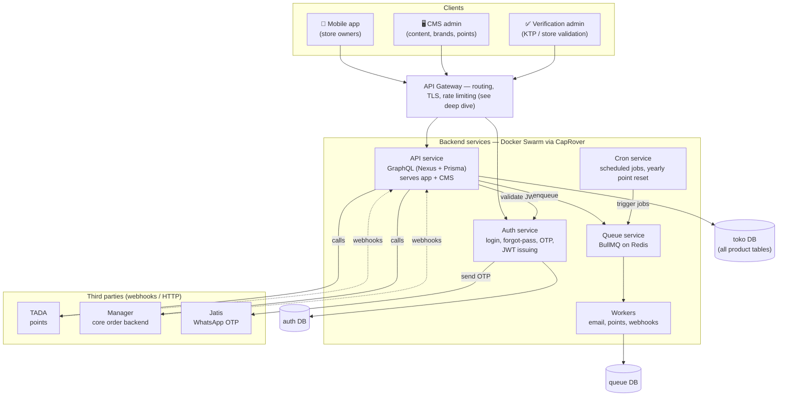
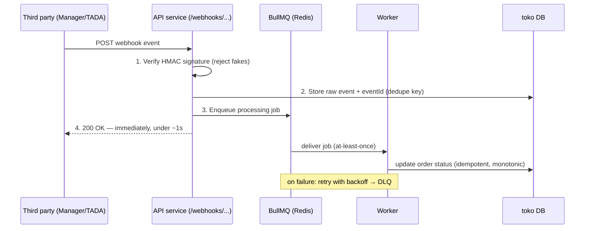
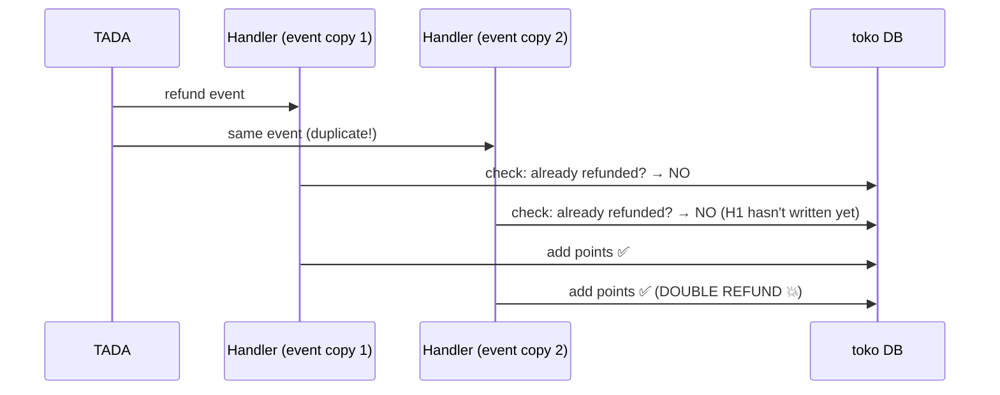

# DBO B2B Platform — My System, Told the Senior Way

- **Written:** 2026-07-05
- **Purpose:** Turn my real project into an interview-ready system design story: how to explain it, what to improve, and how to defend every choice.
- **Stack:** Node/TypeScript, GraphQL (Nexus) + Prisma, PostgreSQL ×3, BullMQ (Redis), Docker Swarm via CapRover. Clients: React Native app, CMS (admin), Verification admin UI.
- **Third parties:** TADA (points), Manager (core order backend for agents), Jatis (WhatsApp OTP).

## The System in One Picture

Draw this in the first 2 minutes of the conversation. Three clients enter through one gateway; four backend services each own their job; every database has exactly one owner; third parties hang off the edge via webhooks.



Features mapped to the pieces: **buy** (API → toko DB → Manager), **profile + KTP photo upload** (API → storage; verification admin approves), **points + redeem** (API ↔ TADA webhooks), **order history + shipping status/tracking** (API ← Manager webhooks), **OTP login** (Auth → Jatis).

## How to Tell This Story in an Interview (60–90 seconds)

> "I built a B2B commerce platform where building-material store owners order branded stock from an app. Three frontends: the React Native app for store owners, a CMS for content admins, and a separate verification UI where admins validate store identity documents (KTP).
>
> The backend is four Node/TypeScript services on Docker Swarm via CapRover: an **API service** (GraphQL with Nexus + Prisma) serving both app and CMS, an **Auth service** owning login, OTP via WhatsApp, and JWT issuing, a **Queue service** using BullMQ on Redis with separate workers, and a **Cron service** for scheduled jobs like the yearly points reset.
>
> I call it a *service-oriented* setup rather than full microservices — and that was deliberate. We split by **operational need**, not by domain dogma: auth is isolated because it's security-critical, queue/workers because background load shouldn't compete with request traffic, cron because scheduled jobs must not run once per replica. The product domain itself stayed together in one API service, which kept development fast for a small team.
>
> We integrate with three external systems through webhooks: TADA for the loyalty points, Manager as the core order backend, and Jatis for WhatsApp OTP."

Why this framing works: you show you know what "real" microservices are, you show the split was **reasoned**, and you hand the interviewer three deep-dive hooks (auth, queue, webhooks) that you're strong on.

**Never apologize for "semi-microservice."** The 2025–2026 consensus is exactly this: modular monolith core, extract services only when a boundary proves itself. Shopify runs a modular monolith at enormous scale. You built the consensus architecture.

## Honest Assessment — What's Good, What to Improve

Interviewers love "what would you change?" — it separates seniors from mids. Each item below is: current state → risk → suggested change.

### Already right (say these with confidence)

- **Queue/worker separation with BullMQ** — background jobs can't starve API traffic; retries and backoff come free.
- **Auth isolated** — smallest possible blast radius for the most sensitive code; JWT means the API tier stays stateless.
- **Cron isolated** — scheduled jobs run in exactly one place, not once per API replica. Many teams get this wrong.
- **Containerized with per-service deploys** — services scale and deploy independently.

### Improvement 1: The API service is the real bottleneck — scale it, don't split it

- **Current:** one API service holds every domain (orders, profile, points, content) for two clients (app + CMS).
- **Risk:** it becomes a deploy bottleneck and the single hot spot under load. But the *wrong* fix is splitting into many services too early.
- **Suggest:** keep it, make sure it's fully **stateless** (no in-memory session/user state), run **multiple replicas** behind the load balancer, and organize code into clear **domain modules** (orders / points / profile / content) with no cross-module imports of internals. Modules with clean boundaries are cheap to extract into services later *if* a real reason appears (e.g., orders needs 10× the scale of content). Optionally split **CMS traffic from app traffic** at the gateway level (two deployments of the same image) so a heavy admin operation can't slow down store owners.

### Improvement 2: Service-to-service GraphQL — keep it at the edge, simplify inside

- **Current:** all internal communication is GraphQL.
- **Risk:** GraphQL shines at the client edge (app/CMS pick their fields). Between backend services it adds schema/codegen overhead, more parsing cost, and tight coupling — internal callers rarely need field selection.
- **Suggest:** GraphQL for client-facing APIs; between services prefer (a) **queue events** for anything async (already have BullMQ — an "order-created" event beats a synchronous internal call) and (b) plain internal REST/RPC with shared TypeScript types for the few synchronous needs (e.g., API → Auth token checks — better yet, verify JWTs locally with a shared public key, zero network call). Mention **Apollo Federation/Router** as the thing you'd reach for only with many teams owning subgraphs — knowing when *not* to use it is the senior signal.

### Improvement 3: Database ownership — one service, one database, enforced

- **Current:** three Postgres databases: `auth`, `queue`, `toko` (all product tables).
- **Risk:** the boundary only works if it's strict. The moment two services connect to the same DB, you have a distributed monolith: schema migrations break neighbors, and you can't reason about load.
- **Suggest:** enforce **only Auth touches `auth`, only workers touch `queue`, only API touches `toko`**. Anyone else asks the owner (event or API call). Inside `toko`, apply the standard Postgres ladder as load grows: indexes (`EXPLAIN ANALYZE` first) → **PgBouncer in transaction mode** (Prisma + many replicas = connection explosion; this is the first thing that breaks) → read replicas for heavy reads (CMS reports, order history) → partition big tables (orders, point history) by time.

### Improvement 4: Cron — single instance is a single point of failure, and jobs must be idempotent

- **Current:** one cron service runs scheduled jobs (emails, yearly point reset).
- **Risk:** two failure modes — the container is down at trigger time (job silently missed), or someone scales it to 2 replicas (job runs twice; a double yearly point reset is a disaster).
- **Suggest:** use **BullMQ repeatable jobs** instead of in-process timers: the schedule lives in Redis, any worker can pick it up, and locking prevents double-runs — your existing queue infra replaces the whole cron service (or shrinks it to a thin scheduler). Make every job **idempotent** (e.g., point reset stamps `lastResetYear` per account and skips already-reset rows — safe to rerun) and add a "job ran" heartbeat alert so a *missed* job is noticed, not just failed ones.

### Improvement 5: CapRover/Swarm — fine at this scale, harden the edges

- **Current:** Docker Swarm via CapRover, presumably few replicas per service.
- **Risk:** the platform is fine; the gaps are usually health checks, deploy behavior, and Redis being a single point of failure.
- **Suggest:** define **health-check endpoints** per service so Swarm restarts dead containers and deploys are rolling (start new, check healthy, stop old = zero downtime); pin CPU/memory limits so one service can't starve the node; treat **Redis as critical infra** (persistence on — it holds BullMQ jobs and schedules — plus password + private network). The honest scale answer: "CapRover serves us well at this size; the migration path is managed containers (ECS/Cloud Run) when multi-node orchestration or team size demands it — not Kubernetes by default."

### Improvement 6: Observability — the cheapest senior upgrade

- **Current:** (typically) per-service console logs.
- **Risk:** a "point redeem failed" bug that crosses API → queue → worker → TADA webhook is undebuggable without correlation.
- **Suggest:** **structured JSON logs with a request ID** generated at the gateway and passed through every service *and into BullMQ job payloads*; track p95/p99 latency, error rate, and **queue depth + job age** (the first metric that screams when workers fall behind); alert on symptoms (error rate, queue age), not causes.

## API Gateway — The Deep Dive

Right now "the gateway" is likely just CapRover's bundled nginx doing routing + TLS. A real gateway layer earns its place with these jobs:

**What the gateway should do (and what it shouldn't):**

- **Routing** — one public domain, paths/hosts mapped to services (`/graphql` → API, `/auth` → Auth). Internal services get **no public route** (workers, cron should be unreachable from the internet).
- **TLS termination** — HTTPS ends at the gateway; services talk plain HTTP on the private overlay network.
- **Edge auth** — verify the JWT *signature* at the gateway and reject garbage before it costs you a service hop. Fine-grained permissions stay in the services (gateway = "is this token real," service = "can this user do this").
- **Rate limiting** — below, in detail.
- **Timeouts, body size limits, CORS** — a request with no timeout is a memory leak with extra steps; KTP photo uploads need a deliberate size limit, everything else a small one.
- **Access logging with request IDs** — inject `X-Request-Id` here; it's the trace anchor for everything downstream.
- What it should **not** do: business logic, data aggregation, response stitching. Gateways route, authenticate, and limit; aggregation belongs to your GraphQL layer or a BFF. A "smart gateway" is a second monolith wearing a hat.

**Rate limiting in detail (the part interviewers dig into):**

- **Algorithms:** fixed window (simple, `INCR` + `EXPIRE`, but allows 2× burst at window edges) → sliding window (smooths the edge) → **token bucket** (bucket of N tokens, refills at rate R; allows honest short bursts while enforcing the average — the default pick).
- **Keys:** per-user (JWT `sub`) once authenticated; per-IP for anonymous endpoints (login, OTP request); per-API-key for server-to-server (webhook callers).
- **Distributed:** counters must live in **Redis** (atomic Lua script or `INCR`), not process memory — you run multiple replicas; a per-node limit is a limit × replica count. You already run Redis for BullMQ; same instance works at this scale.
- **Tiered limits, not one global number:**

| Endpoint | Limit style | Why |
|---|---|---|
| OTP request (Jatis) | Very strict: e.g. 3/number/hour + per-IP + cooldown | Each OTP costs real money per WA message; classic fraud target ("SMS pumping") |
| Login / forgot-password | Strict per-IP + per-account | Credential stuffing |
| GraphQL API | Per-user token bucket + **query depth/complexity limit** | One malicious nested query = a thousand REST calls; depth limiting is GraphQL's extra rate-limit dimension |
| Webhook receivers | Per-source-key allowance | Protects you if a third party retry-storms |

- **Response:** `429` + `Retry-After` header; **fail open** if Redis is down (availability over strictness) with a loud alert — but consider failing *closed* on the OTP route specifically, because there the limiter is protecting money.

**Options for this stack (2026 state):**

| Option | What it is | Fit for DBO |
|---|---|---|
| **nginx (in CapRover)** | Battle-tested proxy; routing, TLS, basic `limit_req` | What you have. Fine to start; per-user/Redis-backed limiting and JWT checks get awkward |
| **Traefik** | Go, container-native, auto-discovers Docker/Swarm services, auto-TLS, middlewares (rate limit, headers) | **The natural next step** — best container-native fit, low ops cost |
| **Kong** | Full API-management gateway on nginx, 70+ plugins (JWT, Redis rate limiting, transformations) | The "full gateway" answer when you need key management + rich policies; heavier to run |
| **Apollo Router** | Rust GraphQL-native gateway for federation (composes subgraphs, ~4× faster than the old Node gateway) | Only when multiple teams own separate subgraphs — overkill here, and saying so is the senior answer |
| **Cloud (AWS API Gateway / Cloudflare)** | Managed edge: rate limiting, WAF, DDoS absorbed for you | The zero-ops answer if you move toward managed infra; Cloudflare in front is cheap DDoS insurance even today |

**Recommended answer in an interview:** "Traefik (or hardened nginx) as the edge: routing, TLS, request IDs, body limits, per-route Redis-backed token-bucket rate limiting with much stricter buckets on OTP and login, JWT signature check at the edge. GraphQL additionally gets query-depth and complexity limits inside the API service, because gateways can't see inside a GraphQL query body. I would *not* add Kong or Apollo Router until API-key management or multi-team subgraphs actually exist."

## Webhooks with Third Parties (TADA · Manager · Jatis)

Two directions, different rules.

**Inbound (they call you — e.g., Manager says "order shipped", TADA confirms points):**

The receiving flow — verify, persist, enqueue, respond fast; the real work happens in a worker:



- **Verify authenticity** — HMAC signature check (shared secret) or at minimum token + IP allowlist. An unauthenticated webhook endpoint means anyone can mark orders shipped.
- **Respond fast, process async** — receive, persist, enqueue, `200`. Slow handlers cause provider timeouts, which cause provider retries, which cause…
- **Idempotency** — providers deliver at-least-once. Dedupe on the event ID (unique constraint on `eventId`); processing the same "order shipped" twice must be harmless.
- **Handle out-of-order delivery** — "shipped" can arrive after "delivered"; make state transitions monotonic (never downgrade status by a late event).
- **Reconciliation** — webhooks *will* be missed (their outage or yours). A cron/repeatable job polls the provider's API for recent state and heals gaps. Say this in interviews: "webhooks for speed, polling for truth."

**Outbound (you call them — e.g., Auth → Jatis OTP, API → Manager create order, API → TADA redeem):**

- **Timeouts always** (2–5s). A hanging Jatis call must not hang your login flow.
- **Retry with jittered exponential backoff** — but only after making the operation idempotent on their side (send an idempotency key / your order ID, like Stripe's `Idempotency-Key` pattern) so a retry can't double-create an order or double-redeem points.
- **Circuit breaker per provider** — if Manager is down, fail fast and degrade (queue orders for later submission) instead of stacking 30s timeouts across your API replicas.
- **Log per provider**: latency, status, cost-relevant counts (OTP sends!). This is also your evidence when the third party says "we never received it."
- **Point redemption specifically** is a money-like flow: treat it as a small saga — mark redemption *pending* in toko DB → call TADA → confirm/rollback on response or timeout reconciliation. Never trust "probably succeeded."

## Likely Interview Questions About This System

### Q: Why three databases? Why not one, or one per service?

- Ownership boundary, not scale: auth data has different sensitivity/backup needs; queue state is disposable; toko is the product core.
- The rule that makes it work: one writer-owner per DB, no shared tables — otherwise it's a distributed monolith.
- Honest note: `toko` is the one that will need the scaling ladder (indexes → PgBouncer → replicas → partitions); the other two stay small.

### Q: What happens if Redis dies?

- Blast radius: BullMQ jobs (emails, point sync, webhook processing) stop; scheduled/repeatable jobs stop; Redis-backed rate limiting degrades.
- Mitigations: Redis persistence (AOF) so queued jobs survive restart; rate limiter fails open (except OTP); API request path keeps working — core buying flow is unaffected because it's DB-backed, and that separation was the point of the queue.
- Detection: queue-depth/heartbeat alerts, not user reports.

### Q: How do you deploy without downtime?

- Stateless services + rolling deploy on Swarm: start new container, health check passes, then stop old.
- DB migrations are the real answer: expand → migrate → contract (add nullable column, deploy code that writes both, backfill, then remove old) — never a breaking migration in one step with Prisma.
- Workers: graceful shutdown — stop taking jobs, finish in-flight ones (BullMQ supports this), then exit; in-flight jobs are safe anyway because they're idempotent.

### Q: Your app goes 10×. What breaks first, in order?

1. **Postgres connections** (Prisma pools × replicas) → PgBouncer, day one.
2. **toko DB read load** (order history, CMS) → indexes, then a read replica.
3. **Worker throughput** (emails, webhook backlog) → scale workers horizontally; they're stateless consumers, this is the easy one.
4. **OTP/third-party costs and limits** → caching, batching, stricter limiting.
- Frame: "I'd measure first — but connection exhaustion is the classic first cliff in exactly this stack."

### Q: Why not full microservices / why not merge it all back to one service?

- Split earns its keep where operational profiles differ (auth security, background load, schedules). Domain split earns nothing yet: one team, one deploy cadence, transactions across order+points+profile are simpler in one service and one DB.
- Escape hatch is designed in: clean domain modules + strict DB ownership = extraction is possible when a real trigger appears (independent scale need, second team).

## Bug & Problem Handling — War Stories

> **To be filled in — I'll add real incidents from this project one by one.**
>
> Each incident gets told using this structure (STAR, engineer's version):

### Incident template

- **Situation:** what broke, who noticed, user impact (be specific: "store owners couldn't redeem points for ~2 hours").
- **Task:** what I owned in the fix.
- **Action — debugging path:** how I narrowed it down (logs? queue depth? replication? third-party status?). The *method* is what's being graded.
- **Resolution:** the fix, and why it was the right one vs the quick one.
- **Prevention:** what changed so it can't recur (alert added, idempotency added, test added).
- **One-line lesson:** the sentence to end on in an interview.

### Incident 1: Double point refund from duplicate TADA webhooks

**Situation.** The redeem flow: user redeems an item → we decrease the store's points in our DB → we call the TADA API to redeem the item and decrease points on their side. TADA then reports the result (success, fail, etc.) back to us as webhook events. One day TADA delivered the **same event more than once, almost simultaneously**. Both copies hit our handler at the same moment. Each handler ran the "has this been processed?" check — and both passed, because neither transaction had written its result yet (classic **check-then-act race**, also called TOCTOU: time-of-check to time-of-use). Both then executed the refund. Result: stores received double points — more than they should ever have.



**Task.** Stop the bleeding (correct the balances), then make double processing impossible.

**Action — debugging path.** Traced the inflated balances back through point history to two identical TADA events with the same payload processed milliseconds apart. That told us two things: the trigger was duplicate delivery (their side), but the vulnerability was ours — our handler was not safe to run twice.

**Resolution.**
1. **Manual correction:** wrote a one-off script to find affected stores (point balance vs expected from redemption history) and revert the extra credit.
2. **Row-level locking:** added `SELECT … FOR UPDATE` on the store row inside the point-update mutation's transaction. Now two concurrent handlers serialize: the second one waits for the first to commit, then re-reads the updated state and its check fails correctly.

```ts
// Fix #1 (what we shipped): serialize concurrent updates on the same store
await prisma.$transaction(async (tx) => {
  // Lock the store row — a concurrent transaction blocks HERE until we commit
  const [store] = await tx.$queryRaw<Store[]>`
    SELECT id, points FROM stores WHERE id = ${storeId} FOR UPDATE
  `;

  // Check runs AFTER the lock, so it sees the committed truth
  const refund = await tx.redemption.findUnique({ where: { id: redemptionId } });
  if (refund.status === 'REFUNDED') return; // second copy stops here now

  await tx.redemption.update({
    where: { id: redemptionId },
    data: { status: 'REFUNDED' },
  });
  await tx.store.update({
    where: { id: storeId },
    data: { points: { increment: refund.points } },
  });
});
```

The key detail to say in an interview: the lock alone isn't the fix — the fix is that the **check and the write now happen atomically inside one transaction**, with the lock forcing the duplicate to wait and then see the first one's result.

**Prevention — what I'd add beyond the lock (the senior follow-up).** Locking serializes the race, but idempotency should be **layered**. Three stronger guards, cheapest first:

**(a) Dedupe on event ID with a unique constraint — reject duplicates at the door.** Works even if TADA resends the event *hours* later, when no lock contention exists:

```sql
CREATE TABLE webhook_events (
  provider  text NOT NULL,
  event_id  text NOT NULL,
  payload   jsonb,
  received_at timestamptz DEFAULT now(),
  PRIMARY KEY (provider, event_id)   -- the actual guard
);
```

```ts
// First insert wins; duplicate copies get zero rows back and stop
const inserted = await tx.$queryRaw<{ event_id: string }[]>`
  INSERT INTO webhook_events (provider, event_id, payload)
  VALUES ('TADA', ${eventId}, ${payload})
  ON CONFLICT (provider, event_id) DO NOTHING
  RETURNING event_id
`;
if (inserted.length === 0) return; // duplicate — already handled, exit quietly
```

**(b) Guarded state transition — make the status change itself the gate.** An atomic conditional update; no separate check step to race:

```ts
// updateMany returns a count — only ONE concurrent caller can win this
const res = await tx.redemption.updateMany({
  where: { id: redemptionId, status: 'PENDING_REFUND' }, // condition + write in one statement
  data: { status: 'REFUNDED' },
});
if (res.count === 0) return; // someone else already did it (or wrong state)
// only the winner reaches the point credit
```

**(c) Points as an append-only ledger — the money-grade answer.** Instead of mutating one `points` column, insert rows into a `point_transactions` table with a unique reference; the balance is the sum. A double refund becomes a unique-constraint violation — **structurally impossible**, not just guarded:

```sql
CREATE TABLE point_transactions (
  id         bigserial PRIMARY KEY,
  store_id   uuid NOT NULL,
  amount     int  NOT NULL,               -- +refund / -redeem
  reason     text NOT NULL,               -- 'REDEEM', 'REFUND', 'YEARLY_RESET'
  reference  text NOT NULL UNIQUE,        -- e.g. 'tada:refund:<eventId>' ← the guard
  created_at timestamptz DEFAULT now()
);
-- balance = SELECT COALESCE(SUM(amount),0) FROM point_transactions WHERE store_id = $1
-- (cache it in stores.points, but the ledger is the truth — and it's an audit trail for free)
```

This is exactly Stripe's `Idempotency-Key` pattern applied to points — and it would also have made the manual repair trivial: delete the duplicate ledger row instead of reverse-engineering balances with a script.

Also worth adding: a **reconciliation job** (BullMQ repeatable) comparing our balances vs TADA's API daily, alerting on drift — catches the *next* class of sync bug before users do.

**One-line lesson.** *"Duplicate delivery isn't the sender's bug — it's the contract. At-least-once delivery means the receiver must be idempotent: dedupe on event ID, guard the state transition, and treat row locks as the seatbelt, not the fix."*

### Incident 2: _(pending)_

## Sources

- [Best API Gateways in 2026 — Zuplo](https://zuplo.com/learning-center/best-api-gateways-2026) — 2026
- [API Gateway Patterns: Authentication, Rate Limiting, and Routing at Scale — Codelit](https://codelit.io/blog/api-gateway-patterns-and-best-practices) — 2025–2026
- [Kong vs Traefik in 2026 — API7](https://api7.ai/kong-vs-traefik) — 2026
- [Rate limiting — Kong Docs](https://developer.konghq.com/rate-limiting/) — current docs, accessed 2026-07-05
- [How to Use GraphQL Federation for Microservices — OneUptime](https://oneuptime.com/blog/post/2026-01-26-graphql-federation-microservices/view) — 2026
- [Introduction to Apollo Federation — Apollo Docs](https://www.apollographql.com/docs/graphos/schema-design/federated-schemas/federation) — current docs, accessed 2026-07-05
