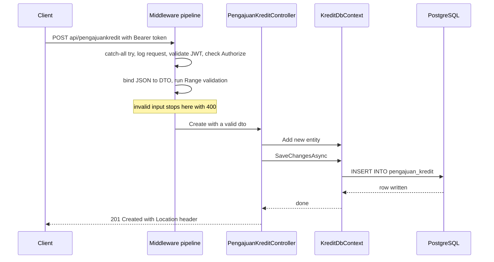
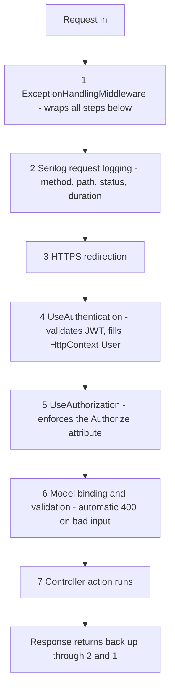

# .NET Basics for a TypeScript Developer — C# and a Real API, Explained Through Your Own Code

- **Researched:** 2026-07-06
- **Target:** Backend Developer review meeting at PT Skyworx Indonesia (banking software) — and any future .NET-adjacent interview
- **Sources freshness:** 2025–2026
- **Running example:** your own submission at `/Users/wing/Desktop/skyworkx/` (Skyworx.Kredit.Api, .NET 8 + EF Core + PostgreSQL)
- **Companion note:** [skyworx-backend-interview-prep.md](skyworx-backend-interview-prep.md) — the meeting script, per-soal questions, and weaknesses to own. This note goes deeper on the .NET fundamentals behind that code.

## TL;DR

- .NET is to C# what Node.js is to JavaScript: runtime + standard library + CLI. C# is like TypeScript, except types are compiled in and still exist at runtime.
- Your API has two phases in `Program.cs`: register services (DI container), then order middleware (pipeline). Order of middleware matters, exactly like Express.
- EF Core's big mental shift from Prisma: you do not call `update()`. You load an entity, mutate it, and `SaveChangesAsync()` diffs and writes. That is change tracking.
- DI lifetimes: Singleton (one forever), Scoped (one per request — your DbContext), Transient (new every time). Know why DbContext must be Scoped.
- `decimal` is exact base-10 math for money; `double` is the same floating point as JS `number`. Your entity uses decimal — that is the right call for a bank.

## Key Concepts

### 1. The platform in one minute

**The problem:** JavaScript needs Node.js to run on a server. C# has the same split — a language and a thing that runs it.

- **.NET** = the runtime (called the CLR — Common Language Runtime) + a huge standard library + the `dotnet` CLI. Think: Node.js + npm + the stdlib, in one install.
- **C#** = the language. Like TypeScript, but compiled to bytecode. There is no "strip the types" step — types are real at runtime, so reflection and runtime type checks work.
- **.NET 8** = what your project targets. It was the LTS release when you built the test. As of late 2025, **.NET 10 is the current LTS**; .NET 8 stays supported until November 2026 (more in "What's Current").
- **ASP.NET Core** = the web framework inside .NET. It plays the role of Express, but batteries included: routing, DI, auth, validation, logging are built in.

Analogy: Node.js is a toolbox you fill from npm. .NET is a workshop that comes furnished — you add fewer packages because more is built in.

**In TypeScript you know this as:** the Node + npm + package.json world. Mapping:

| .NET | Node/TS equivalent |
|---|---|
| `dotnet new webapi` | `npx create-express-app` / scaffolding |
| `dotnet run` | `npm start` |
| `dotnet watch` | `nodemon` / `tsx watch` |
| `dotnet test` | `npx jest` |
| `dotnet add package Serilog` | `npm install pino` |
| `dotnet ef migrations add X` | `npx prisma migrate dev --name x` |
| `Skyworx.Kredit.Api.csproj` | `package.json` (dependencies + build config) |
| NuGet | npm registry |
| `.sln` solution file | monorepo workspace (groups Api + Tests projects) |
| `bin/` and `obj/` | `dist/` (build output; gitignored) |

### 2. C# language essentials for a TS dev

**Static types, but inferred.** `var` is not `any`. It is full type inference, like `const x = ...` in TS.

```csharp
var data = await _db.PengajuanKredits.ToListAsync(); // inferred List<PengajuanKredit>
List<PengajuanKredit> data2 = ...;                   // explicit, same thing
```

**Classes and properties.** `{ get; set; }` declares a property — a field with a built-in getter and setter. Your entity is all properties:

```csharp
public class PengajuanKredit
{
    public Guid Id { get; set; }
    public decimal Plafon { get; set; }
}
```

```ts
// TS equivalent
class PengajuanKredit {
  id!: string;      // Guid ≈ a UUID string
  plafon!: Decimal; // no native TS equivalent — see decimal below
}
```

**Records.** A one-line immutable class with value equality (two records with the same data are equal). You used classes for DTOs; records are the more modern option for read-only data:

```csharp
public record LoginDto(string Username, string Password);
```

**In TS you know this as:** a `Readonly<{...}>` object type — except C# also gives you equality by value for free.

**Null safety.** C# has "nullable reference types" — the compiler tracks what can be null, like `strictNullChecks`.

- `string?` = may be null (TS `string | null`).
- `!` = null-forgiving operator, "trust me, it is not null" (same symbol and meaning as TS). You used it in `jwtSettings["Key"]!`.
- `entity is null` = pattern matching. Preferred over `== null` because `==` can be overloaded by a class; `is null` cannot lie. You used it in every controller.

**async/await: Task vs Promise.** `Task<T>` ≈ `Promise<T>`. The syntax is nearly identical. The engine underneath is not:

- Node: one event loop thread. You cannot block on a promise — the language gives you no way to.
- .NET: a **thread pool** — many worker threads. `await` frees the current thread to serve other requests. But C# *does* give you a way to block: `task.Result` or `task.Wait()`. That parks a thread until the task finishes.
- **Why `.Result` deadlocks:** in some contexts the task's continuation needs the very thread you just blocked. The task waits for the thread; the thread waits for the task. Frozen. Even without a deadlock, blocking threads starves the pool under load.
- The rule is the same as Node: **async all the way down**. Your code does this correctly — every DB call is `await`ed, every action returns `Task<...>`.

**LINQ ≈ array methods.** LINQ (Language Integrated Query) is C#'s filter/map/sort:

```csharp
var big = items.Where(x => x.Plafon > 1000).Select(x => x.Id).OrderBy(x => x);
```

```ts
const big = items.filter(x => x.plafon > 1000).map(x => x.id).sort();
```

The twist: on a database query (`IQueryable`), LINQ is not run in memory — it is **translated to SQL**, like Prisma building a query. `_db.PengajuanKredits.Where(...)` becomes a `WHERE` clause. On a plain `List`, it runs in memory like array methods.

**decimal vs double — the banking one.** JS `number` and C# `double` are the same IEEE 754 binary float: `0.1 + 0.2 !== 0.3`. That is unacceptable for money. C# `decimal` is base-10 with 28–29 significant digits — `0.1m + 0.2m == 0.3m`, exactly. JS has no built-in equivalent; Prisma's `Decimal` wraps a library to fake it. Your entity uses `decimal` for Plafon, Bunga, and Angsuran — say that this was deliberate, because Skyworx handles real money. (You cast to `double` only inside the annuity formula because `Math.Pow` has no decimal version — the prep note covers how to defend that.)

**Small stuff:**

- String interpolation: `$"Hello {name}"` ≈ `` `Hello ${name}` ``.
- Namespaces ≈ modules, but there are no file paths. `namespace Skyworx.Kredit.Api.Data;` declares where a class lives; `using Skyworx.Kredit.Api.Data;` imports the whole namespace. No `../../` — the compiler sees the whole project at once.
- Generics look the same: `List<T>`, `Task<ActionResult<PengajuanKredit>>` ≈ `Array<T>`, `Promise<T>`.

### 3. Building the API — Program.cs and controllers

**The problem:** where does the app start, and how do URLs reach code?

**Program.cs is your `index.ts`.** It always has the same shape — memorize this sentence: *builder → services → build → middleware → run*.

```csharp
var builder = WebApplication.CreateBuilder(args); // 1. create builder
builder.Services.AddControllers();                // 2. register services (DI)
builder.Services.AddDbContext<KreditDbContext>(...);
var app = builder.Build();                        // 3. build the app
app.UseMiddleware<ExceptionHandlingMiddleware>(); // 4. order the pipeline
app.MapControllers();                             // 5. wire routes
app.Run();                                        // 6. listen
```

**In TS you know this as:** creating the Express `app`, calling `app.use(...)` and mounting routers, then `app.listen()`. The difference: .NET splits "register what exists" (services) from "order what runs per request" (middleware). Express mixes both into `app.use`.

**Controllers ≈ Express routers.** A controller is a class; each public method is a route handler ("action"). Attributes (the `[...]` above classes and methods — like decorators in NestJS) declare the routing:

```csharp
[ApiController]                    // enables auto-validation + smart binding
[Route("api/[controller]")]        // [controller] token = class name minus "Controller"
[Authorize]                        // JWT required for every action here
public class PengajuanKreditController : ControllerBase
{
    [HttpGet("{id}")]              // GET api/pengajuankredit/{id}
    public async Task<ActionResult<PengajuanKredit>> GetById(Guid id) { ... }
}
```

```ts
// Express equivalent
const router = Router();
router.use(requireAuth);
router.get("/:id", async (req, res) => { ... });
app.use("/api/pengajuankredit", router);
```

So `PengajuanKreditController` + `[Route("api/[controller]")]` = the URL `api/pengajuankredit`. That token replacement is why the class name matters.

**ActionResult ≈ `res.status().json()`.** Instead of writing to a response object, you return a value that describes the response:

| Your code | Express equivalent |
|---|---|
| `return Ok(entity);` | `res.json(entity)` — 200 |
| `return NotFound(new { message = "..." });` | `res.status(404).json({...})` |
| `return CreatedAtAction(nameof(GetById), new { id }, entity);` | `res.status(201).location('/api/pengajuankredit/' + id).json(entity)` |
| `return NoContent();` | `res.status(204).end()` |
| `return Unauthorized(new { message = "..." });` | `res.status(401).json({...})` |

`CreatedAtAction` is the nice one: it builds the `Location` header by pointing at another action by name. REST-correct 201 with almost no code.

**Model binding — no `req.body`.** Declare a typed parameter and the framework fills it:

- `Guid id` in `GetById(Guid id)` comes from the route. If the URL segment is not a valid UUID, the client gets an automatic 400 — you never see it.
- `CreatePengajuanKreditDto dto` in `Create(...)` comes from the JSON body, parsed and typed. No `JSON.parse`, no manual casting.

**In TS you know this as:** `req.params.id` and `req.body` — except here parsing, typing, and validation happen before your function runs.

**DTOs vs entities.** Your `PengajuanKredit` entity is the database shape. Your `CreatePengajuanKreditDto` is the API contract. Keeping them separate means clients cannot set `Id` or `CreatedAt` (mass-assignment protection), and the DB can change without breaking the API. Same reason you define separate `input` types in GraphQL instead of exposing Prisma models.

This caption goes with the diagram: the full journey of `POST /api/pengajuankredit` through your app — notice how much happens before your controller code runs.



### 4. Dependency injection — the built-in container

**The problem:** your controller needs a database connection. Who creates it? Who closes it? How do tests swap it for a fake?

**The Express way you know:** you `import prisma from './db'` — Node's module cache makes it a singleton. Wiring is implicit; tests need `jest.mock` to swap it.

**The .NET way:** you never `new` your dependencies. You *register* them in `Program.cs`, *declare* them in a constructor, and the container hands them to you:

```csharp
// Program.cs — register
builder.Services.AddDbContext<KreditDbContext>(options => options.UseNpgsql(...));

// Controller — declare, receive
public PengajuanKreditController(KreditDbContext db) { _db = db; }
```

Analogy: DI is room service. You do not go buy the DbContext; you write it on the order card (the constructor), and the container delivers a fresh one to your room (the request).

**Lifetimes — the guaranteed interview question.** When you register a service you pick how long an instance lives:

| Lifetime | Lives for | Use for | Express analogy |
|---|---|---|---|
| **Singleton** | the whole app | config, caches, stateless helpers | module-level `import` |
| **Scoped** | one HTTP request | **DbContext**, per-request state | `res.locals` / per-request context |
| **Transient** | new one every resolve | tiny stateless services | calling a factory function each time |

`AddDbContext` registers **Scoped** by default. Why that matters:

- A DbContext is **stateful** — it tracks every entity you load (see change tracking below) and is **not thread-safe**.
- One per request = a clean unit of work: load, mutate, save, dispose. No leakage between users.
- If it were a Singleton, every request would share one context: race conditions, stale data, and a change tracker that grows forever.

Contrast to name out loud: PrismaClient is *designed* to be a singleton (it just pools connections and holds no request state). DbContext is *designed* to be per-request (it holds tracked entities). Same layer, opposite lifetime — because of state.

**The trap to know: captive dependency.** A Singleton that takes a Scoped service in its constructor "captures" it forever — the per-request thing silently becomes app-wide. .NET throws at startup in development to catch this. The fix is `IServiceScopeFactory`: the singleton creates a short-lived scope when it needs the scoped service.

**Why your tests loved this:** in `PengajuanKreditControllerTests` you built an in-memory DbContext and passed it straight into `new PengajuanKreditController(db)`. Constructor injection made the controller swappable with zero mocking framework. That is the whole point of DI.

### 5. EF Core + migrations — Prisma with a different philosophy

**The mapping first:**

| EF Core | Prisma |
|---|---|
| `KreditDbContext : DbContext` | `PrismaClient` |
| `DbSet<PengajuanKredit> PengajuanKredits` | `prisma.pengajuanKredit` |
| `OnModelCreating` fluent config | `schema.prisma` (`@map`, `@@map`, `@db.Decimal`, `@@index`) |
| `dotnet ef migrations add InitialCreate` | `prisma migrate dev --name init` |
| `dotnet ef database update` | apply pending migrations |
| `KreditDbContextModelSnapshot.cs` | Prisma's migration state tracking |
| Npgsql (the PostgreSQL provider) | `pg` driver + Prisma's Postgres connector |

**Schema config.** Prisma puts mapping in a schema file; EF Core puts it in C# code. Your `OnModelCreating` does exactly what a `schema.prisma` block would:

```csharp
entity.ToTable("pengajuan_kredit");                                   // @@map("pengajuan_kredit")
entity.Property(e => e.Plafon).HasColumnName("plafon")
      .HasColumnType("numeric");                                      // @map("plafon") @db.Decimal
entity.HasIndex(e => e.Tenor).HasDatabaseName("ix_pengajuan_kredit_tenor"); // @@index([tenor])
```

Your `utcConverter` is a **value converter** — a transform applied on every read/write of a column. The problem it solves: your `timestamp` columns have no time zone, and the Npgsql driver rejects `DateTime` values marked as UTC for that column type. The converter strips the UTC marker going in and restores it coming out, so the rest of the code can always work in UTC. In Prisma terms: a global serializer for one field — something Prisma cannot even do; you would handle it in app code.

**Migrations.** `dotnet ef migrations add InitialCreate` compared your model to the last snapshot and generated `Up()` and `Down()` methods in C# (your `20260702090431_InitialCreate.cs` — the `CreateTable` + two `CreateIndex` calls). `dotnet ef database update` runs the SQL. One real difference from Prisma: Prisma generates raw SQL files; EF generates C# that produces SQL, and it includes `Down()` for rollback by default.

**Change tracking — the biggest mental shift from Prisma.**

The problem: how does the ORM know what to write to the database?

- **Prisma is explicit.** You say what to change: `prisma.pengajuanKredit.update({ where: { id }, data: { plafon } })`.
- **EF Core watches you.** Every entity loaded through the context is *tracked*. You mutate its properties like a plain object. `SaveChangesAsync()` diffs every tracked entity against its original values and generates exactly the needed SQL.

Your `Update` action is the perfect demonstration — notice there is **no update call anywhere**:

```csharp
var entity = await _db.PengajuanKredits.FindAsync(id); // now tracked
entity.Plafon = dto.Plafon;                            // just mutate
entity.UpdatedAt = DateTime.UtcNow;
await _db.SaveChangesAsync();                          // EF diffs → UPDATE ... SET changed columns
```

```ts
// The Prisma version of the same thing — explicit
await prisma.pengajuanKredit.update({
  where: { id },
  data: { plafon: dto.plafon, updatedAt: new Date() },
});
```

Analogy: Prisma is dictating a letter — you spell out every change. EF Core is a proofreader with the original next to your draft — it finds the differences itself.

The follow-up they may ask: tracking costs memory and time. For read-only queries, add `.AsNoTracking()` so EF skips the bookkeeping — the standard performance answer for endpoints like your `GetAll`.

### 6. Validation — data annotations

**The problem:** never trust client input. In Node you reach for zod or class-validator. In ASP.NET Core, validation rules live as attributes on the DTO:

```csharp
public class CreatePengajuanKreditDto
{
    [Range(0.01, double.MaxValue, ErrorMessage = "Plafon harus lebih dari 0")]
    public decimal Plafon { get; set; }

    [Range(0, 100, ErrorMessage = "Bunga harus antara 0 dan 100")]
    public decimal Bunga { get; set; }
}
```

```ts
// zod equivalent
const CreateDto = z.object({
  plafon: z.number().positive("Plafon harus lebih dari 0"),
  bunga: z.number().min(0).max(100),
});
```

**The magic half:** `[ApiController]` on the controller makes validation automatic. If any rule fails, the framework returns **400 with field-level errors** before your action runs. There is no `if (!parsed.success)` anywhere in your code — that is why your controllers are so clean. In Express you would write a validation middleware per route; here the pipeline does it.

Common annotations: `[Required]`, `[Range]`, `[StringLength]`, `[EmailAddress]`, `[RegularExpression]`. One gotcha worth knowing: `[Required]` on a non-nullable value type like `decimal` does nothing useful — a missing JSON field just becomes `0`. That is why you used `[Range(0.01, ...)]` instead: it rejects the default `0`. Good instinct; say it was deliberate.

**When annotations run out:** cross-field rules ("angsuran must match plafon, bunga, and tenor") or rules needing a DB lookup. That is when .NET developers add **FluentValidation** — a library where rules are code, like zod's `.refine()`. Right answer in the meeting: "annotations covered everything the spec asked; for cross-field rules like validating angsuran against the formula I would add FluentValidation."

### 7. The middleware pipeline — Express with an onion shape

**The problem:** every request needs the same cross-cutting steps — error capture, logging, auth — before business logic.

Middleware in ASP.NET Core is the same idea as Express: a chain of functions, each deciding to pass the request on or short-circuit. `await _next(context)` is literally `next()`.

The shape difference worth naming: it is an **onion**. Each middleware wraps everything after it — code before `await _next()` runs on the way in, code after it runs on the way out. That is why your exception handler is registered **first**: its `try` block wraps the entire rest of the pipeline. In Express the error handler goes **last** instead, because Express forwards errors ahead with `next(err)`. Opposite positions, same goal: be outermost.

Your custom middleware follows the standard convention — a class with a constructor taking `RequestDelegate` (the next step) plus dependencies, and an `InvokeAsync(HttpContext)` method:

```csharp
public async Task InvokeAsync(HttpContext context)
{
    try { await _next(context); }                       // ≈ next()
    catch (Exception ex)
    {
        _logger.LogError(ex, "Unhandled exception on {Method} {Path}", ...);
        context.Response.StatusCode = 500;
        await context.Response.WriteAsJsonAsync(new { status = 500, message = "..." });
    }
}
```

```ts
// Express equivalent (error middleware, registered LAST)
app.use((err, req, res, next) => {
  logger.error({ err }, "unhandled");
  res.status(500).json({ status: 500, message: "..." });
});
```

This caption goes with the diagram: your actual pipeline order from `Program.cs` — notice the exception handler wraps everything, and authentication runs before authorization.



The standard order to recite: **exception → logging → HTTPS → authentication → authorization → endpoints.** Authentication (who are you — parses the JWT) must come before authorization (are you allowed — checks `[Authorize]`), because authorization reads the identity authentication produced.

### 8. Logging — ILogger and Serilog

**The problem:** `console.log` does not survive production. You need levels, structure, and destinations.

Two layers in .NET:

- **`ILogger<T>`** — the built-in abstraction. Injected via DI everywhere (your middleware takes `ILogger<ExceptionHandlingMiddleware>`; the `T` becomes the log category so you can filter by class). Code depends only on this interface.
- **Serilog** — the popular implementation you plugged in with `builder.Host.UseSerilog()`. Now every `ILogger` call flows through Serilog to its **sinks** (destinations): your config writes to Console and to a daily-rolling file (`Logs/log-.txt`).

**In TS you know this as:** pino or winston — Serilog fills the same seat, and sinks ≈ pino transports.

**Structured logging — why the template syntax matters.** Look at your middleware's log line:

```csharp
_logger.LogError(ex, "Unhandled exception on {Method} {Path}", context.Request.Method, context.Request.Path);
```

`{Method}` and `{Path}` are a **message template**, not string interpolation. Serilog stores the values as named properties alongside the text. That means you can later query "all errors where Path = /api/pengajuankredit" in a log system. If you wrote `$"... {method} {path}"` instead, the values would be melted into one string — searchable only with regex. Same reason you pass objects to pino (`logger.error({ path }, "msg")`) instead of concatenating.

Two more deliberate choices in your `Program.cs` to point at:

- The bootstrap logger is configured **before** `CreateBuilder`, so even startup crashes (bad config, port in use) get logged.
- `app.UseSerilogRequestLogging()` gives one clean line per request: method, path, status, duration — your access log.

### 9. Auth with JWT

**The problem:** stateless API authentication. Same solution you use in Node — signed JWTs — with the verification wired into the pipeline instead of a route-level middleware you write yourself.

**Issuing (your `AuthController`):**

```csharp
var key = new SymmetricSecurityKey(Encoding.UTF8.GetBytes(jwtSettings["Key"]!));
var credentials = new SigningCredentials(key, SecurityAlgorithms.HmacSha256);
var claims = new[] {
    new Claim(JwtRegisteredClaimNames.Sub, dto.Username),
    new Claim(JwtRegisteredClaimNames.Jti, Guid.NewGuid().ToString())
};
var token = new JwtSecurityToken(issuer, audience, claims, expires: ..., signingCredentials: credentials);
```

```ts
// jsonwebtoken equivalent
const token = jwt.sign(
  { sub: username, jti: randomUUID() },
  secret,
  { algorithm: "HS256", issuer, audience, expiresIn: "60m" }
);
```

**Claims ≈ the JWT payload.** Each `Claim` is one key-value pair in the token. `Sub` = subject (who), `Jti` = unique token id. After authentication runs, they are available as `HttpContext.User` — the .NET version of `req.user`.

**Verifying (your `Program.cs`):** `AddAuthentication().AddJwtBearer(...)` with `TokenValidationParameters` is the declarative version of `jwt.verify` + an Express auth middleware. Your config validates all four things that matter: signature (`IssuerSigningKey`), expiry (`ValidateLifetime`), issuer, and audience. Then:

- `app.UseAuthentication()` — runs per request, parses the `Authorization: Bearer` header, fills `HttpContext.User`.
- `[Authorize]` on a controller — rejects with 401 if there is no valid identity. Placing it on the class (as you did on `PengajuanKreditController`) protects every action; `AuthController` has none, so login stays public. ≈ `router.use(requireAuth)` on one router but not another.

**Where the secret lives:** yours is in `appsettings.json` — the .NET config file (≈ a committed `.env` + config in one; environment variables override it at runtime). Fine for an assessment; for production say: environment variables or a secret manager (AWS Secrets Manager / Azure Key Vault), plus key rotation. The prep note has the full defense.

### 10. Testing quickly — xUnit

Mapping:

| xUnit | Jest |
|---|---|
| `[Fact]` | `test("...")` |
| `[Theory]` + `[InlineData(1, 2)]` | `test.each([[1, 2]])` |
| `Assert.Equal(a, b)` | `expect(b).toEqual(a)` |
| `Assert.IsType<OkObjectResult>(x)` | `expect(x).toBeInstanceOf(...)` — and it returns the cast value |
| `dotnet test` | `npx jest` |

Your isolation pattern is the one to explain: each test calls `CreateContext()`, which builds a DbContext on the **InMemory provider** with a `Guid` as the database name. Unique name = fresh empty database per test = tests can run in parallel and in any order. ≈ giving each Jest test its own SQLite-in-memory Prisma client.

The honest limitation (raise it before they do): calling controller methods directly skips the HTTP pipeline — so `[Authorize]`, `[Range]` validation, and model binding are never exercised, and InMemory is not real Postgres. The named fix: **`WebApplicationFactory`** — the supertest equivalent. It boots your real `Program.cs` in memory and lets tests send actual HTTP requests, so a test can assert "no token → 401" and "bunga = 150 → 400". Add **Testcontainers** (disposable real Postgres in Docker) for full fidelity.

## What's Current (2025–2026)

- **.NET 10 is the current LTS** — released November 2025, supported to November 2028. Even-numbered releases are LTS (3 years); odd ones get 18 months.
- **.NET 8 (your project) is still in support until November 10, 2026** — Microsoft announced the end-of-support date in 2026. Good meeting line: "I targeted .NET 8 because it was the safe LTS; upgrading to .NET 10 is mostly a TargetFramework bump plus package updates."
- **Minimal APIs** are Microsoft's recommended starting point for new small APIs (2025 docs): route handlers defined directly on `app`, like Express (`app.MapGet("/x", handler)`). Controllers remain the standard for larger, structured APIs — your choice of controllers is easy to defend for a CRUD test with auth and validation. .NET 10 closed a gap by adding data-annotation validation to minimal APIs (2025).
- **EF Core** versions ship with .NET (EF Core 8 with .NET 8, EF Core 10 with .NET 10). Change tracking, migrations, and the Npgsql provider work the same across them.
- **FluentValidation** remains the community standard for complex validation (2025); data annotations remain fine for simple per-field rules.
- **Serilog** is still the dominant structured-logging library in .NET (2025), typically paired with a queryable sink (Seq, ELK, CloudWatch) in production rather than flat files.

## Likely Interview Questions

### Q: Why is ExceptionHandlingMiddleware registered first, and what happens if you move it after logging?

**Answer outline:**
- The pipeline is an onion: each middleware wraps everything registered after it.
- First = outermost `try/catch`. It catches exceptions from every later step, including the request logger itself.
- Moved later, anything thrown by middleware above it escapes — the client could get a raw 500 with no clean JSON body.
- Express contrast: same goal, opposite position — Express error middleware goes last because errors travel forward via `next(err)`.

### Q: Explain Singleton, Scoped, Transient. What lifetime is your DbContext and why?

**Answer outline:**
- Singleton = one instance for the app; Scoped = one per HTTP request; Transient = new every resolution.
- `AddDbContext` registers Scoped. DbContext is stateful (change tracker) and not thread-safe, so sharing across requests is unsafe.
- One per request = clean unit of work: load, mutate, save, dispose.
- Bonus signal: name the captive-dependency trap — a Singleton must not constructor-inject a Scoped service; use `IServiceScopeFactory` instead.
- Contrast with Prisma: PrismaClient is a singleton by design because it holds no per-request state — same layer, opposite lifetime, and I can explain why.

### Q: Why decimal for plafon but double inside the angsuran calculation?

**Answer outline:**
- `double` is binary floating point — same as JS `number`; cannot represent 0.1 exactly. Wrong for stored money.
- `decimal` is base-10, 28–29 digits, exact for currency — so all entity and DB money columns are decimal (`numeric` in Postgres).
- The formula needs `Math.Pow`, which only exists for double; error there is far below one rupiah, and I round to 2 decimals at the end.
- Production hardening: a decimal power loop and an explicit `MidpointRounding` policy (banker's rounding is a business decision in finance).

### Q: Your PUT endpoint never calls an update method. How does EF Core know what to save?

**Answer outline:**
- Change tracking: entities loaded through the context are tracked with their original values.
- I mutate properties; `SaveChangesAsync()` diffs tracked entities and generates an UPDATE for only the changed columns, inside a transaction.
- Contrast: Prisma is explicit (`update({ where, data })`); EF is implicit via tracking.
- Cost awareness: tracking has overhead, so read-only endpoints should use `.AsNoTracking()`.

### Q: What is wrong with calling task.Result? Isn't C# async the same as Node?

**Answer outline:**
- Same programming model (`Task` ≈ `Promise`, `await` ≈ `await`), different engine: thread pool vs single event loop.
- `.Result`/`.Wait()` block a thread. If the task's continuation needs that thread, both wait on each other — deadlock. Node cannot even express this mistake.
- Even without deadlock, blocked threads starve the pool under load.
- Rule: async all the way down — my code awaits every DB call and returns `Task` from every action.

### Q: Walk me through what happens between the request arriving and your Create method running.

**Answer outline:**
- Exception middleware opens its try; Serilog starts the request log; HTTPS check.
- Authentication parses the Bearer token, validates signature/expiry/issuer/audience, fills `HttpContext.User`.
- Authorization enforces `[Authorize]` — 401 short-circuit if invalid.
- Routing matches `api/pengajuankredit` to the controller; model binding parses JSON into the DTO and the route `Guid`.
- `[ApiController]` runs data-annotation validation — automatic 400 with field errors on failure.
- Only then does `Create(dto)` run, already holding validated, typed input.

## Tradeoffs to Be Ready For

- **Controllers vs minimal APIs:** controllers give structure, filters, and conventional validation for bigger APIs; minimal APIs are lighter and now Microsoft's default suggestion for small services (2025). Yours: controllers — right for a CRUD API with auth + validation, and the enterprise-standard style a banking company reads daily.
- **Data annotations vs FluentValidation:** annotations = zero-setup, per-field, lives on the DTO; FluentValidation = cross-field and testable rules as code. Start with annotations; add FluentValidation when rules involve two or more fields.
- **Change tracking vs explicit updates:** tracking makes update code short and diff-precise but costs memory per tracked entity; `AsNoTracking` for reads, and explicit `ExecuteUpdateAsync` (EF 7+) for bulk writes.
- **Scoped DbContext vs singleton PrismaClient:** not a contradiction — lifetime follows state. Stateful unit-of-work → Scoped; stateless query gateway → Singleton.
- **Symmetric (HMAC) vs asymmetric (RSA) JWT signing:** HMAC is simpler, one shared secret — fine for one service. RSA lets other services verify with a public key without holding the signing secret — the microservices/gateway answer.
- **InMemory tests vs WebApplicationFactory vs Testcontainers:** fast unit isolation vs real pipeline (auth/validation exercised) vs real Postgres. The mature answer is all three layers, budget permitting.

## Real-World Cases to Cite

- **Stack Overflow — .NET at scale:** one of the busiest sites on the internet runs on ASP.NET Core on a famously small number of servers. The go-to proof that .NET performance is not a marketing claim.
- **Raygun — Node.js to .NET Core migration:** the error-monitoring company publicly documented moving an API from Node to .NET Core and reported roughly 20x throughput on the same hardware (Microsoft customer story). Perfect for you specifically: a JS-shop that chose .NET for the hot path.
- **Microsoft Bing and Azure services — .NET in production:** Bing's frontend runs on the latest .NET, and Microsoft publishes the latency wins after each yearly upgrade — evidence the platform is actively invested in.
- **Banking and multifinance in general — why Skyworx is a .NET shop:** .NET is the default enterprise stack in banking: long LTS windows, `decimal` for money, strong typing, and vendor support match compliance-heavy environments. Skyworx's PRIMORDIUM/FINTEGRITY products live exactly in that world — your take-home mirrors it.
- **Serilog + structured logging as industry norm:** structured, queryable logs are the standard expectation in regulated industries — audit trails need "find all events for pengajuan X", which message templates enable and string concatenation destroys.

## Cheatsheet

> **Visual version:** open [dotnet-basics-for-typescript-devs-cheatsheet.html](dotnet-basics-for-typescript-devs-cheatsheet.html) in your browser — C#↔TS concept cards, pipeline diagrams, the dotnet CLI table, decision verdicts, and memory hooks, all visible at a glance.

**One-liners:**

- **.NET** — runtime + stdlib + CLI; the Node.js of C#.
- **C#** — TypeScript's strict cousin; types survive to runtime.
- **ASP.NET Core** — the built-in Express: routing, DI, auth, validation included.
- **Program.cs** — builder → services → build → middleware → run.
- **`[ApiController]`** — enables automatic 400 validation + smart model binding.
- **DI lifetimes** — Singleton (app), Scoped (request), Transient (every resolve).
- **Change tracking** — load, mutate, `SaveChangesAsync()`; EF finds the diff.
- **Message template** — `{Method} {Path}` keeps log values queryable; interpolation melts them.
- **decimal** — base-10 exact money math; double = JS number = never store money in it.
- **Middleware order** — exception → logging → HTTPS → authN → authZ → endpoints.

**dotnet CLI quick reference:**

| Command | Does | npm world |
|---|---|---|
| `dotnet new webapi` | scaffold API project | `npx create-*` |
| `dotnet run` | build + start | `npm start` |
| `dotnet watch` | hot reload | `nodemon` |
| `dotnet test` | run xUnit tests | `npx jest` |
| `dotnet add package X` | install dependency | `npm i x` |
| `dotnet ef migrations add X` | generate migration | `prisma migrate dev --name x` |
| `dotnet ef database update` | apply migrations | apply pending migrations |

**Snippet to remember (the whole update story):**

```csharp
var entity = await _db.PengajuanKredits.FindAsync(id); // tracked
if (entity is null) return NotFound();
entity.Plafon = dto.Plafon;                            // mutate
await _db.SaveChangesAsync();                          // EF diffs → UPDATE
```

**Memory hooks:**

- **"Room service DI"** — constructor = the order card; the container delivers. You never go shopping (`new`) for dependencies yourself.
- **"Onion pipeline"** — first registered = outermost layer. Exception handler is the onion's skin. (Express peels from the other end: its error handler goes last.)
- **"EF is a proofreader"** — it keeps the original, you edit the draft, it finds the differences. Prisma is dictation — you spell out every change.
- **"decimal counts on fingers, double rounds in binary"** — base-10 vs base-2; money always counts on fingers.
- **"Scoped follows state"** — DbContext holds per-request state → per-request lifetime. PrismaClient holds none → singleton.

## Sources

- [.NET 8 and .NET 9 will reach End of Support on November 10, 2026 — .NET Blog](https://devblogs.microsoft.com/dotnet/dotnet-8-9-end-of-support/) — 2026
- [.NET and .NET Core official support policy — Microsoft](https://dotnet.microsoft.com/en-us/platform/support/policy/dotnet-core) — accessed 2026-07-06 (.NET 10 LTS, Nov 2025 → Nov 2028)
- [APIs overview (minimal APIs vs controllers) — Microsoft Learn, aspnetcore-10.0](https://learn.microsoft.com/en-us/aspnet/core/fundamentals/apis?view=aspnetcore-10.0) — 2025
- [.NET Interview Questions: The 2026 Guide — codewithmukesh](https://codewithmukesh.com/blog/dotnet-interview-questions/) — 2026
- [ASP.NET Core DI Interview Questions — Coding Droplets](https://codingdroplets.com/asp-net-core-dependency-injection-interview-questions-for-senior-net-developers-2026) — 2026
- [Minimal APIs vs MVC Controllers comparisons — developersvoice.com](https://developersvoice.com/blog/dotnet/choosing-minimal-api-or-controllers/) — 2025
- [Microsoft .NET — endoflife.date](https://endoflife.date/dotnet) — accessed 2026-07-06
- Your submission: `/Users/wing/Desktop/skyworkx/Skyworx.Kredit.Api` — Program.cs, controllers, DTOs, KreditDbContext, ExceptionHandlingMiddleware, migrations, xUnit tests
