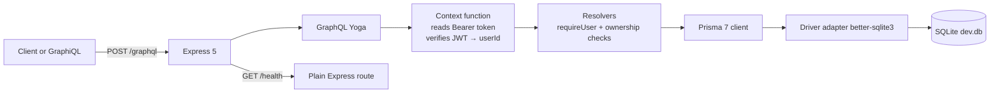
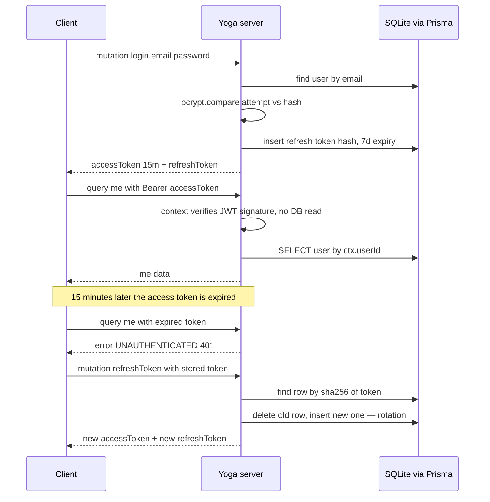

# Express + GraphQL + Prisma with Real Authentication — Taught by One Small App

- **Researched:** 2026-07-06
- **Target:** Software Engineer / Senior Software Engineer (this is the user's home stack — the goal is a clean canonical reference)
- **Sources freshness:** 2025–2026 (Prisma 7 is from Nov 2025, Apollo 4 EOL is Jan 2026)
- **Companion code:** `examples/express-graphql-auth/` — a runnable notes app. Every snippet below comes from it.

## TL;DR

- One small app: Express 5 serves HTTP, GraphQL Yoga handles `/graphql`, Prisma 7 talks to SQLite. Auth is JWT access tokens (15 min) plus DB-backed refresh tokens (7 days, single-use).
- In GraphQL, auth lives in the **context function** (identify the user, once per request) and in **resolvers** (decide what they may do). That split is the whole mental model.
- Passwords are **hashed** with bcrypt (cost 12), never encrypted, never logged. Hashing is one-way; that is the point.
- Two tokens because one token cannot be both long-lived and revocable-cheaply. Short JWT = fast, stateless checks. DB refresh token = a kill switch.
- Authentication = "who are you" (401 UNAUTHENTICATED). Authorization = "are you allowed" (403 FORBIDDEN). The `deleteNote` resolver shows both, in order.

## Key Concepts

### The architecture in one picture

Notice: Yoga is just middleware inside a normal Express app, and the context step sits before every resolver.



Why this shape: Express still owns the app. Health checks, webhooks, and file uploads stay as normal routes. GraphQL is one endpoint among them. You are not choosing "Express or GraphQL" — GraphQL rides on Express.

### What a resolver is

The problem: a GraphQL query is just a text document. Something must turn each requested field into data.

The solution: a **resolver** — one function per field. `Query.myNotes` is a function. `Note.author` is a function. The GraphQL engine walks the query and calls the matching functions.

Analogy: the schema is a restaurant menu; resolvers are the cooks. Each dish on the menu has exactly one cook who knows how to make it.

Why it matters: field resolvers run per object. Ask for 50 notes with their authors, and `Note.author` runs 50 times. That is the **N+1 problem** — 1 query for the list, N queries for the children. The fix at scale is DataLoader, which collects all the author IDs in one tick and fetches them in a single `WHERE id IN (...)` query.

### The context function — where authentication lives

The problem: every resolver needs to know who is calling, but you do not want token-parsing code in every resolver.

The solution: the **context function**. It runs once per request, before any resolver. It reads the `Authorization` header, verifies the JWT, and returns an object that every resolver receives as its third argument.

```ts
// src/context.ts — the heart of GraphQL auth
export function buildContext({ request }: { request: Request }): Context {
  const header = request.headers.get("authorization") ?? "";
  const token = header.startsWith("Bearer ") ? header.slice("Bearer ".length) : null;
  const userId = token ? verifyAccessToken(token) : null; // bad token → null, no throw
  return { prisma, userId };
}
```

Two deliberate choices:

- **It never throws.** A missing or bad token just means `userId: null`. Public operations like `register` and `login` must work without a token.
- **Resolvers opt in to auth** through one helper:

```ts
export function requireUser(ctx: Context): string {
  if (!ctx.userId) {
    throw new GraphQLError("Not authenticated. Send a valid Bearer token.", {
      extensions: { code: "UNAUTHENTICATED", http: { status: 401 } },
    });
  }
  return ctx.userId;
}
```

Analogy: context is the hotel front desk. It checks your ID once and hands you a room key card (`ctx.userId`). Each door (resolver) then only has to check the card.

Contrast with REST: in Express REST, auth is middleware on a route (`app.get("/notes", requireAuth, handler)`). GraphQL has one route for everything, so route middleware cannot distinguish `login` from `myNotes`. Identification moves to context; the allow/deny decision moves into resolvers.

### Hashing vs encryption — why bcrypt

- **Encryption is two-way.** Anyone with the key can get the original back. Wrong for passwords: if the key leaks, every password leaks (this is exactly what happened to Adobe in 2013).
- **Hashing is one-way.** You can compute hash from password, but not password from hash. At login you hash the attempt and compare hashes.
- A **salt** is a random value mixed into each hash, so two users with the same password get different hashes. It defeats precomputed lookup tables (rainbow tables). bcrypt generates and embeds the salt automatically — the salt lives inside the hash string.
- The **cost factor** makes bcrypt slow on purpose. Cost 12 means 2^12 internal rounds, roughly 100–300 ms. One login barely notices; an attacker trying billions of guesses against a stolen database is priced out.

```ts
// src/auth.ts
export function hashPassword(plain: string) {
  return bcrypt.hash(plain, 12); // cost 12 — OWASP minimum for bcrypt is 10
}
```

2026 status: OWASP's first choice for new systems is **argon2id** (memory-hard, resists GPU cracking; minimum 19 MiB memory, 2 iterations). bcrypt with cost ≥ 10 is still listed as acceptable and remains the most common in Node apps. Know one bcrypt limit: it only reads the first 72 bytes of a password.

### JWT anatomy

A **JWT** (JSON Web Token) is three base64url-encoded parts joined by dots: `header.payload.signature`.

Decoded, the access token from this app looks like:

```json
// header — what algorithm signed it
{ "alg": "HS256", "typ": "JWT" }

// payload — the claims. "sub" (subject) = whose token, "exp" = expiry
{ "sub": "cmb1x9k...", "iat": 1751791200, "exp": 1751792100 }
```

The **signature** is a keyed hash (HMAC-SHA256) of the first two parts using `JWT_SECRET`. Change one character of the payload and the signature no longer matches — the server rejects it.

Two facts people get wrong:

- **JWTs are readable by anyone.** Base64 is encoding, not encryption. Paste any JWT into a decoder and read it. Never put secrets in the payload.
- **JWTs are tamper-proof, not secret.** The signature proves the server issued it and nobody edited it. That is all it proves.

Analogy: a JWT is a festival wristband. Anyone can read it, nobody can forge it, and the gate checks it in microseconds without calling the office. But you cannot take a wristband back — it works until it expires. That is why ours lasts only 15 minutes.

### Access token + refresh token — why two

The problem: one token cannot win both fights. A long-lived JWT is dangerous — stolen means days of access, and you cannot revoke it without giving up statelessness. A short-lived JWT alone means users re-enter passwords every 15 minutes.

The solution: split the job.

| | Access token | Refresh token |
|---|---|---|
| Format | JWT, self-contained | Opaque random string (256 bits) |
| Lifetime | 15 min | 7 days |
| Verified by | Signature check, no DB read | DB lookup of its SHA-256 hash |
| Sent | On every request | Only to the `refreshToken` mutation |
| Revocable | No — expires on its own | Yes — delete the row |

The flow: login returns both. The client uses the access token until it expires, then trades the refresh token for a fresh pair. **Rotation** means each refresh token works exactly once — using it deletes the row and issues a replacement. If a stolen token is replayed later, the row is gone and the call fails. RFC 9700 (the OAuth security best-practices RFC, Jan 2025) made rotation the standard recommendation.

We store `sha256(token)` in the DB, not the token. Reason: if the database leaks, the rows are useless — you cannot reverse the hash to get a usable token. (Plain SHA-256 is fine here, unlike passwords, because the token is random — there is nothing to guess.)

Notice the full lifecycle — login, an authenticated query, expiry, refresh with rotation:



### Where the client stores tokens — honest tradeoffs

The problem: the browser has no perfectly safe place.

- **localStorage:** survives reloads, easiest to code. But any XSS (cross-site scripting — injected JavaScript running on your page) can read it and exfiltrate tokens. OWASP says do not put refresh tokens here.
- **In-memory (a JS variable):** invisible to most XSS persistence, gone on reload. Fine for the access token; users just silently refresh on page load.
- **httpOnly cookie:** JavaScript cannot read it at all, so XSS cannot steal it. The browser attaches it automatically — which creates CSRF risk (another site triggering requests as you), handled with `SameSite=Lax/Strict` flags. Requires the API and client to share a site or configure CORS with credentials.

The 2025–2026 default recommendation: **access token in memory, refresh token in an httpOnly, Secure, SameSite cookie.** For React Native, use the platform keychain (e.g. `expo-secure-store`) — never `AsyncStorage` for tokens. This demo app returns both tokens in the GraphQL response to keep the flow visible; say that out loud in an interview and name the cookie upgrade.

### Attacks, one line each

- **Token theft (XSS):** injected script reads storage → keep refresh tokens in httpOnly cookies, short access-token life limits the damage.
- **Token replay:** stolen refresh token reused → rotation makes each token single-use; a replay finds no DB row. (Auth0 goes further: reuse detection revokes the whole family.)
- **Brute force on login:** unlimited password guessing → rate-limit the `login` mutation per IP and per account (e.g. Redis counter), bcrypt slows each attempt anyway.
- **User enumeration:** different errors for "no such email" vs "wrong password" tell attackers which emails exist → return one identical error for both (this app does).
- **Logging passwords:** a request logger that dumps GraphQL variables will record plaintext passwords → redact variables for auth mutations; Facebook (2019) and Twitter (2018) both shipped this bug.
- **Secret leakage:** `JWT_SECRET` in git = anyone can mint valid tokens → env vars only, rotate if exposed.

### The project files, in reading order

Full code in `examples/express-graphql-auth/`. What each file teaches:

1. **`prisma/schema.prisma`** — three models. `User.passwordHash` (never `password`). `RefreshToken.tokenHash` with `@unique` (the lookup key). `Note.authorId` with `@@index` because every ownership query filters on it. Switching to Postgres is one `provider` line plus the adapter.
2. **`prisma.config.ts`** — new in Prisma 7. The CLI config moved out of `schema.prisma`: datasource URL, migrations path. Env vars are no longer auto-loaded, hence `import "dotenv/config"` at the top.
3. **`src/db.ts`** — one `PrismaClient` for the whole process, built with a **driver adapter** (Prisma 7's client is pure TypeScript; the adapter — `better-sqlite3` here, `pg` for Postgres — does the actual database I/O). One client per process, never per request: each client owns a connection pool.
4. **`src/schema.ts`** — the SDL (Schema Definition Language). `AuthPayload` returns `accessToken`, `refreshToken`, `user`. Docstrings in the schema show up in GraphiQL — self-documenting API.
5. **`src/auth.ts`** — the crypto toolbox: bcrypt hash/verify, JWT sign/verify (`sub` claim carries the userId), refresh token issue/rotate/revoke. `verifyAccessToken` returns `null` on any failure instead of throwing — invalid token simply means anonymous.
6. **`src/context.ts`** — covered above. The one-per-request identification step.
7. **`src/resolvers.ts`** — the logic. Three details worth quoting in interviews:
   - `register` catches Prisma error **P2002** (unique constraint) instead of find-then-create. The DB constraint is the source of truth; check-then-insert has a race window between two simultaneous requests.
   - `login` computes one `valid` boolean and throws a single identical error — no user enumeration.
   - `deleteNote` runs `requireUser` (authentication, 401) and then `note.authorId !== userId` (authorization, 403). Two different questions, two different codes.
8. **`src/server.ts`** — `createYoga` + `app.use(yoga.graphqlEndpoint, yoga)`. GraphQL is one middleware in a normal Express 5 app.

## What's Current (2026)

- **Express 5** is the npm default since 5.1.0 (March 31, 2025). Biggest practical win: rejected promises in async handlers are forwarded to the error handler automatically — no more `try/catch(next)` boilerplate. Node 18+ required.
- **Apollo Server 4 reached end-of-life on January 26, 2026.** Apollo Server 5 (June 2025) dropped the built-in Express integration; you now install `@as-integrations/express5` separately.
- **GraphQL Yoga 5** (The Guild) is the mainstream pick for small-to-mid Express servers in 2026: single package, faster in public benchmarks, built-in GraphiQL, SSE subscriptions and file uploads included. Apollo still wins when you need its ecosystem (Federation gateway, Apollo Studio/GraphOS). This project uses Yoga; the swap to Apollo 5 is ~10 lines.
- **Prisma 7** (November 19, 2025) is a major shift: Rust engine removed (client rebuilt in TypeScript, ~90% smaller, up to 3x faster queries), generator renamed `prisma-client-js` → `prisma-client`, generated code lives in your `src/` (output path required), **driver adapters are mandatory**, config moved to `prisma.config.ts`, `.env` no longer auto-loads, and `migrate dev` no longer runs `generate` for you.
- **Password hashing (OWASP, current):** argon2id is the first choice for new systems (≥19 MiB memory, 2 iterations, parallelism 1); bcrypt is still acceptable at work factor ≥ 10 (this app uses 12). Mention the 72-byte bcrypt input limit.
- **Token guidance:** RFC 9700 (OAuth 2.0 Security Best Current Practice, January 2025) standardizes refresh token rotation and mandatory PKCE. Common production numbers in 2025–2026: access tokens 5–30 minutes, refresh tokens 7–14 days with rotation.
- **JWT libraries:** `jsonwebtoken` v9 is still the most common; `jose` is the modern ESM/Web-Crypto alternative (works in edge runtimes like Vercel Edge and Cloudflare Workers).

## Likely Interview Questions

### Q: How does authentication work in a GraphQL server compared to REST middleware?

**Answer outline:**
- REST: auth middleware per route; the URL tells you what is protected.
- GraphQL: one URL, so identification moves to the **context function** — parse the Bearer header, verify the JWT, put `userId` in context, once per request.
- Context never throws; public operations (login, register) need to work anonymously.
- Enforcement is per-resolver (`requireUser`), or via directives/shield middleware in bigger schemas; in Hasura it becomes session variables + row-level permissions.
- Bonus: field-level protection is possible in GraphQL, which REST middleware cannot express.

### Q: Walk me through what happens when an authenticated GraphQL request hits your server.

**Answer outline:**
- Express receives POST /graphql, passes to Yoga middleware.
- Context function: extract `Authorization: Bearer x`, verify JWT signature and expiry — no DB read — get `userId`.
- Yoga parses and validates the query against the schema.
- Resolvers execute top-down; protected ones call `requireUser`, ownership queries filter by `authorId = userId` in the WHERE clause, not in JS afterwards.
- Prisma sends SQL through the driver adapter; errors surface as `GraphQLError` with codes (`UNAUTHENTICATED`, `FORBIDDEN`) in `extensions`.

### Q: JWT vs server-side sessions — when would you pick each?

**Answer outline:**
- Session: random ID in a cookie, state on the server (Redis/Postgres). Instantly revocable, tiny cookie; costs a store lookup per request and shared state across instances.
- JWT: state inside the signed token. No lookup, works across services and mobile; cannot be revoked before expiry without reintroducing state.
- The hybrid everyone actually ships: short JWT access token + revocable stored refresh token — stateless on the hot path, a kill switch on the slow path.
- Senior close: "revocation requirements decide it — if instant logout matters more than stateless reads, sessions win."

### Q: Why both an access token and a refresh token? What is rotation?

**Answer outline:**
- One token cannot be both long-lived and cheaply revocable.
- Access: 15 min JWT, verified by signature only. Refresh: 7-day opaque random string, stored hashed in DB.
- Rotation = single-use refresh tokens: each refresh deletes the old row and issues a new pair; a replayed stolen token finds nothing. RFC 9700 (2025) made this the standard.
- Mention reuse detection (Auth0): if a rotated token is used again, revoke the whole token family — assume theft.

### Q: What's the difference between authentication and authorization? Show it in code.

**Answer outline:**
- Authentication = who are you (401 UNAUTHENTICATED). Authorization = are you allowed (403 FORBIDDEN).
- `deleteNote`: first `requireUser(ctx)` (authn), then `note.authorId !== userId` → FORBIDDEN (authz).
- List queries enforce ownership in the query itself (`where: { authorId: userId }`) — never fetch-all-then-filter.
- Scale-up path: role checks in context, GraphQL directives, or Hasura row-level permissions, and Postgres RLS as defense in depth.

### Q: You resolve `Note.author` per note — what problem appears at scale?

**Answer outline:**
- N+1: 1 query for the notes, N queries for authors — field resolvers run per object.
- Fix: DataLoader — batches all `author` lookups in one event-loop tick into a single `WHERE id IN (...)`, plus per-request caching (create the loader in context, so it cannot leak data across users).
- Prisma alternative: `include: { author: true }` at the parent, or Prisma's relation-query batching.
- Measure first: log query counts per request; N+1 is invisible on a 5-row dev DB.

## Tradeoffs to Be Ready For

- **GraphQL Yoga vs Apollo Server 5:** Yoga — one package, faster, batteries included (GraphiQL, SSE, uploads); Apollo — bigger ecosystem, Federation, GraphOS metrics. Small/mid Express service → Yoga. Enterprise federation → Apollo.
- **JWT vs sessions:** stateless speed and cross-service reach vs instant revocation. The access+refresh hybrid is the practical middle.
- **bcrypt vs argon2id:** bcrypt — ubiquitous, zero native deps via bcryptjs, fine at cost ≥ 10; argon2id — OWASP first choice, memory-hard against GPUs, needs a native module. New greenfield system → argon2id; existing bcrypt hashes are fine (re-hash on next login if you migrate).
- **Opaque refresh token vs JWT refresh token:** opaque + DB — trivially revocable, one insert/delete per refresh (rare, so cheap); JWT refresh — no DB, but revocation needs a denylist, which reintroduces the DB anyway. Opaque wins for most apps.
- **httpOnly cookie vs localStorage vs memory:** cookie — XSS-proof reads, needs CSRF discipline (SameSite); localStorage — convenient, XSS-readable, avoid for refresh tokens; memory — safest and simplest, lost on reload (pair with cookie-based refresh).
- **Access token lifetime:** shorter = smaller theft window but more refresh traffic; 15 min is the boring, defensible default. Say the tradeoff, then commit.
- **SQLite vs PostgreSQL here:** SQLite — zero setup, perfect for a demo/embedded use; Postgres — concurrency, row-level security, production. Prisma makes the swap a provider line + adapter, and migrations carry over.

## Real-World Cases to Cite

- **LinkedIn (2012) — why salts and slow hashes:** 6.5M password hashes leaked; they were unsalted SHA-1, so rainbow tables cracked most of them in days. The canonical "this is why bcrypt, not fast hashes" story.
- **Adobe (2013) — encryption is not hashing:** ~150M records leaked with passwords *encrypted* (3DES, one key) plus plaintext password hints. One key decrypts everything — the textbook argument for one-way hashing.
- **Twitter (2018) & GitHub (2018) — never log passwords:** both found internal logs recording plaintext passwords before hashing and forced mass resets. Cite when explaining why your logger must redact auth mutation variables.
- **Facebook (2019) — same lesson at scale:** hundreds of millions of plaintext passwords in internal logs, searchable by ~20k employees. Logging, not hashing, was the failure.
- **Auth0 — refresh token rotation with reuse detection:** their documented model: single-use refresh tokens; if an already-used token is replayed, the entire token family is revoked because theft is assumed. The pattern this app's `rotateRefreshToken` is a small version of.
- **GitHub (2021) — token design:** moved to prefixed, identifiable tokens (`ghp_...`) enabling automatic secret scanning in public repos. Good to cite for "design tokens so leaks are detectable."

## Cheatsheet

> **Visual version:** open [express-graphql-auth-tutorial-cheatsheet.html](express-graphql-auth-tutorial-cheatsheet.html) in your browser — concept cards, the auth-flow diagrams, run commands, decision verdicts, and real cases, all visible at a glance with progress ticks.

**One-liners:**

- **Resolver** — one function per schema field; the engine calls it to produce that field's data.
- **Context** — per-request object built before any resolver runs; where the Bearer token becomes `userId`.
- **bcrypt cost 12** — 2^12 rounds, ~100–300 ms; slow on purpose to price out brute force.
- **Salt** — random per-password value inside the hash; kills precomputed rainbow tables.
- **JWT** — `header.payload.signature`; readable by anyone, forgeable by no one without the secret.
- **Access token** — 15-min JWT, verified by signature alone, not revocable.
- **Refresh token** — 7-day random string, stored as SHA-256 hash in DB, single-use (rotation), revocable by row delete.
- **UNAUTHENTICATED vs FORBIDDEN** — "don't know you" (401) vs "know you, still no" (403).
- **P2002** — Prisma's unique-constraint error; catch it instead of find-then-create to avoid races.
- **Driver adapter (Prisma 7)** — the package that actually talks to the DB; the client is pure TS now.

**At a glance:**

| | Access token | Refresh token |
|---|---|---|
| Format | JWT | Opaque random 256-bit |
| Lives | 15 min | 7 days |
| Check | Signature (no DB) | DB row by SHA-256 hash |
| Revocable | No | Yes — delete row |
| Client storage | Memory | httpOnly cookie (or keychain on mobile) |

**Snippet to remember (the whole GraphQL auth pattern in 10 lines):**

```ts
// once per request
const context = ({ request }) => {
  const h = request.headers.get("authorization") ?? "";
  const t = h.startsWith("Bearer ") ? h.slice(7) : null;
  return { prisma, userId: t ? verifyAccessToken(t) : null };
};
// in any protected resolver
const userId = requireUser(ctx); // throws UNAUTHENTICATED if null
// ownership lives in the query, not in JS
prisma.note.findMany({ where: { authorId: userId } });
```

**Run commands (from `examples/express-graphql-auth/`):**

```bash
cp .env.example .env && npm install
npm run setup   # prisma migrate dev + prisma generate (v7 doesn't chain them)
npm run dev     # GraphiQL at http://localhost:4000/graphql
```

**Memory hooks:**

- "Context is the front desk, resolvers are the doors." The desk checks ID once; every door just checks the key card.
- "A JWT is a festival wristband." Anyone can read it, no one can forge it, and you cannot take it back — so make it expire fast.
- "Refresh tokens are single-ride tickets." Rotation punches the ticket; a thief with a punched ticket rides nowhere.
- "Hash the things you never need back." Passwords and refresh tokens go in one-way; if you can decrypt it, so can the attacker.
- "401 = who are you? 403 = I know exactly who you are." (Plain words: unauthenticated means unidentified; forbidden means identified but not allowed.)

## Related notes

- [system-design-basics-senior-fullstack-interview.md](system-design-basics-senior-fullstack-interview.md) — the JWT vs session tradeoff in system-design context, caching, scaling Postgres.
- [skyworx-backend-interview-prep.md](skyworx-backend-interview-prep.md) — backend prep where this auth story plugs in.
- [dotnet-basics-for-typescript-devs.md](dotnet-basics-for-typescript-devs.md) — the .NET contrast (ASP.NET Core middleware pipeline vs GraphQL context).

## Sources

- [Apollo Server previous versions / AS4 end-of-life](https://www.apollographql.com/docs/apollo-server/previous-versions) — AS4 EOL January 26, 2026
- [Migrating from Apollo Server 4](https://www.apollographql.com/docs/apollo-server/migration) — 2025; Express integration moved to `@as-integrations/express5`
- [GraphQL Yoga — comparison with other JS GraphQL servers](https://the-guild.dev/graphql/yoga-server/docs/comparison) — maintained 2025
- [Prisma ORM 7 announcement — Rust-free, faster](https://www.prisma.io/blog/announcing-prisma-orm-7-0-0) — November 19, 2025
- [Upgrade to Prisma ORM 7](https://www.prisma.io/docs/guides/upgrade-prisma-orm/v7) — 2025–2026; prisma.config.ts, driver adapters, generate changes
- [Express 5.1.0 now the default on npm, with LTS timeline](https://expressjs.com/en/blog/2025-03-31-v5-1-latest-release/) — March 31, 2025
- [Migrating to Express 5](https://expressjs.com/en/guide/migrating-5.html) — async error forwarding, breaking changes
- [OWASP Password Storage Cheat Sheet](https://cheatsheetseries.owasp.org/cheatsheets/Password_Storage_Cheat_Sheet.html) — current 2025–2026; argon2id first, bcrypt ≥ 10
- [RFC 9700 — OAuth 2.0 Security Best Current Practice (via LoginRadius rotation guide)](https://www.loginradius.com/blog/identity/secure-refresh-token-rotation) — RFC published January 2025
- [Auth.js — Refresh Token Rotation](https://authjs.dev/guides/refresh-token-rotation) — current guidance on rotation flows
