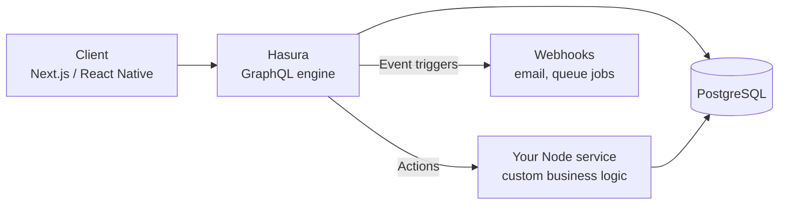

# Hasura — What It Is, How to Use It, and When to Choose It

- **Researched:** 2026-07-06
- **Target:** Senior Software Engineer (I use Hasura in production — this note turns "I use it daily" into "I can explain and defend it")
- **Sources freshness:** 2025–2026
- **Runnable example:** [examples/hasura-todo/](../examples/hasura-todo/) — Docker Compose, 10 minutes, no install.

## TL;DR

- **Hasura is a GraphQL engine that sits on top of PostgreSQL** and instantly generates a complete GraphQL CRUD API from your tables. You don't write resolvers — you configure.
- **The one fact to remember: Hasura is a compiler, not a resolver.** It turns one GraphQL query into **one SQL statement**. That is why N+1 does not exist in Hasura.
- Its killer feature is the **permissions system**: row-level rules per role, powered by session variables from the JWT (`X-Hasura-User-Id`). Authorization becomes config, not code.
- Custom business logic does not live inside Hasura. It goes in **Actions** (Hasura calls your Node/REST handler) or a **remote schema** (your own GraphQL server stitched in).
- **When to use it:** CRUD-heavy product APIs, admin panels, prototypes, live dashboards. **When not:** domains that are mostly custom logic. The production pattern that works: Hasura for the CRUD 80%, a small Node service for the logic-heavy 20% — exactly how my [DBO platform](dbo-b2b-platform-system-design-case-study.md) runs.

## Key Concepts

### What Hasura is (the problem it solves)

**The problem:** most backend code is boring. List the products. Get one order by id. Update a profile. With Express + GraphQL you write the same resolvers, the same `WHERE user_id = ?` checks, again and again. Every new table means new endpoints, new tests, new bugs.

**The solution:** Hasura reads your PostgreSQL schema and instantly gives you a full GraphQL API for it — queries, mutations, filtering, sorting, pagination, and relationships — with zero resolver code. You then *configure* who can see what.

**Simple picture:** hiring a waiter who already memorized your whole menu. You don't teach him every dish (write resolvers) — he can serve everything from day one. You only step into the kitchen yourself for special orders (custom logic).

Where it sits — one caption to remember: Hasura owns the CRUD path; your own code hangs off the side for the special cases:



### How it works: a compiler, not a resolver (the interview answer)

A hand-written GraphQL server resolves field by field. Ask for 100 orders with their users, and a naive server runs 1 query for orders + 100 queries for users. That is the **N+1 problem**, and you fix it with DataLoader batching.

Hasura never has that problem, because it does something different: it **compiles** the whole GraphQL query into **one SQL statement** (with joins and `json_agg`), sends that single query to Postgres, and lets Postgres build the JSON response.

- Resolver server: GraphQL → many small SQL queries → app glues results together.
- Hasura: GraphQL → **one** SQL query → Postgres returns the finished JSON shape.

Say it in one sentence: *"Hasura treats GraphQL as a query language to compile, not a tree of functions to execute — so N+1 can't happen by construction."*

### Tracking tables and relationships

- **Track** = tell Hasura "expose this table in the API." Untracked tables are invisible. (Track = publish.)
- **Relationships** come from foreign keys. `todos.user_id → users.id` gives you two directions:
  - **Object relationship** (many-to-one): each todo has one `user`.
  - **Array relationship** (one-to-many): each user has many `todos`.
- Once tracked, this query just works — no resolver written:

```graphql
query {
  todos {
    title
    user { name }        # object relationship — no N+1, it's one SQL join
  }
}
```

### Permissions — the killer feature

**The problem:** in a custom server, authorization is code you must remember to write in every resolver ("only show MY notes"). Forget one check, and you have a data leak.

**Hasura's answer:** permissions are **declarative rules per role and per operation** (select/insert/update/delete), checked on every request, compiled into the SQL itself. A rule is basically a WHERE clause you configure once:

```json
{ "user_id": { "_eq": "X-Hasura-User-Id" } }
```

That rule on the `todos` table for role `user` means: any select a `user` makes can only ever return rows where `user_id` equals the id in their session. There is no way to forget the check — it is part of the query compilation.

- **Column permissions** too: the `user` role can see `todos.title` but maybe not `todos.internal_note`.
- Memory hook: **permissions are WHERE clauses**, applied by the engine, not by your discipline.

### Auth: where the session variables come from

Hasura does not do login. It **consumes** identity that your auth system produces (Hasura = authorization, your service = authentication):

- **JWT mode** (most common): your auth service (Node, Auth0, Firebase…) issues a JWT with a Hasura claims block inside:

```json
"https://hasura.io/jwt/claims": {
  "x-hasura-default-role": "user",
  "x-hasura-allowed-roles": ["user"],
  "x-hasura-user-id": "42"
}
```

Hasura verifies the token signature, reads the claims, and sets the session variables that permissions use. This is exactly the pattern from my [auth tutorial](express-graphql-auth-tutorial.md) — the login service issues the token, Hasura trusts and enforces it.
- **Webhook mode:** Hasura calls your endpoint on each request and you return the role/user-id. More flexible, one extra network hop.
- **Admin secret:** the root password for the console and server-to-server calls. Never ships to a client.

### Actions — the escape hatch for business logic

**The problem:** "create todo" is CRUD, but "redeem points" is not — it needs validation, external API calls, transactions.

**Actions** let you define a custom mutation/query in the GraphQL schema whose implementation is **your HTTP handler**. Hasura forwards the call (with session variables), your Node code does the work, the response flows back through the same graph.

```
Client → Hasura (action: redeemPoints) → POST to your Node handler → response → client
```

Rule of thumb: **CRUD stays in Hasura; anything with an "if" about money goes in an Action.**

### Remote schemas, event triggers, subscriptions

- **Remote schema:** stitch a whole GraphQL server you own into Hasura's graph. Use when you have many related custom operations — an Action per operation would get noisy.
- **Event triggers:** "when a row changes, call this webhook." Insert into `orders` → Hasura POSTs to your handler → send email / enqueue a job. It is a built-in, reliable table-change-to-webhook bridge (with retries) — Hasura's cousin of the outbox pattern.
- **Subscriptions (live queries):** clients subscribe over WebSocket and receive the query result again whenever it changes. Hasura makes this cheap by **polling Postgres once per interval and multiplexing** — 10,000 subscribers to the same query cost roughly one re-run, not 10,000.

### Metadata and migrations — config as code

Everything you click in the console (tracked tables, permissions, actions) is **metadata** — and it must live in git, or your API config exists only in one running container. The `hasura` CLI keeps it versioned:

| Command | What it does |
|---|---|
| `hasura init` | New project folder (metadata + migrations) |
| `hasura console` | Opens the console **through the CLI** so every click is saved to local files |
| `hasura metadata export` / `apply` | Pull config from a server / push config to a server |
| `hasura migrate create <name>` / `apply` | Create / run SQL migrations |
| `hasura metadata diff` | What differs between local files and the server |

Day-to-day rule: **console via CLI in dev** (clicks become files you commit), **`metadata apply` + `migrate apply` in CI/CD** for staging/production. Clicking directly on a production console is how config drift is born.

## When to Use Hasura — and When Not

**Use it when:**
- The API is mostly **CRUD over Postgres** — product apps, admin panels/CMS, internal tools.
- You need **fine-grained row/column permissions** and would rather configure than hand-write them.
- You want **live data** (subscriptions) without building WebSocket infrastructure.
- Speed matters: a prototype that would take weeks of resolver-writing is an afternoon of tracking tables.

**Avoid it (or pair it) when:**
- The domain is mostly **custom business logic** — you would end up writing an Action for everything, which is a custom server with extra steps.
- Heavy write-side workflows (sagas, multi-step transactions with external systems) — that orchestration belongs in your own service.
- Your data is not (mostly) in PostgreSQL (v2 supports some other DBs, but Postgres is the first-class citizen).

**The honest production architecture** (and my real answer in interviews): Hasura serves the CRUD 80% with permissions; a small Node/Express service handles the logic-heavy 20%, connected via Actions or a remote schema. My DBO platform runs this way — see the [Hasura vs hand-written tradeoff](dbo-b2b-platform-system-design-case-study.md) in that note.

## What's Current (2025–2026)

- **Hasura v2 is still the self-hosting answer.** Fully open source (Apache 2.0), still supported and maintained under Hasura's version policy. For "Hasura + Postgres, self-hosted," v2 remains the recommended, battle-tested choice in 2026.
- **Hasura DDN (v3) is the new architecture** — a Rust engine rebuilt around "data connectors," modular metadata, and multi-team supergraphs. The engine is open source, but the **DDN CLI and console are proprietary**, and the product is managed-cloud-first — the main reason self-hosters stay on v2. Migration tooling v2 → DDN exists.
- **The company pivoted toward AI:** Hasura's focus since 2025 is PromptQL (AI agents querying business data through the same connector layer). Practical takeaway: expect v2 to stay stable rather than gain big features.
- **Alternatives in one line each:** **PostGraphile** — the closest OSS equivalent (Postgres → GraphQL, RLS-based permissions); **Supabase** — Postgres platform with auth/storage, REST + GraphQL, its own ecosystem; **Prisma + Yoga/Apollo** — full control, you write every resolver (my [auth tutorial](express-graphql-auth-tutorial.md) stack).

## Likely Interview Questions

### Q: How does Hasura avoid the N+1 problem?

- It doesn't "solve" N+1 — it makes it impossible: Hasura compiles the entire GraphQL query into a single SQL statement (joins + `json_agg`), so there is no per-field resolution to multiply.
- Contrast: a resolver-based server needs DataLoader to batch; Hasura needs nothing.
- Senior close: "compiler, not resolver — that's the whole architecture in three words."

### Q: How do you secure a Hasura API?

- Three layers: an **auth service** issues JWTs with Hasura claims (authentication) → **role-based permissions** with row/column rules using session variables (authorization) → **admin secret** locked away, console disabled or protected in production.
- Extras that read senior: allow-lists (only known queries in production), depth/rate limiting at the gateway in front, and permissions reviewed like code because metadata lives in git.

### Q: Where does business logic live if Hasura generates the API?

- Not in Hasura. CRUD stays generated; logic goes to **Actions** (Hasura forwards to my Node handler with session variables) or a **remote schema** for bigger custom domains; async reactions go to **event triggers** → queue.
- One sentence: "Hasura is the waiter, my Node service is the kitchen."

### Q: Hasura vs building your own GraphQL server?

- Hasura wins: time-to-API, permissions engine, subscriptions, N+1-free by design, admin console.
- Custom wins: unlimited logic freedom, no engine constraints, one fewer moving part when the domain is logic-heavy.
- The answer that lands: it's not either/or — hybrid (Hasura CRUD + small custom service) is the pattern I run in production.

### Q: How do you version and deploy Hasura config?

- Metadata + migrations in git via the Hasura CLI; console only through `hasura console` in dev so clicks become committed files; CI/CD runs `hasura migrate apply && hasura metadata apply` per environment. Never click on prod.

### Q: When would you NOT use Hasura?

- Logic-dominated domains, complex write orchestration, non-Postgres-centric data, or a team allergic to running an extra stateful-ish engine. Also: if the org is strict-OSS-only and wants v3 features — DDN's tooling is proprietary, so it's v2 or PostGraphile.

## Tradeoffs to Be Ready For

- **Hasura vs custom server:** configuration speed + safety vs logic freedom. Hybrid is the adult answer.
- **Actions vs remote schema:** Actions for a handful of custom operations (simple, per-operation); remote schema when you own a whole GraphQL domain (one stitch, many operations).
- **JWT mode vs webhook mode:** JWT = no extra hop, standard; webhook = flexible per-request logic, +1 network call on every request.
- **Console clicks vs CLI workflow:** console is fast but produces config drift if pointed at prod; CLI turns clicks into git-tracked files. Dev = console-via-CLI, prod = apply-only.
- **v2 vs DDN:** v2 = open source, self-host, stable, monolithic metadata; DDN = new engine, multi-team supergraph, managed-first, proprietary tooling.
- **Generated API surface:** Hasura exposes powerful filtering by default — in production you constrain it (allow-lists, role-scoped fields) rather than leave the whole query language open to clients.

## Real-World Cases to Cite

- **Airbus** — public Hasura case study; internal apps on Hasura over Postgres for fast, permission-controlled data access.
- **Philips** — healthcare data platforms using Hasura's role-based access model (row/column permissions matter a lot with medical data).
- **Swiggy** (Indian food delivery) — used Hasura for rapid internal product APIs.
- **Nhost** — an entire backend-as-a-service company (Firebase alternative) built with Hasura as the core engine — proof the engine can be the foundation, not just a helper.
- **My own production use** — the DBO B2B platform: Hasura for CRUD + permissions, Node services for auth/queue/custom logic ([case study](dbo-b2b-platform-system-design-case-study.md)).

## Cheatsheet

> **Visual version:** open [hasura-guide-cheatsheet.html](hasura-guide-cheatsheet.html) — concept cards, the "where Hasura sits" diagram, CLI commands, decision verdicts, all visible at a glance.

**One-liners:**

- **Hasura** — GraphQL engine over Postgres: tables in, full CRUD API out.
- **Compiler, not resolver** — one GraphQL query → one SQL statement → no N+1, ever.
- **Track** — publish a table into the API. Untracked = invisible.
- **Object / array relationship** — many-to-one / one-to-many, derived from foreign keys.
- **Permission rule** — a per-role WHERE clause: `{"user_id": {"_eq": "X-Hasura-User-Id"}}`.
- **Session variables** — `X-Hasura-Role`, `X-Hasura-User-Id` — set from JWT claims, used by permissions.
- **Action** — custom mutation/query implemented by YOUR HTTP handler. The escape hatch.
- **Remote schema** — stitch your own GraphQL server into Hasura's graph.
- **Event trigger** — row change → webhook (with retries). Table-to-queue bridge.
- **Live query** — subscription; Hasura polls once and multiplexes to all subscribers.
- **Metadata** — every console click, as files, in git. Or it didn't happen.
- **Admin secret** — root access; never in a client, console off in prod.

**Memory hooks:**

- *"Hasura is the waiter, your service is the kitchen."*
- *"Permissions are WHERE clauses you can't forget to write."*
- *"Track = publish."*
- *"CRUD in Hasura, 'if money then' in an Action."*
- *"Metadata in git or it didn't happen."*

## Related Notes

- [DBO case study](dbo-b2b-platform-system-design-case-study.md) — the Hasura-vs-custom tradeoff in my real system
- [Express + GraphQL auth tutorial](express-graphql-auth-tutorial.md) — the custom-server side of the comparison; the JWT it issues is exactly what Hasura's JWT mode consumes
- [System design basics](system-design-basics-senior-fullstack-interview.md) — GraphQL vs REST, caching, N+1 context

## Sources

- [Hasura v2 docs — Introduction](https://hasura.io/docs/2.0/index/) — accessed 2026-07-06
- [Hasura DDN FAQ](https://hasura.io/docs/3.0/help/faq/) — accessed 2026-07-06 (v2 support policy, DDN positioning)
- [Is Hasura v3 / DDN OSS? — GitHub discussion](https://github.com/hasura/graphql-engine/discussions/10556) — 2024–2025 (engine OSS, CLI/console proprietary)
- [Hasura deployment options](https://hasura.io/products/deployment) — accessed 2026-07-06
- [Why upgrade to Hasura DDN](https://hasura.io/why-upgrade-to-hasura-ddn) — accessed 2026-07-06
- [Nhost discussion on Hasura DDN impact](https://github.com/nhost/nhost/discussions/2841) — 2024–2025
