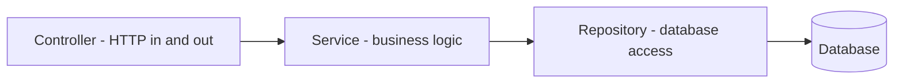

# Java & Spring Basics for a TypeScript Developer

- **Researched:** 2026-07-29
- **Target:** Backend Developer at Bank Mandiri (Java/Spring shop) — written for someone fluent in TypeScript/Node with zero Java
- **Sources freshness:** 2025–2026 (Java 25 LTS, Spring Boot 4.1)
- **Companion:** [visual cheatsheet](java-spring-basics-for-typescript-devs-cheatsheet.html) · [.NET note](dotnet-basics-for-typescript-devs.md) (you already made this jump once)

## TL;DR

- **Java is closer to C# than to TypeScript.** You already learned C# for the Skyworx assessment — that's most of the mental work done. Same OOP model, same compiled-and-typed feel, similar tooling.
- **The five things that will trip you up:** checked exceptions, no union types, `null` everywhere (no `undefined`), everything must live in a class, and `equals()` vs `==`.
- **Spring Boot ≈ NestJS.** Decorators become annotations, modules become component scanning, and dependency injection works almost identically.
- **JPA/Hibernate ≈ Prisma**, but with a very different philosophy: JPA tracks objects in memory and writes changes automatically. Prisma makes you be explicit.
- ⚠️ **Bank Mandiri's job posting says "Spring 4.x"** — that's a much older generation than today's Spring Boot 4. **Learn to recognize both.** Section 12 covers the legacy patterns you'd actually see in their codebase.

---

## Key Concepts

### 1. The platform in one minute

| Concept | TypeScript/Node | Java |
|---|---|---|
| You write | `.ts` | `.java` |
| Compiles to | JavaScript | **bytecode** (`.class`) |
| Runs on | Node (V8) | **JVM** (Java Virtual Machine) |
| Package manager | npm / pnpm | **Maven** (`pom.xml`) or **Gradle** (`build.gradle`) |
| Dependencies folder | `node_modules/` | `~/.m2/repository` (shared across all projects) |
| Entry point | `index.ts` | a class with `public static void main(String[] args)` |
| Runtime install | Node | **JDK** (Java Development Kit — includes compiler + JVM) |

**The key mental shift:** TypeScript's types vanish at runtime. **Java's types are real at runtime** — the JVM enforces them, and you can inspect them (reflection). This is why Java frameworks can do so much "magic" with annotations.

**JDK vs JRE vs JVM:** JDK = the whole toolkit (what you install to develop). JRE = just enough to run. JVM = the engine that executes bytecode. In practice you install a JDK and forget the distinction.

### 2. Language essentials — the side-by-side

#### Variables and types

```typescript
// TypeScript
let name: string = "Stephen";
const age: number = 30;
let items: string[] = ["a", "b"];
const inferred = 42;              // number
```

```java
// Java
String name = "Stephen";          // type comes FIRST, not after a colon
final int age = 30;               // final = const
String[] items = {"a", "b"};      // array
var inferred = 42;                // Java 10+ infers type, local variables only
```

**Number types are the biggest surprise.** TypeScript has one `number`. Java makes you choose:

| Java type | Use for | Notes |
|---|---|---|
| `int` | whole numbers | ~±2.1 billion |
| `long` | big whole numbers | IDs, timestamps. Literal: `100L` |
| `double` | decimals, general math | **binary floating point — never use for money** |
| `BigDecimal` | **money** | exact decimal arithmetic |
| `boolean` | true/false | not `bool` |
| `char` | one character | single quotes: `'a'` |
| `String` | text | double quotes only |

> 💰 **Say this in an interview:** *"Untuk nilai uang saya pakai `BigDecimal`, bukan `double` — karena `double` itu floating point biner, jadi 0.1 + 0.2 tidak persis 0.3. Di perbankan selisih sepersekian sen pun tidak bisa diterima."* You already know this instinct from `decimal` in C#.

#### Primitives vs objects — a Java-only concept

Java has **primitives** (`int`, `double`, `boolean`) and their **object wrappers** (`Integer`, `Double`, `Boolean`).

```java
int a = 5;              // primitive — cannot be null, lives on the stack
Integer b = 5;          // object — CAN be null
```

**Why it matters:** a database column that allows NULL maps to `Integer`, not `int`. And this is where `==` bites you (next section).

#### `==` vs `equals()` — the classic Java bug

```typescript
// TypeScript — === compares values for primitives and strings
"abc" === "abc"   // true
```

```java
// Java
String a = new String("abc");
String b = new String("abc");

a == b            // FALSE — compares references (memory addresses)
a.equals(b)       // TRUE  — compares values
```

**Rule: always use `.equals()` for objects, `==` only for primitives.** This is the single most common Java mistake, and interviewers love asking it.

Null-safe version: `Objects.equals(a, b)` — works even if either is null.

#### Everything lives in a class

```typescript
// TypeScript — top-level functions are fine
export function calculateInterest(amount: number): number {
  return amount * 0.05;
}
```

```java
// Java — must be inside a class
public class InterestCalculator {
    public static double calculateInterest(double amount) {
        return amount * 0.05;
    }
}
// Called as: InterestCalculator.calculateInterest(1000)
```

`static` means "belongs to the class, not to an instance" — like a plain exported function.

#### Access modifiers

| Java | Meaning | TS equivalent |
|---|---|---|
| `public` | anyone | `public` (default) |
| `private` | this class only | `private` |
| `protected` | this class + subclasses | `protected` |
| *(nothing)* | same package only | no equivalent |

Java's default is **package-private**, not public. That surprises people.

#### Classes, interfaces, records

```typescript
// TypeScript
interface Customer { id: string; name: string; }

type Account = { number: string; balance: number };

class Loan {
  constructor(private amount: number, private rate: number) {}
  monthlyPayment(): number { return this.amount * this.rate / 12; }
}
```

```java
// Java — interface: same idea
public interface Customer {
    String getId();
    String getName();
}

// record: immutable data holder (Java 16+). Closest thing to a TS type alias
// for plain data. Auto-generates constructor, getters, equals, hashCode, toString.
public record Account(String number, BigDecimal balance) {}

// class
public class Loan {
    private final BigDecimal amount;
    private final BigDecimal rate;

    public Loan(BigDecimal amount, BigDecimal rate) {   // constructor
        this.amount = amount;
        this.rate = rate;
    }

    public BigDecimal monthlyPayment() {
        return amount.multiply(rate).divide(BigDecimal.valueOf(12), RoundingMode.HALF_UP);
    }
}
```

**`record` is your friend** — it's the modern, concise way to hold data, and it's what you'd use for API request/response objects (DTOs).

#### ⚠️ No union types — the biggest missing feature

```typescript
// TypeScript — perfectly normal
type Status = "PENDING" | "APPROVED" | "REJECTED";
function handle(input: string | number) { }
```

Java **has no union types**. Your options:

```java
// 1. enum — for a fixed set of values (most common)
public enum Status { PENDING, APPROVED, REJECTED }

// 2. sealed interface — a closed hierarchy (Java 17+), for "one of these shapes"
public sealed interface PaymentResult
    permits Success, Failure {}
public record Success(String transactionId) implements PaymentResult {}
public record Failure(String reason)        implements PaymentResult {}

// 3. Method overloading — same name, different parameter types
public void handle(String input) { }
public void handle(int input) { }
```

**Enums are far more powerful than in TypeScript** — they can hold fields and methods:

```java
public enum LoanType {
    KPR("Home Loan", 0.05),
    KTA("Personal Loan", 0.12);

    private final String label;
    private final double rate;

    LoanType(String label, double rate) {
        this.label = label;
        this.rate = rate;
    }
    public double getRate() { return rate; }
}
```

### 3. Collections and Streams — replacing array methods

```typescript
// TypeScript
const names = users.filter(u => u.active).map(u => u.name);
const total = orders.reduce((sum, o) => sum + o.amount, 0);
```

```java
// Java — Streams
List<String> names = users.stream()
    .filter(u -> u.isActive())          // arrow syntax is the same!
    .map(u -> u.getName())
    .toList();                          // Java 16+; older code uses .collect(Collectors.toList())

BigDecimal total = orders.stream()
    .map(Order::getAmount)              // method reference — like o => o.getAmount()
    .reduce(BigDecimal.ZERO, BigDecimal::add);
```

**Collection types:**

| TypeScript | Java interface | Common implementation |
|---|---|---|
| `T[]` / `Array<T>` | `List<T>` | `ArrayList<>` |
| `Map<K,V>` | `Map<K,V>` | `HashMap<>` |
| `Set<T>` | `Set<T>` | `HashSet<>` |

```java
List<String> items = new ArrayList<>();
items.add("a");
items.get(0);                    // NOT items[0] — no bracket access
items.size();                    // NOT .length

Map<String, Integer> scores = new HashMap<>();
scores.put("stephen", 10);
scores.get("stephen");
scores.getOrDefault("bob", 0);
```

> **Generics note:** `List<String>` looks like TypeScript, and works similarly. One difference: Java erases generic types at runtime ("type erasure"), so you can't ask a `List` what type it holds at runtime.

### 4. Null and Optional

Java has **only `null`** — no `undefined`. And historically, nulls everywhere.

```java
// The modern approach: Optional (Java 8+) — like a explicit "maybe"
Optional<Customer> maybeCustomer = repository.findById(id);

maybeCustomer
    .map(Customer::getName)
    .orElse("Unknown");

if (maybeCustomer.isPresent()) { ... }
maybeCustomer.orElseThrow(() -> new NotFoundException("Customer not found"));
```

**`NullPointerException` (NPE)** is Java's most famous runtime error — the equivalent of "cannot read property of undefined". Spring Data repositories return `Optional<T>` precisely to push you into handling absence explicitly.

### 5. ⚠️ Checked exceptions — no TypeScript equivalent at all

This is genuinely new. Java splits exceptions into two kinds:

| Kind | Examples | Rule |
|---|---|---|
| **Checked** | `IOException`, `SQLException` | The compiler **forces** you to either catch it or declare `throws` |
| **Unchecked** (extends `RuntimeException`) | `NullPointerException`, `IllegalArgumentException` | No obligation — like all JS errors |

```java
// Checked: must handle or declare
public void readFile(String path) throws IOException {   // declaring it
    Files.readString(Path.of(path));
}

// Or catch it
try {
    Files.readString(Path.of(path));
} catch (IOException e) {
    log.error("Failed to read file", e);
} finally {
    // always runs
}
```

**Modern practice:** most teams prefer unchecked exceptions for business errors, because checked exceptions clutter every method signature. Spring's `DataAccessException` is unchecked for exactly this reason.

**Interview-ready opinion:**
> "Checked exception itu ide bagus secara teori — memaksa penanganan error. Tapi dalam praktik sering bikin signature berantakan dan orang jadi menulis `catch` kosong. Makanya Spring memilih unchecked exception untuk error database."

### 6. A REST API in Spring Boot — the Express/Nest comparison

**Express (what you know):**
```typescript
app.get("/api/loans/:id", async (req, res) => {
  const loan = await loanService.findById(req.params.id);
  if (!loan) return res.status(404).json({ error: "Not found" });
  res.json(loan);
});
```

**Spring Boot:**
```java
@RestController                          // = this class handles HTTP and returns JSON
@RequestMapping("/api/loans")            // base path for all methods here
public class LoanController {

    private final LoanService loanService;

    // Constructor injection — Spring passes the dependency in automatically
    public LoanController(LoanService loanService) {
        this.loanService = loanService;
    }

    @GetMapping("/{id}")                                    // GET /api/loans/{id}
    public ResponseEntity<LoanResponse> getLoan(@PathVariable Long id) {
        return loanService.findById(id)
            .map(ResponseEntity::ok)                        // 200 with body
            .orElse(ResponseEntity.notFound().build());     // 404
    }

    @PostMapping                                            // POST /api/loans
    @ResponseStatus(HttpStatus.CREATED)                     // 201
    public LoanResponse create(@Valid @RequestBody CreateLoanRequest request) {
        return loanService.create(request);
    }
}
```

**Annotation → decorator translation:**

| Spring | NestJS | Meaning |
|---|---|---|
| `@RestController` | `@Controller()` | HTTP handler class returning JSON |
| `@RequestMapping("/x")` | `@Controller('x')` | Base route |
| `@GetMapping` / `@PostMapping` | `@Get()` / `@Post()` | HTTP verb + path |
| `@PathVariable` | `@Param()` | URL parameter |
| `@RequestParam` | `@Query()` | Query string |
| `@RequestBody` | `@Body()` | Request body → object |
| `@Valid` | `ValidationPipe` | Run validation |
| `@Service` | `@Injectable()` | Business logic class |
| `@Repository` | — | Data access class |

### 7. The three layers — Spring's standard structure



```java
@Service                        // business logic
public class LoanService {
    private final LoanRepository repository;

    public LoanService(LoanRepository repository) {
        this.repository = repository;
    }

    @Transactional              // wraps the method in a DB transaction
    public LoanResponse create(CreateLoanRequest request) {
        Loan loan = new Loan(request.amount(), request.rate());
        Loan saved = repository.save(loan);
        return LoanResponse.from(saved);
    }
}
```

**Keep business logic in the Service, not the Controller.** Interviewers check for this. The controller should only translate HTTP ↔ objects.

### 8. Dependency injection

Same concept as NestJS, and it's the heart of Spring.

```java
// Spring sees @Service/@Repository/@RestController, creates one instance of each
// (a "bean"), and passes them wherever they're needed.

@Service
public class LoanService {
    private final LoanRepository repository;
    private final NotificationClient notifications;

    // Constructor injection — PREFERRED. Spring fills these in.
    public LoanService(LoanRepository repository, NotificationClient notifications) {
        this.repository = repository;
        this.notifications = notifications;
    }
}
```

**Bean scopes** (like C#'s service lifetimes):

| Scope | Meaning | Default? |
|---|---|---|
| **singleton** | one instance for the whole app | ✅ yes |
| **prototype** | a new instance every time it's requested | |
| **request** | one per HTTP request | web apps only |

> **Interview question you should expect:** *"Kenapa constructor injection lebih baik daripada field injection?"*
> **Answer:** *"Karena dependensinya jadi eksplisit dan bisa dibuat `final` — tidak bisa berubah setelah objek dibuat. Dan untuk testing jauh lebih mudah, karena bisa langsung passing mock lewat constructor tanpa perlu reflection. Field injection dengan `@Autowired` menyembunyikan dependensi dan bikin class-nya sulit dites."*

### 9. JPA / Hibernate vs Prisma

```typescript
// Prisma — explicit
const loan = await prisma.loan.findUnique({ where: { id } });
await prisma.loan.update({ where: { id }, data: { status: "APPROVED" } });
```

```java
// JPA entity — the table mapping lives on the class
@Entity
@Table(name = "loans")
public class Loan {
    @Id
    @GeneratedValue(strategy = GenerationType.IDENTITY)
    private Long id;

    @Column(nullable = false, precision = 19, scale = 2)
    private BigDecimal amount;

    @Enumerated(EnumType.STRING)        // store the name, not the ordinal number
    private LoanStatus status;

    @ManyToOne(fetch = FetchType.LAZY)  // many loans belong to one customer
    @JoinColumn(name = "customer_id")
    private Customer customer;
}

// Repository — Spring generates the implementation from the method NAME
public interface LoanRepository extends JpaRepository<Loan, Long> {
    Optional<Loan> findByAccountNumber(String accountNumber);
    List<Loan> findByStatusAndAmountGreaterThan(LoanStatus status, BigDecimal amount);

    @Query("SELECT l FROM Loan l JOIN FETCH l.customer WHERE l.status = :status")
    List<Loan> findWithCustomer(@Param("status") LoanStatus status);
}
```

**The philosophical difference that trips up Prisma users:**

```java
@Transactional
public void approve(Long id) {
    Loan loan = repository.findById(id).orElseThrow();
    loan.setStatus(LoanStatus.APPROVED);
    // NO save() call — JPA tracks the object and writes the change on commit.
}
```

This is called **dirty checking**. JPA holds loaded entities in a "persistence context" and automatically writes any changes when the transaction commits. Powerful, and a common source of surprise.

**⚠️ N+1 in JPA — high-probability interview question.** `FetchType.LAZY` means related data loads only when touched. Loop over 100 loans reading `loan.getCustomer().getName()` and you get 101 queries.
**Fixes:** `JOIN FETCH` in a `@Query`, or an `@EntityGraph`. Same problem you solved with DataLoader in GraphQL.

### 10. Validation

```java
public record CreateLoanRequest(
    @NotNull @DecimalMin("1000000") BigDecimal amount,
    @NotBlank @Size(max = 50) String accountNumber,
    @Email String email
) {}

// In the controller, @Valid triggers it; a violation returns 400 automatically
public LoanResponse create(@Valid @RequestBody CreateLoanRequest request) { ... }
```

Equivalent to `class-validator` in NestJS or Zod in your Node work.

### 11. Testing — JUnit + Mockito

```typescript
// Jest
describe("LoanService", () => {
  it("approves a valid loan", () => {
    expect(service.approve(1)).toBe(true);
  });
});
```

```java
// JUnit 5 + Mockito
@ExtendWith(MockitoExtension.class)
class LoanServiceTest {

    @Mock  private LoanRepository repository;      // fake dependency
    @InjectMocks private LoanService service;      // real class, mocks injected

    @Test
    void approvesValidLoan() {
        // given
        when(repository.findById(1L)).thenReturn(Optional.of(new Loan()));

        // when
        service.approve(1L);

        // then
        verify(repository).save(any(Loan.class));
    }
}
```

| Jest | Java |
|---|---|
| `describe` / `it` | class / `@Test` method |
| `jest.mock()` | `@Mock` (Mockito) |
| `expect(x).toBe(y)` | `assertEquals(y, x)` |
| `jest.spyOn` | `verify(mock).method()` |

`@SpringBootTest` spins up the whole application context for integration tests; `@DataJpaTest` starts just the database layer.

### 12. ⚠️ Legacy Spring — what Bank Mandiri's code may actually look like

Their job posting mentions **Spring Framework 4.x**, which is a much older generation. Bank codebases move slowly. **Learn to read both styles:**

| Modern (Spring Boot 3/4) | Legacy (Spring 4 / Boot 2) |
|---|---|
| `jakarta.persistence.*` | **`javax.persistence.*`** |
| Constructor injection | **`@Autowired` on fields** |
| Java config / auto-config | **XML config** (`applicationContext.xml`) possible |
| `record` DTOs | Plain classes with getters/setters |
| `Optional<T>` returns | Nullable returns |
| `spring-boot-starter-*` | Manually declared dependencies |

```java
// Legacy style you may well see:
@Service
public class LoanService {
    @Autowired                          // field injection — old style
    private LoanRepository repository;
}
```

**If you see `javax.*` imports, you're in a pre-Spring-Boot-3 codebase.** Saying that out loud in a code walkthrough is a genuine signal that you know the ecosystem's history.

---

## What's Current (2026)

- **Java 25 is the current LTS** (released September 2025, supported to 2033). Java 21 is the previous LTS and still extremely common in production — **most banks are on 17 or 21**, not 25.
- **Virtual threads** (stable since Java 21) let you write simple blocking code that scales to millions of concurrent tasks — the JVM's answer to Node's async model, without the `async`/`await` colouring. **Say this if concurrency comes up:** *"Virtual threads membuat kode blocking sederhana bisa scale seperti async, tanpa harus menulis semuanya non-blocking."*
- **Records, sealed interfaces, and pattern matching for `switch`** have made modern Java far less verbose than its reputation.
- **Generational ZGC** delivers sub-10ms GC pauses — relevant for latency-sensitive banking systems.
- **Spring Boot 4 / Spring Framework 7** went GA in **November 2025**, built on Jakarta EE 11; 4.1 arrived June 2026. Notable: 70+ modular JARs, Jackson 3 mandatory, JSpecify null-safety annotations, first-class API versioning, and Spring gRPC.
- **Reality check:** enterprises lag. Expect Java 17/21 and Spring Boot 2.x/3.x at a bank, not the newest.

---

## Likely Interview Questions

### Q: "Apa bedanya `==` dan `equals()`?"
`==` compares references for objects (are these the same object in memory?) and values for primitives. `equals()` compares content. Always use `equals()` for objects; `Objects.equals(a, b)` is the null-safe version. Related: if you override `equals()`, you must override `hashCode()`, or the object will misbehave in a `HashMap` or `HashSet`.

### Q: "Kenapa pakai `BigDecimal` untuk uang, bukan `double`?"
`double` is binary floating point, so decimal fractions like 0.1 can't be represented exactly — errors accumulate. `BigDecimal` does exact decimal arithmetic. In banking, a fraction of a cent of drift is unacceptable, and reconciliation would fail.

### Q: "Checked vs unchecked exception?"
Checked (e.g. `IOException`) must be caught or declared with `throws` — the compiler enforces it. Unchecked (`RuntimeException` and subclasses) carry no obligation. Modern practice leans to unchecked for business errors, because checked exceptions clutter signatures and encourage empty `catch` blocks. Spring's `DataAccessException` is unchecked for this reason.

### Q: "Kenapa constructor injection, bukan field injection?"
Dependencies become explicit and can be `final` (immutable). Testing is much easier — pass mocks straight into the constructor without reflection. Field injection with `@Autowired` hides dependencies and makes a class hard to instantiate in a test.

### Q: "Apa itu N+1 di JPA dan bagaimana mengatasinya?"
With `FetchType.LAZY`, related entities load on first access. Fetching 100 loans then reading each loan's customer produces 101 queries. Fix with `JOIN FETCH` in a `@Query`, or an `@EntityGraph`, so the related rows come back in one query. Same class of problem as GraphQL N+1, solved with batching.

### Q: "Apa itu `@Transactional`?"
It wraps the method in a database transaction — all writes commit together or roll back together. Important detail: by default it only rolls back on unchecked exceptions. Also, because it works via a proxy, calling a `@Transactional` method **from within the same class** bypasses it — a classic bug.

### Q: "Bagaimana Anda menangani race condition di Java?"
Connect it to your real story: *"Di sistem saya sebelumnya ada dua request bersamaan yang sama-sama lolos pengecekan sebelum salah satunya commit — akhirnya poin dobel. Solusinya row-level locking di database, `SELECT ... FOR UPDATE`, supaya pengecekan dan penulisan jadi atomic. Di level aplikasi Java ada `synchronized` dan `java.util.concurrent`, tapi untuk sistem multi-instance, lock di database atau distributed lock lebih tepat — karena lock di JVM cuma berlaku di satu instance."*

That last sentence is a strong senior signal.

### Q: "Anda dari Node/TypeScript — apa yang paling berbeda?"
> "Yang paling berbeda: Java punya checked exception yang tidak ada di TypeScript, tidak ada union type jadi harus pakai enum atau sealed interface, dan semuanya harus di dalam class. Yang mirip: konsep OOP, generics, dan dependency injection — Spring itu sangat mirip NestJS yang sudah saya pakai. Dan karena saya sudah belajar C# untuk satu assessment, banyak konsep Java yang langsung terasa familiar."

---

## Tradeoffs to Be Ready For

| Choice | Pick when | Cost |
|---|---|---|
| **`int` vs `Integer`** | `int` for values that always exist | `Integer` can be null — needed for nullable DB columns |
| **`BigDecimal` vs `double`** | `BigDecimal` for money, always | Slower and more verbose |
| **Checked vs unchecked exceptions** | Unchecked for business errors | Checked forces handling but clutters signatures |
| **`FetchType.LAZY` vs `EAGER`** | LAZY by default | Risks N+1; EAGER over-fetches every time |
| **JPA vs plain SQL (JdbcTemplate)** | JPA for CRUD-heavy domains | JPA hides the SQL; complex reporting queries are clearer in raw SQL |
| **Constructor vs field injection** | Constructor, always | Slightly more code |
| **Virtual threads vs reactive (WebFlux)** | Virtual threads — simpler code, same scalability | Reactive is harder to read and debug |

---

## Cheatsheet

**Visual version:** [java-spring-basics-for-typescript-devs-cheatsheet.html](java-spring-basics-for-typescript-devs-cheatsheet.html)

### Syntax quick map

| TypeScript | Java |
|---|---|
| `const x = 5` | `final int x = 5;` |
| `let s: string` | `String s;` |
| `x: number` | `int` / `long` / `double` / `BigDecimal` |
| `string \| number` | ❌ none — use enum, sealed interface, or overloading |
| `null` / `undefined` | `null` only (+ `Optional<T>`) |
| `arr.map(f)` | `list.stream().map(f).toList()` |
| `arr.filter(f)` | `list.stream().filter(f).toList()` |
| `arr.length` | `list.size()` / `array.length` |
| `arr[0]` | `list.get(0)` |
| `obj.x === y` | `obj.getX().equals(y)` |
| `interface Foo {}` | `interface Foo {}` (same!) |
| `type Foo = {...}` | `record Foo(...) {}` |
| `async` / `await` | virtual threads, or `CompletableFuture` |
| `try/catch` | `try/catch` + checked exceptions |
| npm / `package.json` | Maven / `pom.xml` |
| Jest | JUnit 5 + Mockito |
| Express / NestJS | Spring Boot |
| Prisma | JPA / Hibernate |
| Zod / class-validator | Bean Validation (`@NotNull`, `@Size`) |

### Annotation quick map

| Annotation | Does |
|---|---|
| `@RestController` | HTTP handler returning JSON |
| `@Service` | business logic bean |
| `@Repository` | data access bean |
| `@GetMapping` / `@PostMapping` | route + verb |
| `@PathVariable` / `@RequestParam` / `@RequestBody` | URL param / query / body |
| `@Valid` | run validation |
| `@Transactional` | wrap in a DB transaction |
| `@Entity` / `@Table` / `@Id` / `@Column` | JPA table mapping |
| `@Autowired` | inject (legacy style — prefer constructor) |

### Things that will bite you

1. `==` on objects compares references — use `.equals()`
2. `double` for money — use `BigDecimal`
3. `NullPointerException` — no optional chaining; use `Optional`
4. JPA lazy loading → N+1 queries
5. `@Transactional` silently skipped when called from inside the same class
6. Checked exceptions force `throws` up the call stack
7. `javax.*` vs `jakarta.*` imports mark old vs new Spring

### 3-hour learning plan

1. **Hour 1 — syntax:** types, classes, `record`, collections, streams. Write a tiny program that filters and maps a list.
2. **Hour 2 — Spring Boot:** generate a project at [start.spring.io](https://start.spring.io), build one `@RestController` with GET and POST, and one `@Service`.
3. **Hour 3 — data:** add a JPA `@Entity` and a `JpaRepository`, then read about `@Transactional` and the N+1 problem.

If you only get one hour, do **hour 2** — Spring structure is what a Java interviewer asks about most.

---

## Sources

- [Java 25: Everything You Need to Know About the Latest LTS Release — Medium](https://medium.com/@dilshanthilina1010/java-25-everything-you-need-to-know-about-the-latest-lts-release-d3e8850bf3b5) — Sept 2025 release, supported to 2033
- [Java 21 to Java 25 LTS: Every Feature You Actually Need to Know — ankurm.com](https://ankurm.com/java-21-to-25-lts-features/) — records, pattern matching, sealed types
- [Java Virtual Threads in JDK 25 — JAVAPRO](https://javapro.io/2026/03/05/java-25-and-the-new-age-of-performance-virtual-threads-and-beyond/) — virtual threads, scoped values, generational ZGC
- [Java 25 LTS: Features, Updates, and Enterprise Impact — Aegis Softtech](https://www.aegissofttech.com/insights/java-25-lts/) — enterprise adoption context
- [Spring Boot 4.0 Release Notes — GitHub](https://github.com/spring-projects/spring-boot/wiki/Spring-Boot-4.0-Release-Notes) — official release notes
- [Spring Boot 4 vs. 3: What Actually Changed — Java Code Geeks](https://www.javacodegeeks.com/2026/04/spring-boot-4-vs-3-what-actually-changed.html) — modularization, Jackson 3, JSpecify
- [Spring Boot 4.1.0 available now — spring.io](https://spring.io/blog/2026/06/10/spring-boot-4/) (June 2026) — gRPC support, SSRF mitigation
- [A Comprehensive Analysis of Spring Boot 4 and Spring Framework 7 — Medium](https://medium.com/codetutorials/a-comprehensive-analysis-of-spring-boot-4-and-spring-framework-7-new-features-upgrade-0058d7660fd9) — GA Nov 2025, Jakarta EE 11
- [The differences between Java and TypeScript devs must know — TheServerSide](https://www.theserverside.com/tip/The-differences-between-Java-and-TypeScript-devs-must-know) — type system and compilation differences
- [TypeScript for Java/C# Programmers — official TypeScript docs](https://www.typescriptlang.org/docs/handbook/typescript-in-5-minutes-oop.html) — the comparison in reverse, useful for spotting mismatches
- [DDL - 01 - Backend Developer (Java/Microservices) — Kalibrr](https://www.kalibrr.com/c/pt-bank-mandiri-persero-tbk/jobs/108264/ddl-01-backend-developer-java-microservices) — the "Spring 4.x" requirement that motivates section 12
- Related workspace notes: [.NET basics for TypeScript devs](dotnet-basics-for-typescript-devs.md), [Bank Mandiri backend technical](bank-mandiri/bank-mandiri-backend-developer-technical-interview.md), [PostgreSQL guide](postgresql-queries-interview-guide.md)
