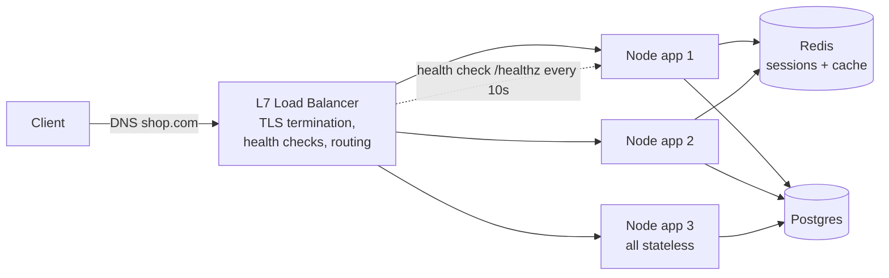
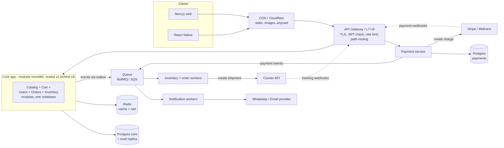
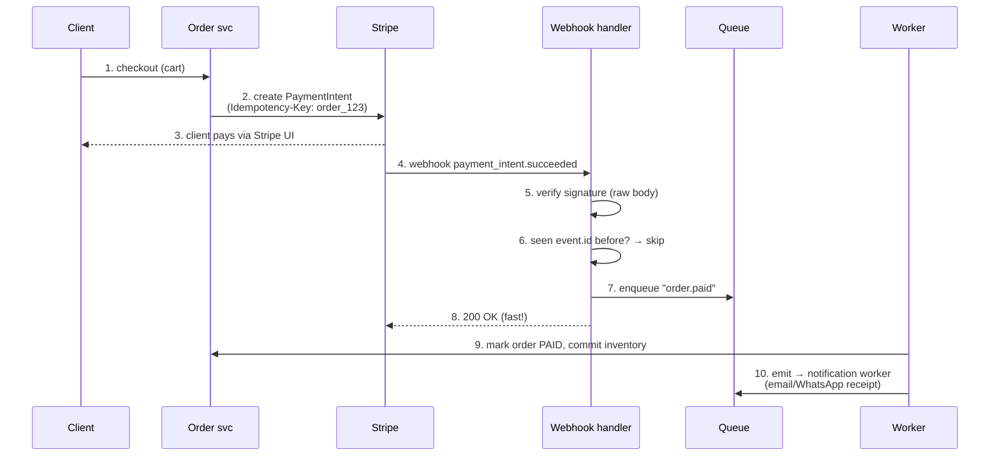

# Load Balancers in Depth + Microservices for an Online Shop (Worked Example)

- **Researched:** 2026-07-06
- **Target:** Senior Software Engineer (general readiness, no specific company)
- **Sources freshness:** mostly 2025–2026
- **How to read this note:** every term is explained the first time it appears. Read Part 1 first (load balancers), then Part 2 (the online shop example). End with the cheatsheet.

## TL;DR

- A **load balancer (LB)** is one public entrance that shares traffic between several copies of your app.
- There are two main types. **L4** only looks at the address on the envelope (IP and port) — very fast, but it cannot see what is inside. **L7** opens the envelope and reads the HTTP request — so it can make smarter routing choices. For normal web apps, use L7.
- Deploys with zero downtime work like this: the new app copy only gets traffic after it proves it is healthy, and the old copy is allowed to finish its current requests before it stops.
- **Sticky sessions** (always sending a user to the same server) are usually a bad sign. The better answer: keep no user state in server memory, so any server can handle any user.
- For the shop example: do **not** create 10 small services. Build one well-organized app (a "modular monolith") plus 2 separate pieces that really need to be separate: payments and background workers.
- Every third party (Stripe, courier, WhatsApp) follows one same recipe: send requests with an **idempotency key**, and receive results by **webhook** — verify it, skip duplicates, put the work in a queue, answer 200 fast.

## Key Concepts — Part 1: Load Balancers

### What a load balancer does, and where it sits

**The problem:** one server can only handle a limited number of users. When traffic grows, you run 3 or more identical copies of your Node/GraphQL app.

**The new problem this creates:** users need one address to connect to, not three.

**The solution:** a load balancer. It is one public address that receives all requests and forwards each one to a healthy app copy.

**Simple picture:** think of a restaurant host. Guests (requests) come to one door. The host (load balancer) seats each guest with a waiter (app instance) who is free. Guests never choose the waiter themselves.

A modern load balancer also does more than sharing traffic:

- It **checks each app copy is alive** and stops sending traffic to dead ones (health checks — explained below).
- It **handles HTTPS** so your app copies don't have to (TLS termination — explained below).
- It gives users **one stable address**, while app copies behind it can start and stop freely. This is exactly what you need for autoscaling and deploys.

You already use one: on CapRover, **nginx** is the built-in load balancer that routes traffic to your Docker containers.

The picture — one entry point, many identical instances. Notice: clients only ever talk to the LB, never to an app copy directly:



### L4 vs L7 — the first question you'll get

Network traffic has layers. Layer 4 is the connection level (TCP). Layer 7 is the application level (HTTP). A load balancer works at one of these two layers.

**Simple picture:** imagine the request is a letter.

- An **L4 load balancer** is a mail sorter who only reads the address on the envelope (IP + port). Very fast, because it never opens the letter. But it cannot make decisions based on what the letter says.
- An **L7 load balancer** opens the letter and reads it (the HTTP request: the URL, headers, cookies). Slower by a tiny amount, but much smarter.

What that smartness gives you with L7:

- Route by URL: `/graphql` goes to the API servers, `/images` goes to the static file servers.
- Rate limiting per route (limit how many requests a user can send).
- Check login tokens at the front door.
- Retry a failed request on another instance.

**When to use which:** for web apps, **L7 is the default** — nginx, Traefik, and AWS ALB are all L7. Choose L4 only when you need extreme speed on millions of connections, or a protocol that is not HTTP (for example database traffic or game servers). Very big systems use both in a chain: L4 at the front, L7 behind it. GitHub and Cloudflare are built exactly this way.

### Algorithms — how the LB picks an instance

| Algorithm | How it picks | Use when |
|---|---|---|
| **Round robin** | Take turns: 1, 2, 3, 1, 2, 3... | The default. Works when all instances are equal and requests are small |
| **Weighted round robin** | Take turns, but some instances get more turns | Instances have different sizes — or canary deploys (send only 5% of traffic to a new version to test it) |
| **Least connections** | Pick the instance that is busy with the fewest requests right now | Some requests are slow and some are fast (big GraphQL queries, file uploads) |
| **IP hash** | Same client IP always goes to the same instance | You need a cheap way to keep a user on one server — but it breaks when servers are added/removed |
| **Consistent hashing** | Like IP hash, but designed so adding or removing a server only moves a small part of the traffic | Caching — you want the same user or key to always land on the same server, even when the pool changes |

Memory hook: **"Equal work → round robin. Unequal work → least connections. Same key must go to same place → hashing."**

### Health checks and connection draining — how zero-downtime deploys work

Two simple ideas that together give you deploys with no errors:

**1. Health checks — "are you alive?"**

- **Active check:** the LB calls a special endpoint on each instance (for example `GET /healthz`) every few seconds. If it fails several times in a row, the LB stops sending traffic to that instance. When it passes again, traffic comes back.
- **Passive check:** the LB does not call anything special — it just watches real traffic. If an instance starts returning errors (5xx) or timing out, the LB removes it.
- Careful with one thing: if your `/healthz` also checks the database, and the shared database goes down, then **every** instance fails its health check at the same time and the LB removes all of them. Now nothing can serve even a friendly error page.

**2. Connection draining — "finish your work before you leave"**

When an instance needs to stop (for example, during a deploy), the LB does not kill it instantly. It stops sending **new** requests to it, but lets the requests that are already running finish. This waiting period is called draining. (AWS calls it "deregistration delay.")

**Simple picture:** a cashier closing their register. They put up a "closed" sign so no new customers join the line, but they still serve the customers already in line.

Good number to say: AWS sets this wait to 300 seconds by default, which is too long for most web apps. **30–60 seconds is the practical answer.**

**Putting it together — a rolling deploy** (this is what CapRover / ECS / Kubernetes do for you):

1. Start a container with the new version.
2. The LB health-checks it. Only after it passes does it receive real traffic.
3. The old container goes into draining: no new requests, current ones finish.
4. The old container stops. Repeat for each instance.

The detail that impresses interviewers: **if you skip draining, every deploy kills requests mid-flight and users see a burst of 502 errors.**

### Sticky sessions — why they exist and why you should say no

**The problem they solve:** imagine your app stores the user's login session in the Node process memory. Instance 1 knows the user is logged in; instances 2 and 3 do not. So the LB must send that user to instance 1 **every time**. This is a **sticky session** — the LB "glues" a user to one instance, usually with a cookie.

**Why it's a trap:**

- Load becomes unbalanced — one instance collects all the heavy users.
- If that instance crashes or deploys, those users are logged out.
- Autoscaling barely helps — new instances get only new users; existing users stay glued to the old ones.

**The senior answer:** don't store session state in process memory at all. Two good options:

- **JWT:** the session lives inside a signed token that the client sends with every request. No server lookup needed. Weakness: hard to cancel a token before it expires — so keep tokens short-lived and use refresh tokens.
- **Redis session:** the session lives in Redis, and the client only holds a session ID. Any instance can look it up in under a millisecond, and you can delete a session instantly.

Once you do either one, **any instance can serve any user**, and the LB is free to balance properly.

The one honest exception: **WebSockets.** A WebSocket connection stays open on one instance for its whole life — that is real, unavoidable stickiness. To send a message to a user connected to another instance, use Redis pub/sub as a bridge between instances.

### TLS termination, HTTP/2, WebSockets

- **TLS termination:** TLS is the encryption in HTTPS. "Termination" means the load balancer is the endpoint of the encryption: it holds the certificate and decrypts incoming traffic. Behind the LB, inside your private network, traffic travels as plain HTTP. Benefits: certificates live in one place (this is what Let's Encrypt on CapRover/Traefik automates for you), and your app instances don't spend CPU on encryption. If rules require encryption everywhere (compliance), you re-encrypt from LB to backend, or use L4 passthrough (the LB forwards the encrypted traffic without opening it).
- **HTTP/2 and HTTP/3:** newer, faster versions of HTTP. The usual setup: clients talk HTTP/2 or HTTP/3 to the LB/CDN, and the LB talks plain HTTP/1.1 to your Node apps. Your app code changes nothing, but users get the speed benefit. Current state: Cloudflare and CloudFront support HTTP/3; AWS ALB still only supports HTTP/2 (as of 2025).
- **WebSockets:** the LB must support the "Upgrade" handshake (the request that turns an HTTP connection into a WebSocket) and must allow long-lived idle connections. nginx, Traefik, and ALB all handle this.

### Isn't the load balancer itself a single point of failure?

Yes — one LB in front of everything is itself one thing that can die. So it is never deployed alone. Three levels of the answer, from simple to global:

1. **A pair of LBs:** two LB machines share one "floating" IP address. If the active one dies, the other takes over the IP in seconds (classic setup: HAProxy + keepalived).
2. **Managed LBs are already redundant:** an AWS ALB is not one machine — AWS runs several LB nodes in different data centers behind one DNS name. You get the pair-failover for free.
3. **Anycast (global):** the same IP address is announced from many places around the world, and the internet automatically routes each user to the nearest one. If one location dies, it just stops announcing, and users flow to the next nearest. This is how Cloudflare works — you rent this; you don't build it.

### Global vs local load balancing

- **Local** = spreading traffic across instances inside one region. Everything above is local.
- **Global** = first deciding **which region** a user should go to (EU users → EU servers), then local balancing inside that region.

Two global tools:

- **GeoDNS:** the DNS server gives different answers based on where the user asks from. Simple, but slow to react to failures, because DNS answers are cached.
- **Anycast:** the same IP everywhere (explained above) — instant failover, but you rent it from Cloudflare/CloudFront.

In practice they are combined: anycast CDN at the edge → regional load balancers → app instances.

### Tools mapped to your world

| Tool | Layer | Where you'd meet it |
|---|---|---|
| **nginx** | L7 (can also do L4) | CapRover's built-in reverse proxy — you already run this |
| **Traefik** | L7 | Docker-native: finds your containers automatically, gets HTTPS certificates automatically |
| **HAProxy** | L4 + L7 | The high-performance classic; GitHub uses it |
| **AWS ALB** | L7 | Managed HTTP load balancer: path routing, WebSockets, HTTP/2, built-in auth |
| **AWS NLB** | L4 | Extreme speed, static IPs, non-HTTP traffic |
| **Cloudflare** | Global (anycast) + L7 | CDN, HTTPS, firewall, and global balancing in front of everything |

Interview one-liner: *"On CapRover I get nginx as my L7 balancer. On AWS I'd put an ALB in front, and only use NLB if I needed raw TCP speed or static IPs."*

## Key Concepts — Part 2: Worked Example — Online Shop as Microservices

### Step 1: Requirements first (never skip this in the interview)

What the shop must do (functional requirements):

- Browse and search products
- Cart
- Checkout, paying through an external payment gateway (Stripe / Midtrans)
- Order tracking through a courier API
- Notifications by email / WhatsApp

How well it must do it (non-functional requirements):

- **Browsing** is read-heavy and must be fast → we can cache aggressively.
- **Checkout must be correct** — no double charges, no selling items we don't have.
- **Third parties will sometimes be slow or down** — that must not break our shop.

Say this sentence in the interview: *"Browsing cares about speed. Checkout cares about correctness. That difference drives the whole design."*

### Step 2: The service split, with reasoning

The junior mistake is creating a separate service for everything. The senior move is asking, for each part: **does this really need to be separate?**

| Capability | Separate service? | Why |
|---|---|---|
| Catalog + search | No — a module inside the core app | Read-heavy and cache-friendly. Extract later only if search needs its own engine (Elasticsearch) |
| Cart | **No** — module | Tiny logic; a Redis hash or a Postgres table. A separate "cart service" is pure extra cost |
| Users/auth | Module (or your existing auth service) | Everything depends on it; separating it early means every request must cross the network |
| Orders | Module first; the first thing to extract later | Owns the order state machine; correctness-critical |
| **Payments** | **Yes — separate** | Money has different rules: strict correctness, audit logs, PCI security rules. And it talks to a third party. A payment deploy should never be mixed with a CSS fix |
| Inventory | Module first | Needs transactions. Keeping it in the same Postgres as orders gives you real ACID transactions for free |
| **Notifications** | **Yes — as queue workers** | Purely background work. Email/WhatsApp providers are slow — retries must not block anything else |

So the honest 2025–2026 architecture is: **one modular monolith** (a single well-organized app — Node/GraphQL with clean module boundaries inside) **plus 2 extracted pieces**: a payment service and notification/queue workers. This is the same pattern as your BullMQ setup at work.

Two rules that make it work:

- Each extracted service **owns its own database**. Nobody reads another service's tables directly. They talk through APIs and events.
- Say out loud what you are **not** doing: *"I'm not creating cart, catalog, and user services on day one. Every network boundary adds latency and new ways to fail, and microservice infrastructure costs about 4–6× more than a monolith. I extract a service when there is a proven reason: it needs to scale independently, it has different guarantees, or a separate team owns it."*

The whole system in one picture. Notice three things: one gateway in front, each extracted service has its own database, and third parties are only touched through the payment service or the queue — never directly from a user request:



### Step 3: Third-party integrations done right

First, two words you need:

- **Idempotency key:** a unique label you attach to a request (for example, the order ID). If the same request arrives twice, the receiver sees the same label and performs the action only **once**. It makes retries safe.
- **Webhook:** instead of you asking the provider "is it done yet?" again and again, the provider calls **your** API when something happens ("payment succeeded"). You give them a URL; they POST events to it.

Every third party in this design follows one same recipe: **send requests with an idempotency key; receive results by webhook; verify the webhook, skip duplicates, queue the work, answer fast.**

**Payment (Stripe/Midtrans), step by step:**

1. User clicks "pay." The order is saved as `PENDING`. The payment service asks Stripe to create the payment, **with an idempotency key made from the order ID**. If the user double-clicks, or our retry fires twice, Stripe sees the same key and creates **one** charge, not two.
2. The user completes payment directly with the provider's UI (Stripe Elements / Midtrans Snap). Card numbers never touch our servers — that keeps us out of the hardest security rules (PCI).
3. **The webhook is the source of truth — not the redirect.** After paying, the user's browser gets redirected back to us, but users close tabs and lose connections. The event we trust is the webhook Stripe sends to our server: `payment_intent.succeeded`.
4. Our webhook handler does four things, in order (**V-D-Q-A**):
   - **Verify** the signature, so we know it is really Stripe. Important detail: the signature is checked against the **raw** request body, so in Express this route must use `express.raw()` — if the normal JSON middleware parses it first, verification breaks.
   - **Dedupe:** check the event ID against a `processed_events` table. Providers deliver webhooks **at-least-once** — duplicates are guaranteed to happen eventually. (This exact thing caused the double-refund incident in my DBO project.)
   - **Queue** the actual work (mark order paid, send receipt) into BullMQ.
   - **Ack:** return `200` immediately. Stripe expects a fast answer, and if it doesn't get one, it retries for up to 3 days — which means more duplicates.

The flow to draw. Notice: we answer 200 **before** doing the heavy work — the worker does the rest:



**Shipping/courier:** when an order is paid, a worker creates the shipment through the courier's API — again with a reference key (the order ID) so retries can't create two shipments. Tracking updates arrive as webhooks → same V-D-Q-A recipe → update the order status → notify the customer. If the courier has no webhooks, a scheduled job polls their tracking API instead. (This is exactly the API/cron/queue split you already run in production.)

**Notifications (email/WhatsApp):** never send them inside a user request. Put a job in the queue; a worker calls the provider with retries and exponential backoff (wait longer after each failure), and a dead-letter queue collects jobs that keep failing so you can inspect them. Rule: a slow email provider must never make checkout slow.

### Step 4: Communication — sync vs async, and sagas

**The rule of thumb:** *if the user is waiting for the answer, call directly (sync — GraphQL/REST). If they are not waiting, put it in the queue (async).*

- Checkout confirmation → sync (the user is staring at the screen).
- Receipt email, analytics, shipment creation → async (nobody is waiting).

**The saga pattern — for actions that cross services.** Placing an order touches orders + payment + inventory. If they were all in one database, one transaction would cover them. Across services there is no shared transaction — so we use a **saga**: a chain of small local steps, where each step has an **undo action** (called a compensation) in case a later step fails.

Example: reserve inventory → charge payment → payment **fails** → undo: release the reservation, cancel the order.

Two ways to run a saga:

- **Choreography** — no leader. Each service reacts to events: `order.created` → inventory reserves stock → `stock.reserved` → payment charges. Loose and simple to start, but when something gets stuck, it's hard to answer "where is order 123 right now?" — the flow exists only as scattered events.
- **Orchestration** — one coordinator runs the flow step by step and triggers the undo steps on failure (a small orchestrator service, a BullMQ flow, or AWS Step Functions). Slightly more coupled, but you can **see** the whole flow, retry it, and time it out in one place. Pick this for money flows and anything with more than ~3 steps.

Inventory tip that sounds senior: don't decrease stock when someone adds to cart. Instead make a **reservation with a time limit** ("hold 2 units for order 123 for 15 minutes"). No overselling, and abandoned carts release themselves automatically.

### Step 5: Failure handling

**"The payment provider is down — what happens to checkout?"** — walk through it calmly:

- Every call to the provider has a **timeout** (a few seconds — never hang for 60).
- Temporary errors get **retries with exponential backoff and jitter** (wait longer each time, plus a little randomness so all retries don't fire at the same moment).
- After several failures in a row, a **circuit breaker** opens: we stop calling the provider for a cool-down period and fail fast instead of letting requests pile up. (Same idea as an electrical breaker at home: cut the flow before things burn.)
- The order simply stays in `PENDING_PAYMENT`. Because the order is a **state machine**, "provider is down" is just a state — not a crash. Tell the user honestly: "Payment is processing, we'll confirm by email."
- Recovery is automatic: when the provider comes back, their webhooks arrive — plus we run a **reconciliation job** (a scheduled task that asks the provider about all our still-pending payments and fixes any differences). **For money, never trust only the immediate response.**

**The outbox pattern (short but powerful):** sometimes one service must do two things together: save a change in the database **and** publish an event ("order paid → someone send the email"). If you do these as two separate writes, one can succeed while the other fails — order saved, event lost, customer never gets a receipt. The fix: write the event into an `outbox` table **inside the same database transaction** as the order change. A small relay worker reads that table and publishes the events to the queue. Now the event can never be lost if the order was saved. With Prisma: `prisma.$transaction([order.update(...), outbox.create(...)])`.

## What's Current (2025–2026)

- **The microservices correction is real.** A 2025 CNCF survey found ~42% of microservices adopters are merging services back together. The winning pattern: modular monolith + a few extracted hot paths. Amazon Prime Video's famous 2023 case (moved a workload back to a monolith, ~90% cost reduction) is still the standard citation. Microservice infrastructure costs run roughly 4–6× a monolith.
- **HTTP/3 at the edge.** Cloudflare and CloudFront serve HTTP/3; AWS ALB still tops out at HTTP/2, while NLB added QUIC passthrough (Nov 2025).
- **Draining defaults questioned.** ALB's 300-second deregistration delay is widely considered too long — practitioners use 30–60 seconds for HTTP services.
- **Payments hygiene is table stakes now:** idempotency keys + webhook signature verification + dedupe-by-event-ID appear in every current guide. Stripe documents at-least-once delivery and ~3 days of retries.
- **Interview trends:** L4 vs L7 tradeoffs, "how do rolling deploys avoid dropped requests," and "design checkout so a double-click can't double-charge" are standard senior screens. Observability and failure modes are explicit rubric items.

## Likely Interview Questions

### Q: What's the difference between an L4 and an L7 load balancer, and when would you use each?

**Answer outline:**
- L4 forwards connections by IP + port and never reads the content — extremely fast, works for any protocol, but blind. L7 reads the HTTP request and routes by path/host/headers — smarter: per-route rules, auth at the edge, retries.
- Default to L7 for web apps (nginx/Traefik/ALB — what I run via CapRover's nginx). Use L4 (NLB/HAProxy) for raw throughput, non-HTTP protocols, or TLS passthrough.
- Senior close: big systems chain both — L4 at the front, L7 behind (GitHub's GLB works exactly this way).

### Q: How do you deploy a new version behind a load balancer without dropping requests?

**Answer outline:**
- Rolling deploy: start the new instance → it passes health checks → it starts receiving traffic → the old instance drains (no new requests, current ones finish, 30–60s) → it stops.
- Name both health check types: active (LB polls `/healthz`) and passive (LB watches real errors).
- Mention the failure smell: skipping draining = a burst of 502 errors on every deploy.
- Bonus: weighted routing gives you canary deploys — 5% of traffic to the new version, watch the error rate, then increase.

### Q: A user's session breaks when we scale out. Sticky sessions or something else?

**Answer outline:**
- Diagnose out loud: the session lives in process memory, so the LB must glue each user to one instance → uneven load, sessions lost on deploy, autoscaling barely helps.
- Fix: make the app tier stateless — JWT (no lookup; but hard to revoke, so short expiry + refresh tokens) or Redis sessions (instant revocation, one fast lookup). Then any instance serves anyone.
- Exception: WebSockets are legitimately pinned to one instance — bridge instances with Redis pub/sub.
- Anchor it: "This is how I run Node containers behind nginx/ALB — nothing lives in process memory."

### Q: Design an online shop. Which microservices do you create?

**Answer outline:**
- Requirements first: browsing = speed, checkout = correctness. Different needs justify different components.
- Start with a modular monolith (catalog, cart, users, orders, inventory as modules on one Postgres — real ACID transactions between orders and inventory) + extract only what's proven: a payment service (money rules, PCI, third-party coupling) and async notification workers.
- Each extracted service owns its database; services talk via APIs and queue events; outbox pattern for reliability.
- Say the negative out loud: "I would not build cart/catalog/user services on day one — every network boundary adds failure modes, and infra costs run 4–6× higher." Cite Shopify (modular monolith) and Amazon Prime Video (consolidated back).
- Growth path: extract orders or search later, when scale or team ownership demands it.

### Q: How do you integrate a payment gateway so a retry or double-click can't double-charge?

**Answer outline:**
- Idempotency key on the charge request (derived from the order ID) — the provider dedupes, so retries are safe.
- The webhook is the source of truth, not the client redirect. Verify the signature on the raw body (`express.raw` before JSON parsing), dedupe on `event.id` in a processed-events table (delivery is at-least-once), return 200 fast, process via queue.
- The order is a state machine: `PENDING → PAID → FULFILLED / FAILED`; a reconciliation job polls the provider for stuck `PENDING` payments.
- Cite Stripe's `Idempotency-Key` header and 3-day webhook retries.

### Q: The payment provider goes down during checkout. Walk me through what happens.

**Answer outline:**
- Timeouts + retries with jittered backoff + a circuit breaker (fail fast after N failures; probe carefully when recovering) — one slow dependency must not exhaust the Node event loop or connection pool.
- The order stays `PENDING_PAYMENT` — a state, not an error. Honest UX: "we'll confirm by email." Inventory is held by a reservation with a time limit, so it releases itself.
- Recovery is automatic: webhooks + a reconciliation job settle the truth when the provider returns.
- Close with observability: alert on circuit-breaker-open, queue depth, and the age of pending payments.

### Q: Two services must stay consistent without a shared transaction (order + payment + inventory). How?

**Answer outline:**
- Saga: a chain of local transactions, each with a compensating undo (payment failed → release the reservation, cancel the order).
- Choreography (services react to events; loose but hard to trace) vs orchestration (one coordinator; visible, retryable) — pick orchestration for money flows.
- Outbox pattern so "save to DB + publish event" can't half-fail; consumers must be idempotent because delivery is at-least-once.
- Cheapest correct answer first: if both parts still live in the modular monolith on one Postgres, it's just a normal transaction — say that before reaching for sagas.

## Tradeoffs to Be Ready For

- **L4 vs L7:** speed and protocol-freedom vs content-aware routing and edge features. Web apps → L7. Raw throughput or non-HTTP → L4. Huge scale → both, chained.
- **ALB vs NLB:** ALB = HTTP features (path routing, WebSockets, built-in auth); NLB = extreme speed, static IPs, any TCP/UDP. Default ALB; NLB for special needs.
- **Sticky sessions vs stateless:** stickiness is quick to switch on but breaks scaling and deploys; stateless costs a small design change (JWT/Redis) and makes every instance interchangeable. Stateless wins — except live WebSocket connections.
- **JWT vs Redis sessions:** JWT = no lookup, but revocation is hard (mitigate with short expiry + refresh tokens); Redis = instant revocation, one fast lookup, but Redis must be highly available. Hybrids are common.
- **Managed LB (ALB/Cloudflare) vs self-hosted (nginx/Traefik/HAProxy):** managed = zero ops and built-in redundancy, for a monthly cost; self-hosted = full control and cheap, but you own the failover setup.
- **Monolith vs microservices for the shop:** monolith = speed of development, real transactions, one deploy; microservices = independent scaling and team autonomy — at 4–6× infra cost plus distributed-transaction pain. Verdict: modular monolith + extracted payments/notifications; extract more only when proven.
- **Sync vs async:** user waiting → sync; nobody waiting → queue. Async's price: eventual consistency + idempotent consumers.
- **Choreography vs orchestration:** loose coupling vs visibility and control. Money flows → orchestration.
- **Webhook inline vs queued:** inline is simpler but risks provider timeouts and duplicate races; verify → dedupe → enqueue → 200 is the production answer.

## Real-World Cases to Cite

- **Stripe — idempotency keys:** every money-changing API call accepts an `Idempotency-Key` header; a retried charge applies exactly once. Their webhooks are at-least-once with ~3 days of retries — receivers must dedupe on event ID. Cite in any payment or queue answer.
- **GitHub — GLB:** their load balancer chains an L4 "director" (using consistent hashing) in front of L7 HAProxy proxies — connections survive changes in the pool. The perfect "L4 and L7 together" citation.
- **Cloudflare — anycast + Unimog:** the same IPs announced worldwide (anycast); inside each datacenter, their own L4 balancer (Unimog) spreads the load. Cite for global load balancing and "isn't the LB a single point of failure?"
- **Amazon Prime Video — consolidation (2023):** merged a microservices pipeline back into a monolith and cut that workload's cost by ~90%. The strongest citation for "don't split by default."
- **Shopify — modular monolith at commerce scale:** one of the world's largest shops runs on a modular monolith, sharded into per-shop "pods," and survives Black Friday at millions of requests per minute. Direct proof your shop design doesn't need 12 services.
- **Netflix — failure isolation:** popularized circuit breakers (Hystrix) and chaos engineering; their Zuul gateway does L7 routing and resilience. Cite for "the provider is down" answers.

## Cheatsheet

> **Visual version:** open [load-balancers-microservices-online-shop-cheatsheet.html](load-balancers-microservices-online-shop-cheatsheet.html) in your browser — concept cards, whiteboard diagrams, numbers, decision verdicts, real cases, and memory hooks, all visible at a glance with progress ticks.

**One-liners:**

- **Load balancer** — one public address that spreads traffic across healthy, identical instances.
- **L4** — balances connections by IP + port; fast, cannot see the request. **L7** — reads the HTTP request; routes by path/host/header; smart.
- **Least connections** — pick the instance with the fewest active requests; use when request durations vary.
- **Consistent hashing** — same key always lands on the same server, and pool changes move only a small share of keys.
- **Active health check** — the LB polls `/healthz`. **Passive** — the LB watches real errors.
- **Connection draining** — a leaving instance takes no new requests but finishes its current ones (30–60s).
- **Sticky session** — gluing a user to one instance; avoid it by keeping sessions in JWT/Redis.
- **TLS termination** — the LB decrypts HTTPS; certificates live in one place.
- **Anycast** — one IP announced everywhere; users reach the nearest site; instant failover.
- **API gateway** — an L7 LB with app-level duties: auth checks, rate limiting, per-service routing.
- **Idempotency key** — a unique label on a request so a retry applies the action only once.
- **Saga** — a distributed transaction as a chain of local steps, each with an undo action.
- **Outbox** — save the event in the same DB transaction as the change; a relay publishes it afterwards.
- **Webhook rule (V-D-Q-A)** — Verify signature (raw body) → Dedupe on event ID → Queue the work → Ack 200 fast.

**At a glance:**

| | ALB (L7) | NLB (L4) |
|---|---|---|
| Sees | HTTP paths, headers, cookies | IPs, ports, connections |
| Best for | Web/API routing, WebSockets, built-in auth | Raw throughput, static IPs, TCP/UDP |
| Latency | milliseconds | sub-millisecond |
| Pick when | Default for your Node/GraphQL apps | Non-HTTP, extreme scale, IP allowlists |

**Snippet to remember (Stripe webhook, Express):**

```ts
app.post("/webhooks/stripe", express.raw({ type: "application/json" }), async (req, res) => {
  const event = stripe.webhooks.constructEvent(      // 1. Verify signature on RAW body
    req.body, req.headers["stripe-signature"]!, WEBHOOK_SECRET
  );
  const seen = await prisma.processedEvent.findUnique({ where: { id: event.id } });
  if (!seen) {                                       // 2. Dedupe: delivery is at-least-once
    await prisma.processedEvent.create({ data: { id: event.id } });
    await queue.add("stripe-event", event);          // 3. Queue: heavy work goes to a worker
  }
  res.sendStatus(200);                               // 4. Ack fast — Stripe retries for 3 days
});
```

**Memory hooks:**

- Algorithms: **"Equal work → round robin; unequal work → least connections; same key, same place → hashing."**
- Rolling deploy: **"Check in, drain out."** The new instance checks in (health), the old one drains out.
- Sticky sessions: like gum on the load balancer's shoe — it works, until you try to move.
- Webhooks: **"V-D-Q-A"** — Verify, Dedupe, Queue, Ack.
- Service extraction: **"Extract when it hurts, not when it's cool."** Payments and notifications hurt first.
- Money rule: *"The webhook is the truth; the redirect is a rumor."* (The user's browser can lie or disappear; the provider's webhook cannot.)

## Sources

- [Load balancing: system design interview concepts — igotanoffer](https://igotanoffer.com/blogs/tech/load-balancing-system-design-interview) — accessed 2026-07-06
- [Networking Essentials — Hello Interview](https://www.hellointerview.com/learn/system-design/core-concepts/networking-essentials) — accessed 2026-07-06
- [L4 vs L7 Load Balancers: The Trade-offs Nobody Explains Well — systemdr](https://systemdr.substack.com/p/l4-vs-l7-load-balancers-the-trade) — 2025
- [ALB vs NLB: Which Load Balancer Should You Use? — Cloudviz](https://cloudviz.io/blog/aws-alb-vs-nlb-which-load-balancer-should-you-use) — 2025
- [AWS NLB now supports QUIC in passthrough mode — AWS What's New](https://aws.amazon.com/about-aws/whats-new/2025/11/aws-network-load-balancer-quic-passthrough-mode/) — 2025-11
- [Deregistration Delay on AWS ALB — Reliable Penguin](https://blogs.reliablepenguin.com/2025/12/20/deregistration-delay-on-aws-application-load-balancers-alb) — 2025-12
- [How to Configure Connection Draining for Zero-Downtime Deployments — OneUptime](https://oneuptime.com/blog/post/2026-02-12-configure-connection-draining-on-a-load-balancer/view) — 2026-02
- [Sticky Sessions: Benefits and Drawbacks — DEV Community](https://dev.to/rahulvijayvergiya/sticky-sessions-benefits-and-drawbacks-68n) — 2025
- [JWT vs Sessions: When to Use Each (2026 Guide) — jwtdecode.io](https://jwtdecode.io/jwt-vs-session) — 2026
- [Modular Monolith: 42% Ditch Microservices in 2026 — byteiota](https://byteiota.com/modular-monolith-42-ditch-microservices-in-2026/) — 2026
- [Microservices vs Monoliths in 2026 — Java Code Geeks](https://www.javacodegeeks.com/2025/12/microservices-vs-monoliths-in-2026-when-each-architecture-wins.html) — 2025-12
- [E-Commerce System Design — Educative](https://www.educative.io/blog/ecommerce-system-design) — 2025
- [Receive Stripe events in your webhook endpoint — Stripe Docs](https://docs.stripe.com/webhooks) — accessed 2026-07-06
- [Stripe Webhooks: Complete Implementation Guide (2026) — Hooklistener](https://www.hooklistener.com/learn/stripe-webhooks-implementation) — 2026
- [Best practices I wish we knew when integrating Stripe webhooks — Stigg](https://www.stigg.io/blog-posts/best-practices-i-wish-we-knew-when-integrating-stripe-webhooks) — 2025
- [Saga patterns — AWS Prescriptive Guidance](https://docs.aws.amazon.com/prescriptive-guidance/latest/cloud-design-patterns/saga.html) — accessed 2026-07-06
- [Saga Pattern Demystified: Orchestration vs Choreography — ByteByteGo](https://blog.bytebytego.com/p/saga-pattern-demystified-orchestration) — 2025
- [Load Balancing Reference Architecture — Cloudflare Docs](https://developers.cloudflare.com/reference-architecture/architectures/load-balancing/) — accessed 2026-07-06
- [What is Anycast DNS? — Cloudflare Learning](https://www.cloudflare.com/learning/dns/what-is-anycast-dns/) — accessed 2026-07-06
- [GLB: GitHub's open source load balancer — GitHub Blog](https://github.blog/engineering/infrastructure/glb-director-open-source-load-balancer/) — 2018 (canonical case)
- [Unimog — Cloudflare's edge load balancer — Cloudflare Blog](https://blog.cloudflare.com/unimog-cloudflares-edge-load-balancer/) — 2020 (canonical case)
