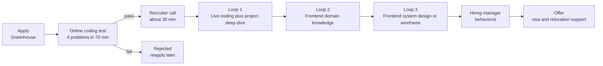

# PayPay (Japan) Frontend Engineer — Full Interview Prep

- **Researched:** 2026-07-27
- **Target:** Frontend Engineer / Senior Frontend Engineer at PayPay Corporation (Tokyo, hybrid)
- **Sources freshness:** mostly 2025–2026 (Glassdoor reports from May and July 2026, current Greenhouse posting, CodeSignal 2026 platform changes)
- **Your situation:** you applied once and were cut at the online test. You have not re-applied. So Part 1 below is the part that decides everything.

**Related notes — linked, not repeated here:**

- JavaScript internals, React internals, Core Web Vitals, frontend system design → [react-js-frontend-interview-guide.md](../react-js-frontend-interview-guide.md)
- Hands-on hooks and data-fetching exercises → [react-hooks-fetching-practice.md](../react-hooks-fetching-practice.md)
- Caching, scaling, load balancers, backend design → [system-design-basics-senior-fullstack-interview.md](../system-design-basics-senior-fullstack-interview.md)

---

## TL;DR

- The online test is a **CodeSignal-style set of 4 problems in 70 minutes**, ranked easy to hard. It is scored by hidden test cases with **partial credit**. You do not need 4 out of 4 to pass.
- The thing that fails people is **time management, not intelligence**. Bank the two easy problems fast, then spend the rest on the mediums. A working slow solution scores. An unfinished clever one scores zero.
- For a JavaScript developer, **hash maps (`Map`/`Set`), two pointers, sliding window, string parsing, sorting with a comparator, and stacks** cover most of what a 70-minute screen asks. Trees and graphs show up in the last problem.
- The job posting says **"Vue.js (preferred) or React"**. React is accepted. Vue is a preference, not a filter. But one interview round does ask you to compare Vue and React reactivity, so you need to be able to talk about Vue.
- **Give yourself 5–6 weeks.** The single highest-value practice is a weekly full simulation: 4 unseen problems, 70 minutes, no pausing, no help. Almost nobody does this, and that is why almost nobody passes on the first try.

---

# Key Concepts

## The process at a glance

Notice where the test sits: it is the very first technical gate, and everything else is behind it.



Reported end-to-end time: **about 28 days on average** for Frontend Engineer, with some candidates reporting 1–3 months.

---

# Part 1 — The Online Test (your priority)

## 1.1 What the test actually is

**The problem you are solving:** PayPay gets far more applicants than it can interview. The online test is a cheap filter. It is not trying to find the best engineer. It is trying to remove people who cannot produce working code under a clock.

**The format**, from 2025–2026 candidate reports:

| Item | Detail |
|---|---|
| Platform | **CodeSignal** in almost all 2025–2026 reports. Older backend reports mention **Codevue**, which reads input from standard input. Prepare for CodeSignal, but know the stdin pattern too. |
| Problems | **4** |
| Time | **70 minutes total** — one shared clock, not 17.5 min each |
| Difficulty | Easy → hard. Usually roughly 2 easy, 2 medium, LeetCode-style |
| Topics reported | Arrays, strings, hash maps, stacks, matrix, and wordy "simulation" problems |
| Scoring | Hidden test cases with **partial credit** — passing 6 of 10 cases still earns points |
| Language | You choose. Use **JavaScript or TypeScript** — the language you are fastest in |

**Terms defined:**

- **Hidden test cases** — the graders run your code against inputs you never see. You cannot eyeball your way to a pass. You must reason about edge cases yourself.
- **Partial credit** — your score is a fraction of tests passed, not pass/fail per problem. This single fact should change your whole strategy.
- **Standard input (stdin)** — some platforms hand you the raw text of the input instead of function arguments. You parse it yourself.

**On the score number:** CodeSignal's current General Coding Assessment score runs roughly **200–600**. Older articles say 300–850 — that was the retired "Coding Score" scale. PayPay has never published a cut score. Reports say a strong-but-imperfect result passes.

## 1.2 The 70-minute plan

**The problem:** with one shared clock across 4 problems, a single hard problem can eat 40 minutes and leave you with one solved problem out of four.

**The solution: a fixed schedule you rehearse until it is automatic.**

| Minutes | Do this |
|---|---|
| 0–3 | **Scan all 4 problems.** Do not code. Rank them: which pattern do I recognize instantly? |
| 3–14 | **Easiest problem.** Write it, run the samples, submit. |
| 14–28 | **Second easiest.** Same. Now you have banked points. |
| 28–50 | **Third problem.** Brute force first. Submit the brute force. Optimize only if it clearly times out. |
| 50–64 | **Hardest problem.** Aim for partial credit — handle the simple cases correctly even if the general case is beyond you. |
| 64–70 | **Sweep.** Re-read your submitted solutions for empty input, single element, and off-by-one bugs. Re-submit fixes. |

**Hard rules:**

- **Never solve in the given order.** Problem 3 is often the longest to implement. Solve by your confidence, not by the numbering.
- **Set a per-problem cap.** If you are 5 minutes past the budget, submit whatever runs and move on. You can come back.
- **Submit early and often.** A submission that passes 5 of 12 tests is worth more than an unsubmitted perfect idea.
- **Read the problem twice before coding.** CodeSignal problems are wordy on purpose. Misreading the spec is the most expensive mistake available.

**Everyday analogy:** it is a buffet with a 70-minute table booking. Fill your plate with the dishes you can reach first. Do not queue 40 minutes for the lobster.

## 1.3 The DSA patterns to drill, ranked for a 70-minute screen

**"DSA"** = data structures and algorithms. **"Pattern"** = a reusable shape of solution. You are not memorizing 300 problems. You are learning ~12 shapes and recognizing which one a problem is wearing.

### Tier 1 — drill these until they are reflexes

**1. Hash map counting and lookup**
- *What it is:* store what you have seen so you never search again. `Map`, `Set`, or a plain object.
- *Recognize it when:* the problem says "duplicate", "count", "frequency", "seen before", "pair that sums to", "anagram", "first unique".
- *JS note:* `Set.has()` and `Map.get()` are O(1) — constant time no matter the size. `array.includes()` is O(n) — it walks the whole array. Swapping one for the other is the single most common speedup in these tests.

```ts
// Two-sum shape — the most reused 5 lines in coding tests
function twoSum(nums: number[], target: number): [number, number] | null {
  const seen = new Map<number, number>(); // value -> index
  for (let i = 0; i < nums.length; i++) {
    const need = target - nums[i];
    if (seen.has(need)) return [seen.get(need)!, i];
    seen.set(nums[i], i);
  }
  return null;
}
```

**2. Two pointers**
- *What it is:* two index variables moving through one array, usually from both ends inward or at different speeds.
- *Recognize it when:* the array is **sorted**, or the problem is about palindromes, pairs, removing duplicates in place, or merging two sorted lists.
- *JS note:* use `while (left < right)`. Avoid `splice` inside the loop — it is O(n) each call and turns your O(n) solution into O(n²).

**3. Sliding window**
- *What it is:* a two-pointer variant where the pointers define a moving range. You add on the right, remove on the left.
- *Recognize it when:* "longest / shortest **contiguous** subarray or substring that satisfies X", "max sum of k consecutive".
- *JS note:* keep a `Map` of counts inside the window. Shrink from the left with a `while`, not an `if`.

**4. String building and parsing**
- *What it is:* splitting text into tokens, or building an output string character by character.
- *Recognize it when:* the input is text, CSV-like, a sentence, a version number, or a formatted log line.
- *JS note:* strings are **immutable** — you cannot change one in place. `result += ch` inside a long loop can degrade badly. Push characters into an array and `join("")` at the end.

**5. Sorting with a custom comparator**
- *What it is:* ordering by a rule you define.
- *Recognize it when:* "sort by frequency then alphabetically", "kth largest", "meeting rooms", "merge intervals".
- *JS trap — memorize this:* `[10, 9, 1].sort()` returns `[1, 10, 9]`. The default sort converts everything to strings and compares text. **Always pass a comparator for numbers:** `.sort((a, b) => a - b)`.

```ts
nums.sort((a, b) => a - b);                       // ascending numbers
words.sort((a, b) => b.count - a.count || a.name.localeCompare(b.name)); // two keys
```

**6. Stack**
- *What it is:* last in, first out. Just a JS array with `push` and `pop`.
- *Recognize it when:* brackets/parentheses matching, undo, "next greater element", nested structures, evaluating expressions, simplifying a file path.
- *JS note:* `push`/`pop` are fast. `shift`/`unshift` are O(n) because every element moves — never use them in a hot loop.

### Tier 2 — very likely as the 3rd or 4th problem

**7. Matrix / grid traversal**
- *Recognize it when:* the input is a 2D array — islands, flood fill, spiral order, rotating an image, shortest path in a grid.
- *JS trap:* `Array(3).fill(Array(3).fill(0))` creates **three references to one row**. Changing `grid[0][0]` changes all rows. Use `Array.from({ length: n }, () => new Array(m).fill(0))`.

**8. BFS and DFS**
- *What they are:* two ways to walk a tree or graph. **BFS** (breadth-first) visits level by level using a queue — use it for shortest path. **DFS** (depth-first) goes deep first using recursion or a stack — use it for "explore the whole region" and tree problems.
- *Recognize it when:* "shortest number of steps", "connected regions", "levels of a tree", "can I reach X from Y".
- *JS note:* do not use `array.shift()` for the BFS queue. Use an index pointer.

```ts
const q = [start];
let head = 0;
while (head < q.length) {
  const cur = q[head++];   // O(1) dequeue
  // ... push neighbours onto q
}
```

**9. Binary search**
- *What it is:* halve the search range each step. O(log n).
- *Recognize it when:* the data is sorted, or the answer itself is a number in a range you can test ("minimum capacity such that…").
- *JS note:* use `mid = low + ((high - low) >> 1)` or just `Math.floor((low + high) / 2)`. Overflow is not a real risk in JS at these sizes.

**10. Intervals**
- *Recognize it when:* pairs of `[start, end]` — merging, overlapping, meeting rooms, inserting a booking.
- *Recipe:* sort by start, then walk once and merge when `current.start <= previous.end`.

**11. Prefix sums**
- *What it is:* precompute running totals so any range sum is one subtraction.
- *Recognize it when:* many "sum between i and j" queries, or "subarray sums to k" (combine with a hash map).

### Tier 3 — know the shape, do not over-invest

**12. Simple 1D dynamic programming**
- *What it is:* build the answer from smaller answers stored in an array. Climbing stairs, house robber, coin change, max subarray.
- *Recognize it when:* "how many ways", "min/max cost to reach", and choices at each step depend on earlier steps.
- *Reality check:* in a 70-minute screen you will see at most easy DP. Learn 4 canonical problems, not 40.

**13. Simulation / implementation-heavy**
- *What it is:* no clever trick. Just follow a long list of rules exactly, with many edge cases.
- *Recognize it when:* the problem statement is 4 paragraphs long with numbered rules.
- *Why it matters:* CodeSignal loves these, and they are where careful people beat clever people. Read the rules twice. Write a helper function per rule.

### Fast recognition table

| Words in the problem | Pattern to reach for |
|---|---|
| duplicate, count, frequency, seen, anagram | Hash map / Set |
| sorted array, pair, palindrome, in-place removal | Two pointers |
| longest/shortest contiguous, window of size k | Sliding window |
| valid brackets, next greater, nested, undo | Stack |
| sort by … then by …, kth largest | Comparator sort |
| grid, island, region, maze | BFS / DFS on matrix |
| shortest number of moves | BFS |
| sorted, find, minimum X such that | Binary search |
| [start, end] pairs, overlapping, merge | Intervals |
| sum between i and j, subarray sums to k | Prefix sums + hash map |
| how many ways, min cost to reach | 1D DP |
| four paragraphs of rules | Simulation — read twice, helper per rule |

## 1.4 JavaScript-specific gotchas in coding tests

These are the ones that silently cost points.

**1. The sort comparator trap (most common)**
```ts
[10, 9, 1].sort();            // [1, 10, 9]  ← wrong, sorted as text
[10, 9, 1].sort((a, b) => a - b); // [1, 9, 10] ← correct
```
`sort` also **mutates** the original array. Use `[...arr].sort(...)` if you still need the original.

**2. `Map` vs plain object**

| | `Map` | Plain object `{}` |
|---|---|---|
| Key types | Any — numbers, strings, objects | Coerced to strings |
| Size | `map.size` | `Object.keys(o).length` — O(n) |
| Iteration order | Insertion order, guaranteed | Integer-like keys jump to the front |
| Inherited keys | None | `"constructor"`, `"toString"` can collide |
| Verdict | **Default to `Map` in tests** | Fine for small fixed string keys |

**3. `.includes()` inside a loop is O(n²)**
```ts
// slow — O(n^2), times out on large inputs
for (const x of a) if (b.includes(x)) out.push(x);

// fast — O(n)
const bSet = new Set(b);
for (const x of a) if (bSet.has(x)) out.push(x);
```

**4. Number precision, not overflow**
- JavaScript has no integer overflow at normal test sizes — but it does lose precision above `Number.MAX_SAFE_INTEGER` (9,007,199,254,740,991).
- Floating point is the real trap: `0.1 + 0.2 === 0.3` is `false`. For money-like problems compare with a tolerance, or work in integer cents.
- If a problem explicitly says results can exceed 2^53, use `BigInt`.

**5. Strings are immutable**
```ts
// can degrade badly on long strings
let out = ""; for (const c of s) out += transform(c);

// safe
const parts: string[] = []; for (const c of s) parts.push(transform(c));
const out = parts.join("");
```

**6. Array method costs**
- `push` / `pop` — O(1). Use for stacks.
- `shift` / `unshift` / `splice` — O(n). Never inside a loop.
- `[...arr]` and `arr.slice()` — O(n). Never inside a loop.

**7. The 2D array reference trap**
```ts
const bad = Array(3).fill(Array(3).fill(0));   // 3 pointers to ONE row
const good = Array.from({ length: 3 }, () => new Array(3).fill(0));
```

**8. `map(Number)` not `map(parseInt)`**
```ts
["1", "2", "3"].map(parseInt); // [1, NaN, NaN] — parseInt gets the index as radix
["1", "2", "3"].map(Number);   // [1, 2, 3]
```

**9. Recursion depth**
Node's default call stack is roughly 10,000 frames. A DFS over 100,000 nodes will crash with "Maximum call stack size exceeded". Convert to an explicit stack loop when input sizes are large.

**10. Reading standard input (Codevue / HackerRank style)**
If the platform gives you raw input instead of function arguments, this is the whole boilerplate:
```ts
const input = require("fs").readFileSync(0, "utf8").trim().split("\n");
const n = Number(input[0]);
const nums = input[1].split(" ").map(Number);
console.log(solve(n, nums));
```
Practice this once so it never costs you 5 minutes.

**11. Comparing arrays or objects**
`[1,2] === [1,2]` is `false`. To use an array as a hash key, stringify it: `key = arr.join(",")` or `JSON.stringify(arr)`.

## 1.5 The study plan — 6 weeks from "failed the test" to "passed"

**The problem:** grinding random LeetCode problems builds a false sense of readiness. You solve at your own pace, with hints available, one problem at a time. The real test is four problems, one clock, no help.

**The solution:** pattern blocks on weekdays, full simulation on weekends.

**Daily budget: 90 minutes.** More than that and you burn out before week 4.

| Week | Patterns | Volume | Weekend simulation |
|---|---|---|---|
| 1 | Arrays, hash maps / `Set`, two pointers | 20 easy | 1 set: 4 easy in 70 min |
| 2 | Strings, sliding window, stack, queue | 12 easy + 6 medium | 1 set: 3 easy + 1 medium |
| 3 | Sorting + comparators, intervals, binary search, prefix sums | 8 easy + 8 medium | 1 set: 2 easy + 2 medium |
| 4 | Matrix traversal, BFS/DFS on grids and trees | 6 easy + 10 medium | 1 set: 2 easy + 2 medium |
| 5 | 1D DP, greedy, long simulation problems | 4 easy + 10 medium | 2 sets, different days |
| 6 | Only weak patterns + full simulations | Re-solve 15 you previously failed | 3 sets. Apply after the last one. |

**Rules that make the plan work:**

- **25-minute cap per practice problem.** Stuck at 25 minutes? Read the editorial, understand it, then close it and re-type the solution from memory.
- **Re-solve, do not re-read.** Put every problem you needed help with into a "redo" list. Solve it again from scratch 3 days later. This is spaced repetition and it is what actually moves you.
- **Write the complexity down** before you code. "This is O(n log n) time, O(n) space." It forces you to notice when you are about to write an O(n²) loop.
- **Keep a mistakes log.** One line per bug you hit: "forgot comparator", "used shift in BFS", "did not handle empty array". Read it before every simulation. Your mistakes repeat.

**Where to practice:**

| Resource | Use it for |
|---|---|
| **NeetCode 150** | The main list. Grouped by pattern, with video walkthroughs. Best pattern coverage per hour. |
| **Blind 75** | If you are short on time. It is a subset of NeetCode 150. Complete coverage of 75 beats half of 150. |
| **LeetCode "Top Interview 150"** | Extra volume once patterns are solid. |
| **CodeSignal practice / Interview Practice mode** | Get used to the exact editor, the run button, and the hidden-test feedback. Do at least 3 sessions here. |
| **LeetCode by tag, random** | Source your simulation sets so the problems are genuinely unseen. |

**How to run a simulation properly (this is the step people skip):**

1. Pick 4 unseen problems by tag: 2 easy, 2 medium. Do not read them first.
2. Set a 70-minute timer. One timer, not four.
3. Phone away. No editorial, no AI assistant, no Google beyond language docs.
4. When the timer ends, stop mid-line. That is your real score.
5. Spend 45 minutes reviewing: what pattern did you miss, where did time leak, which bug repeated.

Do this at least **6 times** before you apply. By simulation 5 or 6 the format stops being scary, and that is the actual goal.

## 1.6 Why people fail this test — and the counter for each

| Why they fail | What it looks like | The counter |
|---|---|---|
| Ran out of time | Two problems untouched | Fixed schedule from 1.2. Hard cap per problem. Solve by confidence, not by number. |
| Optimal-or-nothing | Spent 30 min searching for the O(n) trick, submitted nothing | **Brute force first, always submit it, then optimize.** Partial credit is real credit. |
| Froze on an unfamiliar pattern | Blank screen for 10 minutes | Drill recognition, not solutions. Use the recognition table in 1.3. If nothing fires in 90 seconds, move on and come back. |
| Untested edge cases | Solution "works" but fails 4 hidden tests | Run the **EDSON** checklist below on every problem before submitting. |
| Slow in an unfamiliar editor | Fighting the run button instead of the problem | 3 practice sessions in CodeSignal's own environment. |
| Misread the problem | Correct code, wrong problem | Read twice. Restate the requirement in one sentence in a comment before coding. |
| Nerves | Everything above, but worse | Simulations. Six of them. Familiarity is the only real cure. |

**EDSON edge-case checklist** — run it in your head in 30 seconds before every submit:

- **E**mpty input — `[]`, `""`, `0` items
- **D**uplicates — all elements identical
- **S**ingle element — length 1
- **O**rder extremes — already sorted, reverse sorted
- **N**egatives and zero — including negative results and division by zero

---

# Part 2 — The Rest of the Process

Lighter treatment, because you have to pass Part 1 first.

## 2.1 Stage by stage

| Stage | Length | What they test | How to prepare |
|---|---|---|---|
| Application review | 1–2 weeks | Years of experience, stack fit | Make sure your CV literally says "5+ years", "TypeScript", "React", and any Vue exposure |
| Online coding test | 70 min | Can you produce working code under a clock | Part 1 |
| Recruiter call | ~30 min | Motivation, visa status, salary expectation, English level, language preference for interviews | Have a 90-second "why PayPay, why Japan" answer and a salary range ready |
| Loop 1 — live coding | 45–60 min | One medium DSA problem, plus a deep dive into a project on your CV, plus CS fundamentals | Practice **talking while coding** |
| Loop 2 — frontend domain | 60 min | JavaScript internals, SPA routing, React vs Vue reactivity, performance, CSS | Your [react-js-frontend-interview-guide.md](../react-js-frontend-interview-guide.md) covers most of this |
| Loop 3 — system design / wireframe | 45–60 min | Given a wireframe or a product, design the frontend: components, state, API contract, responsiveness | Section 2.3 below |
| Hiring manager / behavioral | 45 min | Impact, conflict, ownership, why you are leaving | STAR stories, 4 of them, rehearsed |

## 2.2 The live coding round is a different skill

**The problem:** in the online test nobody watches you. In the live round, silence reads as "does not know what they are doing", even if your code is right.

**What changes:**

- **Talk before you type.** Restate the problem. Ask about input size, duplicates, and empty input. Then say your approach and its complexity out loud. Only then code.
- **Narrate tradeoffs.** "I'll use a Map for O(1) lookups. That costs O(n) extra memory. If memory were tight I'd sort first and use two pointers, at O(n log n) time instead."
- **Write a test yourself.** Walk through one example by hand at the end. Interviewers score this heavily.
- **Handle hints gracefully.** If the interviewer nudges you, say "good point" and adjust. Defending a wrong approach is the worst outcome in this round.
- **Expect the project deep dive.** They will pick something on your CV and ask why you built it that way. Prepare two projects where you can defend the architecture, the tradeoffs, and what you would change now.

## 2.3 The frontend system design round

Reported prompts from candidates are practical, not abstract: implement or design from a wireframe, then defend the decisions. Likely prompts for a payments company:

- **Design a checkout / payment confirmation flow.** Talk about: optimistic UI vs blocking spinner (for money, block and confirm), double-submit protection, idempotency, error and retry states, network loss mid-payment, accessibility of the form.
- **Design a QR scanner screen.** Camera permission states, torch, fallback to manual code entry, offline behaviour, scanning debounce, low-end Android performance.
- **Design a transaction history list.** Infinite scroll with keyset pagination, virtualization for long lists, pull to refresh, filtering, empty and error states, currency and date formatting per locale.
- **Design a multi-team frontend.** How to split an app across teams — micro-frontends with `single-spa` (PayPay's actual stack), shared design system, versioning, bundle size budgets.

**The structure to use every time:** requirements (functional + non-functional) → component tree → state ownership → API contract → edge and error states → performance → accessibility → observability.

Full detail lives in [react-js-frontend-interview-guide.md](../react-js-frontend-interview-guide.md) and [system-design-basics-senior-fullstack-interview.md](../system-design-basics-senior-fullstack-interview.md).

## 2.4 The domain knowledge round — what has actually been asked

From candidate write-ups, the recurring questions are:

- `this` binding, the event loop, Promises and microtasks
- What an SPA is, its downsides, and how client-side routing is implemented
- Vue vs React reactivity — how each detects a change
- Repaint vs reflow, and what triggers each
- Reducing bundle size — code splitting, dynamic `import()`, tree shaking, webpack analysis
- `async` vs `defer` on `<script>`
- Centering an element (yes, really) — flexbox, grid, and the older methods
- CSS grid vs flexbox — when each

All of these are answered in your existing React/JS guide. Do not re-learn them here; re-read that note.

---

# Part 3 — The Vue.js Gap, Honestly

## 3.1 Is it a blocker?

**No.** The current posting says: *"at least 1 year of industry experience with VueJS (preferred) or React."* The word "or" is doing real work. React satisfies the requirement. "Preferred" means that between two otherwise equal candidates, the Vue one has an edge.

**But** one interview round asks you to compare Vue and React reactivity. If you say "I have never used Vue", you lose points for curiosity, not for skill. So learn enough Vue 3 to have an intelligent conversation. That is a weekend, not a month.

## 3.2 Vue 3 for a React developer — the translation table

**Vue's Composition API** is Vue's function-based way of writing components. It was directly inspired by React hooks, so most concepts map cleanly.

| React | Vue 3 | Difference that matters |
|---|---|---|
| `useState` | `ref()` / `reactive()` | Vue lets you **mutate** state directly (`count.value++`). React makes you **replace** it (`setCount(c => c + 1)`). |
| `useMemo` | `computed()` | `computed` tracks its own dependencies automatically. No dependency array. |
| `useEffect` | `watchEffect()` / `watch()` | `watchEffect` auto-tracks. `watch` targets a specific source. Again, no dependency array. |
| `useEffect` cleanup | `onUnmounted()` / return from `watchEffect` | Same idea |
| `useRef` (DOM) | `ref` bound in template | Same idea |
| `useContext` | `provide()` / `inject()` | Same idea |
| Custom hooks | Composables (`useSomething.ts`) | Same idea, same naming convention |
| Props + callback props | Props + `emit()` | Vue has a first-class event system |
| `children` | Slots | Slots are more structured, named slots are common |
| JSX | Template with directives | `v-if`, `v-for`, `v-model`, `v-bind` (`:`), `v-on` (`@`) |
| Zustand / Redux | Pinia | Pinia is the official store, very close to Zustand in feel |
| React Router | Vue Router | Official, file-based in Nuxt |
| Next.js | Nuxt | Same role: routing, SSR, data fetching |
| React Native | — | Vue has no equivalent. Say this if asked. |

**A Single File Component (SFC)** is Vue's `.vue` file — template, script, and styles in one file:

```vue
<script setup lang="ts">
import { ref, computed, watch } from "vue";

const count = ref(0);                       // like useState
const doubled = computed(() => count.value * 2);  // like useMemo, auto-tracked
watch(count, (n) => console.log(n));        // like useEffect with [count]
</script>

<template>
  <button @click="count++">{{ count }} / {{ doubled }}</button>
</template>

<style scoped>
button { padding: 8px; }
</style>
```

Note: inside `<script>` you write `count.value`. Inside `<template>` Vue unwraps it for you, so you write `count`.

## 3.3 The reactivity answer (this is the question they ask)

**React:** state changes trigger a **re-render of the component function**. React then compares the new output tree with the old one and applies the minimum DOM changes. React does not know *which* piece of state you read — it re-runs the whole component and relies on diffing plus memoization.

**Vue 3:** state is wrapped in a **Proxy** — an object that intercepts reads and writes. When a component reads `count`, Vue records "this effect depends on count". When `count` changes, Vue re-runs **only the effects that read it**. This is finer-grained. It is why Vue rarely needs a `useMemo` equivalent for correctness.

**One-line version to say out loud:** "React re-runs the component and diffs the output. Vue tracks dependencies at read time with Proxies and re-runs only what depends on the changed value. React trades precision for simplicity, Vue trades a little magic for precision."

## 3.4 What is current in Vue (2026) — one line to sound informed

Vue 3.6 reached release-candidate stage in 2026 with **Vapor Mode** — an opt-in compile mode that removes the virtual DOM entirely and writes direct DOM updates — plus a reactivity rewrite based on `alien-signals`. The Composition API code is unchanged, so it is a per-file opt-in. Mentioning this shows you follow the ecosystem even though you work in React.

## 3.5 How to frame the gap in the interview

Use this shape, adapted to your own words:

> "I have shipped production React and React Native for several years, plus Next.js. I have not shipped Vue commercially, but I have gone through Vue 3's Composition API and built with it. The mental model is very close to hooks — `ref` for state, `computed` for derived values, `watch` for side effects. The real difference is reactivity: Vue tracks dependencies with Proxies and updates precisely, React re-renders and diffs. Given your stack runs both React and Vue behind `single-spa`, I would be productive in the React parts immediately and I expect a couple of weeks to be fully comfortable in the Vue ones."

Why this works: it is honest, it proves you actually looked, it uses their stack, and it gives a concrete ramp-up estimate instead of a vague promise.

**Before the interview, actually build one small Vue 3 app.** A todo list with Pinia and Vue Router is enough. Then you can say "I built X" instead of "I read about it".

---

# Part 4 — Company and Role Context

## 4.1 What PayPay is

- A **QR-code mobile payment app in Japan**. You open the app, scan a merchant's QR code or show your own, and pay from a linked balance, bank account, or card.
- Launched **2018**. Backed by SoftBank and the Yahoo Japan / LY Corporation group.
- **70 million registered users** as of July 2025; reports put it near **72 million registered and ~40 million monthly transacting users** by December 2025. That is over half of Japan's adult population.
- Roughly **two-thirds of Japan's QR-code payment volume**.

## 4.2 Why that matters for a frontend engineer

- **Scale means small regressions are expensive.** A 100 KB bundle increase multiplied by tens of millions of sessions is a real cost. Expect performance budget questions.
- **Payments must be correct.** Double-charging is unacceptable. Expect questions about double-submit protection, idempotency, and what the UI does when the network dies mid-payment.
- **Devices are varied.** A national payment app runs on cheap Android phones in poor signal. Low-end performance and offline behaviour are real product concerns, not theory.
- **Accessibility and i18n are not optional.** Japanese and English UIs, screen readers, elderly users. Their stack lists `i18n` explicitly.
- **Micro-frontends are their reality.** Their stack lists `single-spa`, which lets separately built React and Vue apps run inside one page. That is why both frameworks appear in the posting.

## 4.3 The role, from the current posting

| Item | Detail |
|---|---|
| Experience | **5+ years** building secure web frontends in JavaScript or a language that compiles to it |
| Framework | **1+ year of Vue.js (preferred) or React** |
| Language | **Business-level English required.** Japanese not required. Interviews can be in English or Japanese — you choose |
| Stack | TypeScript, JavaScript, HTML/CSS · Vue.js, React, NestJS, Express.js, single-spa · Docker, Kubernetes, ArgoCD, AWS, GitHub Actions, Terraform · Jest, Storybook, Webpack, i18n · Sentry, Kibana, New Relic, Google Analytics, Firebase · Figma |
| Work style | **Hybrid, Tokyo.** Super-flex hours |
| Relocation | **Visa sponsorship + relocation support**: one-way flight, ~1.5 months temporary housing, moving allowance, help with visa and residence paperwork, apartment deposit support |
| Salary range (public listings) | Frontend Engineer roughly ¥6.5M–13M; Senior Frontend Engineer roughly ¥9M–14M |

## 4.4 Working in English at a Japanese company

- PayPay runs both English and Japanese as working languages. Employees come from **50+ countries**.
- You will not be blocked by Japanese, but some senior engineers are more comfortable in Japanese. Candidates report interviewers with varying English fluency.
- **Practical advice:** speak slower than feels natural, use short sentences, and check understanding ("does that answer the question, or should I go deeper?"). Clarity is worth more than vocabulary.
- Choose **English** for your interviews unless your Japanese is business level.
- Your stack maps well: their `Express.js` / `NestJS` middleware layer is close to your Express and GraphQL background, and Docker/AWS overlaps with your CapRover and Docker experience.

---

## What's Current (2026)

- **Platform: CodeSignal.** Glassdoor reports from **May 2026 and July 2026** describe a CodeSignal invite with 4 LeetCode-style questions ranging easy to hard, arriving about a week after applying. Older backend reports (2023–2024) mention **Codevue**, which uses standard input and output. Prepare mainly for CodeSignal; spend 10 minutes learning the stdin boilerplate as insurance.
- **CodeSignal added an AI co-pilot mode in 2025.** Some employers enable "Cosmo", an in-editor AI assistant. If it is enabled, **the employer receives the full transcript of your conversation with it.** Ask targeted questions ("what is the signature of Array.prototype.flatMap") rather than asking for a solution.
- **Proctoring tightened in 2026.** CodeSignal published research in February 2026 showing cheating attempts on proctored assessments more than doubled, from 16% in 2024 to 35% in 2025. Detection now includes keystroke rhythm, code-velocity analysis, tab switching, webcam, and screen recording. Practical effect: do not paste code from outside, and do not leave the tab.
- **Retake limits (2026):** 2 assessments per 30 days, 3 per 6 months. Do not burn an attempt unprepared.
- **PayPay's 2026 frontend postings name an "AI-First Culture"** and expect engineers to use AI tools in code review, testing, and debugging as part of normal workflow. Have an honest answer about how you use AI assistants and where you do not trust them.
- **Hiring speed:** Glassdoor's Frontend Engineer average is about **28 days** end to end. Candidates in Tokyo also report 1–3 months, so plan for either.
- **Location:** the current Greenhouse posting is **hybrid in Tokyo with visa sponsorship and relocation support**. An older Japan Dev listing advertising full remote from overseas is from **2023** and does not reflect the current posting. Assume you will relocate.
- **Vue in 2026:** Vue 3.6 reached RC with Vapor Mode (no virtual DOM, opt-in) and an `alien-signals`-based reactivity rewrite. Their stack still lists both Vue and React behind `single-spa`.

---

## Likely Interview Questions

### Round: Online test (no interviewer — these are the problem shapes)

Practise one of each, timed:

1. Frequency counting on a string or array (hash map)
2. Longest substring without repeating characters (sliding window)
3. Valid parentheses or a monotonic-stack "next greater" (stack)
4. Merge intervals or meeting rooms (sort + sweep)
5. Number of islands or flood fill (grid DFS/BFS)
6. Binary search on a rotated or condition-based range
7. A long rules-based simulation — parse a log, apply rules in order, output a summary
8. Two-pointer in-place array modification

### Round: Live coding

**Q: Given an array of transaction objects, return the top K merchants by total amount, breaking ties alphabetically.**

**Answer outline:**
- Clarify: how large is the input, can amounts be negative (refunds), is K larger than the number of merchants.
- Build a `Map<string, number>` in one pass — O(n).
- Convert to an array and sort with a two-key comparator: `(a, b) => b.total - a.total || a.name.localeCompare(b.name)`.
- State complexity: O(n + m log m) where m is the number of distinct merchants.
- Mention the improvement: a min-heap of size K gives O(m log K) if K is much smaller than m — and say you would only build it if profiling justified the extra code.
- Test out loud: empty array, one transaction, all same total, K > m.

**Q: Implement a debounce function, then explain where you would use it in a payments app.**

**Answer outline:**
- Closure over a timer id; clear and reset on each call; support a cancel method.
- In TypeScript, type it generically so the wrapped function keeps its signature.
- Use case: merchant search input, address autocomplete. **Not** for the pay button — that needs a disable-on-submit plus server-side idempotency, because debounce is a timing guess, not a guarantee.

### Round: Frontend domain knowledge

**Q: How does Vue's reactivity differ from React's?**
- React re-runs the component function and diffs the returned tree.
- Vue wraps state in Proxies, records which effects read which values, and re-runs only those effects.
- Consequence: React needs `useMemo`/`useCallback` (or the React Compiler) to avoid wasted work; Vue's `computed` is cached and auto-tracked.
- Honest closer: "I work in React daily, so I know the memoization side well. I studied Vue's model because your stack runs both."

**Q: How would you cut the bundle size of a large SPA?**
- Measure first — webpack bundle analyzer, then a size budget in CI.
- Route-level code splitting with dynamic `import()`.
- Replace heavy dependencies (moment → date-fns or Intl; lodash → per-method imports).
- Tree shaking requires ES modules and `sideEffects: false`.
- Defer non-critical work: lazy-load the QR scanner library only on the scan route.
- Tie it to the user: "on a mid-range Android in Japan, this is the difference between a 1.5s and a 4s first interaction."

**Q: `async` vs `defer` on a script tag?**
- Both download the script in parallel with HTML parsing.
- `async` executes as soon as it downloads — order not guaranteed. Use for independent scripts like analytics.
- `defer` executes after parsing, in document order. Use for app code that depends on the DOM or on other scripts.
- Neither helps if the script is huge — that is a bundle problem, not a loading-attribute problem.

More frontend answers: [react-js-frontend-interview-guide.md](../react-js-frontend-interview-guide.md).

### Round: Frontend system design

**Q: Design the checkout screen for a payment app.**

**Answer outline:**
- Requirements first. Functional: choose payment method, confirm amount, submit, show result. Non-functional: works on 3G and low-end Android, never double-charges, screen-reader usable, Japanese and English.
- Component tree and state ownership: a single `CheckoutMachine` state holder (idle → submitting → confirmed → failed) rather than several booleans. Booleans allow impossible states.
- API contract: `POST /payments` with a client-generated **idempotency key**, so a retry cannot charge twice.
- Do **not** use optimistic UI for money. Block the button, show a determinate state, and only show success on server confirmation.
- Failure paths: network timeout with unknown result → poll a status endpoint, never auto-retry the charge blindly.
- Performance: this route should be the smallest bundle in the app. Preload it from the cart page.
- Observability: Sentry breadcrumbs on each state transition, plus a funnel metric per step.

### Round: Behavioral

**Q: Why PayPay, and why Japan?**
- Concrete: national-scale payments, tens of millions of users, real correctness constraints — different from the products you have worked on.
- Specific to them: micro-frontends with `single-spa` running React and Vue, which is a genuinely interesting engineering problem.
- Personal and honest about relocation from Indonesia. Show you have thought about it rather than treating it as a bonus.

**Q: Tell me about a time you disagreed with a teammate on a technical decision.**
- STAR. Pick a real one with a measurable outcome. Show you changed your mind or found data, not that you won.

---

## Tradeoffs to Be Ready For

- **Brute force vs optimal, under a clock.** In the online test, always write and submit the brute force first. Partial credit is guaranteed points; an unfinished optimal solution is zero. In the *live* round, invert this — state the brute force in one sentence, then say "but I'd do X for O(n)" and code X. The live round scores your reasoning, the online test scores your output.
- **`Map` vs plain object.** `Map` for anything non-trivial: real key types, O(1) size, no prototype key collisions. Object literals for tiny fixed string-keyed lookups where readability wins.
- **Recursion vs iteration.** Recursion is shorter and clearer for trees. Iteration with an explicit stack is required when input can exceed roughly 10,000 depth. Say which you chose and why.
- **Vue vs React.** Vue: finer-grained reactivity, less manual memoization, templates catch some errors at compile time. React: bigger ecosystem, React Native for mobile, JSX is plain JavaScript so composition is more flexible. For PayPay, the honest answer is "both, because `single-spa` lets teams choose".
- **Micro-frontends vs one SPA.** Micro-frontends buy independent deploys and team autonomy. They cost duplicated dependencies, a harder shared-state story, and slower first load. Only worth it past a certain org size — which PayPay clearly is.
- **Optimistic UI vs blocking confirmation.** Optimistic is right for likes, drafts, and reordering. Blocking is right for money. Saying this distinction out loud in a payments interview is a strong signal.
- **English vs Japanese interview.** Pick English unless your Japanese is business level. A slower, clearer English answer beats a shaky Japanese one. You are not scored on language beauty.
- **Speed vs test coverage in live coding.** Write the solution first, then hand-trace one example. Do not write a test framework. Do not skip the trace either.

---

## Real-World Cases to Cite

- **PayPay — micro-frontends:** their public stack lists `single-spa`, which lets independently built React and Vue applications share one page. Cite it when asked why they use two frameworks, or in any "how would you split a frontend across teams" question.
- **Stripe — idempotency keys:** every payment API call accepts an `Idempotency-Key` header, so a retried charge applies exactly once. Cite this in any checkout or payment-flow design.
- **Shopify — checkout performance:** Shopify rebuilt checkout as a single-page flow and treats checkout speed as a revenue metric, with strict performance budgets. Cite it when arguing that the payment route should carry the smallest bundle in the app.
- **Netflix — removing React from the landing page:** Netflix cut client-side JavaScript on its signup landing page and reported time-to-interactive improving by roughly half. Cite it when discussing bundle size, or "do we need a framework on this route".
- **Pinterest — progressive web app rebuild:** rebuilding the mobile web experience as a lightweight PWA produced large gains in engagement and signups. Cite it for low-end device performance and mobile web strategy.
- **GitLab — Vue at scale:** GitLab runs one of the largest open-source Vue codebases and has published extensively on migrating from jQuery to Vue and on their component library. Cite it if asked whether Vue holds up in large applications.

---

## Cheatsheet

> **Visual version:** open [paypay-frontend-interview-prep-cheatsheet.html](paypay-frontend-interview-prep-cheatsheet.html) in your browser — DSA pattern cards, the 70-minute timeline, the numbers table, decision verdicts, the week-by-week plan, and memory hooks. Everything visible, nothing hidden behind taps.

**The test in one line:** 4 problems, 70 minutes, partial credit, easy → hard, CodeSignal, you pick the language.

**The 70-minute schedule:**

| 0–3 | 3–14 | 14–28 | 28–50 | 50–64 | 64–70 |
|---|---|---|---|---|---|
| Scan all 4 | Easiest | Second easiest | Third | Hardest — partial credit | Sweep edge cases |

**Pattern → trigger words:**

| Trigger | Pattern |
|---|---|
| duplicate, count, seen | `Map` / `Set` |
| sorted, pair, palindrome | Two pointers |
| longest contiguous | Sliding window |
| brackets, next greater | Stack |
| sort by … then … | Comparator |
| grid, island | DFS / BFS |
| fewest moves | BFS |
| [start, end] | Sort + merge |
| sum i..j | Prefix sums |
| four paragraphs of rules | Simulation |

**Snippets to remember:**

```ts
nums.sort((a, b) => a - b);                     // never sort numbers without this
const s = new Set(arr);                         // O(1) has() beats O(n) includes()
const g = Array.from({length:n}, () => new Array(m).fill(0)); // safe 2D array
const q = [start]; let head = 0;                // O(1) BFS queue
while (head < q.length) { const cur = q[head++]; }
const parts: string[] = []; /* push */ parts.join(""); // build strings safely
const input = require("fs").readFileSync(0, "utf8").trim().split("\n"); // stdin
```

**React → Vue quick map:**

| React | Vue 3 |
|---|---|
| `useState` | `ref` / `reactive` |
| `useMemo` | `computed` (no dep array) |
| `useEffect` | `watch` / `watchEffect` |
| custom hook | composable |
| Zustand/Redux | Pinia |
| Next.js | Nuxt |

**Memory hooks** (idioms here only — plain meaning next to each):

- **"Scan, Bank, Attack, Sweep."** Scan all four problems, bank the easy points, attack the hard ones, sweep for edge cases. Your whole 70-minute plan in four words.
- **"Banked beats brilliant."** "Banked" means already submitted and scoring. A submitted brute force outscores an unfinished optimal solution.
- **"Sort numbers, or sort strings."** If you forget the comparator, JavaScript sorts your numbers as text. `[10, 9].sort()` → `[10, 9]` stays wrong-looking forever.
- **"Set beats includes."** Any `includes` inside a loop is a hidden O(n²).
- **"Vue mutates, React replaces."** The one-line reactivity difference.
- **EDSON** — Empty, Duplicates, Single, Order extremes, Negatives. The edge-case checklist to run before every submit.
- **"Money never goes optimistic."** Optimistic UI is for likes, not for payments.

---

## Sources

- [PayPay Frontend Engineer job posting — Greenhouse](https://job-boards.greenhouse.io/paypay/jobs/4089251004) — current posting, accessed 2026-07-27 (5+ years, 1+ year Vue preferred or React, business English, hybrid Tokyo, visa + relocation)
- [PayPay Frontend Engineer interviews — Glassdoor](https://www.glassdoor.com/Interview/PayPay-Frontend-Engineer-Interview-Questions-EI_IE3735809.0,6_KO7,24.htm) — reports through July 2026 (CodeSignal, 4 questions easy→hard, ~28 days average)
- [PayPay Frontend Developer interviews — Glassdoor](https://www.glassdoor.com/Interview/PayPay-Frontend-Developer-Interview-Questions-EI_IE3735809.0,6_KO7,25.htm) — coding test with 4 questions, HR round, live coding on JS fundamentals
- [PayPay FE Interview notes — HackMD](https://hackmd.io/@yuhsinchen/SkKLYvres) — 4-round frontend loop with the exact domain questions asked
- [Software Engineer Interview Experience with PayPay Japan — Gaijineer](https://gaijineer.co/software-engineer-interview-experience-with-paypay-japan) — Codevue stdin format, loop structure, ~3-week timeline
- [PayPay interview loops for frontend engineer — Blind](https://www.teamblind.com/post/paypay-interview-loops-for-frontend-engineer-1p2q8chv) — May 2025, CodeSignal assessment then Loop 1 and Loop 2
- [PayPay Tokyo Senior Frontend Engineer Interview Process — Blind](https://www.teamblind.com/post/Paypay-Tokyo-Senior-Frontend-Engineer-Interview-Process-iVmesCBY) — Nov 2023, LeetCode easy/medium plus web/JS/React questions
- [PayPay Interview Questions — InterviewBit](https://www.interviewbit.com/paypay-interview-questions/) — 2024, 5-round structure
- [CodeSignal Interview Tips: Pass the GCA in 70 Minutes — AceRound](https://www.aceround.app/blog/codesignal-interview-tips-ai/) — 2026, Q1–Q4 difficulty breakdown, Cosmo AI co-pilot, proctoring
- [CodeSignal — Cheating Detection and Fraud Prevention](https://codesignal.com/cheating-and-fraud/) — Feb 2026 research: fraud attempts 16% (2024) → 35% (2025)
- [Understanding Assessment Score — CodeSignal Knowledge Base](https://support.codesignal.com/hc/en-us/articles/13408542717079-Understanding-Assessment-Score) — current 200–600 score range
- [How to Score High on the CodeSignal GCA — Fonzi](https://fonzi.ai/blog/codesignal-gca-practice) — 2026, question-order strategy
- ["PayPay" Reaches 70 Million Registered Users — PayPay press release](https://about.paypay.ne.jp/en/pr/20250715/01/) — 2025-07-15
- [What is PayPay? Merchants' guide — Antom](https://knowledge.antom.com/what-is-paypay-the-merchants-guide-to-japans-top-qr-code-wallet) — ~72M registered, ~40M monthly transacting as of Dec 2025, ~2/3 QR market share
- [Experience Life in Japan — PayPay Careers](https://about.paypay.ne.jp/career/en/work-style/experience-life-in-japan/) — visa sponsorship, flight, 1.5 months temporary housing, relocation allowance, 50+ nationalities
- [PayPay jobs in Japan — Japan Dev](https://japan-dev.com/paypay-jobs-in-japan) — salary bands (FE ¥6.5M–13M, Senior FE ¥9M–14M)
- [PayPay Frontend Engineer (India) — Built In](https://builtin.com/job/08-frontend-developer/8999281) — 2026, "AI-First Culture", DSA and low-level design expectations
- [NeetCode 150 vs Blind 75 (2026 guide) — InterviewChamp](https://interviewchamp.ai/learn/leetcode-75-vs-blind-75-vs-neetcode-150-2026) — 2026, which list to use for a 4–6 week runway
- [Vue 3.6 Vapor Mode feature-complete](https://blog.imseankim.com/vue-3-6-beta-vapor-mode-virtual-dom-solidjs-svelte-feature-complete-2026/) — 2026, Vapor Mode and alien-signals reactivity rewrite
- [Frontend System Design Interview Questions 2026 — FrontendInterviews.dev](https://frontendinterviews.dev/frontend-system-design-interview-questions) — 2026, checkout flow prompt structure
