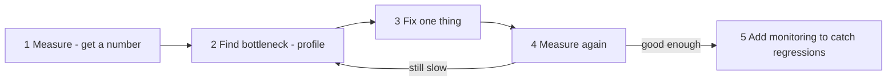
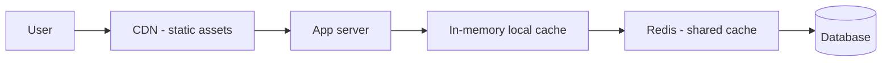

# Performance Optimization — Web, Mobile, and Backend

- **Researched:** 2026-07-29
- **Target:** Software Engineer / Senior Software Engineer interviews (asked live at Bank Mandiri, backend developer round)
- **Sources freshness:** mostly 2025–2026 (React Compiler 1.0, React Native 0.84 + Hermes V1, Core Web Vitals 2026 thresholds)

## TL;DR

- **Always answer in this order: measure → find the bottleneck → fix → measure again.** Interviewers are testing your *method*, not your list of tricks. Jumping straight to solutions is the most common mistake.
- **Web:** the three numbers are **LCP < 2.5s** (loading), **INP < 200ms** (responsiveness), **CLS < 0.1** (visual stability), measured at the 75th percentile of real users.
- **Mobile:** the budget is **16.67ms per frame** for 60fps. Miss it and the user sees jank. Cold start and list scrolling are where most problems live.
- **Backend:** measure **p95/p99, not average** — averages hide the slow tail that real users feel. Most problems are database problems: missing indexes, N+1, and connection pool exhaustion.
- **The single best senior signal:** say *"I'd profile first, because the bottleneck is usually not where people guess."* Then name the specific tool.

---

## 1. The universal method — say this before any specific technique

Every performance question, in any layer, gets the same opening. This structure alone puts you ahead of most candidates.

**Say it like this:**

> "Yang pertama saya lakukan bukan langsung optimasi, tapi mengukur — karena bottleneck seringkali bukan di tempat yang kita duga. Saya cari dulu angkanya: bagian mana yang sebenarnya lambat, dan seberapa lambat. Setelah ketemu, saya perbaiki satu hal dulu, lalu ukur lagi untuk memastikan memang itu penyebabnya. Kalau mengubah banyak hal sekaligus, kita tidak tahu mana yang berpengaruh."

**Three principles worth stating:**

1. **Measure before optimizing.** Optimizing the wrong thing wastes time and adds complexity for nothing.
2. **Optimize the bottleneck, not everything.** If the database takes 900ms of a 1000ms request, making your code twice as fast saves 50ms. Fixing the query saves 800ms.
3. **Percentiles, not averages.** An average of 200ms can hide that 5% of users wait 3 seconds. **p95** means 95% of requests were faster than this number; **p99** is the slowest 1%. Those slow users are often your most active ones — they have the most data.

---

## 2. Web performance

### 2.1 The metrics — Core Web Vitals (2026)

Google's three official metrics. Each is scored at the **75th percentile of real Chrome users over 28 days** — so it's real-user data, not a lab test.

| Metric | What it measures | Good | Needs work | Poor |
|---|---|---|---|---|
| **LCP** — Largest Contentful Paint | How long until the biggest visible element (usually the hero image or headline) has rendered. "Does it feel loaded?" | **≤ 2.5s** | 2.5–4s | > 4s |
| **INP** — Interaction to Next Paint | From a user's tap/click until the screen visibly updates. "Does it feel responsive?" | **≤ 200ms** | 200–500ms | > 500ms |
| **CLS** — Cumulative Layout Shift | How much the layout jumps around while loading. "Does it feel stable?" | **≤ 0.1** | 0.1–0.25 | > 0.25 |

> ⚠️ **Currency check:** INP replaced FID (First Input Delay) as the official responsiveness metric in March 2024. If you mention FID in an interview, you'll sound out of date. INP is stricter because it measures *all* interactions, not just the first one.

**Other useful numbers:** TTFB (Time To First Byte — server responsiveness), FCP (First Contentful Paint — first pixel of content), TBT (Total Blocking Time — the lab proxy for INP).

### 2.2 How to check — the tools

| Tool | What it gives you | When to use |
|---|---|---|
| **Chrome DevTools → Lighthouse** | A lab audit with scores and specific recommendations | First look, quick wins |
| **Chrome DevTools → Performance tab** | A flame chart of exactly what the main thread did, millisecond by millisecond | Finding what's blocking interaction |
| **Chrome DevTools → Network tab** | Waterfall of every request, size, and timing | Finding oversized assets and blocking requests |
| **PageSpeed Insights** | Both lab data and **real user data** (CrUX) | The number Google actually judges you on |
| **Google Search Console → Core Web Vitals** | Real-user data across your whole site, grouped by page type | Finding which pages are bad at scale |
| **React DevTools → Profiler** | Which components re-rendered, how long each took, and *why* | React-specific render problems |
| **Bundle analyzer** (`@next/bundle-analyzer`, `webpack-bundle-analyzer`) | What's actually inside your JavaScript bundle | Finding the huge dependency you forgot about |

**Lab vs field data — a distinction worth mentioning:**
- **Lab** (Lighthouse) — a simulated run on one machine. Reproducible, good for debugging, but not what your users actually experience.
- **Field** (CrUX, Real User Monitoring) — actual measurements from real users on real devices and networks. This is what counts.

> "Lighthouse bagus untuk debugging karena hasilnya konsisten, tapi yang menentukan tetap data pengguna asli — karena user kita banyak yang pakai HP kelas menengah dengan jaringan tidak stabil, bukan laptop kencang."

### 2.3 Solutions — by symptom

#### Slow LCP (page feels slow to load)

| Cause | Fix |
|---|---|
| Huge unoptimized images | Serve **WebP/AVIF**, size them correctly, use `next/image` which does this automatically. Set explicit `width`/`height`. |
| Hero image loads late | **Preload** it (`<link rel="preload">`) and never lazy-load above-the-fold images. |
| Slow server response (high TTFB) | Cache the response, add a CDN, fix the slow database query behind it. |
| Render-blocking CSS/JS | Inline critical CSS, defer the rest, `async`/`defer` on scripts. |
| Slow fonts | `font-display: swap` so text shows immediately, preload the font file, subset to the characters you use. |
| No CDN | Serve static assets from edge locations near the user — a real issue for Indonesia if your origin is overseas. |

#### Poor INP (page feels laggy when tapped)

The cause is almost always **the main thread is busy**. JavaScript is single-threaded: while it's running, nothing can respond.

| Cause | Fix |
|---|---|
| Long JavaScript tasks | Break work into smaller chunks; yield to the browser (`setTimeout`, `scheduler.yield`) |
| Too much JS shipped | **Code splitting** — load only what this page needs. Dynamic `import()` for heavy components. |
| Expensive re-renders | See React section below |
| Heavy computation on every keystroke | **Debounce** input, memoize the calculation, or move it to a **Web Worker** (a separate thread) |
| Huge lists rendered at once | **Virtualization** — only render rows visible on screen |

#### High CLS (layout jumps around)

| Cause | Fix |
|---|---|
| Images without dimensions | Always set `width` and `height` (or `aspect-ratio`) so space is reserved |
| Ads/embeds injected later | Reserve a fixed-size container |
| Web fonts swapping | Preload fonts; use `size-adjust` to match fallback metrics |
| Content inserted above existing content | Insert below, or reserve space |

### 2.4 React-specific (2026)

**The big change: React Compiler reached 1.0 in October 2025.** It auto-memoizes components at build time, which means `useMemo`, `useCallback`, and `React.memo` are largely unnecessary for patterns it recognizes. Teams report roughly **70% fewer unnecessary re-renders** without manual work.

**Current advice:** turn the compiler on, write components naturally, and reach for manual memoization **only when the Profiler shows the compiler missed something**.

**The classic causes of slow React, in order of how often they're the real problem:**

1. **State placed too high in the tree.** One keystroke re-renders the whole page. **Fix: move state closer to where it's used** — this is free and usually the biggest win.
2. **New object/array/function created every render** and passed as a prop, so memoization never helps.
3. **Long lists rendered in full.** Fix with virtualization (`react-window`, TanStack Virtual).
4. **Expensive computation on every render.** Memoize it.
5. **Context provider re-rendering all consumers** because its value is a fresh object each time.

**Next.js specifics:**
- **Server Components** — render on the server, ship no JavaScript for that component. The most effective way to reduce bundle size.
- **Choose the right rendering strategy:** static (SSG) for content that rarely changes, server-rendered (SSR) for personalized data, client-side for interactive dashboards. In banking, most authenticated pages are SSR — you can't cache someone's balance publicly.
- `next/image`, `next/font`, and route-level code splitting are built in.

---

## 3. Mobile performance

### 3.1 The metrics that matter

| Metric | Target | Why |
|---|---|---|
| **Frame budget** | **16.67ms** per frame (60fps); 8.3ms for 120fps | Exceed it and a frame is dropped — the user sees stutter ("jank") |
| **Scroll FPS** | 58+ fps sustained, even on low-end devices | Scrolling is where users notice jank most |
| **Cold start** | Under ~2s | The first impression of the app |
| **Interaction latency** | Under 100ms to first visual feedback | Below this, it feels instant |
| **Memory** | Under ~180MB JS working set for a normal app | Exceeding it causes OS kills on cheap devices |
| **App size** | Smaller is better | Directly affects install rates in markets with limited data |

**Three kinds of startup — know the distinction, it comes up:**
- **Cold start** — process created fresh, nothing cached. The slowest and the one to optimize.
- **Warm start** — process alive, activity recreated.
- **Hot start** — app resumed from background. Should be near-instant.

### 3.2 How to check

**React Native:**
- **Hermes sampling profiler** — built in, shows which JS functions consume time
- **Flipper / React DevTools Profiler** — component render timings
- **Perf Monitor** — live JS and UI thread FPS overlay
- **Sentry / Firebase Performance Monitoring** — real-user data from production, including cold start and slow frames

**Native (Kotlin/Swift — relevant for Bank Mandiri):**
- **Android Studio Profiler** — CPU, memory, network, energy at method-level granularity. **System Tracing** shows Choreographer frame-drop events directly on the timeline — far more actionable than a raw FPS number.
- **Xcode Instruments** — **Time Profiler** for CPU, **Core Animation** for dropped frames, **Allocations** for memory. Apple's frame budget is the same 16.67ms.
- **Android Vitals** (Play Console) and **Xcode Organizer** — real-user metrics from actual installs.

> **Say this:** "Yang saya cari bukan angka FPS rata-rata, tapi frame mana yang lewat dari 16 milidetik dan kenapa. Android Studio System Tracing menunjukkan itu langsung di timeline."

### 3.3 Solutions

#### Slow cold start
- **Do less work at startup.** Move non-essential initialization (analytics, SDKs, preloading) to after the first screen renders, or make it lazy.
- **Hermes bytecode** (React Native) — precompiled bytecode cuts startup **30–50%** versus shipping raw JavaScript. Hermes V1 became the default in RN 0.84 (early 2026), giving roughly **30% less memory** and faster cold starts.
- **Baseline Profiles** (Android) — ship ahead-of-time compilation hints so hot code paths don't need interpreting on first run.
- Avoid heavy work on the main thread during launch; show a skeleton instead of a blank screen.

#### Janky scrolling / dropped frames
- **Use the right list component.** RN: `FlatList`/`FlashList`, never `.map()` over a large array. Android: `RecyclerView`. iOS: `UITableView`/`UICollectionView` with cell reuse.
- **Give the list hints:** `keyExtractor`, stable keys, `getItemLayout` when row height is fixed, `windowSize` and `initialNumToRender` tuned.
- **Keep row components cheap.** No heavy computation, no inline function/object creation inside `renderItem`.
- **Move animations off the JS thread.** `useNativeDriver: true`, or Reanimated, which runs on the UI thread.
- **Flatten deep view hierarchies** — every nesting level costs layout time.

#### Large app size / slow on cheap devices
- Compress and correctly size images; use vector assets where possible.
- Remove unused dependencies — check what's actually in the bundle.
- Android App Bundle so users download only the resources for their device.
- **Test on a real low-end device, not just the simulator.** This is worth saying out loud — it shows you think about actual users, not the developer's iPhone.

#### Network on poor connections (very relevant for Indonesia)
- **Cache aggressively** and show cached data immediately while refreshing in the background.
- **Paginate** instead of loading everything.
- **Shrink payloads** — ask the API for only the fields you need (a genuine GraphQL advantage).
- **Handle offline gracefully** — queue actions and retry when the connection returns.
- Retry with **exponential backoff**, never a tight retry loop that drains battery.

---

## 4. Backend performance

### 4.1 The metrics

| Metric | What it means |
|---|---|
| **Latency p50 / p95 / p99** | How long requests take. p99 = the slowest 1%. **Always quote percentiles, never averages.** |
| **Throughput** (RPS/TPS) | Requests handled per second |
| **Error rate** | Percentage of failed requests — a system that's fast because it's failing isn't fast |
| **Saturation** | How full the resources are: CPU, memory, connection pool, queue depth |

> **Why percentiles matter — say this:** "Rata-rata itu menyesatkan. Kalau rata-rata 200ms tapi p99-nya 3 detik, artinya 1% user menunggu 3 detik — dan biasanya justru user yang paling aktif, karena datanya paling banyak. Jadi saya selalu lihat p95 dan p99."

**The four golden signals** (a good framework to name): **latency, traffic, errors, saturation**.

### 4.2 How to check

| Tool type | Examples | What it tells you |
|---|---|---|
| **APM / tracing** | Sentry, Datadog, New Relic, OpenTelemetry | Which endpoint is slow, and **which span inside it** — the DB call, the external API, or your code |
| **Distributed tracing** | OpenTelemetry, Jaeger | Follows one request across multiple services — essential in microservices |
| **Database query stats** | `pg_stat_statements` (PostgreSQL) | Historical view: which queries consume the most total time |
| **Query plan** | `EXPLAIN ANALYZE` | What the database actually did for one specific query |
| **Live activity** | `pg_stat_activity` | What's running *right now*, including blocked queries |
| **Profiler** | Java Flight Recorder, async-profiler, Node `--prof`/clinic.js | CPU and memory hot spots at code level |
| **Load testing** | k6, JMeter, Gatling | How the system behaves under load *before* production finds out |

**The PostgreSQL workflow — worth memorizing, it's a common interview answer:**

1. **`pg_stat_statements`** → find the queries with the highest *total* time (a 50ms query called 10,000 times is worse than a 2s query called twice).
2. **`EXPLAIN ANALYZE`** on the worst one → see the real plan and timings. Use `EXPLAIN (ANALYZE, BUFFERS)` for real diagnostics.
3. **Look for `Seq Scan` on a big table** where you expected an index. Also compare **estimated vs actual rows** — a big mismatch means the statistics are stale (run `ANALYZE`).
4. **Add the index**, re-run `EXPLAIN ANALYZE`, confirm it became an `Index Scan` and the time dropped.

> ⚠️ Use `ANALYZE` carefully — it actually executes the query. For `UPDATE`/`DELETE`, wrap it in a transaction and roll back.

### 4.3 Solutions — ordered by how often they're the real problem

#### 1. Database (the most common cause by far)

| Problem | How you spot it | Fix |
|---|---|---|
| **Missing index** | `Seq Scan` on a large table in `EXPLAIN` | Add an index on the filtered/joined column. **Cost:** every write must update it too — don't index blindly. |
| **N+1 queries** | One list request produces hundreds of nearly identical queries in the trace | Batch/eager-load: `JOIN`, `IN (...)`, DataLoader in GraphQL, `JOIN FETCH` in JPA |
| **Selecting too much** | Large result payloads, high I/O | `SELECT` only needed columns; paginate; avoid `SELECT *` |
| **Connection pool exhaustion** | Requests queue and time out while the DB looks idle | Size the pool correctly (HikariCP in Spring Boot); find connection leaks; keep transactions short |
| **Long transactions / lock contention** | Queries blocked in `pg_stat_activity` | Keep transactions short; don't call external APIs inside a transaction |
| **Stale statistics** | Estimated rows wildly different from actual | Run `ANALYZE`; check autovacuum is healthy |

**Pagination gotcha worth mentioning:** `OFFSET 100000` still scans and discards 100,000 rows. **Keyset pagination** (`WHERE id > last_seen_id ORDER BY id LIMIT 20`) stays fast at any depth.

#### 2. Caching

Where to cache, from cheapest to most expensive to get right:

**Cache-aside** is the standard pattern: check cache → on miss, read the database → write it back to cache with a TTL.

**The tradeoffs you must raise (this is the senior part):**
- **Staleness.** A cache is a copy; it can be wrong. **In banking, never cache a balance right after a transaction.** Cache what tolerates being slightly old: config, product lists, exchange rates.
- **Invalidation.** Deleting the entry when data changes. Harder than TTL but necessary for correctness-critical data.
- **Cache stampede / thundering herd.** A popular key expires and hundreds of requests hit the database at the same instant. Fixes: **TTL jitter** (randomize expiry so keys don't all die together), **request coalescing / singleflight** (only one request rebuilds it, the rest wait), **probabilistic early expiration**.
- **Never let the cache be the source of truth.** If Redis dies, the system should get slower, not fail.

#### 3. Application code

- **Do work in parallel** when calls are independent — `Promise.all` instead of sequential `await`, or `CompletableFuture` in Java. This is often the single biggest easy win in an endpoint that calls three services.
- **Move slow work out of the request.** If the user doesn't need the result now (emails, reports, syncing), push it to a **queue** (RabbitMQ) and return immediately.
- **Stream large responses** instead of building them fully in memory.
- **Fix inefficient algorithms** — nested loops over large collections, repeated work inside loops.

#### 4. JVM / runtime (Java-specific, relevant to Bank Mandiri)

- **G1GC** is the safe default for most Spring Boot APIs — predictable pause times. **ZGC** or **Shenandoah** when latency predictability matters more than throughput.
- **Heap sizing:** an undersized heap makes the JVM fight garbage collection during startup, which fails health checks and breaks autoscaling.
- **HikariCP** is Spring Boot's default connection pool and is fast — but the defaults may not match your load.
- **Watch Metaspace** — Spring Boot's dependencies and embedded server consume a lot; misconfiguration causes OOM or constant GC.
- **The principle to state:** *"JVM tuning without measurement is gambling. Change one variable at a time and validate."*

#### 5. Architecture-level

- **Horizontal scaling** — more instances behind a load balancer. Requires **stateless** services (sessions in Redis, not in server memory).
- **Read replicas** — send read queries to copies of the database. Caveat: **replication lag** means a read right after a write may return old data.
- **Async processing** — queues for anything the user isn't waiting on.
- **Circuit breaker** — stop calling a failing dependency for a while so requests don't pile up and take your service down with it.
- **Timeouts on every external call.** A missing timeout is how one slow dependency freezes an entire service.

---

## 5. How to answer this in an interview

### The structure

1. **Ask what "slow" means.** "Slow di bagian mana — loading awal, atau waktu dipakai? Dan seberapa lambat, ada angkanya?" This alone signals seniority.
2. **State the method:** measure → find the bottleneck → fix one thing → measure again.
3. **Name the specific tool** you'd use for that layer.
4. **Give the likely causes in order of probability**, not a random list.
5. **End with the tradeoff.**

### Model answer — "Bagaimana Anda meningkatkan performa aplikasi?"

> "Pertama saya klarifikasi dulu lambatnya di mana — karena penanganannya beda. Kalau lambat waktu pertama dibuka, itu masalah loading. Kalau lambat waktu dipakai, itu masalah responsiveness. Dan saya perlu angkanya, bukan sekadar 'terasa lambat'.
>
> Setelah itu saya ukur. Untuk web saya lihat Core Web Vitals — LCP untuk loading, INP untuk responsiveness — pakai Lighthouse untuk debugging dan data pengguna asli untuk menilai. Untuk backend saya lihat p95 dan p99, bukan rata-rata, karena rata-rata menyembunyikan user yang paling menderita.
>
> Dari pengalaman saya, di backend penyebabnya hampir selalu database: index yang kurang, N+1 query, atau connection pool yang habis. Jadi saya cek dulu ke sana — pakai pg_stat_statements untuk lihat query mana yang paling makan waktu total, lalu EXPLAIN ANALYZE untuk lihat rencana eksekusinya.
>
> Yang saya hindari: mengoptimasi tanpa mengukur. Kalau database memakan 900ms dari total 1 detik, mempercepat kode aplikasi dua kali lipat cuma menghemat 50ms. Yang harus diperbaiki query-nya."

### If they ask specifically about your experience

Anchor it in something real rather than theory:

> "Contoh konkret dari yang saya kerjakan: di GraphQL, masalah paling sering muncul adalah N+1 — satu query untuk daftar, lalu satu query lagi per item. Kelihatan di trace sebagai ratusan query mirip. Solusinya batching pakai DataLoader: kumpulkan semua ID dulu, ambil sekaligus dalam satu query. Itu memangkas ratusan query jadi dua."

---

## 6. Cheatsheet — quick recall

**The method (say this first, every time):**
Measure → find bottleneck → fix one thing → measure again.

**Web — the three numbers:**
| LCP ≤ 2.5s | INP ≤ 200ms | CLS ≤ 0.1 |

*(INP replaced FID in March 2024 — don't say FID.)*

**Mobile — the budget:** 16.67ms per frame for 60fps.

**Backend — the rule:** p95/p99, never averages.

**Tools by layer:**
- Web → Lighthouse, DevTools Performance, React Profiler, bundle analyzer
- Mobile → Hermes profiler, Android Studio System Tracing, Xcode Instruments
- Backend → APM/tracing, `pg_stat_statements`, `EXPLAIN ANALYZE`, load testing

**Top 3 backend causes, in order:**
1. Database — missing index, N+1, connection pool
2. Missing cache, or cache used wrongly
3. Sequential calls that could run in parallel

**Top 3 web causes:**
1. Too much JavaScript (bundle size, main-thread blocking)
2. Unoptimized images
3. Unnecessary re-renders

**Top 3 mobile causes:**
1. Too much work at startup
2. Rendering long lists without virtualization
3. Animations running on the JS thread instead of the UI thread

**Tradeoffs to name (this is what makes you sound senior):**
- Index → faster reads, slower writes
- Cache → faster, but stale data risk; never the source of truth
- Read replica → scales reads, but replication lag
- Denormalization → faster reads, harder consistency
- Memoization → fewer renders, more memory and complexity

**Never say:** "I'd just add caching" without saying what could go stale.

---

## 7. Sources

**Web**
- [What Are the Core Web Vitals? LCP, INP & CLS Explained (2026)](https://www.corewebvitals.io/core-web-vitals) — thresholds, 75th percentile / 28-day measurement
- [Core Web Vitals 2026: INP, LCP & CLS Thresholds](https://webhelpagency.com/blog/core-web-vitals-2026/) — current rating bands
- [Core Web Vitals in 2026: What LCP, INP, and CLS Mean and How to Fix Them — ToolsPivot](https://toolspivot.com/blog/core-web-vitals-guide) — fixes by metric

**React**
- [React Compiler Deep Dive: How Automatic Memoization Eliminates 90% of Performance Optimization Work — DEV](https://dev.to/pockit_tools/react-compiler-deep-dive-how-automatic-memoization-eliminates-90-of-performance-optimization-work-1351) — Compiler 1.0 (Oct 2025), ~70% fewer re-renders
- [React Profiler Guide: Find Performance Bottlenecks (2026) — Crosscheck](https://crosscheck.cloud/blogs/react-profiler-guide-finding-performance-bottlenecks/) — how to read the Profiler
- [React Performance Optimization 2026: Advanced Techniques — Softaims](https://softaims.com/blog/react-performance-optimization-advanced-2026) — current guidance on manual memoization

**Mobile**
- [React Native Performance Optimization: The 2026 Playbook — RapidNative](https://www.rapidnative.com/blogs/react-native-performance-optimization-2026-playbook) — FPS, latency, and memory targets
- [Hermes V1 by Default in React Native 0.84 — TO THE NEW](https://www.tothenew.com/blog/hermes-v1-by-default-in-react-native-0-84-the-biggest-performance-win-of-2026/) — 30% less memory, faster cold start
- [Overview of measuring app performance — Android Developers](https://developer.android.com/topic/performance/measuring-performance) — official Android measurement guidance
- [How to Reduce App Startup Time on Android, iOS & Flutter: The Complete 2026 Guide — Digia](https://www.digia.tech/post/app-startup-time-performance-guide/) — cold/warm/hot start
- [Mobile app performance testing: Complete guide — Netguru](https://www.netguru.com/blog/mobile-app-performance-testing) — Android Profiler, Xcode Instruments, 16.67ms frame budget

**Backend & database**
- [How to Read and Optimize Slow Queries with EXPLAIN ANALYZE — OneUptime](https://oneuptime.com/blog/post/2026-01-25-explain-analyze-postgresql/view) — plan reading, BUFFERS, estimated vs actual rows
- [Identify PostgreSQL slow queries with pg_stat_statements — Aiven](https://aiven.io/docs/products/postgresql/howto/identify-pg-slow-queries) — finding top queries by total time
- [PostgreSQL slow queries — 7 ways to find and fix bottlenecks — DEV](https://dev.to/piteradyson/postgresql-slow-queries-7-ways-to-find-and-fix-performance-bottlenecks-2app) — systematic workflow
- [What is P99 latency? (2026 Guide) — SRE School](https://sreschool.com/blog/p99-latency/) — percentiles and tail latency
- [Application Performance Monitoring: The 2026 Guide — Augment Code](https://www.augmentcode.com/guides/application-performance-monitoring) — OpenTelemetry, continuous profiling
- [How to Optimize API Response Times — OneUptime](https://oneuptime.com/blog/post/2026-01-27-optimize-api-response-times/view) — common API bottlenecks
- [JVM & GC Tuning for Spring Boot in Production (2026 Guide) — JavaGuides](https://medium.com/javaguides/jvm-gc-tuning-for-spring-boot-in-production-2026-guide-b75b46c88e9a) — G1GC default, heap sizing, HikariCP

**Caching**
- [How to tame the thundering herd problem — Redis](https://redis.io/blog/how-to-tame-the-thundering-herd-problem/) — official guidance on stampede
- [How to Handle Cache Stampede (Thundering Herd) in Redis — OneUptime](https://oneuptime.com/blog/post/2026-01-21-redis-cache-stampede/view) — TTL jitter, coalescing, early expiration
- [Advanced Caching Strategies: Redis, CDNs, and Cache Invalidation at Scale — AverageDevs](https://www.averagedevs.com/blog/caching-strategies-redis-cdn) — layered caching

**Related workspace notes:** [Bank Mandiri backend technical](bank-mandiri/bank-mandiri-backend-developer-technical-interview.md) · [Team Lead round](bank-mandiri/bank-mandiri-ddl-round3-team-lead.md) · [PostgreSQL queries guide](postgresql-queries-interview-guide.md) · [React interview guide](react-js-frontend-interview-guide.md) · [React Native guide](react-native-interview-guide.md)
