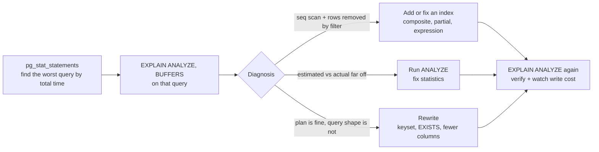

# PostgreSQL Queries — Interview Guide (Joins, Indexing, EXPLAIN, Transactions + Advanced)

- **Researched:** 2026-07-07
- **Target:** Software Engineer / Senior Software Engineer (full stack, Prisma + Hasura + PostgreSQL in production)
- **Sources freshness:** 2024–2026 (PostgreSQL 18 is current stable; 19 is in beta)
- **Practice playground:** `examples/postgres-practice/` — run the real queries against 100k seeded rows.
- **Personal context:** this note exists because of mock-interview Q4 (2026-07-07). The wrong answer was "the indexes are missing DESC." The right answer is in [The composite index rule](#the-composite-index-rule--the-burn-topic). Read that section until you can say it cold.

## TL;DR

- Two single-column indexes can never serve a two-column sort. `ORDER BY a DESC, b DESC` needs ONE composite index `(a, b)` — and a plain ASC one works, because B-trees scan backward.
- Always verify with `EXPLAIN (ANALYZE, BUFFERS)`. Look for: scan type, Sort nodes, estimated vs actual rows, and Buffers.
- `LEFT JOIN` + `WHERE right.col = x` silently becomes an INNER JOIN. Put right-table filters in `ON`.
- Window functions are now treated like joins — expected, not advanced. Know `ROW_NUMBER` vs `RANK` vs `DENSE_RANK` and `DISTINCT ON` cold.
- The slow-query workflow to recite: pg_stat_statements → EXPLAIN ANALYZE → index or rewrite → EXPLAIN ANALYZE again to verify.

## Key Concepts — Part 1: Interview Fundamentals

### Joins, properly

Mini dataset used below. Two tables from your real system:

**stores**

| id | name |
|----|------|
| 1  | Toko Jaya |
| 2  | Toko Baru |
| 3  | Toko Lama |

**orders**

| id  | store_id | status    |
|-----|----------|-----------|
| 101 | 1        | PAID      |
| 102 | 1        | CANCELLED |
| 103 | 2        | PAID      |

A join matches rows from two tables on a condition. The join *type* decides what happens to rows with no match.

```sql
SELECT s.name, o.id, o.status
FROM stores s
INNER JOIN orders o ON o.store_id = s.id;
```

- **INNER JOIN** — keep only matched pairs. Result: 3 rows. Toko Lama disappears (no orders).
- **LEFT JOIN** — keep every left row. Unmatched left rows get NULLs on the right side. Result: 4 rows. Toko Lama appears once, with `o.id = NULL`.
- **RIGHT JOIN** — same idea, mirrored. Rarely written; people swap table order and use LEFT.
- **FULL JOIN** — keep unmatched rows from both sides. Used for reconciliation ("what exists in A but not B, and vice versa").

Analogy: INNER is a guest list crossed with RSVPs — only people who did both. LEFT is the full guest list, with blanks where nobody replied.

**In Prisma/Hasura this is:** Prisma `include: { orders: true }` (LEFT-join semantics; by default Prisma runs separate queries, or one LATERAL join with `relationLoadStrategy: 'join'`). Hasura nested queries compile to LATERAL joins with `json_agg`.

#### The trap: LEFT JOIN + WHERE on the right table

Problem: you want all stores, plus their PAID orders if any.

```sql
-- WRONG: this is secretly an INNER JOIN
SELECT s.name, o.id
FROM stores s
LEFT JOIN orders o ON o.store_id = s.id
WHERE o.status = 'PAID';
```

Why it breaks: for Toko Lama, `o.status` is NULL. `NULL = 'PAID'` is not true. The WHERE removes the row. The LEFT JOIN's whole point is undone.

Fix: filter the right table inside `ON`.

```sql
-- RIGHT: all stores kept, orders filtered
SELECT s.name, o.id
FROM stores s
LEFT JOIN orders o ON o.store_id = s.id AND o.status = 'PAID';
```

Rule to memorize: **ON filters before the join keeps unmatched rows. WHERE filters after — and NULLs never pass a WHERE.**

#### Semi-join and anti-join: EXISTS, IN, NOT EXISTS

Problem: "which stores have at least one order?" A JOIN gives Toko Jaya **twice** (two orders). You do not want the duplicates — you want a yes/no per store. That is a **semi-join**.

```sql
-- Semi-join: no duplicates, stops at the first match
SELECT s.name FROM stores s
WHERE EXISTS (SELECT 1 FROM orders o WHERE o.store_id = s.id);

-- IN works too for this shape
SELECT s.name FROM stores s
WHERE s.id IN (SELECT store_id FROM orders);
```

When to use which:

- **EXISTS** — the default for "has at least one related row." Reads as intent. Safe with NULLs.
- **IN** — fine for small literal lists (`status IN ('PAID','SHIPPED')`) and simple subqueries. The planner treats `IN (subquery)` and `EXISTS` similarly in modern Postgres.
- **JOIN** — when you actually need columns from the other table. If you JOIN then DISTINCT just to dedupe, you wanted EXISTS.
- **Trap: `NOT IN` with NULLs.** If the subquery returns a single NULL, `NOT IN` returns zero rows, silently. Always prefer `NOT EXISTS`.

**Anti-join** — "stores with NO orders":

```sql
-- Preferred
SELECT s.name FROM stores s
WHERE NOT EXISTS (SELECT 1 FROM orders o WHERE o.store_id = s.id);

-- Equivalent classic form
SELECT s.name FROM stores s
LEFT JOIN orders o ON o.store_id = s.id
WHERE o.id IS NULL;
```

**In Prisma/Hasura this is:** Prisma `where: { orders: { some: {...} } }` compiles to EXISTS; `none` compiles to NOT EXISTS. Hasura's `_exists` and relationship filters do the same.

### Aggregation: GROUP BY, HAVING, FILTER, COUNT

GROUP BY collapses rows into one row per group. Aggregate functions (COUNT, SUM, AVG, MAX) summarize each group.

- **WHERE vs HAVING:** WHERE filters *rows before* grouping. HAVING filters *groups after*. "Only PAID orders" → WHERE. "Only stores with more than 10 orders" → HAVING.
- **FILTER** — a per-aggregate WHERE. Cleaner than `SUM(CASE WHEN ...)`.
- **COUNT(\*) vs COUNT(col):** `COUNT(*)` counts rows. `COUNT(col)` counts rows where col is NOT NULL. `COUNT(DISTINCT col)` counts unique values. On a LEFT JOIN, `COUNT(o.id)` correctly gives 0 for stores with no orders; `COUNT(*)` would give 1.

```sql
SELECT s.city,
       COUNT(o.id)                                   AS orders,
       COUNT(*) FILTER (WHERE o.status = 'PAID')     AS paid,
       COUNT(*) FILTER (WHERE o.status = 'CANCELLED') AS cancelled
FROM stores s
LEFT JOIN orders o ON o.store_id = s.id
GROUP BY s.city
HAVING COUNT(o.id) > 100;
```

**In Prisma/Hasura this is:** Prisma `groupBy` + `_count`/`_sum` with `having`; Hasura exposes `<table>_aggregate` fields.

### Subqueries vs CTEs (WITH)

A **CTE** ("common table expression", the `WITH` clause) is a named subquery. Use it to give steps names and read top-to-bottom.

```sql
WITH paid AS (
  SELECT store_id, SUM(total_cents) AS revenue
  FROM orders WHERE status = 'PAID'
  GROUP BY store_id
)
SELECT s.name, p.revenue
FROM paid p JOIN stores s ON s.id = p.store_id
ORDER BY p.revenue DESC LIMIT 10;
```

The fact interviewers check (it dates you if you get it wrong): before Postgres 12 (2019), every CTE was an **optimization fence** — Postgres computed it fully and could not push filters into it. **Since PG12, CTEs referenced once are inlined** and optimized like subqueries. You can force behavior with `WITH x AS MATERIALIZED (...)` (compute once, e.g. to reuse an expensive result) or `NOT MATERIALIZED`.

**In Prisma/Hasura this is:** neither generates CTEs for you — this is `$queryRaw` / Hasura SQL-function territory. Good place to mention you drop to raw SQL when it wins.

### Indexing — deep and clear (the burn topic)

#### How a B-tree actually works

Problem: without an index, finding one row means reading the whole table (a **sequential scan** — Postgres reads every page and checks every row).

A **B-tree index** is a separate structure that stores the indexed values **in sorted order**, in a shallow tree, with a pointer from each value to its table row. Analogy: the index at the back of a book — topics sorted alphabetically, each with a page number. You don't read the book to find "webhooks"; you jump.

Because it is sorted, a B-tree answers three things fast:

1. Equality: `WHERE store_id = 42` — walk down the tree, 3–4 page reads even with 100M rows.
2. Ranges: `WHERE created_at > now() - interval '7 days'` — find the start, read rightward.
3. **Order:** `ORDER BY created_at LIMIT 10` — the index is already sorted; read 10 entries, done, no Sort step.

Point 3 is the one that failed you in the mock. Indexes are not just for finding rows — they are for **avoiding sorts**.

#### Composite indexes and the leftmost prefix rule

A **composite index** is one index over multiple columns: `(a, b)`. It sorts by `a` first, then by `b` **within equal values of `a`**. Analogy: a phone book sorted by (last name, first name). All the Tans together, and within the Tans, sorted by first name.

The **leftmost prefix rule**: the index is only useful if the query constrains the leading columns. Index `(a, b, c)` serves:

- `WHERE a = ?`
- `WHERE a = ? AND b = ?` (and `AND c = ?`)
- `WHERE a = ? ORDER BY b` — equality on the prefix, then the index is sorted by what remains
- **not** `WHERE b = ?` alone — like asking the phone book for everyone named "John": the sorting doesn't help. (PG18's skip scan softens this — see What's Current.)

Practical ordering rule: **equality columns first, then the range or sort column.** For "orders of one store, newest first":

```sql
CREATE INDEX idx_orders_store_created ON orders (store_id, created_at);
-- serves: WHERE store_id = ? ORDER BY created_at DESC LIMIT 10  (backward scan, no sort)
```

**In Prisma/Hasura this is:** Prisma `@@index([storeId, createdAt(sort: Desc)])` in the schema; Hasura — you add indexes with a migration, Hasura doesn't manage them.

#### Backward index scans — why DESC rarely matters

A B-tree's entries are linked in both directions. Postgres can read any index forward or backward. So:

- Single column: index `(created_at)` serves both `ORDER BY created_at ASC` and `ORDER BY created_at DESC`. The plan says `Index Scan Backward`. **You never need a DESC single-column index.**
- Multi column, same direction: index `(tenor, plafon)` read backward yields `tenor DESC, plafon DESC`. Backward reverses **everything at once**.
- Multi column, **mixed** directions: `ORDER BY tenor DESC, plafon ASC` cannot be produced by reading `(tenor, plafon)` in either direction. Only now do you need directions in the definition: `(tenor DESC, plafon ASC)`.

#### The composite index rule — the burn topic

The mock question, replayed correctly. Query:

```sql
SELECT * FROM credit_products
ORDER BY tenor DESC, plafon DESC
LIMIT 1;
```

Existing indexes: one on `(tenor)`, one on `(plafon)`. Do they serve this query? **No — and not because DESC is missing.**

- The query needs rows in one combined order: by tenor, and by plafon *within equal tenors*.
- The `(tenor)` index knows nothing about plafon order inside a tenor group. The `(plafon)` index is irrelevant to the leading sort. Postgres cannot stitch two B-trees into one two-column ordering. So it must fetch rows and add a **Sort** step — with `LIMIT 1` it's a top-N sort over every row.
- Adding DESC to the single-column indexes fixes nothing. The problem is *two indexes*, not *direction*.
- The fix is one composite index. A plain `(tenor, plafon)` already works — Postgres scans it backward and the plan reads `Index Scan Backward ... Limit (rows=1)`: it reads exactly one index entry. Writing `(tenor DESC, plafon DESC)` is equivalent; it only *has* to be explicit when directions mix.

```sql
CREATE INDEX idx_credit_tenor_plafon ON credit_products (tenor DESC, plafon DESC);
-- verify:
EXPLAIN ANALYZE SELECT * FROM credit_products ORDER BY tenor DESC, plafon DESC LIMIT 1;
-- want: Index Scan Backward (or forward on the DESC index), no Sort node
```

The sentence to say in an interview: *"Two single-column indexes can't serve a multi-column sort — I'd add one composite index on (tenor, plafon); direction doesn't even matter here because B-trees scan backward. Then I'd verify with EXPLAIN ANALYZE that the Sort node is gone."*

#### Covering indexes (INCLUDE)

Problem: even after an index finds the rows, Postgres visits the table (the "heap") to fetch the other columns. That heap trip costs I/O.

A **covering index** carries extra columns as payload so the query is answered from the index alone — an **Index Only Scan**:

```sql
CREATE INDEX idx_orders_store_created_inc
  ON orders (store_id, created_at) INCLUDE (status, total_cents);
```

INCLUDE columns are stored but not sorted — they can't be searched, only returned. Caveat: index-only scans depend on the **visibility map** being fresh, so recently updated rows still cause heap visits until vacuum runs.

#### Partial indexes

Problem: you only ever query a slice of the table, but the index carries every row.

A **partial index** has a WHERE clause and only indexes matching rows — smaller, faster, cheaper to maintain:

```sql
CREATE INDEX idx_orders_pending ON orders (created_at) WHERE status = 'PENDING';
CREATE INDEX idx_stores_active ON stores (name) WHERE deleted_at IS NULL;
```

Queries must repeat the WHERE condition to use it. Great for soft deletes, queues, "active only" lookups.

#### Expression indexes

Problem: `WHERE lower(email) = lower($1)` can't use an index on `email` — the function hides the column from the B-tree.

An **expression index** indexes the *result of an expression*:

```sql
CREATE UNIQUE INDEX idx_users_email_lower ON users (lower(email));
```

Same idea applies to `date_trunc('day', created_at)` or JSONB extracts.

#### When indexes DON'T help

- **Low selectivity** — "selectivity" means what fraction of rows a condition matches. `WHERE status = 'PAID'` matching 40% of rows: the planner rightly ignores the index. Jumping index→heap per row is slower than one sequential read. Rule of thumb: an index earns its keep when the query returns under roughly 5–10% of the table.
- **Small tables** — a few hundred rows fit in a couple of pages; a seq scan is already the fast path.
- **Leading-wildcard LIKE** — `LIKE '%jaya%'` has no prefix to descend the sorted tree with. Fix: trigram index (`pg_trgm` extension + GIN) or real full-text search.
- **Wrapped columns** — any function or cast around the column (`lower(email)`, `created_at::date`) disables plain indexes; use an expression index.
- **The write cost** — every INSERT/UPDATE/DELETE must also update *every index* on the table. Indexes are a tax on writes to subsidize reads. Unused indexes are pure tax: find them with `pg_stat_user_indexes` (`idx_scan = 0`) and drop them.

### EXPLAIN ANALYZE — how to actually read it

Definitions first:

- **EXPLAIN** shows the planner's *guess*: the plan and estimated costs. The query does not run.
- **EXPLAIN ANALYZE** *runs the query* and shows the plan with real times and real row counts. (Careful: it really executes — wrap data-modifying statements in `BEGIN; ... ROLLBACK;`.)
- **BUFFERS** adds how many 8KB pages were read from cache (`hit`) vs disk (`read`). In PG18 this is on by default with ANALYZE; before that, write `EXPLAIN (ANALYZE, BUFFERS)`.

Read the plan **inner-most node first** (deepest indentation runs first).

Annotated example — the "orders of store 42, newest first" query with no useful index:

```
EXPLAIN (ANALYZE, BUFFERS)
SELECT * FROM orders WHERE store_id = 42 ORDER BY created_at DESC LIMIT 10;

Limit (cost=2745.94..2745.96 rows=10 width=45)
      (actual time=21.343..21.345 rows=10 loops=1)
  ->  Sort (cost=2745.94..2746.19 rows=101 width=45)          ← a Sort node = the index is NOT serving the ORDER BY
        Sort Key: created_at DESC
        Sort Method: top-N heapsort  Memory: 26kB              ← sort fit in work_mem; "external merge Disk" = spilled
        ->  Seq Scan on orders (cost=0.00..2743.00 rows=101 width=45)   ← read the WHOLE table
              (actual time=0.012..21.201 rows=98 loops=1)      ← estimated 101 rows, got 98: estimate is GOOD
              Filter: (store_id = 42)
              Rows Removed by Filter: 99902                    ← 99,902 rows read and thrown away = wasted I/O
              Buffers: shared hit=1743                         ← 1743 pages touched, all from cache
Planning Time: 0.108 ms
Execution Time: 21.371 ms
```

How to read each part:

- **cost=startup..total** — the planner's estimate in abstract units (not ms). Only useful for comparing plans.
- **actual time=start..end** — real milliseconds. Multiply by `loops` if loops > 1.
- **rows estimated vs actual** — *the* health check. Off by 10–100×? The planner is flying blind → it picks bad join strategies. Fix: run `ANALYZE orders;` (refreshes statistics), or raise the statistics target for skewed columns. Bad estimates → bad plans.
- **Rows Removed by Filter** — pure waste. Big number = missing index.
- **Buffers** — `hit` = from shared memory cache, `read` = from disk. Huge buffer counts explain "why is this slow even though the plan looks fine."

After `CREATE INDEX ON orders (store_id, created_at);` the same query plans as:

```
Limit (actual time=0.030..0.056 rows=10 loops=1)
  ->  Index Scan Backward using idx_orders_store_created on orders
        Index Cond: (store_id = 42)
        Buffers: shared hit=13
Execution Time: 0.078 ms                                        ← 21 ms → 0.08 ms, 1743 pages → 13
```

No Sort node, `Index Scan Backward` handles the DESC, 10 rows read instead of 100k. This before/after is exercise 4–5 in the playground.

**Scan types, one line each:**

- **Seq Scan** — read the whole table. Right choice for big fractions or small tables; a smell when filtering to few rows.
- **Index Scan** — walk the index, jump to the heap per matching row. Best for few rows.
- **Index Only Scan** — answer entirely from the index (covering index + fresh visibility map). Fastest.
- **Bitmap Index/Heap Scan** — the middle ground: collect all matching row locations from the index first, sort by physical location, then read the heap sequentially. Chosen for "medium" selectivity or to combine two indexes with AND/OR — note: combining two bitmaps helps *filtering*, never *sorting*.

**Join algorithms, one line each (the planner picks — you just explain the choice):**

- **Nested Loop** — for each outer row, probe the inner side. Wins when the outer side is small and the inner probe hits an index. Deadly when both sides are big and unindexed.
- **Hash Join** — build a hash table on the smaller side, stream the bigger side through it. The workhorse for large equality joins.
- **Merge Join** — both sides sorted, zip them together. Wins when inputs are already sorted (indexes) or for huge joins.

### Transactions and isolation

A **transaction** is a group of statements that commits or rolls back as one. The guarantees are ACID: **A**tomic (all or nothing), **C**onsistent (constraints hold), **I**solated (concurrent transactions don't trample each other — *to a configurable degree*), **D**urable (committed = survives a crash).

"Isolation level" = how much concurrent transactions can see of each other. Postgres levels, each with its anomaly:

- **READ COMMITTED (the default).** Every *statement* sees a fresh snapshot of committed data. Anomaly: **non-repeatable read** — and, worse in practice, the **lost update**: two handlers both read `points = 100`, both compute `100 + 50`, both write `150`. One update vanished. This is exactly the TADA double-refund race.
- **REPEATABLE READ.** One snapshot for the *whole transaction* — re-reading gives the same answer. If two RR transactions update the same row, the second gets a serialization error and must retry. Anomaly still possible: **write skew** — two transactions each read a condition, both act, and the *combination* violates the rule (e.g., two admins each check "store has under 3 active promos", both insert a promo → 4 promos).
- **SERIALIZABLE.** The outcome is as if transactions ran one at a time. Postgres detects dangerous patterns (including write skew) and aborts one transaction with error `40001` — your code **must retry**. Strongest, costs some throughput and retry logic.

**Row locking — `SELECT ... FOR UPDATE`.** Locks the selected rows until commit; a concurrent transaction that also selects them FOR UPDATE *waits*, then sees the committed result. This turns check-then-act into a safe sequence. It is exactly how the TADA double-refund was fixed: lock the store row, *then* check "already refunded?", then write — the duplicate handler blocks, re-checks, and stops.

```sql
BEGIN;
SELECT points FROM stores WHERE id = $1 FOR UPDATE;  -- concurrent handler waits HERE
-- check + update, safe from races
COMMIT;
```

**Deadlocks in one paragraph.** Transaction A locks row 1 then wants row 2; transaction B locks row 2 then wants row 1. Both wait forever — except Postgres detects the cycle after `deadlock_timeout` (1s) and kills one with an error. Prevention: lock rows in a **consistent order** (e.g., always by ascending id), keep transactions short, and treat a deadlock error as a retry signal, not a crash.

**In Prisma/Hasura this is:** `prisma.$transaction(async (tx) => {...}, { isolationLevel: 'Serializable' })`; FOR UPDATE requires `tx.$queryRaw`. Hasura runs each mutation in a transaction; multi-step logic with locks belongs in a Postgres function or your own service.

## Key Concepts — Part 2: Advanced / Real Production Life

### Window functions — the #1 "advanced" interview topic (no longer optional)

Problem: GROUP BY collapses rows — you lose the detail. A **window function** computes an aggregate *alongside* each row, without collapsing. `OVER (PARTITION BY x ORDER BY y)` defines the "window": partition = which rows belong together, order = how to number/accumulate them.

**ROW_NUMBER vs RANK vs DENSE_RANK** — one table, values 300, 300, 200:

| total | ROW_NUMBER | RANK | DENSE_RANK |
|-------|-----------|------|------------|
| 300   | 1         | 1    | 1          |
| 300   | 2         | 1    | 1          |
| 200   | 3         | 3    | 2          |

- ROW_NUMBER: unique numbers, ties broken arbitrarily.
- RANK: ties share a rank, then it **skips** (1, 1, 3) — Olympic medals.
- DENSE_RANK: ties share, **no gaps** (1, 1, 2) — price tiers.

**Latest order per store** — the classic. Two Postgres ways:

```sql
-- Way 1: ROW_NUMBER (portable SQL)
SELECT * FROM (
  SELECT o.*, ROW_NUMBER() OVER (PARTITION BY store_id ORDER BY created_at DESC) AS rn
  FROM orders o
) t WHERE rn = 1;

-- Way 2: DISTINCT ON (Postgres specialty — shorter and usually faster)
SELECT DISTINCT ON (store_id) *
FROM orders
ORDER BY store_id, created_at DESC;
```

`DISTINCT ON (x)` keeps the **first row per x** according to ORDER BY. Mentioning it unprompted is a "really knows Postgres" signal. With an index on `(store_id, created_at DESC)` it can be very fast.

**LAG / LEAD** — look at the previous/next row: `LAG(total_cents) OVER (PARTITION BY store_id ORDER BY created_at)` gives each order the previous order's total (e.g., "did this store's order size grow?").

**Running total** — the points-balance-over-time query on your ledger:

```sql
SELECT created_at, amount,
       SUM(amount) OVER (PARTITION BY store_id ORDER BY created_at) AS balance
FROM point_transactions
WHERE store_id = 42;
```

**In Prisma/Hasura this is:** Prisma `distinct: ['storeId']` + `orderBy` uses DISTINCT ON; real window functions are `$queryRaw`. Hasura: SQL functions exposed as queries.

### UPSERT — INSERT ... ON CONFLICT

Problem: "insert, unless it exists" as check-then-insert is a race (two requests both see "not exists"). **UPSERT** makes it one atomic statement riding on a unique constraint:

```sql
-- Webhook dedupe (your TADA fix, layer a): first delivery wins, duplicates do nothing
INSERT INTO webhook_events (provider, event_id, payload)
VALUES ('TADA', $1, $2)
ON CONFLICT (provider, event_id) DO NOTHING
RETURNING event_id;   -- empty result = duplicate, stop processing

-- Or update on conflict:
INSERT INTO store_settings (store_id, theme)
VALUES ($1, $2)
ON CONFLICT (store_id) DO UPDATE SET theme = EXCLUDED.theme;
```

`EXCLUDED` = the row you tried to insert. This is the database-level idempotency tool — say "unique constraint + ON CONFLICT" whenever webhooks or retries come up. (PG19 adds `ON CONFLICT DO SELECT` for atomic get-or-create.)

**In Prisma/Hasura this is:** `prisma.model.upsert(...)`; Hasura mutations take an `on_conflict` argument.

### Keyset pagination vs OFFSET

Problem: `OFFSET 100000 LIMIT 20` forces Postgres to **fetch and discard 100,000 rows** before returning 20. Page 1 is fast; page 5,000 is slow; and rows shifting between requests cause skipped/duplicated items.

**Keyset pagination** (also "cursor pagination"): remember the last row you saw, ask for rows *after it*, using the index:

```sql
-- page 1
SELECT * FROM orders ORDER BY created_at DESC, id DESC LIMIT 20;
-- next page: pass the last row's (created_at, id) as the cursor
SELECT * FROM orders
WHERE (created_at, id) < ($1, $2)          -- row-value comparison, index-friendly
ORDER BY created_at DESC, id DESC LIMIT 20;
```

Every page costs the same: descend the index, read 20 entries. The `id` tiebreaker makes the ordering total (no skipped twins). Tradeoff: no "jump to page 37" — which infinite-scroll UIs don't need anyway.

**In Prisma/Hasura this is:** Prisma `cursor: { id }` + `take`; GraphQL Relay-style `after` cursors. Hasura supports both; use cursors for feeds.

### JSONB — when, and how to index it

When to use: payloads whose shape you don't control or query rarely (webhook bodies, provider metadata, per-store settings). When NOT to: fields you filter, join, aggregate, or validate — those earn real columns. Rule: **columns for data you query, JSONB for data you store.**

- `->` returns JSONB (chainable); `->>` returns **text** (for comparing/displaying): `payload->'user'->>'email'`.
- Containment: `payload @> '{"type": "refund"}'` — "does this JSONB contain this shape?"
- **GIN index** — "generalized inverted index": indexes every key/value inside the document, like a search engine index. B-trees can't look inside a document; GIN can.

```sql
CREATE INDEX idx_events_payload ON webhook_events USING gin (payload jsonb_path_ops);
-- served by the index:
SELECT * FROM webhook_events WHERE payload @> '{"type": "refund"}';
-- jsonb_path one-liner:
SELECT jsonb_path_query(payload, '$.items[*].sku') FROM webhook_events;
```

**In Prisma/Hasura this is:** Prisma `Json` fields with `path`/`equals` filters; Hasura ships `_contains` (that's `@>`) on jsonb columns.

### LATERAL join — "top N per group"

Problem: "top 3 orders for each store." A plain JOIN can't say "run this subquery once per store." **LATERAL** lets a subquery reference the row of the table before it — a foreach loop in SQL:

```sql
SELECT s.name, o.id, o.total_cents
FROM stores s
JOIN LATERAL (
  SELECT id, total_cents FROM orders
  WHERE store_id = s.id                  -- references the current store row
  ORDER BY total_cents DESC LIMIT 3
) o ON true;
```

With the composite index `(store_id, total_cents)` each per-store lookup is a few index reads. This is also how Hasura compiles every nested GraphQL query — say that in the interview.

### Recursive CTE — trees and chains

Problem: hierarchies (category trees, referral chains) need to follow parent links an unknown number of steps. A **recursive CTE** starts with a base row and repeatedly joins until no new rows appear:

```sql
WITH RECURSIVE chain AS (
  SELECT id, referred_by, 1 AS depth
  FROM stores WHERE id = 42                            -- base: start store
  UNION ALL
  SELECT s.id, s.referred_by, c.depth + 1
  FROM stores s JOIN chain c ON s.referred_by = c.id   -- step: who did they refer?
)
SELECT * FROM chain;
```

Guard against cycles with a depth cap (`WHERE depth < 10`) or a visited-path array.

### FOR UPDATE SKIP LOCKED — a job queue in pure Postgres

Problem: multiple workers pull from a jobs table. With plain FOR UPDATE, worker 2 *waits* on the row worker 1 locked — workers process one at a time. **SKIP LOCKED** says: don't wait, skip locked rows, take the next free one. Analogy: don't queue behind someone at the ticket counter — take the next open counter.

```sql
UPDATE jobs SET status = 'running', locked_at = now()
WHERE id = (
  SELECT id FROM jobs
  WHERE status = 'queued'
  ORDER BY created_at
  FOR UPDATE SKIP LOCKED
  LIMIT 1
)
RETURNING *;
```

Each concurrent worker atomically claims a *different* job. This is the engine inside **pg-boss** and **Graphile Worker** (Node) — the "BullMQ without Redis" answer. Interview framing: *"For moderate volume I'd consider a Postgres queue with SKIP LOCKED — one less system, and the job enqueue can join the business transaction. At high throughput or for delayed/repeatable jobs, a dedicated queue like BullMQ earns its keep."*

### Materialized views — precomputed reports

Problem: a dashboard aggregates millions of rows on every load. A **materialized view** runs the query once and stores the result like a table; reads are instant.

```sql
CREATE MATERIALIZED VIEW store_monthly_revenue AS
SELECT store_id, date_trunc('month', created_at) AS month, SUM(total_cents) AS revenue
FROM orders WHERE status = 'PAID' GROUP BY 1, 2;

CREATE UNIQUE INDEX ON store_monthly_revenue (store_id, month);
REFRESH MATERIALIZED VIEW CONCURRENTLY store_monthly_revenue;  -- no read-blocking; needs that unique index
```

Tradeoffs: data is stale until the next refresh (schedule it — a BullMQ repeatable job fits); plain REFRESH locks reads, CONCURRENTLY doesn't but requires a unique index and does more work; every refresh recomputes everything.

### Partitioning by time — in 5 lines

Problem: `orders` and `point_transactions` grow forever; indexes get huge; deleting old data is a massive DELETE. **Partitioning** splits one logical table into physical child tables by a key — for you, by month:

```sql
CREATE TABLE point_transactions (
  id bigserial, store_id int NOT NULL, amount int NOT NULL, created_at timestamptz NOT NULL,
  PRIMARY KEY (id, created_at)                    -- partition key must be in the PK
) PARTITION BY RANGE (created_at);

CREATE TABLE point_transactions_2026_07 PARTITION OF point_transactions
  FOR VALUES FROM ('2026-07-01') TO ('2026-08-01');
```

Queries filtered on `created_at` touch only relevant partitions ("partition pruning"); dropping old data = `DROP TABLE` on one partition, instant. Cost: the partition key must appear in primary/unique keys, and you must create partitions ahead of time (automate with `pg_partman`). It's step 4 on the scaling ladder — after indexes, pooling, replicas.

### Maintenance reality — VACUUM, ANALYZE, pg_stat_statements

- **Dead tuples & VACUUM.** Postgres never edits a row in place. UPDATE writes a *new* row version and marks the old one dead (this is MVCC — multi-version concurrency control; it's why readers never block writers). Dead versions pile up as **bloat**: the table takes more pages, scans slow down. **VACUUM** is the garbage collector reclaiming dead space; **autovacuum** runs it automatically once ~20% of a table's rows are dead. What breaks it: long-running transactions — they pin old snapshots so vacuum can't clean anything newer. Watch `pg_stat_user_tables.n_dead_tup`.
- **ANALYZE & statistics.** ANALYZE samples the table and stores value distributions. The planner uses these to estimate row counts; stale stats → wrong estimates → wrong plans (you saw this in EXPLAIN's estimated-vs-actual). Autovacuum also runs it; run it manually after bulk loads.
- **pg_stat_statements** — the "which query is slow" tool. An extension aggregating every query (normalized: constants stripped) with calls, total/mean time, rows. First stop in any performance investigation: `ORDER BY total_exec_time DESC LIMIT 10`. Enable it everywhere; it's nearly free.
- **Connection pooling** — one line: Prisma's pool × many replicas exhausts Postgres connections; PgBouncer in transaction mode is the fix — details in `notes/system-design-basics-senior-fullstack-interview.md`.

### The slow-query workflow (recite this)

One diagram to remember — the loop interviewers want to hear, and the one missing from the mock answer:



## What's Current (2024–2026)

- **PostgreSQL 18** (September 2025) is the current stable line. Highlights you can name:
  - **Skip scan:** multicolumn B-tree indexes can now be used even when the *leading* column isn't filtered (works best when it has few distinct values). The leftmost prefix rule is now "strong default guidance" rather than an absolute wall — knowing both halves of that sentence is a 2026-grade answer.
  - **`uuidv7()` built in:** time-ordered UUIDs. Random UUIDv4 primary keys scatter B-tree inserts (cache misses, bloat); UUIDv7 inserts append-mostly like bigserial while staying globally unique.
  - **Async I/O subsystem:** faster sequential scans, bitmap scans, and vacuum.
  - **EXPLAIN ANALYZE shows BUFFERS by default**, plus index-lookup counts — one less flag to forget.
- **PostgreSQL 17** (September 2024): vacuum memory use cut up to ~20× (new internal structure), faster B-tree scans for `IN (...)` lists, `MERGE ... RETURNING`, `JSON_TABLE`.
- **PostgreSQL 19 beta** (June 2026, GA expected ~September 2026): parallel autovacuum, `REPACK CONCURRENTLY` (rebuild bloated tables without the exclusive lock of `VACUUM FULL`), `ON CONFLICT DO SELECT` (atomic get-or-create).
- **CTE inlining** has been the behavior since PG12 (2019) — saying "CTEs are optimization fences" without the version caveat dates you.
- **Interview trend (2025–2026):** window functions are treated as baseline, like joins. Frequently-missed topics interviewers probe: isolation levels, covering indexes, RANK vs DENSE_RANK, partial indexes, and reading EXPLAIN ANALYZE output.
- **Prisma** (2024+) offers `relationLoadStrategy: 'join'` — nested reads as one SQL query using LATERAL + JSON aggregation instead of the default multiple queries.

## Likely Interview Questions

### Q: A query is slow in production. Walk me through finding and fixing it.

**Answer outline:**
- Find it with **pg_stat_statements** — order by total_exec_time; fix what's hot, not what's anecdotal. (APM/Hasura tracing also point at candidates.)
- Run **EXPLAIN (ANALYZE, BUFFERS)** on the real query with real parameters.
- Diagnose: seq scan + big "Rows Removed by Filter" → missing/wrong index. Estimated vs actual rows far apart → run ANALYZE / fix stats. Sort node feeding a LIMIT → index doesn't match the ORDER BY.
- Fix: composite/partial/expression index, or rewrite (keyset instead of OFFSET, EXISTS instead of JOIN+DISTINCT).
- **Verify with EXPLAIN ANALYZE again**, and mention the index's write cost. Bonus sentence: "In my B2B platform the first cliff was connections, not queries — PgBouncer came before heroic indexing."

### Q: Explain the composite index leftmost prefix rule.

**Answer outline:**
- Composite index (a, b) = phone book: sorted by a, then b within equal a.
- Serves: a alone; a AND b; a equality + ORDER BY b. Doesn't serve b alone (pre-PG18; skip scan now softens this when a has few distinct values).
- Order columns: equality first, then range/sort.
- The war story: two single-column indexes can't serve `ORDER BY tenor DESC, plafon DESC` — one composite `(tenor, plafon)` can, even without DESC, via backward scan. Verified with EXPLAIN ANALYZE: Sort node gone.

### Q: What isolation levels does Postgres have, and when would you raise them?

**Answer outline:**
- READ COMMITTED (default): fresh snapshot per statement; allows non-repeatable reads and lost updates in read-modify-write code.
- REPEATABLE READ: one snapshot per transaction; concurrent update → serialization error, retry. Still allows write skew.
- SERIALIZABLE: as-if-sequential; detects write skew; must retry on 40001.
- Practice: stay on READ COMMITTED and make hot spots explicit with `SELECT ... FOR UPDATE` (my TADA double-refund fix) or atomic statements (`ON CONFLICT`, guarded UPDATE). Raise to SERIALIZABLE for invariants spanning multiple rows where locks are hard to express — and add retry logic.

### Q: ROW_NUMBER vs RANK vs DENSE_RANK?

**Answer outline:**
- All number rows within `OVER (PARTITION BY ... ORDER BY ...)`.
- Ties: ROW_NUMBER unique (1,2,3), RANK skips after ties (1,1,3), DENSE_RANK doesn't skip (1,1,2).
- Use ROW_NUMBER for "latest per group" (rn = 1); in Postgres also offer DISTINCT ON as the shorter, often faster native alternative.

### Q: Why is OFFSET pagination slow, and what's the alternative?

**Answer outline:**
- OFFSET n reads and discards n rows first — page depth = linear cost; plus rows shifting between pages.
- Keyset: `WHERE (created_at, id) < (cursor) ORDER BY ... LIMIT n` — constant cost via the index; needs a unique tiebreaker column.
- Tradeoff: no jump-to-page-N. Prisma `cursor` / Relay `after` implement exactly this.

### Q: What's wrong with `LEFT JOIN orders o ... WHERE o.status = 'PAID'`?

**Answer outline:**
- NULLs from unmatched left rows fail the WHERE → silently an INNER JOIN.
- Fix: move the right-table condition into ON (or use a subquery/EXISTS).
- Bonus: NOT IN + NULL returns zero rows; prefer NOT EXISTS for anti-joins.

### Q: How do you prevent double-processing (duplicate webhook, retried job)?

**Answer outline:**
- Layered idempotency: unique constraint + `INSERT ... ON CONFLICT DO NOTHING RETURNING` as the front door (zero rows back = duplicate, stop).
- Guarded state transition: `UPDATE ... WHERE status = 'PENDING'` — check and write in one atomic statement, count = 0 means someone else won.
- `SELECT ... FOR UPDATE` to serialize check-then-act when multiple steps must see consistent state.
- Money-grade: append-only ledger with unique reference — duplicates become constraint violations. Tell the TADA story: real incident, all four layers.

### Q: When would an index NOT help?

**Answer outline:**
- Low selectivity (matches a big fraction — planner correctly prefers seq scan), tiny tables, leading-wildcard LIKE, function-wrapped columns (fix: expression index).
- Every index taxes writes; unused indexes are pure cost — check `pg_stat_user_indexes`.
- Close with: "I don't guess — EXPLAIN ANALYZE decides."

## Tradeoffs to Be Ready For

- **Composite index vs several single-column indexes:** composite serves multi-column filters *and* multi-column sorts; singles are flexible for varied predicates (bitmap-AND) but can never serve a combined ORDER BY. Design for your hottest query shape.
- **EXISTS vs IN vs JOIN:** EXISTS for "has any" (no dupes, NULL-safe); IN for small lists; JOIN only when you need the columns. NOT EXISTS over NOT IN, always.
- **CTE vs subquery:** readability vs control; since PG12 mostly identical performance; `MATERIALIZED` to compute an expensive step once, at the cost of losing filter push-down.
- **OFFSET vs keyset:** page-jumping UI vs constant-time deep pagination. Feeds → keyset, admin tables with page numbers → OFFSET is acceptable while shallow.
- **JSONB vs columns:** flexibility vs integrity/planning. Columns for what you query and validate; JSONB for payloads. GIN indexes rescue JSONB queries but cost more on writes than B-trees.
- **DISTINCT ON vs ROW_NUMBER:** DISTINCT ON is shorter and Postgres-native; ROW_NUMBER is portable and gives you rn > 1 (top-N needs LATERAL or window).
- **Materialized view vs live query vs cache:** MV = stale-but-consistent precompute inside the DB; Redis cache = faster but a second system + invalidation; live query = always fresh, pay per read.
- **FOR UPDATE vs SERIALIZABLE:** explicit locks are cheap and targeted but you must remember them everywhere; SERIALIZABLE catches everything but costs retries and throughput. Hot single-row invariants → lock; cross-row invariants → SERIALIZABLE.
- **Postgres queue (SKIP LOCKED) vs Redis queue (BullMQ):** one less system + transactional enqueue vs higher throughput + built-in scheduling/retries. Volume decides.
- **More indexes vs write speed:** each index slows every write and vacuum; index the proven query shapes, drop the unused (`idx_scan = 0`).

## Real-World Cases to Cite

- **Stripe — idempotency:** every payment API call takes an `Idempotency-Key`; retried charges apply exactly once. Cite alongside `ON CONFLICT DO NOTHING` and unique-reference ledgers.
- **Figma — scaling Postgres in place (2023–2024):** hit single-Postgres limits, then partitioned and horizontally sharded *in place* instead of migrating to NoSQL. The canonical "exhaust Postgres first" story.
- **Notion — sharded Postgres (2021, resharded 2023):** split one Postgres into 32 physical databases / 480 logical shards by workspace ID, then resharded live. Cite when partitioning/sharding by tenant comes up.
- **Instagram — sortable IDs + keyset pagination:** generated time-ordered IDs inside Postgres (the ancestor of today's UUIDv7 argument) so feeds paginate by cursor over an index.
- **GitLab — everything on Postgres:** runs one of the largest public Postgres installs; their public development docs enforce query time budgets around 100ms and require EXPLAIN plans in merge requests. Cite as "performance as code review culture."
- **Your own: TADA double-refund (DBO platform):** duplicate webhook + check-then-act race → FOR UPDATE fix, then layered idempotency (unique event ID, guarded transition, append-only ledger). Your strongest card — it's real. Full write-up: `notes/dbo-b2b-platform-system-design-case-study.md`.

## Cheatsheet

> **Visual version:** open [postgresql-queries-interview-guide-cheatsheet.html](postgresql-queries-interview-guide-cheatsheet.html) in your browser — concept cards, annotated EXPLAIN, decision verdicts, numbers, and memory hooks, all visible at a glance.
> **Hands-on:** `examples/postgres-practice/` — 13 exercises against 100k seeded rows.

**One-liners:**

- **B-tree index** — sorted tree over column values; fast equality, ranges, and ORDER BY; scans both directions.
- **Leftmost prefix rule** — composite (a,b) helps only when a is constrained (PG18 skip scan softens this).
- **Backward index scan** — a plain ASC index serves DESC; DESC in definitions only matters for mixed directions.
- **Covering index** — INCLUDE payload columns → Index Only Scan, no heap visit.
- **Partial index** — index only rows matching a WHERE; small and fast for hot slices.
- **DISTINCT ON (x)** — first row per x by ORDER BY; Postgres-only "latest per group."
- **Keyset pagination** — WHERE (sort cols) < cursor ORDER BY ... LIMIT — constant-cost deep pages.
- **SKIP LOCKED** — claim next unlocked row without waiting; job queues in pure Postgres.
- **VACUUM** — reclaims dead row versions MVCC leaves behind; long transactions block it.
- **pg_stat_statements** — aggregated per-query timings; the first stop for "what's slow."

**At a glance — sort serving:**

| Query needs | Two indexes (a), (b) | Composite (a, b) | Composite (a DESC, b ASC) |
|---|---|---|---|
| `ORDER BY a` | yes (index a) | yes | yes (backward) |
| `ORDER BY a DESC, b DESC` | **no — sort step** | **yes (backward scan)** | no |
| `ORDER BY a DESC, b ASC` | no | no | yes |
| `WHERE a = ? ORDER BY b` | no | yes | partly (direction) |

**Snippet to remember (the burn-topic fix):**

```sql
-- ORDER BY tenor DESC, plafon DESC LIMIT 1  needs ONE composite index:
CREATE INDEX ON credit_products (tenor, plafon);      -- backward scan serves DESC, DESC
EXPLAIN ANALYZE SELECT ... ORDER BY tenor DESC, plafon DESC LIMIT 1;
-- success = "Index Scan Backward", no Sort node
```

**Memory hooks:**

- **"Index mengikuti query"** — the index follows the query, not the query the index — and EXPLAIN ANALYZE is the proof. (Your own line from the mock — keep using it.)
- **Phone book** — composite (last, first): all Tans together, sorted by first name inside. You can't find every "John" fast → leftmost prefix.
- **The direction rule in 3 sentences:** one column → any index works both ways. Two columns, same direction → plain composite, read backward. Mixed directions → put DESC in the definition.
- **EXPLAIN vs ANALYZE** — EXPLAIN is the plan on paper; ANALYZE is the security-camera footage of what actually ran.
- **OFFSET vs keyset** — OFFSET recounts the whole line from the front every time; keyset leaves a bookmark ("bookmark" = the cursor row) and resumes.
- **RANK medals** — RANK is Olympic medals (1,1,3 — silver skipped); DENSE_RANK is price tiers (1,1,2); ROW_NUMBER never ties.
- **Isolation photos** — READ COMMITTED: new photo per statement. REPEATABLE READ: one photo for the whole transaction. SERIALIZABLE: photos plus a referee who cancels conflicting plays.
- **MVCC litter** — Postgres never overwrites; every UPDATE drops the old version as litter; VACUUM is the street cleaner. Long transactions tell the cleaner "don't touch anything yet."

## Sources

- [PostgreSQL 18 Released!](https://www.postgresql.org/about/news/postgresql-18-released-3142/) — 2025-09
- [PostgreSQL 18 Release Notes](https://www.postgresql.org/docs/current/release-18.html) — 2025-09
- [Postgres 18: Skip Scan — Breaking Free from the Left-Most Index Limitation (pgEdge)](https://www.pgedge.com/blog/postgres-18-skip-scan-breaking-free-from-the-left-most-index-limitation) — 2025
- [Get Excited About Postgres 18 (Crunchy Data)](https://www.crunchydata.com/blog/get-excited-about-postgres-18) — 2025
- [Postgres 18 Features: Async I/O, UUIDv7, OAuth and More (Xata)](https://xata.io/blog/going-down-the-rabbit-hole-of-postgres-18-features) — 2025
- [PostgreSQL 19 Beta 1 Released!](https://www.postgresql.org/about/news/postgresql-19-beta-1-released-3313/) — 2026-06
- [PostgreSQL 19 Beta: The Four Features You'll Actually Feel (The Build)](https://thebuild.com/blog/2026/05/18/postgresql-19-beta-the-four-features-youll-actually-feel/) — 2026-05
- [Top SQL Interview Questions 2026: What Senior Developers Actually Get Asked (Witty Coder)](https://www.wittycoder.in/blog/sql-interview-questions-2026) — 2026
- [PostgreSQL Interview Questions: Top 30 With Answers 2026 (Digiqt)](https://digiqt.com/blog/postgresql-interview-questions/) — 2026
- [PostgreSQL docs: Indexes, EXPLAIN, Transaction Isolation](https://www.postgresql.org/docs/current/indexes.html) — current docs, accessed 2026-07-07
- [Prisma docs: Relation load strategies (join vs query)](https://www.prisma.io/docs/orm/prisma-client/queries/relation-queries) — current docs, accessed 2026-07-07
