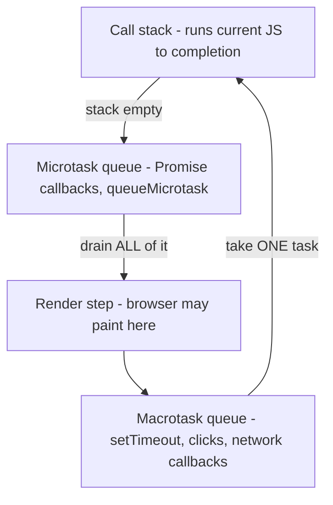
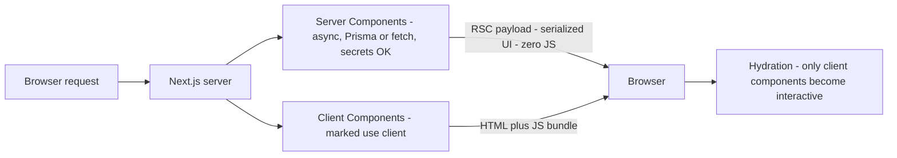

# React & JavaScript Frontend Interview Guide

- **Researched:** 2026-07-08
- **Target:** Software Engineer / Senior Software Engineer (full-stack, React + Next.js + React Native daily)
- **Sources freshness:** mostly 2025–2026 (React 19.2, React Compiler 1.0, Next.js 16, State of React 2025)

**Goal of this note:** you use React daily. The interview gap is not "can you build it" — it is "can you explain the internals and defend the choice". Every question in your collected list is answerable from this note.

**Related notes (linked, not duplicated):**
- JWT storage, localStorage vs cookies, auth flows → [express-graphql-auth-tutorial.md](express-graphql-auth-tutorial.md)
- Caching, CDN, scaling basics → [system-design-basics-senior-fullstack-interview.md](system-design-basics-senior-fullstack-interview.md)
- What happens server-side after the request leaves the browser → [load-balancers-microservices-online-shop.md](load-balancers-microservices-online-shop.md)
- Keyset pagination for infinite scroll APIs → [postgresql-queries-interview-guide.md](postgresql-queries-interview-guide.md)

---

## TL;DR

- The event loop answer that wins: one macrotask runs, then ALL microtasks drain, then the browser may paint. Long JS tasks block paint — that is why the event loop is a performance topic, not trivia.
- The Virtual DOM is not "fast". It is a strategy: diff two JS trees, then apply the minimal set of real DOM changes in one batch. Say this and you sound senior.
- Memoization rule for 2026: measure first, memo is not free — and the React Compiler (1.0, Oct 2025) now does it automatically, so manual `useMemo` everywhere reads as outdated.
- State management answer for 2026: split server state from client state first. Server state → React Query/SWR. The little client state left → Zustand or Context. Redux is no longer the default (Zustand passed it in downloads).
- Core Web Vitals today: LCP ≤ 2.5s, INP ≤ 200ms (INP replaced FID in March 2024), CLS ≤ 0.1 — all measured at the 75th percentile of real users.

---

# Part 1 — JavaScript Deep Dive

### 1.1 var / let / const and hoisting

**The problem:** `var` leaks. It is function-scoped, so a variable declared inside an `if` block escapes the block. It can also be read before its declaration line without an error.

**The solution:** `let` and `const` are block-scoped — they live only inside the nearest `{ }`.

**Hoisting** — before running your code, JavaScript first registers all declarations at the top of their scope. That registration step is called hoisting.

- `var` is hoisted **and** initialized to `undefined`. Reading it early gives `undefined`, silently.
- `let`/`const` are hoisted but **not** initialized. Reading them early throws a `ReferenceError`. The zone between scope start and the declaration line is called the **Temporal Dead Zone (TDZ)** — "dead" because the variable exists but cannot be touched yet.

```js
console.log(a); // undefined — var was hoisted and initialized
console.log(b); // ReferenceError — b is in the TDZ
var a = 1;
let b = 2;
```

`const` means the **binding** cannot be reassigned. The value can still change inside:

```js
const user = { name: "Wing" };
user.name = "Stephen"; // fine — mutating the object
user = {};             // TypeError — reassigning the binding
```

**Interview one-liner:** "Default to `const`, use `let` when I reassign, never `var`. `var` is function-scoped and hoists to `undefined`; `let`/`const` are block-scoped with a TDZ, so mistakes fail loudly instead of silently."

### 1.2 Closures

**The problem:** a function often needs private, persistent data that survives between calls, without polluting the outer scope.

**The solution:** a **closure** — a function that keeps access to the variables of the scope where it was created, even after that scope has finished running.

*Analogy: a closure is a backpack. When a function is created, it packs the variables around it into a backpack and carries them wherever it goes.*

```ts
function makeCounter() {
  let count = 0;              // private — nobody outside can touch it
  return () => ++count;       // this function "closes over" count
}
const next = makeCounter();
next(); // 1
next(); // 2 — count survived between calls
```

**Production uses you can cite from your own work:**
- **Debounce** stores its timer in a closure (see 1.6). No global, no class needed.
- **React hooks** are closures: every render creates functions that close over that render's props and state. This is also the root cause of the stale closure bug (Part 2.4).
- **Module pattern / factories:** a `createApiClient(baseUrl, token)` factory returns functions that close over the token.

### 1.3 The event loop — and why it matters for performance

**The problem:** JavaScript runs on **one thread** — one call stack, one thing at a time. But the browser must handle timers, network responses, and clicks without freezing.

**The solution:** the **event loop**. Slow work (timers, fetch, I/O) is handed to the browser. When it finishes, its callback is queued. The loop feeds queued callbacks back onto the stack whenever the stack is empty.

Definitions first:
- **Call stack** — where the currently running function frames live. One at a time.
- **Macrotask queue** (a.k.a. task queue / callback queue) — callbacks from `setTimeout`, `setInterval`, network events, user clicks.
- **Microtask queue** — Promise callbacks (`.then`, `await` continuations) and `queueMicrotask`. Higher priority.

**The rule to memorize:** run one macrotask → drain the **entire** microtask queue → browser may paint → take the next macrotask.

The loop order — notice microtasks always fully drain before the next macrotask, and paint happens between macrotasks:



The classic "what order do these log":

```js
console.log("1");
setTimeout(() => console.log("2"), 0);          // macrotask
Promise.resolve().then(() => console.log("3")); // microtask
console.log("4");
// Output: 1, 4, 3, 2
// Sync code first. Then microtasks (3). Then the macrotask (2), even at 0ms.
```

**Why it matters for performance (this is the senior part):**
- The browser can only paint **between** tasks. A JS task longer than **50ms** is a "long task" — it blocks paint and input, and directly hurts INP (see Part 3.3). Fix: break work up (`setTimeout`, `requestIdleCallback`, or the newer `scheduler.yield`), or move it off-thread with a **Web Worker** (a separate JS thread with no DOM access).
- Microtasks can **starve** the loop: a Promise chain that keeps queueing more microtasks never lets the browser paint. Macrotasks cannot do this — only one runs per turn.
- `await` splits your function: everything after `await` runs later as a microtask.

### 1.4 == vs ===

**The problem:** `==` performs **type coercion** — it silently converts the operands to a common type before comparing. The conversion rules are hard to memorize, so bugs hide there (`0 == ""` is true, `"0" == ""` is false).

**The solution:** `===` compares value **and** type, no conversion. Always use it.

One defensible exception: `x == null` is true for both `null` and `undefined` — a compact "is it missing" check. If you use it, say it is deliberate. (TypeScript with `strictNullChecks` mostly removes the need.)

### 1.5 Promises and async/await

**The problem:** callback-based async code nests deeply and makes error handling manual at every level.

**The solution:** a **Promise** — an object representing a future value, in one of three states: *pending*, *fulfilled*, or *rejected*. It settles once, and `.then`/`.catch` chains flatten the nesting. `async/await` is syntax on top: `await` pauses the function (not the thread) until the Promise settles, and rejections become `throw`, so `try/catch` works.

The mistake interviewers look for — accidental sequential awaits:

```ts
// Sequential: ~600ms total (waits for user, THEN starts orders)
const user = await fetchUser(id);      // 300ms
const orders = await fetchOrders(id);  // 300ms

// Parallel: ~300ms total — start both, then await both
const [user2, orders2] = await Promise.all([fetchUser(id), fetchOrders(id)]);
```

Know the four combinators:
- `Promise.all` — all fulfill, or reject on the **first** failure. Use for "I need everything".
- `Promise.allSettled` — waits for all, never rejects; gives per-item status. Use for independent jobs (e.g., firing multiple webhooks).
- `Promise.race` — settles with the first to settle. Classic use: timeout wrapper.
- `Promise.any` — first to **fulfill**; rejects only if all fail. Use for redundant sources.

### 1.6 Debounce vs throttle (the live search box)

**The problem:** a search box fires an input event on every keystroke. Calling your GraphQL search on each one wastes requests and can return results out of order.

- **Debounce** — wait until the events **stop** for N ms, then run once. *Analogy: an elevator door — it keeps resetting its close timer while people keep walking in.*
- **Throttle** — run at most once every N ms **while** events keep firing. *Analogy: a camera limited to one photo per second, no matter how often you press.*

**The live-search answer:** debounce the input by ~300ms (you want the *final* query, not intermediate ones). Throttle is for continuous streams where you need regular updates — scroll position, window resize, mouse move, sending "user is typing" signals.

Both store their bookkeeping in a **closure** — this is the production closure example:

```ts
function debounce<T extends (...args: any[]) => void>(fn: T, ms: number) {
  let timer: ReturnType<typeof setTimeout>; // lives in the closure
  return (...args: Parameters<T>) => {
    clearTimeout(timer);                    // every new event resets the wait
    timer = setTimeout(() => fn(...args), ms);
  };
}

function throttle<T extends (...args: any[]) => void>(fn: T, ms: number) {
  let last = 0;                             // lives in the closure
  return (...args: Parameters<T>) => {
    if (Date.now() - last >= ms) {
      last = Date.now();
      fn(...args);
    }
  };
}
```

Senior extras to mention: for search, also cancel the in-flight request with `AbortController` (stale responses can arrive out of order), and in React use React Query — it keys the cache by the query string, so stale responses cannot overwrite fresh ones.

### 1.7 Event bubbling vs capturing

**The problem:** you click a button inside a card inside a list. Which element's handler runs?

**The solution:** the browser dispatches the event in three phases:
1. **Capturing** — from `document` **down** to the target.
2. **Target** — on the clicked element itself.
3. **Bubbling** — from the target back **up** to `document`. This is the default phase for handlers.

**The production use case — event delegation:** instead of attaching 1,000 click handlers to 1,000 list rows, attach **one** handler on the list container. Clicks bubble up to it; read `event.target` to find which row was clicked. Less memory, and rows added later work automatically.

```ts
list.addEventListener("click", (e) => {
  const row = (e.target as HTMLElement).closest("[data-id]");
  if (row) openItem(row.dataset.id!);
});
```

React does this for you: since React 17, React attaches one listener per event type at your app's **root container** and routes events to your components. That is why React events are "synthetic" — they are React's wrapper objects around the native event.

Capture-phase use case: run before anything can stop the event — e.g., an analytics listener, or "close any open dropdown on any click" (`addEventListener("click", fn, true)` — the `true` means capture phase). `stopPropagation()` halts the journey; use it sparingly because it silently breaks delegation above.

### 1.8 "What happens when you type a URL and hit Enter"

Structure the answer as a journey. Say the stage names, then go deep where the interviewer steers.

1. **Parse + cache checks** — browser checks its HTTP cache and service worker first. A cached response can skip the network entirely.
2. **DNS** — Domain Name System, the internet's phone book: name → IP address. Checked in browser cache → OS cache → resolver.
3. **TCP handshake** — a 3-step hello that opens a reliable connection to that IP.
4. **TLS handshake** — negotiates encryption; certificates prove the server's identity. (HTTP/3 merges connection setup steps to cut round trips.)
5. **HTTP request → server** — the request usually hits a CDN or load balancer first, then your app. The whole server side is in [load-balancers-microservices-online-shop.md](load-balancers-microservices-online-shop.md).
6. **Browser renders — the critical rendering path:**
   - Parse HTML → **DOM** (tree of elements).
   - Parse CSS → **CSSOM** (tree of styles).
   - DOM + CSSOM → **render tree** (only visible elements).
   - **Layout** — compute each box's size and position.
   - **Paint** — fill in pixels. **Composite** — GPU layers combined into the final frame.
7. **JavaScript** — a plain `<script>` blocks HTML parsing. `defer` downloads in parallel and runs after parsing, in order (the usual right answer). `async` runs as soon as it arrives, order not guaranteed (analytics).

Senior hook: tie each stage to a metric — DNS/TLS affect **TTFB** (time to first byte), the rendering path affects **LCP**, and JS long tasks affect **INP**.

### 1.9 Web fundamentals quick hits

**CSS box model:** every element is four nested layers — content → padding → border → margin. The gotcha: with the default `box-sizing: content-box`, `width` means the *content only*, so padding and border make the element bigger than the width you wrote. Fix everyone uses:

```css
* { box-sizing: border-box; } /* width now includes padding + border */
```

**Flexbox vs Grid in one line:** Flexbox lays out in **one dimension** (a row OR a column — navbars, toolbars); Grid lays out in **two dimensions** (rows AND columns — page layouts, card grids). Modern rule: they compose — Grid for the page, Flex inside components.

**CORS** — Cross-Origin Resource Sharing. **The problem:** the browser's *same-origin policy* blocks JS on `app.com` from reading responses from `api.com` (different origin = different scheme, domain, or port). This protects users — otherwise any website could call your bank's API with your cookies and read the answer. **The solution:** the *server* opts in by sending `Access-Control-Allow-Origin` headers. For "non-simple" requests (e.g., `Content-Type: application/json`, or an `Authorization` header), the browser first sends a **preflight** — an `OPTIONS` request asking permission.

Fixes, in interview order:
1. Server-side (the real fix): in Express, the `cors` middleware with an explicit origin allow-list. In Hasura, `HASURA_GRAPHQL_CORS_DOMAIN`.
2. Same-origin by design: proxy the API through your Next.js app (`rewrites` in `next.config.js`) — the browser only ever talks to one origin.
3. If you send cookies: server needs `Access-Control-Allow-Credentials: true` and a **specific** origin (wildcard `*` is forbidden with credentials), client needs `credentials: "include"`.

Key senior point: CORS is enforced **by the browser only**. curl and server-to-server calls ignore it. It is not your API's security layer — auth is (see [express-graphql-auth-tutorial.md](express-graphql-auth-tutorial.md)).

---

# Part 2 — React Internals

### 2.1 The Virtual DOM, honestly

**The problem:** real DOM updates are expensive — not the node change itself, but what follows: style recalculation, layout, paint. Naively re-rendering a page on every state change would trash performance. But writing manual, surgical DOM updates (jQuery era) does not scale in a large app.

**The solution:** you describe the whole UI as a function of state. React builds a **Virtual DOM** — a tree of plain JS objects describing the UI. On each render it builds a new tree, **diffs** it against the previous one, and applies only the minimal set of real DOM changes, batched together.

*Analogy: renovating a building. Instead of demolishing and rebuilding, the architect compares the old blueprint with the new one and hands the builders only the list of changes.*

**The honest framing (this is what sounds senior):** the VDOM is not "faster than the DOM" — a hand-tuned direct DOM update is always faster than diff + update. The VDOM is the price React pays so you can write *declarative* code ("UI = f(state)") and still get *good enough* DOM performance via diffing and batching. Frameworks like Svelte and Solid skip the VDOM entirely by compiling to direct updates — proof it is a strategy, not a requirement.

### 2.2 Reconciliation — how the diff actually works

**Reconciliation** is React's process of comparing the new element tree with the old one to decide what to change. A full tree diff is O(n³); React gets to O(n) with two heuristics:

1. **Different element type → tear down and rebuild.** `<div>` becoming `<span>`, or `ComponentA` becoming `ComponentB`, destroys the whole subtree, state included.
2. **Same type → keep the DOM node/instance, update changed props.** State survives.
3. **Lists → match children by `key`,** not by position (next section).

Two phases, and the distinction matters:
- **Render phase** — React calls your components and diffs. Since React 18 this is **concurrent**: work is split into small units (**Fiber** — React's internal linked-list rewrite of the tree, shipped in React 16, that makes rendering interruptible). React can pause low-priority rendering to handle a keystroke, then resume or throw away the work. This is what `useTransition` exposes: mark an update as non-urgent.
- **Commit phase** — apply the computed changes to the real DOM. Always synchronous, never interrupted (a half-updated DOM would flash broken UI).

Also say: React 18 **batches all state updates automatically** — multiple `setState` calls in one event, timeout, or promise produce one render. (Before 18, only event handlers batched.)

### 2.3 Why keys matter — the index-as-key bug

**The problem:** when diffing a list, React needs to know which new item corresponds to which old item. Without help it matches by position.

**The solution:** `key` — a stable identity per item, so React can match items across renders, reorder DOM nodes instead of rewriting them, and keep each item's state attached to the right item.

*Analogy: keys are name tags, not seat numbers. If you identify people by seat and someone leaves, everyone "becomes" a different person.*

The bug that proves it:

```tsx
{todos.map((todo, i) => (
  <li key={i}>                       {/* BUG: index as key */}
    <input defaultValue={todo.text} />
  </li>
))}
// Delete todo 0. Every remaining todo's index shifts down by one.
// React sees the same keys 0..n-2 and thinks those items just changed props.
// Result: the DOM inputs keep their typed values — now attached to the WRONG todos.
```

Same failure with component state, animations, and uncontrolled inputs. Index keys are only acceptable when the list never reorders, inserts, or deletes — and items have no state. Use the database `id`. Never `Math.random()` — a new key each render means destroy + recreate every item.

Bonus senior trick: changing a `key` on purpose is the idiomatic way to **reset** a component's state (`<ProfileForm key={userId} />` resets the form when the user changes).

### 2.4 Hooks mental model: closures over renders (the stale closure bug)

**The model:** every render is a function call. Props and state are **constants within that render**. Every function you create during a render (handlers, effects) closes over *that render's* values — the backpack from Part 1.2.

**How hooks work under the hood:** React stores hook state in a list attached to the component's Fiber node, matched **by call order**. That is why the Rules of Hooks exist — no hooks in conditions or loops, or call #2 in this render might get call #3's state from last render.

**The stale closure bug** — the interview favorite:

```tsx
const [count, setCount] = useState(0);

useEffect(() => {
  const id = setInterval(() => {
    setCount(count + 1); // BUG: closes over count from the FIRST render (0)
  }, 1000);
  return () => clearInterval(id);
}, []); // empty deps → effect runs once → its closure never updates
// Result: 0 → 1 → stuck at 1 forever (always computing 0 + 1)
```

Fixes, in preference order:
1. **Functional update:** `setCount(c => c + 1)` — asks React for the latest value, no dependency on the closure.
2. **Add the dependency:** `[count]` — effect re-runs each change; interval is cleared and recreated (correct, but churny).
3. **`useEffectEvent`** (React 19.2, 2025): extract the non-reactive logic so it always sees fresh values without re-running the effect.

### 2.5 useState vs useReducer

- `useState` — independent, simple values. The default.
- `useReducer` — **the problem:** several state fields that update together, or the next state depends on the previous in non-trivial ways. Handlers become a soup of `setX` calls that can go out of sync. **The solution:** one reducer — a pure function `(state, action) => newState`. All transition logic lives in one testable place, and components just `dispatch({ type: "..." })`.

Rule of thumb: 3+ fields that change together (form with validation, multi-step wizard, data-fetch state machine of `loading/error/data`) → reducer. Also: `dispatch` has a stable identity, which is handy to pass down without `useCallback`.

### 2.6 useEffect deep dive — and the 3 common mistakes

**What it is for (say this first):** synchronizing your component with **external systems** — network, subscriptions, timers, the DOM, browser APIs. It is *not* "run code after render" as a lifecycle replacement.

Mechanics: runs **after** the browser paints. The cleanup function runs before the next effect run and on unmount. Dependencies are compared with `Object.is` — reference equality for objects.

**Mistake 1 — using an effect for derived state:**

```tsx
// BAD: extra render, extra state to keep in sync
const [fullName, setFullName] = useState("");
useEffect(() => { setFullName(first + " " + last); }, [first, last]);

// GOOD: derive during render
const fullName = `${first} ${last}`;
// expensive? const result = useMemo(() => compute(data), [data]);
```

**Mistake 2 — unstable dependencies causing infinite loops:** an object or function created during render is a *new reference* every render. Put it in the deps and the effect re-runs each time — often re-triggering a state update → loop. Fixes: depend on primitives (`user.id`, not `user`), memoize the reference, or move the object inside the effect.

**Mistake 3 — no cleanup → race conditions and leaks:** two fast `userId` changes fire two fetches; the slow first response can land last and overwrite the fresh data. Every effect that subscribes, sets a timer, or fetches needs a cleanup. The fetch version with `AbortController` is in 2.9.

**useEffect vs useLayoutEffect:** `useEffect` runs *after paint* — the default, does not block the frame. `useLayoutEffect` runs *after DOM mutation but before paint*, synchronously. **The problem it solves:** you need to measure the DOM (a tooltip's size, a scroll position) and adjust state before the user sees the frame — with `useEffect` you would get a one-frame flicker. Cost: it blocks painting, so keep it rare and cheap.

### 2.7 Controlled vs uncontrolled components

- **Controlled** — React state is the single source of truth: `value={state}` + `onChange`. You get instant validation, formatting, and conditional logic, at the cost of a render per keystroke.
- **Uncontrolled** — the DOM holds the value; you read it when needed (`ref`, or `FormData` on submit). Less code, fewer renders.

2026 answer: controlled when the UI must react *while typing* (live search, formatting, enable/disable submit). Uncontrolled for simple submit-time forms — this is also why **React Hook Form** is popular (uncontrolled under the hood, so keystrokes do not re-render the form) and it aligns with React 19 form Actions reading `FormData`.

### 2.8 Prop drilling and how to avoid it

**The problem:** passing a prop through five layers that do not use it, just to reach a leaf. Refactors touch every layer.

Solutions, in order — interviewers like that you do *not* jump straight to Context:
1. **Component composition first.** Pass components as `children` instead of passing data down. `<Layout sidebar={<UserPanel user={user} />} />` — `Layout` never sees `user`. Removes most drilling for free.
2. **Context** — for low-frequency, app-wide values: theme, locale, current auth user. Caveat: **every consumer re-renders when the context value changes**, so it is wrong for fast-changing state. Also memoize the provider `value` object.
3. **A store (Zustand)** — for shared, frequently-changing client state. Components subscribe to *slices*, so only components using the changed slice re-render.
4. Ask first: is it actually **server state**? Then React Query is the answer, not any of the above (Part 3.6).

### 2.9 Build a custom useFetch hook (loading / error / abort)

Built up in steps — each step answers a "what's wrong with the previous version" question:

```tsx
import { useEffect, useState } from "react";

function useFetch<T>(url: string) {
  // Step 1: the three states every async UI needs
  const [data, setData] = useState<T | null>(null);
  const [error, setError] = useState<Error | null>(null);
  const [loading, setLoading] = useState(true);

  useEffect(() => {
    // Step 3: cancellation — fixes the race when url changes fast
    const controller = new AbortController();
    setLoading(true);
    setError(null);

    fetch(url, { signal: controller.signal })
      .then((res) => {
        // Step 2: fetch does NOT reject on 404/500 — check res.ok yourself
        if (!res.ok) throw new Error(`HTTP ${res.status}`);
        return res.json() as Promise<T>;
      })
      .then((json) => {
        setData(json);
        setLoading(false);
      })
      .catch((err) => {
        if (err.name === "AbortError") return; // cancelled — not a real error
        setError(err);
        setLoading(false);
      });

    // cleanup runs on unmount AND before re-running for a new url
    return () => controller.abort();
  }, [url]);

  return { data, error, loading };
}
```

Talking points while writing it:
- `fetch` only rejects on network failure; HTTP errors must be checked via `res.ok`.
- The cleanup + `AbortController` is the fix for the stale-response race (Mistake 3 above) and for setting state after unmount.
- Close with: "In production I use React Query — it adds what this can't: caching, request deduplication, retries, and stale-while-revalidate. But this is what it does at its core."

### 2.10 React.memo / useMemo / useCallback — when they help, when they're waste

Definitions:
- **Memoization** — cache a result; if inputs did not change, return the cache.
- `React.memo(Component)` — skip re-rendering if props are shallow-equal.
- `useMemo(fn, deps)` — cache a computed **value** across renders.
- `useCallback(fn, deps)` — cache a **function reference** (it is `useMemo` for functions).

**When they help:**
1. An expensive computation re-running on unrelated renders (`useMemo`).
2. A genuinely heavy subtree (big list, chart) re-rendering with unchanged props (`React.memo`).
3. Preserving reference identity so `React.memo` children or effect deps actually work (`useCallback`, `useMemo` for objects).

**When they're waste:** everywhere else. Each one costs memory, a deps comparison per render, and readability. Memoizing a cheap component costs more than re-rendering it. And one non-memoized object prop silently defeats a `React.memo` child — half-applied memoization is pure cost.

**The senior decision rule:** "Re-renders are not a problem; *slow* re-renders are. I profile with React DevTools Profiler first, then memoize the measured hot path. And before memoizing I try composition — pushing state down to the component that uses it, or lifting content up as `children` — which removes the re-render structurally."

**2026 twist you must mention:** the **React Compiler** (v1.0, Oct 2025) auto-memoizes components and values at build time. Teams adopting it are deleting manual `useMemo`/`useCallback`. You still need to *understand* memoization to explain what the compiler does and debug when it bails out.

### 2.11 React Server Components (RSC) — and what changed in Next.js

**The problem:** classic SSR still ships all component JS to the browser. The server renders HTML, then the client downloads the same components and **hydrates** — attaches event listeners and rebuilds state so the HTML becomes interactive. Data-heavy, non-interactive parts (product descriptions, markdown, dashboards) pay the full JS cost for nothing.

**The solution:** split components into two kinds.
- **Server Components** — run **only** on the server. They can be async, query the database directly (Prisma!), read secrets, and ship **zero JS** to the browser. Output is a serialized UI description (the "RSC payload"), not HTML.
- **Client Components** — marked `"use client"`. They ship JS, hydrate, and own interactivity: hooks, state, event handlers, browser APIs.

*Analogy: a restaurant. Server Components are dishes cooked in the kitchen — you get the finished plate, not the recipe or the chef. Client Components are the table-side burner — the equipment has to be at your table because you interact with it.*

Who does what — notice only client components ship and hydrate JS:



Practical rules for the interview:
- In the Next.js **App Router**, every component is a Server Component **by default**; you opt into the client with `"use client"`.
- `"use client"` marks a **boundary**: everything it imports becomes client-side too. Keep the boundary low — leaf components like buttons and inputs, not whole pages.
- A Server Component can pass serializable props to a Client Component, and can be passed *into* one as `children` — that is how an interactive shell wraps server-rendered content.
- **Server Actions** (`"use server"`) complete the picture: form mutations run on the server without hand-writing an API route.
- Advantages to list: less JS shipped (better INP/LCP), data fetching next to the data (no client waterfalls, no exposed API keys), and streaming with `Suspense` (send the shell now, slow parts later).
- Honest costs: mental model complexity (two worlds, serialization boundary), framework lock-in (in practice you use RSC via Next.js), and immature ecosystem patterns (some libraries assume client-only).

### 2.12 React 19 in one minute (current, verified)

- **React 19 stable** — December 2024. **React 19.2** — October 2025. Roughly half of daily React users are already on 19 (State of React 2025).
- **Actions** — pass an async function to `<form action={...}>`; React manages pending/error states. `useActionState` (form state + pending), `useFormStatus` (pending inside the form), `useOptimistic` (show the expected result immediately, reconcile when the server answers).
- **`use()`** — read a Promise or Context inside render; suspends until resolved. Unlike hooks, it may be called conditionally.
- **`ref` as a normal prop** — `forwardRef` is no longer needed.
- **React Compiler 1.0** (Oct 2025) — build-time auto-memoization; ESLint rules ship with it.
- **19.2 additions** — `<Activity>` (hide UI with state preserved), `useEffectEvent` (fresh values inside effects without re-running them), View Transitions integration.

---

# Part 3 — Frontend Performance & System Design

### 3.1 Rendering 10,000 items — virtualization

**The problem:** 10,000 rows = 10,000+ DOM nodes. The initial render, layout, and memory all blow up; scrolling stutters. `React.memo` does not help — the nodes *exist*.

**The solution: virtualization (windowing).** Only render what is visible plus a small buffer (~20–30 rows). As the user scrolls, reposition and re-fill that fixed pool of rows inside a tall spacer element that keeps the scrollbar honest.

```tsx
import { FixedSizeList } from "react-window";

<FixedSizeList height={600} width="100%" itemCount={10_000} itemSize={48}>
  {({ index, style }) => (
    <div style={style}>{items[index].name}</div> // style positions the row — required
  )}
</FixedSizeList>
```

Talking points: `react-window` for the simple case, **TanStack Virtual** for headless/variable-height (the 2025+ favorite); costs are accessibility (Ctrl+F cannot find unrendered rows) and complexity with dynamic heights. Lightweight alternative for medium lists: CSS `content-visibility: auto` — the browser skips rendering off-screen content without JS.

### 3.2 Infinite scrolling, efficiently

Combine three pieces — each fixes a different failure:

1. **IntersectionObserver** for the trigger. **The problem:** scroll listeners fire constantly and force layout reads. **The solution:** the browser tells you when a sentinel `<div>` at the list bottom becomes visible — no scroll math, off the main thread.

```tsx
useEffect(() => {
  const io = new IntersectionObserver(
    ([entry]) => entry.isIntersecting && fetchNextPage(),
    { rootMargin: "400px" } // start loading before the user hits bottom
  );
  if (sentinelRef.current) io.observe(sentinelRef.current);
  return () => io.disconnect();
}, [fetchNextPage]);
```

2. **Keyset (cursor) pagination** for the API. **The problem:** `OFFSET 50000` makes PostgreSQL scan and discard 50,000 rows, and rows shift when data changes mid-scroll. **The solution:** `WHERE (created_at, id) < ($cursor...) ORDER BY ... LIMIT 20` — constant-time pages, no duplicates/skips. Full treatment in [postgresql-queries-interview-guide.md](postgresql-queries-interview-guide.md). In React: `useInfiniteQuery` from React Query manages the cursor and page cache.
3. **Virtualization** for the DOM (3.1) — otherwise the list grows unbounded and the tab dies at page 50.

Round it out with: scroll position restoration on back-navigation, and an end-of-list state.

### 3.3 Core Web Vitals — current definitions (verified 2025–2026)

**Core Web Vitals** are Google's three user-experience metrics, measured from **real users** (field data), evaluated at the **75th percentile**. They affect SEO ranking and, more importantly, conversion.

| Metric | Measures | Good | Meaning |
|---|---|---|---|
| **LCP** — Largest Contentful Paint | Loading | **≤ 2.5s** | When the biggest visible element (usually the hero image or heading) finishes rendering. |
| **INP** — Interaction to Next Paint | Responsiveness | **≤ 200ms** | Worst-case delay from a user interaction (click/tap/keypress) to the next painted frame. **Replaced FID in March 2024.** |
| **CLS** — Cumulative Layout Shift | Visual stability | **≤ 0.1** | How much visible content jumps around unexpectedly. Unitless score. |

**Top fixes per metric:**

- **LCP:** serve the hero image optimized (`next/image` — AVIF/WebP, correct size); `<link rel="preload">` + `fetchpriority="high"` on it, never lazy-load it; cut TTFB with CDN/ISR caching; inline critical CSS.
- **INP:** break up long tasks (>50ms) — this is the event loop payoff from Part 1.3; ship less JS (RSC, code splitting); `useTransition` for heavy state updates so typing stays responsive; move crunching to Web Workers; avoid layout thrashing (interleaved DOM reads/writes forcing repeated synchronous layout).
- **CLS:** always give images and embeds explicit `width`/`height` (the browser reserves space); reserve space for ads/banners/skeletons; `font-display: swap` with size-matched fallback fonts; never insert content above existing content except after user action.

Measure: field data (what counts) via CrUX / RUM tools (Vercel Analytics, web-vitals library); lab diagnosis via Lighthouse and the Performance panel. **RUM** — Real User Monitoring, collecting metrics from actual visitors' browsers.

### 3.4 Bundle splitting and lazy loading

**The problem:** one bundle means the user downloads, parses, and executes your admin panel, charting library, and modals to see the login page. JS cost is paid twice — download and CPU.

**The solution:** split by route and by heavy feature, load on demand.

- **Route-based (free in Next.js):** each page/layout is its own chunk automatically.
- **Component-based:** `React.lazy` + `Suspense` (or `next/dynamic`) for heavy, conditional UI — charts, editors, modals, anything below the fold:

```tsx
const Chart = React.lazy(() => import("./Chart")); // separate chunk via dynamic import()

<Suspense fallback={<Skeleton />}>
  {showChart && <Chart data={data} />}
</Suspense>
```

- `next/dynamic` with `ssr: false` for browser-only libraries (maps, canvas).
- Verify, don't guess: `@next/bundle-analyzer` to find what is actually heavy; check a library's cost before adopting (bundlephobia). Common wins: replace moment with date-fns/dayjs, import icons individually, dedupe lodash.
- Rule of thumb to quote: keep the initial route's JS under ~200KB gzipped; load the rest on interaction or in the background.

### 3.5 Frontend caching layers

Answer as layers, closest-to-user first (deep dive on CDN/server caching in [system-design-basics-senior-fullstack-interview.md](system-design-basics-senior-fullstack-interview.md)):

1. **HTTP cache (browser).** Hashed static assets (`app.3f9c.js`) → `Cache-Control: max-age=31536000, immutable` — cached "forever", a new deploy changes the hash. HTML → no long cache; revalidate with ETags.
2. **CDN edge cache.** Static assets and cacheable pages served near the user. Next.js **ISR** (Incremental Static Regeneration) is CDN caching with automatic background rebuilds: serve the cached page instantly, regenerate after `revalidate` seconds or on-demand (`revalidatePath`) — pair with `stale-while-revalidate` semantics.
3. **Data cache in the app — stale-while-revalidate.** **The problem:** always refetching is slow; never refetching is stale. **The solution (React Query / SWR):** show cached data **immediately**, refetch in the background, update if changed. Users see instant screens that quietly self-correct. Key React Query knobs: `staleTime` (how long data is trusted without refetch) vs `gcTime` (how long unused cache is kept); invalidate after mutations with `invalidateQueries`.
4. **Client storage** (small, deliberate): localStorage / sessionStorage / cookies / IndexedDB — next section.

### 3.6 localStorage vs sessionStorage vs cookies (security + scale)

| | localStorage | sessionStorage | Cookies |
|---|---|---|---|
| Size | ~5MB | ~5MB | ~4KB |
| Lifetime | until cleared | per-tab, until tab closes | set by `Expires`/`Max-Age` |
| Sent to server | never | never | **every request** to the domain |
| JS access | yes | yes | **blockable** via `HttpOnly` |
| Main risk | **XSS** can read it | XSS (smaller window) | **CSRF** — mitigated by `SameSite` |

Security framing (full flow in [express-graphql-auth-tutorial.md](express-graphql-auth-tutorial.md)):
- **XSS** — cross-site scripting: injected JS runs on your page. It can read `localStorage`, so **tokens in localStorage are readable by any successful XSS**.
- The senior default for auth: **`HttpOnly` + `Secure` + `SameSite` cookie** — JS cannot read it, so XSS cannot exfiltrate it; `SameSite=Lax/Strict` blunts CSRF (a forged cross-site request riding on auto-sent cookies).
- Scalability angle: cookies ride on **every** request — keep them tiny (a session id or JWT, not app data). Big client-side data belongs in **IndexedDB** (async, large, structured — what offline-capable apps and React Query persistence use).
- localStorage is synchronous — reading/writing blocks the main thread. Fine for a theme flag; wrong for anything big or hot. sessionStorage: per-tab wizard/draft state.

### 3.7 State management strategy in a large app (Redux vs Context vs Zustand)

**The 2026 framework — split by state type first, pick tools second:**

1. **Server state** — data that lives in your database and is only *cached* on the client (users, orders, feeds). This is 70–90% of most apps' "state". Wrong tool: Redux/Context copies that go stale. Right tool: **React Query or SWR** — caching, dedup, revalidation, optimistic updates are their whole job. (Or Apollo/urql cache if you are GraphQL-first — same concept.)
2. **URL state** — filters, tabs, pagination, search. Put it in the URL (`searchParams`): shareable, survives refresh, back button works.
3. **Local component state** — `useState`/`useReducer`. Keep state as close to where it is used as possible.
4. **Shared client state** — what actually remains: theme, auth session flag, cart drawer open, multi-step form. Small by now.
   - **Context** — fine for low-frequency values (theme, locale, current user object). Not a state manager: every consumer re-renders on change, no selectors.
   - **Zustand** — the current default for real shared client state: tiny (~1KB), no providers, **selector-based subscriptions** (only components reading the changed slice re-render), usable outside React (event handlers, sockets).
   - **Redux Toolkit** — still right for genuinely complex domains: large teams that want enforced structure, middleware pipelines, devtools time-travel, heavy audit/undo requirements.

**Survey backing (State of React 2025):** Zustand crossed ~50% usage and overtook Redux in npm downloads; ~a third of respondents use *no* state library because React Query + built-ins cover them. Quote this and you sound current.

### 3.8 Scalable frontend architecture for large apps

Structure the answer in layers:

- **Code organization:** feature-based folders (`features/checkout/…` owning its components/hooks/api) over type-based (`components/`, `hooks/`) — features stay deletable and team-ownable. A `shared/ui` design system underneath (Storybook-documented).
- **Boundaries:** enforce import rules (ESLint import boundaries or Nx) so features do not reach into each other's internals; share via explicit public APIs.
- **Scaling teams:** monorepo (Turborepo/Nx/pnpm workspaces) with shared packages is the 2026 default. Module Federation / micro-frontends only when *independent deployment by separate teams* is a hard requirement — say the cost out loud: duplicated dependencies, inconsistent UX, harder upgrades.
- **Data layer:** one API client, React Query keys organized per feature, generated types from the GraphQL schema (codegen) — end-to-end type safety.
- **Rendering strategy per page type:** static/ISR for marketing and content, RSC + streaming for logged-in data pages, pure client for highly interactive tools.
- **Guardrails (senior signal):** performance budgets in CI (bundle size checks), RUM dashboards for CWV, error tracking (Sentry), feature flags for safe rollout, E2E smoke tests (Playwright).

### 3.9 "Design a frontend for millions of users"

Have a repeatable answer skeleton:

1. **Serve from the edge.** CDN for all static assets; ISR/edge-cached HTML for anonymous pages. Most of "millions of users" never hits your origin.
2. **Ship less JS.** RSC + route-based code splitting + budgets. The fastest JS is the JS you did not send.
3. **Pick rendering per page.** Marketing → static/ISR. Feed/dashboard → SSR or RSC streaming (fast first paint, personalized). Editor-like tools → CSR after login.
4. **Cache in layers** (3.5) and design the API for it — cacheable GETs, cursor pagination, stale-while-revalidate on the client.
5. **Resilience:** skeletons + optimistic UI, error boundaries per feature region, graceful degradation when a sub-service is down, retry with backoff.
6. **Measure and guard:** RUM (CWV per route, per country), performance budgets in CI, feature flags + canary deploys. Close with: "I'd watch p75 INP and LCP per route and treat regressions like bugs."

### 3.10 Real-time updates without performance issues

**The problem:** a live dashboard or feed pushing many updates per second can render your app to death — each message triggering a re-render is death by a thousand cuts.

Answer in two halves:

- **Transport:** WebSockets (bidirectional — chat, collaboration), **SSE** (server→client only — notifications, tickers, LLM streams; plain HTTP, auto-reconnect), or just polling/refetch-on-focus via React Query when "real-time" really means "fresh enough". Pick the least powerful tool that meets the need. Hasura subscriptions = WebSockets managed for you. Server-side scaling of connections → [load-balancers-microservices-online-shop.md](load-balancers-microservices-online-shop.md).
- **Rendering discipline (the part most candidates miss):**
  - **Batch:** buffer incoming messages and flush to state at a fixed cadence (e.g., every 100–250ms), not per message. One render per flush.
  - **Throttle** high-frequency values (cursor positions, prices) — the screen only shows ~60 frames/s anyway.
  - **Subscribe narrowly:** store updates in Zustand/React Query and let only the affected row's component re-render via selectors — not the whole list.
  - **Virtualize** long live lists (3.1); append off-screen items without rendering them. Add "N new items" pill instead of yanking the scroll position.
  - **Backpressure:** if the client falls behind, drop/coalesce intermediate updates (latest-wins for a price; you never needed all 500 ticks).

---

## What's Current (2025–2026)

- **React 19** stable Dec 2024; **React 19.2** Oct 2025 (Activity, `useEffectEvent`, View Transitions). ~48% of daily React users are on 19 already (State of React 2025).
- **React Compiler 1.0** shipped Oct 2025 — build-time auto-memoization. Teams report fewer re-renders with zero code changes; manual `useMemo`/`useCallback` is becoming legacy style. Interviews now ask "what does the compiler change about memoization?"
- **Next.js 16** (Oct 2025): Turbopack default bundler, **Cache Components** — caching is now fully **opt-in** (`use cache` + Partial Pre-Rendering) instead of the App Router's old implicit caching, faster navigation prefetching, React 19.2 under the hood.
- **INP replaced FID** as the responsiveness Core Web Vital in **March 2024** (FID fully retired Sept 2024). Thresholds (Google official): LCP ≤ 2.5s, INP ≤ 200ms, CLS ≤ 0.1, at p75.
- **Signals are NOT in React.** The TC39 signals proposal (fine-grained reactive primitives, backed by Angular/Vue/Solid/Preact teams) is still **Stage 1** — early discussion. React explicitly chose the compiler route instead of a signals API. Correct interview line: "Signals are a fine-grained reactivity model other frameworks use; React gets similar re-render reduction via the compiler, not a new API."
- **State management (State of React 2025):** Zustand ~50% usage and now ahead of Redux in downloads; TanStack Query is the default for server state; ~34% use no dedicated state library at all.
- **Frontend system design rounds are now standard** for senior roles (2025–2026): rendering strategy, state architecture, caching, CWV — exactly Part 3.
- **Tailwind CSS v4** (Jan 2025): CSS-first configuration, much faster builds — worth one sentence if styling comes up.

---

## Likely Interview Questions

Organized the way companies actually run rounds. Outlines only — the deep material is in the parts above.

### Round 1 — JS + web fundamentals

**Q: Difference between var, let, and const?**
- Scope: `var` function-scoped; `let`/`const` block-scoped.
- Hoisting: `var` → `undefined` silently; `let`/`const` → TDZ, loud `ReferenceError`.
- `const` = binding frozen, value still mutable. Default to `const`. (→ 1.1)

**Q: What is a closure? Give a practical example.**
- Function + the variables of its birth scope, kept alive ("backpack").
- Counter example; then production: debounce's timer, React hooks closing over each render.
- Bonus: it is also the root cause of the stale closure bug in effects. (→ 1.2, 2.4)

**Q: Explain the event loop. Why does it matter for performance?**
- One thread; call stack; browser handles slow work; queues feed the stack.
- Order: 1 macrotask → drain ALL microtasks → maybe paint → next macrotask. Log-order example: 1, 4, 3, 2.
- Performance: paint only happens between tasks → long tasks (>50ms) hurt INP → chunk work or use Workers. (→ 1.3)

**Q: What is hoisting?** — declarations registered before execution; `var` initialized to `undefined`, `let`/`const` in TDZ; function declarations fully hoisted, function expressions not. (→ 1.1)

**Q: == vs ===?** — `==` coerces types (buggy edge cases), `===` compares type + value. Always `===`; only defensible `==` is `x == null` for null-or-undefined. (→ 1.4)

**Q: Promises and async/await?**
- Three states, settles once; `await` = pause the function, not the thread; rejection → `try/catch`.
- Name the parallel-vs-sequential await trap + `Promise.all`.
- Know all/allSettled/race/any and one use each. (→ 1.5)

**Q: Debounce vs throttle — which for a live search box?**
- Debounce = run after events stop (elevator door); throttle = at most once per interval (camera).
- Search box → debounce ~300ms + AbortController for stale responses; throttle → scroll/resize/typing indicators.
- Write both in ~5 lines; mention the closure holding the timer. (→ 1.6)

**Q: Event bubbling vs capturing — production use case?**
- Three phases: capture down, target, bubble up (default).
- Delegation: one listener on the container for 1,000 rows; React does this at the root since v17.
- Capture use: global "close dropdowns on any click", analytics. (→ 1.7)

**Q: What happens when you type a URL and hit Enter?**
- Caches → DNS → TCP → TLS → HTTP → CDN/LB → server → response.
- Render: DOM + CSSOM → render tree → layout → paint → composite; script blocking, `defer` vs `async`.
- Senior move: map stages to TTFB / LCP / INP. (→ 1.8)

**Q: CSS box model / Flexbox vs Grid / CORS?** — content-padding-border-margin + `border-box`; Flex = 1D, Grid = 2D; CORS = browser-enforced same-origin policy, fixed server-side with allow-list headers + preflight awareness, not a security layer for the API. (→ 1.9)

### Round 2 — React internals & patterns

**Q: How does reconciliation work?**
- New element tree vs old, O(n) heuristics: type change → rebuild subtree; same type → patch props; lists → keys.
- Render phase (interruptible, Fiber, concurrent since 18) vs commit phase (sync DOM writes).
- Automatic batching in 18; `useTransition` for low-priority updates. (→ 2.2)

**Q: Why do keys matter? / What breaks with index keys?**
- Keys = identity across renders ("name tags, not seat numbers").
- Index-as-key delete bug: input values/state attach to the wrong rows.
- Use stable ids; changing a key on purpose = state reset trick. (→ 2.3)

**Q: What is the Virtual DOM really for?**
- Not "fast" — a batching/diffing strategy that makes declarative UI affordable.
- Diff two JS trees, apply minimal batched DOM changes.
- Credibility bonus: Svelte/Solid skip it via compilation — it is a tradeoff, not a law. (→ 2.1)

**Q: useState vs useReducer?** — independent simple values vs multi-field transitions in one pure, testable function; stable `dispatch`; reducer for wizards/forms/fetch state machines. (→ 2.5)

**Q: useEffect — deps, cleanup, common mistakes?**
- Purpose: sync with external systems, runs after paint; cleanup before re-run and unmount; deps compared by reference.
- Mistakes: derived state in effects; unstable object/function deps → loops; missing cleanup → fetch races and leaks (AbortController).
- `useLayoutEffect` only to measure DOM before paint (avoid flicker); it blocks the frame. (→ 2.6)

**Q: Controlled vs uncontrolled?** — React state vs DOM as source of truth; controlled for live validation/formatting, uncontrolled + FormData for simple submits; React Hook Form and React 19 Actions favor the uncontrolled direction. (→ 2.7)

**Q: Prop drilling — how do you avoid it?** — composition/`children` first, Context for low-frequency globals (re-render caveat), Zustand for changing shared state, and "is it server state?" → React Query. (→ 2.8)

**Q: Build a data-fetching hook.** — write `useFetch` from 2.9: three states, `res.ok`, AbortController cleanup; close with "React Query in production, and here's what it adds".

**Q: React.memo/useMemo/useCallback — when do they help?**
- Help: expensive compute, heavy subtrees, reference stability for memo children/effect deps.
- Waste: by default — costs memory + comparisons + readability; one unstable prop defeats memo.
- Rule: profile first, memoize the measured hot path, try composition first. Compiler 1.0 automates it now. (→ 2.10)

**Q: React Server Components — advantages?**
- Server-only components: async, direct DB/Prisma, secrets, zero JS shipped; client components (`"use client"`) own interactivity.
- App Router: server by default; `"use client"` is a boundary — keep it at the leaves; pass server content as `children`.
- Wins: less JS (INP/LCP), no client waterfalls, streaming; costs: complexity, framework coupling. (→ 2.11)

**Q: State management in a large app — Redux vs Context vs Zustand?** — split server/URL/local/shared state first; React Query eats most of it; Context for low-frequency, Zustand as shared-state default (selectors), RTK for complex/enforced-structure domains; cite the 2025 survey. (→ 3.7)

### Round 3 — Frontend system design

**Q: Render 10,000 items efficiently.** — virtualization: render only the visible window (~20–30 nodes) in a tall spacer; react-window/TanStack Virtual; costs (find-in-page, variable heights); `content-visibility` for medium lists. (→ 3.1)

**Q: Design efficient infinite scrolling.** — IntersectionObserver sentinel (+`rootMargin` preload) + keyset pagination API (never OFFSET) + virtualization + `useInfiniteQuery`; scroll restoration. (→ 3.2)

**Q: Core Web Vitals — what are they and how do you improve each?** — LCP ≤2.5s / INP ≤200ms (replaced FID 2024) / CLS ≤0.1, p75 field data; 2–3 fixes per metric from 3.3; mention RUM vs lab.

**Q: Frontend caching strategy?** — layers: immutable hashed assets → CDN/ISR → stale-while-revalidate (React Query: `staleTime`, invalidation on mutation) → deliberate client storage. (→ 3.5)

**Q: localStorage vs sessionStorage vs cookies?** — table from 3.6; auth default = HttpOnly+Secure+SameSite cookie; XSS vs CSRF framing; cookies travel on every request so keep them tiny; IndexedDB for big data.

**Q: Design a frontend serving millions of users.** — edge/CDN first, ship less JS, rendering strategy per page type, layered caching, resilience (skeletons, error boundaries, degradation), RUM + budgets + flags. (→ 3.9, 3.8)

**Q: Real-time updates without killing performance?** — pick transport (WS vs SSE vs polling — least powerful that works), then rendering discipline: batch flushes, throttle hot values, selector-based subscriptions, virtualization, latest-wins backpressure. (→ 3.10)

---

## Tradeoffs to Be Ready For

- **Manual memoization vs React Compiler:** manual = precise control, works everywhere today; compiler = whole-app coverage with zero noise, but you must understand memoization to debug bail-outs. 2026 answer: adopt the compiler, keep the mental model.
- **CSR vs SSR vs ISR vs RSC:** CSR = simplest ops, worst first paint/SEO; SSR = fresh + fast first paint, per-request server cost; ISR = CDN-fast + eventually fresh, only for shareable (non-personalized) pages; RSC = less JS + server data access, most complex mental model. Pick **per page type**, not per app — that sentence is the senior answer.
- **Context vs Zustand vs Redux Toolkit:** Context = built-in, but all consumers re-render, no selectors; Zustand = selectors + tiny + no providers; RTK = structure/middleware/devtools for big teams. First ask: is it server state? Then none of these — React Query.
- **Controlled vs uncontrolled forms:** per-keystroke power vs performance and simplicity; React Hook Form / React 19 Actions push uncontrolled.
- **Virtualization vs pagination:** virtualization = seamless UX, complexity + a11y costs; pagination = simple, SEO-able, jumpable. Feeds → virtualized infinite scroll; admin tables → pagination.
- **WebSockets vs SSE vs polling:** bidirectional vs server-push vs simplicity. Least powerful tool that meets the requirement; stateful connections complicate load balancing (→ load balancer note).
- **localStorage JWT vs HttpOnly cookie:** convenience + explicit header vs XSS-proof storage + CSRF handling (`SameSite`). Default: cookie. (→ auth note)
- **Micro-frontends vs monorepo modular frontend:** independent team deploys vs duplicated deps and inconsistent UX. Default: monorepo with enforced boundaries; micro-frontends only at org scale with a hard independence requirement.
- **GraphQL vs REST for frontend data:** exact-shape queries + one round trip for nested UI vs simpler HTTP caching by URL. You run Hasura + Apollo daily — name N+1/DataLoader and persisted queries as the costs you manage.

---

## Real-World Cases to Cite

- **Netflix — ship less JS:** famously removed client-side React from its logged-out landing page (kept server-rendered React), cutting load and time-to-interactive by ~50%. Cite when arguing "the fastest JS is none" / RSC motivation.
- **Facebook — code splitting at scale:** the 2020 facebook.com rebuild split JS into three tiers (skeleton first, above-the-fold next, the rest after) plus data-driven dependency loading. Cite for bundle-splitting strategy beyond `React.lazy`.
- **Twitter/X — feeds:** virtualized timeline rendering plus the hybrid push/pull fan-out for celebrity accounts; Twitter Lite's PWA work showed big engagement wins from perf. Cite for infinite scroll + real-time feed design.
- **Discord — real-time rendering discipline:** millions of concurrent WebSocket connections, and on the client they virtualize message lists and batch updates to keep chat smooth. Cite for 3.10.
- **The Economic Times — INP business impact (web.dev case study):** improved INP ~4x and saw ~50% lower bounce rate. Cite to tie Core Web Vitals to money, not just SEO.
- **Shopify — rendering strategy per page:** Hydrogen (React storefront framework) + edge rendering for commerce: static/cached where possible, streamed SSR for personalized parts. Cite for "pick rendering per page type".

---

## Cheatsheet

> **Visual version:** open [react-js-frontend-interview-guide-cheatsheet.html](react-js-frontend-interview-guide-cheatsheet.html) in your browser — concept cards, an event-loop SVG with a "say this" line, CWV numbers, decision verdicts, and real cases, all visible at a glance with progress ticks.

**One-liners:**

- **Closure** — a function that keeps the variables of its birth scope ("backpack").
- **Event loop** — one macrotask → drain ALL microtasks → maybe paint → repeat.
- **TDZ** — the zone where a hoisted `let`/`const` exists but throws if touched.
- **Debounce** — run after the events stop. **Throttle** — run at most once per interval.
- **VDOM** — a diffing/batching strategy for declarative UI, not a speed feature.
- **Reconciliation** — diff new tree vs old: type change → rebuild; same type → patch; lists → keys.
- **Key** — item identity across renders; index keys break state on reorder/delete.
- **Stale closure** — an effect/handler seeing an old render's values; fix with functional updates or correct deps.
- **useLayoutEffect** — like useEffect but before paint; only for DOM measurement.
- **RSC** — components that run only on the server: async, DB access, zero JS shipped.
- **Hydration** — attaching JS behavior to server-rendered HTML.
- **Virtualization** — render only the visible window of a long list.
- **SWR pattern** — serve cached data instantly, revalidate in the background.
- **INP** — worst interaction-to-paint delay; the responsiveness vital since March 2024.
- **CORS** — browser-enforced cross-origin rules; fixed server-side; not API security.

**At a glance — Core Web Vitals (p75, field data):**

| Metric | Good | Top fix |
|---|---|---|
| LCP | ≤ 2.5s | Optimize + preload the hero image; cache HTML at the CDN |
| INP | ≤ 200ms | Break long tasks (>50ms); ship less JS |
| CLS | ≤ 0.1 | Explicit dimensions; reserve space for late content |

**Snippet to remember (debounce — the closure story in 5 lines):**

```ts
function debounce<T extends (...a: any[]) => void>(fn: T, ms: number) {
  let timer: ReturnType<typeof setTimeout>;      // the closure
  return (...a: Parameters<T>) => {
    clearTimeout(timer);
    timer = setTimeout(() => fn(...a), ms);
  };
}
```

**Memory hooks:**

- **Event loop:** "One task, ALL microtasks, maybe paint." (Plain words: per loop turn, one macrotask runs, then the microtask queue fully empties, then the browser gets a chance to draw.)
- **Debounce = elevator door, throttle = one photo per second.**
- **Closure = backpack** the function packed at birth and carries around.
- **Keys = name tags, not seat numbers.**
- **VDOM = blueprint diff before renovating** — builders get a change list, not a demolition order.
- **RSC = restaurant kitchen** (you get the plate, not the recipe); client components = the table-side burner.
- **CWV = "Load, Respond, Stay put"** → LCP, INP, CLS.
- **State: "Fetch it? React Query. Own it? Zustand. Share rarely? Context."**
- **Memoization: "Profile first — memo is a paid feature, not a default."**

---

## Sources

- [React 19.2 — react.dev blog](https://react.dev/blog/2025/10/01/react-19-2) — 2025-10-01
- [React v19 — react.dev blog](https://react.dev/blog/2024/12/05/react-19) — 2024-12-05
- [Next.js 16 — nextjs.org blog](https://nextjs.org/blog/next-16) — 2025-10
- [State of React 2025 — State Management](https://2025.stateofreact.com/en-US/libraries/state-management/) — 2025
- [State of React 2025–2026: Key Takeaways — Strapi](https://strapi.io/blog/state-of-react-2025-key-takeaways) — 2025
- [The React Compiler at Eighteen Months — Sascha Becker](https://saschb2b.com/blog/react-compiler-year-in-review) — 2025/2026
- [React State Management in 2026: A Data-Driven Comparison — Sascha Becker](https://saschb2b.com/blog/react-state-management-2026) — 2026
- [Core Web Vitals thresholds — web.dev](https://web.dev/articles/defining-core-web-vitals-thresholds) — updated 2024–2025
- [Core Web Vitals and Google Search — Google Search Central](https://developers.google.com/search/docs/appearance/core-web-vitals) — current
- [TC39 Signals proposal (Stage 1) — GitHub](https://github.com/tc39/proposal-signals) — active 2024–2026
- [Optimizing JavaScript Delivery: Signals vs React Compiler — RedMonk](https://redmonk.com/kholterhoff/2025/05/13/javascript-signals-react-compiler/) — 2025-05-13
- [100+ React Interview Questions from Ex-interviewers — GreatFrontEnd](https://www.greatfrontend.com/blog/100-react-interview-questions-straight-from-ex-interviewers) — 2026
- [Frontend Engineering 2026: CWV, React 19 & DX Patterns for Senior Roles — MockExperts](https://www.mockexperts.com/blog/frontend-engineering-2026-performance-dx) — 2026
