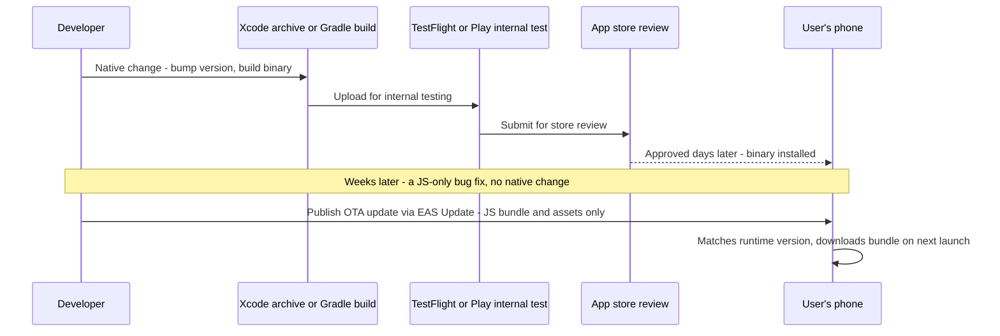

# React Native Interview Guide — The Delta from React Web

- **Researched:** 2026-07-14
- **Target:** Software Engineer / Senior Software Engineer (you use React Native daily in production — this note is the gap-filler, not a beginner tutorial)
- **Sources freshness:** mostly 2025–2026 (React Native 0.82, Expo SDK 54/57, Hermes V1, FlashList v2)

**This note's job:** you already know React and JavaScript deeply — see [react-js-frontend-interview-guide.md](react-js-frontend-interview-guide.md) for closures, the event loop, hooks, reconciliation, and React internals. None of that is repeated here. This note covers only what is **different, additional, or mobile-specific** about React Native. Read the web guide first if you need the fundamentals refreshed.

**Related notes (linked, not duplicated):**
- JS fundamentals, hooks, reconciliation, React 19 → [react-js-frontend-interview-guide.md](react-js-frontend-interview-guide.md)
- JWT storage tradeoffs, access/refresh tokens → [express-graphql-auth-tutorial.md](express-graphql-auth-tutorial.md) (this note extends it with mobile-specific storage)

---

## TL;DR

- React Native does not use a browser or the DOM. It runs your JS on a JS engine (Hermes), and a separate layer turns your React tree into real iOS/Android views. The "bridge vs New Architecture" question is really "how does that JS-to-native handoff work."
- New Architecture (JSI + Fabric + TurboModules) is not optional anymore. React Native 0.82 (October 2025) removed the old bridge entirely — there is only one architecture now.
- Flexbox is the only layout system in React Native. There is no CSS, no cascade, and the default `flexDirection` is `column` — the exact opposite of web's default `row`. This trips up every web developer at least once.
- The release process is two-speed: native binary changes go through Xcode/Gradle builds and app store review (days). JS-only changes can go out instantly over the air (OTA) — but OTA cannot touch native code, ever.
- Flipper is dead. React Native DevTools (built into Metro since RN 0.76) is now the default debugger.

---

## Key Concepts

### How React Native actually works — the bridge vs the New Architecture

**The problem this solves:** your JavaScript needs to make an iOS `UIView` or an Android `View` appear on screen, and it needs to call native code (camera, GPS, battery). JavaScript itself cannot do this — it has no access to the phone's UI toolkit. Something has to translate between the two worlds.

**The old answer — the bridge.** For most of React Native's life (through RN 0.75), that translator was called the **bridge**. Here is what made it slow:

- JS and native code ran on **separate threads**, and could never call each other directly.
- Every message between them — "render this view," "here's the scroll position," "the user tapped here" — had to be **serialized to JSON as a string**, passed across, and **parsed back** on the other side.
- All calls were **asynchronous**, batched at the end of each event loop tick. Even a call that logically should be instant (like reading how far the user has scrolled) had to wait for a round trip.

*Analogy: the bridge is two people who don't speak the same language, passing paper notes through a mail slot. Every sentence has to be written down, folded, posted, and unfolded — even for a yes/no question.*

**Why that hurt:** on a fast-scrolling list, the native side sends scroll position updates constantly. Each one gets serialized to JSON, crosses the bridge, gets parsed. On a busy frame, these messages queue up. By the time JS processes an old scroll event, the user's finger has already moved further — that's the classic "blank cells during fast scroll" bug.

**The new answer — JSI, Fabric, and TurboModules ("the New Architecture").**

- **JSI** (JavaScript Interface) — a C++ layer that lets JavaScript hold a direct reference to a native object and call its methods **synchronously**, like calling a regular function. No JSON, no serialization, no queue.
- **Fabric** — the new rendering system built on JSI. It can talk to the native UI layer synchronously and supports concurrent React features properly (Suspense, transitions) because rendering isn't stuck behind an async queue.
- **TurboModules** — the New Architecture's replacement for native modules. They load **lazily** (only when first used, not all at app startup) and call native code through JSI instead of the bridge.

*Analogy: JSI is those same two people now speaking the same language directly, face to face. No notes, no mail slot — just a conversation.*

**Why this matters for the interview:** the bridge was async overhead by design, and serialization cost scaled with how much data crossed it (a scroll position object, a big list's worth of view updates). JSI removes both problems — it's synchronous and there's nothing to serialize for most calls. That's the concrete, technical reason "New Architecture is faster," not just a marketing line.

**Current status (verified 2025–2026):** React Native 0.76 made the New Architecture the **default** for new apps. React Native 0.82 (October 2025) went further — it runs **entirely** on the New Architecture, and any attempt to fall back to the old bridge is ignored. The old architecture is gone, not just deprecated. If you're on an older RN version at work, expect this to be an active migration conversation.

Notice: the old side does two full round trips of serialize-parse for one scroll event; the new side does one direct call —

```mermaid
graph TB
  subgraph Old bridge - removed in RN 0.82
    A1["JS thread - your React code"] -->|serialize to JSON| B1["The bridge - async queue"]
    B1 -->|parse JSON| C1["Native UI and modules - Swift, Kotlin"]
    C1 -->|serialize to JSON| B1
    B1 -->|parse JSON| A1
  end
  subgraph New Architecture - default since RN 0.76, only option since 0.82
    A2["JS thread - your React code"] -->|direct synchronous call| B2["JSI - C++ interface, no queue"]
    B2 -->|direct synchronous call| C2["Fabric renderer and TurboModules"]
  end
```

### Core components vs web — no HTML, no CSS files

**The problem:** React Native doesn't run in a browser, so there's no `<div>`, no ``, no DOM, and no `.css` file to link.

**The solution:** React Native ships its own small set of built-in components that map to native views:

| Web | React Native | Notes |
|---|---|---|
| `<div>` | `<View>` | The layout container. No default styling at all — not even a border. |
| `<span>` / `<p>` | `<Text>` | **Every piece of text must be inside a `<Text>`.** Unlike web, you cannot put a bare string inside a `<View>`. |
| `` | `<Image>` | Needs explicit `width`/`height` or it renders at 0×0 — there's no intrinsic image size like web. |
| `<div overflow-y: scroll>` | `<ScrollView>` | Renders **all** children up front (see next section — this is a trap at scale). |
| paginated table / long list | `<FlatList>` / `<SectionList>` | Virtualized — only renders what's near the visible area. |

Styling: there is no CSS file, no cascade, and no class names. You style with the **`StyleSheet` API** — a plain JS object of style rules, similar to inline styles but optimized (RN can send style objects to native by ID instead of re-serializing them every render):

```tsx
import { StyleSheet, View, Text } from "react-native";

function Card({ title }: { title: string }) {
  return (
    <View style={styles.card}>
      <Text style={styles.title}>{title}</Text>
    </View>
  );
}

const styles = StyleSheet.create({
  card: { padding: 16, borderRadius: 8, backgroundColor: "#fff" },
  title: { fontSize: 16, fontWeight: "600" },
});
```

**The classic gotcha — Flexbox is the only layout system, and the default axis is flipped.** On web, Flexbox is one of several layout tools, and a plain `<div>` with `display: flex` defaults to `flexDirection: row`. In React Native, **every `<View>` is a flex container by default**, and its default `flexDirection` is **`column`**. If you've ever put two elements in a `<View>` expecting them side by side and got them stacked vertically instead, that's this gotcha. You have to explicitly write `flexDirection: "row"` to get web's default behavior.

### Lists at scale — FlatList, ScrollView, and FlashList

**The problem:** a chat app, a social feed, or a product list can have thousands of rows. Rendering them all as real native views at once burns memory and makes scrolling stutter — the same problem virtualization solves on web (see the React guide, section 3.1), but here it's not optional, it's the default component you reach for.

- **`ScrollView`** renders **all** its children immediately, whether visible or not. Fine for a short settings screen with 10 fixed items. Wrong for anything unbounded — memory grows with the list, and initial render time grows with it too.
- **`FlatList`** is windowed rendering built in: it only renders items near the visible viewport, recycling views as you scroll, the mobile equivalent of `react-window` on web.

Performance props worth knowing by name, because these come up directly in interviews:

- **`keyExtractor`** — like React's `key`, tells FlatList how to identify each row so it can recycle correctly on reorder/update.
- **`getItemLayout`** — if every row is a fixed, known height, you can tell FlatList the exact size and position up front. This skips a measurement pass and makes `scrollToIndex` instant instead of estimated.
- **`windowSize`** — how many "screens" worth of content to keep rendered around the visible area (default 21, meaning ~10 screens above and below). Lower it to save memory on long lists with heavy rows.
- **`initialNumToRender`** — how many rows render on first paint, before anything is scrolled. Lower this to speed up first render of a screen.
- **`removeClippedSubviews`** — (Android mainly) actually detaches off-screen views from the native view hierarchy instead of just hiding them, saving more memory at some risk of visual glitches during fast scrolling.

**FlashList (Shopify's library) — the current recommendation for heavy lists.** FlashList is a near drop-in replacement for FlatList (change the import, mostly done) built to fix FlatList's weakest points: blank cells during fast scroll and janky recycling. **FlashList v2 (2025)** is a ground-up rewrite that automatically measures item sizes — no more `estimatedItemSize` guessing — and is built specifically for the New Architecture; v2 will not run on the old bridge at all. Verified 2025–2026: Shopify runs FlashList v2 in production and it's the standard answer now for "how do you render a large list efficiently in React Native," the same way virtualization is the standard web answer — just say FlashList by name.

### Navigation — there is no browser URL or history

**The problem:** on web, the browser gives you a URL bar, back/forward buttons, and `window.history` for free. React Native has none of that — there's no address bar on a phone screen.

**The solution: React Navigation** (or **Expo Router**, which is built on top of it — see the Expo section below). You compose **navigators**:

- **Stack navigator** — screens pushed on top of each other, like web's browser history, with a back gesture/button. Most common for drill-down flows (list → detail).
- **Tab navigator** — bottom or top tabs, each holding its own stack. Standard for an app's main sections.
- **Drawer navigator** — a slide-out side menu.

**Passing data between screens** is done with route params, not a URL query string:

```tsx
navigation.navigate("ProductDetail", { productId: "abc123" });
// on the receiving screen:
const { productId } = route.params;
```

**Deep linking** is the mobile equivalent of a web route: a URL like `myapp://product/abc123` (or a universal link `https://myapp.com/product/abc123`) opens the app directly to that screen, even from cold start. You configure a `linking` config mapping URL patterns to screens and their params — this is what lets a push notification or a shared link land the user on the right screen instead of just the home screen.

**The mental model shift:** on web you think "what's the URL for this screen." On mobile you think "what's the screen stack, and which navigator owns it" — navigation state is a tree of nested navigators, not a flat history list. Expo Router changes this back closer to web thinking by using **file-based routing** (a file in `app/product/[id].tsx` *is* the route `/product/123`), which is why it's become the default recommendation for new Expo projects in 2026 — it gives you URL-like ergonomics on top of React Navigation's engine.

### Native modules and platform-specific code

**The problem:** some things — camera access, Bluetooth, biometric auth, battery level — only exist as native APIs. JavaScript can't reach them on its own.

**The solution: a native module.** Someone writes a small piece of Swift/Objective-C (iOS) and Kotlin/Java (Android) that talks to the OS, and exposes a JS-callable interface across JSI (or the old bridge, historically). Most of the time you don't write these yourself — you install a community package (`react-native-camera`, `expo-battery`) that already did it. You write one when no package exists for something you need, or you need to touch a native SDK directly (a payment SDK, a specific hardware feature).

A simplified example of what a native module looks like conceptually (Android battery level, via a `TurboModule`):

```kotlin
// Kotlin - the native side
class BatteryModule : TurboReactPackage() {
  fun getBatteryLevel(): Double {
    val bm = context.getSystemService(Context.BATTERY_SERVICE) as BatteryManager
    return bm.getIntProperty(BatteryManager.BATTERY_PROPERTY_CAPACITY) / 100.0
  }
}
```

```ts
// JS side - looks like a normal async function call
import { NativeModules } from "react-native";
const level = await NativeModules.BatteryModule.getBatteryLevel();
```

**Platform-specific code without writing native modules:**

- **`Platform.OS`** — a string, `"ios"` or `"android"`, for simple branches: `Platform.OS === "ios" ? styles.iosShadow : styles.androidElevation`.
- **`Platform.select({ ios: ..., android: ... })`** — cleaner for picking a whole value or style object per platform.
- **File extensions `.ios.js` / `.android.js`** (or `.tsx`) — write two versions of a whole component, and the bundler picks the right file automatically at build time based on the target platform. Use this when the platforms diverge enough that branching inside one file gets messy (a native-feeling tab bar, for example).

### Styling and layout gotchas vs web

- **No cascade.** Web CSS inherits font, color, etc. down the tree by default. React Native styles apply **only** to the component they're set on — with one exception: `<Text>` nested inside another `<Text>` does inherit style, because nested text needs to compose (bold word inside a sentence). Everything else needs its own explicit style.
- **No `z-index` quirks like web's stacking context rules** — React Native's `zIndex` only affects siblings within the same parent; there's no stacking-context inheritance complexity to reason about, which is simpler than web but still trips people up if they expect web's exact behavior.
- **Shadows are two different APIs.** iOS uses `shadowColor`/`shadowOffset`/`shadowOpacity`/`shadowRadius`. Android ignores all of those and uses a single `elevation` number instead (Android's Material Design shadow system). You typically write both and use `Platform.select` to pick the right props.
- **`SafeAreaView` and notches.** Phones have notches, camera cutouts, and home-indicator bars that eat into the screen. `SafeAreaView` (or `react-native-safe-area-context`, the more flexible modern choice) pads your content away from those areas automatically — the mobile equivalent of web never needing to worry about a browser chrome overlapping your content.
- **`Dimensions` API instead of CSS media queries.** There's no `@media` — you read `Dimensions.get("window")` for width/height, or use the `useWindowDimensions` hook to react to rotation/resizing. Responsive design means checking these values and branching, not writing breakpoint CSS.
- **No hover state — touch first.** There's no mouse, so no `:hover`. Interaction is `onPress`, `onLongPress`, `onPressIn`/`onPressOut`. `TouchableOpacity` (dims on press) and the newer **`Pressable`** (more flexible, exposes press state for custom feedback) are the tap-handling equivalents of a web `<button onClick>`.

### Async storage and persistence — and why it's async

**The problem:** web's `localStorage` is synchronous and blocks the main thread while reading/writing. On mobile, that's a worse tradeoff — storage lives on the device's file system, and blocking the single UI thread to read a file would freeze the app mid-scroll.

**`AsyncStorage`** is React Native's rough equivalent of `localStorage`, but every call returns a Promise — `await AsyncStorage.getItem("key")` — because reads/writes happen off the JS thread. It's simple, ships with React Native, but its per-operation latency is why heavier apps often move on.

**MMKV** is the current fast alternative — memory-mapped file storage (originally built by WeChat), fully synchronous, commonly cited as around 30x faster than AsyncStorage for typical read/write patterns. Verified 2025–2026 recommendation: use MMKV for app state, preferences, feature flags, and small caches (also the default choice for persisting Zustand/Jotai stores); most teams still keep plain AsyncStorage around only for simple, low-risk cases or Expo Go compatibility, since MMKV needs a native module.

**Where NOT to store sensitive data:** neither AsyncStorage nor MMKV encrypts anything by default — both are readable if the device is compromised or (on Android, on some setups) if the app's sandboxed storage is inspected. Tokens need real OS-level protection: **the iOS Keychain and Android Keystore**, accessed in React Native via `expo-secure-store` or `react-native-keychain`. Tie this back to your JWT knowledge (see [express-graphql-auth-tutorial.md](express-graphql-auth-tutorial.md)): on web the 2025–2026 default is an in-memory access token plus an httpOnly cookie refresh token. On mobile there's no httpOnly cookie concept for app-to-API calls — the equivalent safe home for a refresh token is the **platform keychain**, not AsyncStorage and not MMKV.

### Networking and offline-first considerations

**The problem:** a browser tab usually stays connected to Wi-Fi or ethernet. A phone moves — into a subway, an elevator, airplane mode — and can lose network **at any moment**, mid-request, far more often than a typical web session does.

- **`NetInfo`** (`@react-native-community/netinfo`) tells you the current connection type and whether you're actually connected — subscribe to it to show an offline banner or gate network calls.
- **Optimistic updates + retry queues.** Instead of waiting for a request to succeed before updating the UI, apply the change locally right away, queue the actual request, and reconcile (or roll back) when the network returns. This is the same optimistic-update pattern from React Query on web, just load-bearing more often on mobile because "no network" is a normal, frequent state, not an edge case.
- **React Query / TanStack Query in React Native** works the same way it does in Next.js — caching, retries, `staleTime` — but you pair it with `NetInfo` so it knows to pause/resume refetching based on real connectivity, and you often persist its cache to MMKV or AsyncStorage so cached data survives an app restart with no network.

### Performance specifics

**Threads, not just "the main thread."** React Native (even on the New Architecture) still separates work across threads: the **JS thread** runs your React code and business logic; the **UI/main thread** (native) actually draws pixels and handles touch input. On the old architecture, all rendering commands had to cross the bridge to reach the UI thread. On the New Architecture, Fabric can do more UI work directly without waiting on the JS thread for every step — but heavy JS work still blocks the JS thread, and a blocked JS thread still means dropped frames, because animations and gesture responses need JS to keep up.

**The 60fps budget.** A phone targets 60 frames per second — that's **16.6ms per frame** to do all the work needed to produce that frame. Same math as the web's "long task" idea in the [React guide](react-js-frontend-interview-guide.md), just applied to a native render loop instead of the browser's. Blow the budget and you get visible jank — a stutter, a skipped frame, a laggy scroll.

**Hermes.** Hermes is a JavaScript engine built by Meta specifically for React Native, an alternative to using the phone's general-purpose JS engine (JavaScriptCore on iOS). Hermes **pre-compiles your JS to bytecode at build time**, so the app doesn't have to parse and compile JS on every cold start — this is why Hermes gives faster startup, lower memory use, and a smaller app size. Verified current status: Hermes has been the default engine for years, and **React Native 0.84 (February 2026)** went further, making **Hermes V1 the default and removing JavaScriptCore as an option entirely** — there's no more engine choice to make.

**`InteractionManager`** lets you say "run this after any current animations/gestures finish," deferring non-urgent JS work (heavy list processing, analytics batching) so it doesn't compete with an in-flight animation for the same JS thread and cause it to stutter.

**Why `console.log` in production hurts performance:** in RN, log calls are still bridged/serialized to the native console (through the debugger or Metro's log pipe) even when nothing is watching — each call has real cost, and logging inside a hot path (a render, a scroll handler, a list row) can add up to visible jank. Strip logs in production builds (Babel plugins that remove `console.*` calls exist for exactly this).

**Debugging tools, current as of 2025–2026 — Flipper is dead:** **React Native DevTools**, built into Metro since RN 0.76 (press `j` in the Metro terminal), is now the default JS debugger — it talks to the Hermes engine directly via the Chrome DevTools protocol, so the app behaves identically whether or not you're attached, unlike old remote debugging. **Reactotron** is still commonly used alongside it for inspecting state, storage (AsyncStorage/MMKV), and custom logs. For anything native-level (crashes, memory), you drop into Xcode/Android Studio directly. Production crash/perf monitoring is a separate layer — Sentry, Bugsnag, or Crashlytics with source maps uploaded per release.

### Expo vs bare React Native workflow

**The problem:** setting up native iOS/Android projects, wiring native modules, and managing Xcode/Gradle configuration by hand is slow and easy to get wrong, especially for teams that are mostly JS/TS developers.

**Expo** is a toolchain and set of managed native modules on top of React Native. It gives you:

- A large set of **pre-built native modules** (camera, notifications, secure storage, sensors) that work without writing any native code yourself.
- **EAS Build** — cloud builds of your iOS/Android binaries, no local Xcode/Android Studio setup required.
- **EAS Submit** — pushes the built binary to the App Store / Play Store for you.
- **EAS Update** — the modern name for Expo's OTA update service (see the release process below).

**Terminology update (verified 2025–2026):** "ejecting" is old vocabulary — the `expo eject` command was fully removed by SDK 46 (2022). The current model is **`npx expo prebuild`**, which generates the native `ios`/`android` folders from your JS config (**Continuous Native Generation**). You can run `prebuild` to drop into full native control whenever you need it, and even regenerate those folders later — it's a door you can open and close, not a one-way ejection.

**The honest tradeoff:** Expo's managed modules cover the large majority of what typical apps need, and EAS gives you fast iteration without touching Xcode. Bare workflow (or `prebuild`-ed Expo, which is functionally the same thing now) gives you full native control when you need a native SDK Expo doesn't wrap, or deep custom native code. In 2025–2026, this is much less of a binary choice than it used to be — most production apps now run "Expo with prebuild," using Expo's tooling and config plugins while still having full native folders when a specific native dependency needs it.

### The release process — how a code change reaches a user's phone

This is real production knowledge and it's a common senior-level question, because it shows you understand the operational side, not just the code.

**For a native change** (new native module, updated RN version, new permission, anything touching Xcode/Gradle):

1. **Build the binary.** iOS: an Xcode **archive**. Android: a Gradle build producing an `.aab` (Android App Bundle). Both get a bumped native version — iOS `CFBundleVersion` / `versionCode` on Android — separate from your JS/app version.
2. **Internal testing.** iOS: **TestFlight** (Apple's internal/external beta distribution, up to 10,000 external testers). Android: **Play Internal Testing** or a closed test track.
3. **App store review.** Apple's review typically takes about 24–48 hours (can be longer, and can reject for policy reasons — no JS trick gets around this). Google Play review is usually faster, often just a few hours, but can also take longer for policy-sensitive apps.
4. **Rollout.** Once approved, it goes live — often as a **staged rollout** (a percentage of users first, then ramped up) so a bad release can be paused before it hits everyone.

**For a JS-only change** (a bug fix in your React code, an updated asset, a copy change — nothing touching native code):

- You can ship it **over the air (OTA)** — no app store review, often live within minutes. **Expo Updates** (via EAS Update) is the current standard tool for this. Microsoft's CodePush, the older standard, was retired along with all of App Center on March 31, 2025 — if you see CodePush mentioned in an older tutorial, know that it's deprecated now; teams either migrated to Expo Updates, a self-hosted CodePush server (Microsoft open-sourced it), or a paid alternative like Ionic Appflow.
- **What OTA can update:** your JS bundle and static assets (images, fonts). **What it cannot touch:** anything native — a new native module, a changed permission, an updated RN version, native config. Those always require a new binary build and a fresh store submission. This is the single most important limit to state clearly in an interview: OTA is not a way to skip app review, it's a way to skip it **only for the parts of the app that are pure JS**.
- There's a real risk here too: an OTA update is a way to ship a bug straight to every user's phone with no review gate. Production setups typically stage OTA rollouts too, and some app stores (Apple in particular) have policies restricting what OTA updates are allowed to change, to prevent using OTA to smuggle in features that should have gone through review.
- **The version dance:** your **JS bundle version** (what EAS Update ships) and your **native build version** (`versionCode`/`CFBundleVersion`, what the store tracks) move independently. Expo Updates uses **runtime version** matching to make sure an OTA update only gets served to binaries that are actually compatible with it — an OTA bundle built against a newer native API will simply not be offered to an older binary that can't run it.

Notice: the store path always waits on review; the OTA path skips straight to the phone —



---

## What's Current (2025–2026)

- **New Architecture is no longer optional.** Default since RN 0.76 (late 2024); the old bridge was **removed entirely** in RN 0.82 (October 2025) — attempting to use the legacy architecture is silently ignored. If you're interviewing about a codebase still on the old bridge, expect this migration to come up.
- **Hermes V1 became the sole engine** in RN 0.84 (February 2026), fully removing JavaScriptCore as an option — there's no more "which JS engine" decision to make on new projects.
- **FlashList v2 (2025)** is the standard recommendation over FlatList for large or complex lists — automatic item sizing (no more size estimates), built specifically for the New Architecture, and it will not run on the old bridge at all.
- **Flipper is dead.** Deprecated from RN 0.73, removed from templates by 0.74, replaced by **React Native DevTools**, built into Metro since RN 0.76 (press `j`). Reactotron remains popular alongside it for state/storage inspection.
- **Microsoft's CodePush and all of App Center retired on March 31, 2025.** **Expo Updates / EAS Update** is now the mainstream OTA answer; the CodePush GitHub repo was archived in May 2025. Self-hosted CodePush and Ionic Appflow are the migration paths for teams that don't use Expo.
- **MMKV vs AsyncStorage vs SecureStore is now a three-way split, not a single winner:** MMKV for fast general state, SecureStore/Keychain for secrets, AsyncStorage kept mainly for simple cases or Expo Go compatibility. Around 80% of RN projects still have AsyncStorage somewhere, but MMKV adoption for hot-path state is now standard advice.
- **"Ejecting" is retired vocabulary.** `expo eject` was removed by SDK 46 (2022); the current model is `npx expo prebuild` and Continuous Native Generation — native folders you can generate, edit, and regenerate, not a one-way door.
- **Expo Router is now the default recommendation for new Expo projects** (2026) over hand-configuring React Navigation directly — it's built on top of React Navigation and adds file-based routing and easier deep linking. Plain React Navigation is still right for bare RN projects or apps needing very custom low-level navigation control.
- **React Native does not support React Server Components in the way Next.js does — with one narrow, early exception.** Expo Router has an **early-preview, opt-in** RSC integration for New Architecture apps, but this is experimental and far from the default or production-standard pattern most teams use. The correct, defensible interview answer: "React Native renders native views, not HTML — there's no browser to send an HTML/RSC payload to render into, so RSC's whole premise (skip shipping JS, send a rendered payload to hydrate) doesn't map the same way. Expo is experimenting with it, but it isn't mainstream RN practice yet." RN does support standard React 19 features that don't depend on a DOM — hooks, Actions, `useOptimistic`, Suspense for data fetching.
- **RN's market position in 2026:** widely cited as powering a large share of cross-platform mobile development, used by Instagram, Discord (98% code sharing between iOS/Android), Shopify (all mobile apps), and Coinbase (moved to it from native apps in 2021) — useful real-world cases, covered below.

---

## Likely Interview Questions

### Q: Explain the React Native bridge vs the New Architecture — in your own words.

**Answer outline:**
- The problem: JS can't touch native UI directly; something has to translate.
- Old bridge: async, JSON-serialized messages between the JS thread and native — a real cost on hot paths like scroll events, because every message gets stringified and parsed.
- New Architecture: JSI lets JS call native code synchronously and directly, no serialization; Fabric is the renderer built on top of it; TurboModules are lazily-loaded native modules using JSI.
- Current state: default since RN 0.76, the only option since RN 0.82 — say this to show you're current, not reciting 2020-era knowledge.

### Q: FlatList vs ScrollView — when do you use each, and what perf props matter?

**Answer outline:**
- ScrollView renders every child immediately — fine for a short, fixed list, wrong for anything large or dynamic.
- FlatList virtualizes — only renders near the viewport, recycles views, same idea as `react-window` on web.
- Name the props: `keyExtractor`, `getItemLayout` (skip measurement, instant `scrollToIndex`), `windowSize`, `initialNumToRender`, `removeClippedSubviews`.
- For anything heavy or large-scale, mention FlashList v2 (Shopify) as the 2025–2026 default recommendation over plain FlatList.

### Q: How do native modules work? Walk me through a simple example.

**Answer outline:**
- JS can't reach camera/Bluetooth/battery APIs directly — a native module is Swift/Kotlin code exposed to JS.
- Most of the time you install a community package that already wrote this; you write your own when no package exists or you need a specific native SDK.
- On the New Architecture, these are TurboModules — called through JSI, loaded lazily instead of all at startup.
- Mention `Platform.OS`/`Platform.select` and `.ios.js`/`.android.js` files as the lighter-weight way to branch platform behavior without writing native code at all.

### Q: How would you debug a jank or performance issue in a production RN app?

**Answer outline:**
- Frame the budget: 60fps = 16.6ms per frame; anything blocking the JS thread past that shows up as dropped frames.
- Tools: React Native DevTools (Flipper's replacement, built into Metro) for JS-side profiling; Reactotron for state/storage; native profilers (Xcode Instruments, Android Studio profiler) for native-side issues.
- Common culprits: unnecessary re-renders in a FlatList row (fix: `React.memo` on row components, stable `keyExtractor`), unvirtualized long lists (`ScrollView` instead of `FlatList`/FlashList), heavy synchronous work on the JS thread blocking gestures, `console.log` calls in a hot path.
- `InteractionManager.runAfterInteractions` to defer non-urgent work off an in-flight animation.

### Q: Expo vs bare React Native — what's the real tradeoff?

**Answer outline:**
- Expo: pre-built native modules for most common needs, EAS Build/Submit/Update remove the need for local Xcode/Android Studio setup and manual store submission — high velocity.
- Bare / prebuilt: full native control when you need an SDK Expo doesn't wrap, or deep custom native code.
- Correct current terminology: it's not "eject vs Expo" anymore — `expo prebuild` generates native folders on demand, reversible, not a one-way migration like the old `eject` command was.
- 2025–2026 reality: most production apps run Expo with prebuild — get the tooling, keep native access when a specific dependency needs it.

### Q: How does an OTA update work, and what are its limits and risks?

**Answer outline:**
- OTA ships a new JS bundle + assets directly to installed apps, skipping app store review — Expo Updates (EAS Update) is the current standard tool; CodePush is deprecated (App Center retired March 2025).
- Hard limit: OTA can only update JS and assets. Anything native — new native modules, permission changes, RN version bumps — needs a new binary build and a fresh store submission. State this limit unprompted; it's the answer interviewers are checking for.
- Risk: it bypasses app review, so a bad OTA update reaches users fast with no review gate — mitigate with staged OTA rollouts, same as staged binary rollouts.
- The version dance: JS bundle version and native build version (`versionCode`/`CFBundleVersion`) move independently; Expo's runtime version matching stops an incompatible OTA bundle from being served to an old binary.

### Q: How do you design an offline-first data strategy for a mobile app?

**Answer outline:**
- Frame the problem correctly: unlike a browser tab, a phone loses network constantly, mid-request — this has to be a designed-for case, not an edge case.
- `NetInfo` to know connectivity state; gate/queue network calls on it.
- Optimistic updates: apply the change locally immediately, queue the real request, reconcile or roll back on response — same idea as React Query's optimistic updates on web, just more load-bearing here.
- React Query/TanStack Query in RN for caching and retries, persisted to MMKV/AsyncStorage so cached data survives app restarts with no network.
- Mention conflict handling for retried writes — the "what if this succeeded on a flaky connection and we retry it anyway" problem (tie to idempotency if it comes up).

### Q: Navigation in React Native — no browser URL, so how does deep linking and state work?

**Answer outline:**
- No URL bar/history — React Navigation composes stack/tab/drawer navigators instead; navigation state is a tree, not a flat history list.
- Params instead of query strings: `navigation.navigate("Screen", { id })`, read via `route.params`.
- Deep linking: a `linking` config maps URL patterns (`myapp://product/123` or a universal link) to a screen + params, so notifications/shared links can open the app directly to the right place, even from cold start.
- Expo Router as the 2025–2026 default for new Expo projects: file-based routing (`app/product/[id].tsx`) gives URL-like ergonomics on top of React Navigation, with deep linking mostly automatic from the file structure.

---

## Tradeoffs to Be Ready For

- **New Architecture migration timing:** early adoption meant unstable third-party packages (~15% of the ecosystem still isn't fully compatible); staying on the old bridge is no longer possible past RN 0.82, so this is now "when," not "if." Say this if a codebase you discuss is still on the old bridge.
- **FlatList vs FlashList:** FlatList — built in, zero extra dependency, fine for small-to-medium lists; FlashList v2 — better perf at scale, automatic sizing, but adds a dependency and requires the New Architecture. Default to FlashList for anything list-heavy (feeds, chat, catalogs) in a New Architecture app.
- **AsyncStorage vs MMKV vs SecureStore:** AsyncStorage — zero setup, async, fine for light/simple data; MMKV — ~30x faster, synchronous, needs a native module, wrong for secrets (no encryption); SecureStore/Keychain — the only right place for tokens, slower and more limited in size, not for bulk data.
- **Expo (with prebuild) vs fully bare RN:** Expo — velocity, managed modules, EAS tooling; bare — full native control for edge-case SDKs. In 2025–2026 this is a smaller gap than it used to be, since `prebuild` gives you native folders on demand without losing Expo's tooling.
- **OTA update vs full store submission:** OTA — instant, no review wait, but JS/assets only and bypasses the review safety net; store submission — required for any native change, slower, but goes through Apple/Google's review gate. Never treat OTA as a way to sneak a feature change past review policy — some stores explicitly restrict this.
- **React Navigation vs Expo Router:** React Navigation — lower-level, full control, works in bare RN; Expo Router — file-based routing, faster to build with, built on top of React Navigation so you're not giving up its power, but tied to the Expo ecosystem. Default to Expo Router for new Expo projects; keep React Navigation for bare projects or highly custom navigation needs.
- **Hermes as the only engine now vs the old JSC choice:** less flexibility, but one less decision to make, and the whole ecosystem now optimizes for a single target — worth mentioning if asked "what changed" about the JS runtime.

---

## Real-World Cases to Cite

- **Discord — cross-platform code sharing:** iOS and Android apps share about 98% of their code through React Native, and Discord shaved real time off cold start through New Architecture-era optimization work. Cite for "how much can you actually share across platforms in practice."
- **Shopify — all mobile apps run on React Native, and they wrote FlashList:** Shopify shares roughly 80% of code across iOS/Android and built FlashList specifically because FlatList wasn't fast enough for their commerce lists at scale — cite this when discussing list performance, since it's the same company on both sides of the story.
- **Coinbase — moved *to* React Native, not away from it (2021):** switched from separate native iOS/Android codebases to React Native to let one team ship both platforms together. Useful as a counterpoint to the Airbnb case below — the tradeoff isn't fixed, it depends on team structure and how native-heavy the product is.
- **Instagram — one of the earliest large-scale adopters:** started integrating React Native in 2016 to ship features faster across platforms without doubling engineering work; still runs significant RN surface area today.
- **Airbnb — the well-known case for moving *away* from React Native (2018):** after two years of heavy investment, Airbnb "sunset" React Native, citing having to effectively maintain three platforms (iOS, Android, and the RN layer itself) plus their own React Native fork, meaning some work was done three times over. This is the case to cite for balance — mention it, then say the industry and the framework itself have both moved on significantly since 2018 (New Architecture, Hermes, mature tooling), and Airbnb's specific pain points (maintaining a fork, immature tooling) are far less true of RN today.
- **Microsoft App Center / CodePush retirement (2025):** a real, recent example of OTA tooling itself needing a migration plan — cite when discussing the risk of building critical infrastructure on a single vendor's hosted service, and the value of Expo Updates or a self-hosted alternative as the current path.

---

## Cheatsheet

> **Visual version:** open [react-native-interview-guide-cheatsheet.html](react-native-interview-guide-cheatsheet.html) in your browser — concept cards, an old-bridge-vs-JSI diagram with a "say this" line, a numbers table, decision verdicts, and real cases, all visible at a glance with progress ticks.

**One-liners:**

- **JSI** — a C++ interface letting JS call native code directly and synchronously, no JSON, no queue.
- **Fabric** — the New Architecture's renderer, built on JSI.
- **TurboModule** — the New Architecture's native module: lazy-loaded, called via JSI.
- **Bridge** — the old, fully-removed-in-0.82 async/JSON translator between JS and native.
- **Hermes** — Meta's JS engine for React Native; pre-compiles to bytecode for faster startup. Sole engine as of RN 0.84 (2026).
- **FlashList** — Shopify's virtualized list library; the 2025–2026 default recommendation over plain FlatList for heavy lists.
- **OTA update** — shipping a new JS bundle/assets directly to installed apps, no store review, no native changes allowed.
- **Runtime version matching** — Expo Updates' safety check so an OTA bundle only reaches binaries it's actually compatible with.
- **`prebuild`** — generates native `ios`/`android` folders from your Expo config; the modern replacement for the old `eject` command.
- **Native module** — Swift/Kotlin (or Obj-C/Java) code exposed to JS, for anything JS can't reach on its own (camera, Bluetooth, battery).
- **Deep link** — a URL (custom scheme or universal link) that opens the app directly to a specific screen with params, even from cold start.
- **MMKV** — synchronous, memory-mapped key-value storage; ~30x faster than AsyncStorage for hot-path state.

**At a glance — Expo vs bare RN:**

| | Expo (with prebuild) | Bare React Native |
|---|---|---|
| Native module coverage | Large built-in set; add more via config plugins | Anything, but you wire it yourself |
| Build/release tooling | EAS Build/Submit/Update, cloud-based | You own Xcode/Gradle/CI |
| Best for | Most product teams — velocity + good defaults | Deep custom native needs, existing large native codebases |
| Native access | Available on demand via `prebuild`, not locked out | Always fully available |

**At a glance — storage:**

| | AsyncStorage | MMKV | SecureStore / Keychain |
|---|---|---|---|
| Speed | Slower, async | ~30x faster, sync | Slower, but that's not the point |
| Encrypted | No | No (by default) | Yes — OS-level |
| Use for | Simple data, Expo Go | App state, cache, feature flags | Tokens, secrets — always |

**Snippet to remember (a resilient FlatList row):**

```tsx
<FlatList
  data={items}
  keyExtractor={(item) => item.id}
  renderItem={({ item }) => <Row item={item} />}
  getItemLayout={(_, i) => ({ length: ROW_HEIGHT, offset: ROW_HEIGHT * i, index: i })}
  initialNumToRender={10}
  windowSize={5}
  removeClippedSubviews
/>
```

**Memory hooks:**

- **Bridge vs JSI = mail slot vs face to face.** Old: write it down, fold it, post it, unfold it — every time. New: just talk directly.
- **Flexbox default axis: "web starts with a row of chairs, RN starts with a stack of pancakes."** Web `row`, RN `column` — say it out loud once and you won't forget it in the interview.
- **OTA = "the JS can travel without a passport, native code can't."** JS/assets skip review; anything touching native always needs one.
- **Storage: "MMKV for speed, Keychain for secrets, AsyncStorage if you're not sure yet."**
- **60fps = 16.6ms per frame** — same "long task" idea as the web event loop, just applied to native frames instead of browser paints.
- **Airbnb vs Coinbase** — same framework, opposite decisions. The lesson isn't "RN is bad" or "RN is good," it's "the tradeoff depends on your team and product," and that's the sentence that sounds senior.

---

## Sources

- [React Native 0.82 — A New Era (official blog)](https://reactnative.dev/blog/2025/10/08/react-native-0.82) — 2025-10-08
- [About the New Architecture — React Native docs](https://reactnative.dev/architecture/landing-page) — current 2025–2026
- [reactwg/react-native-new-architecture — GitHub working group](https://github.com/reactwg/react-native-new-architecture) — active 2024–2026
- [Hermes V1 by Default in React Native 0.84 — TO THE NEW Blog](https://www.tothenew.com/blog/hermes-v1-by-default-in-react-native-0-84-the-biggest-performance-win-of-2026/) — 2026
- [Using Hermes — React Native docs](https://reactnative.dev/docs/hermes) — current
- [FlashList v2: A ground-up rewrite for React Native's New Architecture — Shopify Engineering](https://shopify.engineering/flashlist-v2) — 2025
- [Instant Performance Upgrade: From FlatList to FlashList — Shopify Engineering](https://shopify.engineering/instant-performance-upgrade-flatlist-flashlist) — 2025
- [React Native DevTools — official docs](https://reactnative.dev/docs/react-native-devtools) — current 2025–2026
- [Long Live Flipper, All Hail The New Debugger — Aswin S](https://aswin-s.com/blogs/long-live-flipper) — 2025
- [decoupling-flipper-from-react-native-core proposal — GitHub](https://github.com/react-native-community/discussions-and-proposals/blob/main/proposals/0641-decoupling-flipper-from-react-native-core.md) — 2023–2025
- [Visual Studio App Center Retirement — Microsoft Learn](https://learn.microsoft.com/en-us/appcenter/retirement) — retirement date March 31, 2025
- [App Center Retirement: Top Alternatives for Mobile Teams — Embrace](https://embrace.io/blog/app-center-retirement/) — 2025
- [react-native-mmkv — GitHub](https://github.com/mrousavy/react-native-mmkv) — current 2025–2026
- [React Native MMKV vs AsyncStorage vs Expo SecureStore: 2026 Storage Decision Guide — PkgPulse](https://www.pkgpulse.com/guides/react-native-mmkv-vs-async-storage-vs-expo-secure-store-2026) — 2026
- [Using React Server Components in Expo Router apps — Expo docs](https://docs.expo.dev/guides/server-components/) — current 2025–2026
- [Expo Router vs React Navigation — Which One Should You Use in 2026 — DEV Community](https://dev.to/bhupeshchandrajoshi/expo-router-vs-react-navigation-which-one-should-you-use-in-2026-3khj) — 2026
- [Ejecting (Expo) — Grokipedia, terminology history](https://grokipedia.com/page/Ejecting_Expo) — 2025
- [Expo SDK 54 Changelog](https://expo.dev/changelog/sdk-54) — 2025
- [Expo SDK 56 Changelog](https://expo.dev/changelog/sdk-56) — 2026
- [Sunsetting React Native — Airbnb Engineering (Gabriel Peal)](https://medium.com/airbnb-engineering/sunsetting-react-native-1868ba28e30a) — 2018
- [15 Successful Companies Using React Native in 2026 — Trio](https://trio.dev/companies-use-react-native/) — 2026
- [React Native's 2026 New Architecture: How JSI and Fabric Finally Killed the Performance Bridge — Bolder Apps](https://www.bolderapps.com/blog-posts/react-natives-2026-new-architecture-how-jsi-and-fabric-finally-killed-the-performance-bridge) — 2026
