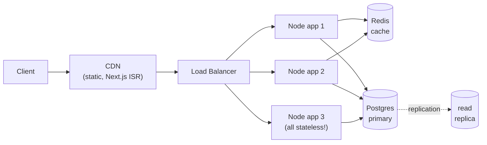
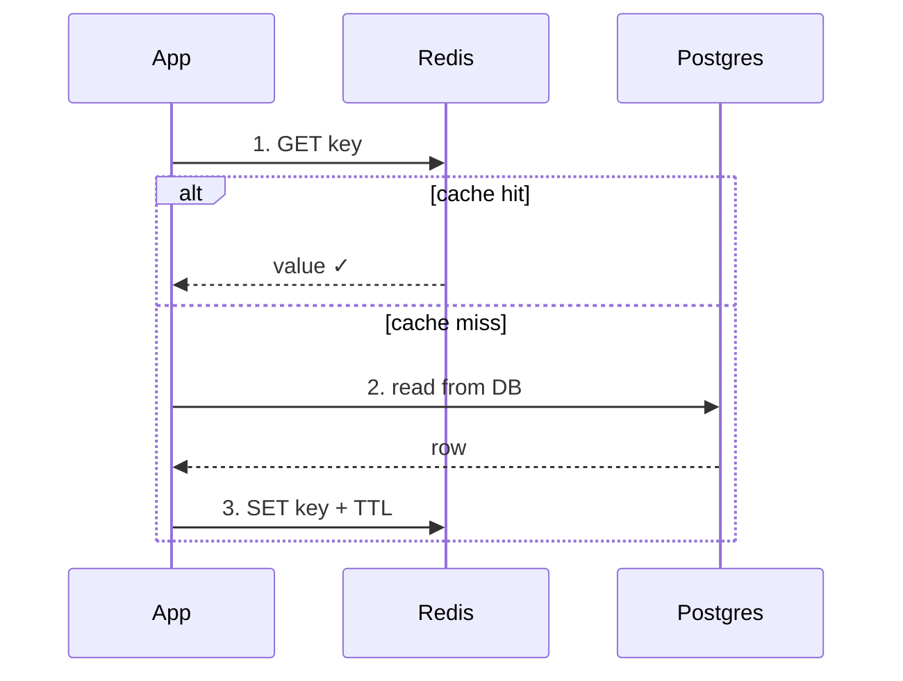
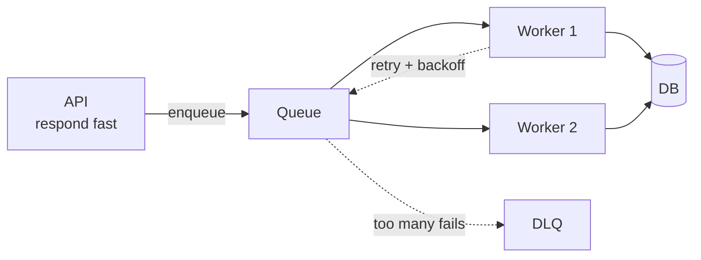

# System Design Basics for Senior Full-Stack Interviews (JS/TS Ecosystem)

- **Researched:** 2026-07-05
- **Target:** Senior Software Engineer (general readiness, no specific company)
- **Sources freshness:** mostly 2025–2026

## TL;DR

- Senior system design interviews are 45–60 min collaborative conversations. You are expected to **drive**: clarify requirements, propose a design, and go deep where it matters — the interviewer follows you, not the reverse.
- The winning structure: **requirements → core entities → API → high-level design → deep dives**, spending most time on 2–3 deep dives where you show real depth.
- Fundamentals you must know cold: load balancing, caching strategies, DB indexing/replication/sharding, queues, CAP/consistency, and idempotency.
- 2025–2026 shift: interviewers now explicitly score **observability, failure modes, and cost** — and roughly half of loops include an AI/LLM-infrastructure-flavored question.
- Your edge: answer everything through your real stack — Node/TypeScript services, Next.js, GraphQL, Prisma, PostgreSQL, Redis, Docker/AWS. Concrete beats generic every time.

## Key Concepts

### How the interview actually runs

You get a prompt ("Design a URL shortener", "Design a notification system") and 45–60 minutes. The proven flow (Hello Interview's delivery framework, widely used in 2025–2026):

1. **Functional requirements** (~5 min) — "Users should be able to…" statements. Pick the 2–3 core features; explicitly park the rest.
2. **Non-functional requirements** — scale (users, QPS, data size), latency targets, consistency needs, availability. Do quick back-of-envelope math here.
3. **Core entities** — the 3–5 nouns your system persists (User, Post, Notification…).
4. **API design** — entities map naturally to REST resources or GraphQL types.
5. **High-level design** — boxes and arrows satisfying the functional requirements end to end.
6. **Deep dives** (~15–20 min) — where senior interviews are won. Attack the non-functional requirements: scaling the hot path, handling failure, keeping data consistent.

At senior level, silence and passivity are penalized. Propose, commit, and justify. There is no single right answer — decisiveness with reasoning is the rubric.

### Scaling the service tier

- **Vertical scaling** (bigger box) is fine early, has a ceiling.
- **Horizontal scaling** (more boxes behind a load balancer) requires **stateless services**: no sessions or user state in Node process memory. Sessions go in a signed JWT or Redis; then any instance can serve any request.
- Node-specific: it's single-threaded per process. Scale within a machine via cluster mode / multiple containers, across machines via a load balancer (ALB, nginx). Never block the event loop — offload CPU work (image resize, PDF gen) to a queue and worker.

The picture to draw first in almost any design — stateless app tier behind a load balancer, cache and database behind that:



### L4 vs L7 load balancers

L4 and L7 come from the OSI model — a standard that describes network communication in 7 layers. For load balancers, only two matter:

- **L4 = Layer 4, the transport layer.** The TCP connection level. At this layer you only see IP addresses and ports (`203.0.113.5:443`) — never the content of the request.
- **L7 = Layer 7, the application layer.** The HTTP level. Here you see the full request: URL (`/graphql`), method, headers, cookies.

**The letter analogy:** a request is a letter.

- An **L4 balancer** is a mail sorter who only reads the envelope (IP + port). Super fast — it never opens anything — but it can only decide "this envelope goes to server 2."
- An **L7 balancer** opens the letter and reads it. Slightly slower, but now it can make smart decisions: `/graphql` → API servers, `/images` → static servers, reject requests with a bad JWT, rate-limit a noisy user.

| | L4 | L7 |
|---|---|---|
| Sees | IP + port only | URL, headers, cookies |
| Speed | Sub-millisecond | Milliseconds (still fast) |
| Examples | AWS NLB, HAProxy (TCP mode) | **nginx (CapRover's proxy)**, Traefik, AWS ALB |
| Use when | Non-HTTP traffic (databases, game servers), extreme throughput | Normal web apps — **the default** |

The two-sentence interview answer: *"L4 forwards TCP connections by IP and port without reading the content — very fast but blind. L7 reads the HTTP request, so it can route by path, check auth, and rate-limit — that's the default for web apps, and it's what I run with nginx on CapRover."*

Senior closer if they push further: big systems chain them — an L4 layer at the front for raw speed, L7 proxies behind it for smart routing. GitHub's load balancer (GLB) is built exactly this way.

> Full deep dive (algorithms, health checks, draining, sticky sessions): see [load-balancers-microservices-online-shop.md](load-balancers-microservices-online-shop.md).

### Caching

Layers, from user inward: browser/CDN (static assets, Next.js ISR pages) → application cache (Redis) → database.

- **Cache-aside** (most common): read cache → miss → read DB → write cache with TTL. You control it; risk is stale data and cache-miss stampedes (fix with locks or request coalescing).


- **Invalidation**: TTLs for tolerable staleness, explicit delete-on-write for correctness-sensitive data.
- Know the numbers: Redis read ~sub-millisecond; a well-indexed Postgres read ~1–5ms. Recent (2026) writing pushes back on reflexive Redis use — a tuned Postgres with PgBouncer often makes a cache layer unnecessary until real scale. Saying that is a senior signal.

### PostgreSQL at scale (your database story)

Escalation ladder — present it in this order:

1. **Indexes + query optimization** — `EXPLAIN ANALYZE` first, always. Most "we need to shard" conversations end here.
2. **Connection pooling** — Postgres connections are expensive (20–100ms to establish; each holds server memory). App-level pool (`pg.Pool`, Prisma's pool) plus **PgBouncer in transaction mode** in front lets thousands of clients share tens of real connections. Critical with serverless/Lambda, where each invocation would otherwise open its own connection.
3. **Read replicas** — streaming replication; writes to primary, reads fan out to replicas. Two clients in code (writer/reader). Caveat: **replication lag** → read-your-own-writes problems; route a user's reads to the primary briefly after their write.
4. **Partitioning** — split huge tables (events, logs) by time or tenant within one database.
5. **Sharding** — split data across databases by key (user_id). Last resort: you lose cross-shard joins and transactions. In 2025–2026 the fashionable answer is "scale Postgres a long way before sharding" (or reach for Citus/managed options like Aurora/Neon).

### Async work: queues and events

Anything slow or failure-prone that the user doesn't need synchronously goes to a **message queue** (SQS, BullMQ on Redis, Kafka for high-throughput streams). Web request → enqueue job → respond fast → worker processes it.



- Benefits: decoupling, retry with backoff, absorbing traffic spikes, isolating failures.
- Must-mention pair: **at-least-once delivery** means duplicates happen, so consumers must be **idempotent** (idempotency key stored with the result; dedupe on it).
- **Event-driven architecture** (services emitting events others react to) is a major 2025–2026 pattern — good for fan-out (order placed → email, analytics, inventory), at the cost of harder debugging and eventual consistency.

### Consistency, CAP, and transactions

- **CAP** in practice: during a network partition you choose consistency (reject some requests) or availability (serve possibly-stale data). Real systems choose per-feature: payments need consistency; a like-count doesn't.
- **Strong vs eventual consistency** — read replicas, caches, and queues all introduce eventual consistency. Name where it appears in your design and why it's acceptable.
- Postgres gives you ACID transactions in one node — a genuinely strong argument for keeping the core in one database (a "modular monolith" core is a respected 2025–2026 position).

### API design: REST vs GraphQL

- REST: simple, cacheable by URL (CDN-friendly), great for public APIs.
- GraphQL: clients pick fields, one round trip for nested data — ideal for product UIs (your Next.js/React Native apps). Costs: HTTP caching is harder, and naive resolvers cause **N+1 queries** — fix with DataLoader batching (or Hasura, which compiles queries to single SQL statements).
- Real-time: **WebSockets** for bidirectional (chat), **SSE** for server-push only (notifications, LLM token streaming), polling as the honest simple option.

### Observability and failure modes (now on the rubric)

Finish every design with: structured logs (with request/trace IDs), metrics (p95/p99 latency, error rate, queue depth), traces across services, and alerts tied to SLOs. Then failure modes: what happens if Redis dies (degrade to DB, don't 500), if a worker crashes mid-job (retry + idempotency), if the DB fails over. Mention timeouts, retries with jittered exponential backoff, and circuit breakers so one slow dependency can't take the fleet down.

## What's Current (2025–2026)

- **AI infrastructure questions went mainstream (2026).** Roughly half of system design loops now include an ML-adjacent prompt ("Design the serving infra for an LLM API"). They test architecture judgment — GPU cost, batching, streaming responses (SSE), caching prompts — not ML theory.
- **Observability and cost are explicit rubric items (2025–2026).** Ending a design without monitoring, on-call debuggability, and rough cost reasoning leaves points on the table.
- **Format changes (2026):** whiteboard-only rounds are mostly gone; collaborative tools (Excalidraw etc.) are standard; Google moved back to in-person to counter AI-assisted cheating.
- **Postgres-maximalism (2025–2026):** the default answer trend is "Postgres until it hurts" — pooling (PgBouncer), replicas, partitioning before reaching for NoSQL or sharding. Cited numbers: single tuned instance fine under ~100GB; add replicas at 100GB–1TB.
- **Edge and serverless are mainstream (2025–2026):** functions in CDNs (Cloudflare Workers, Lambda@Edge) for personalization and auth checks; durable/stateful serverless patterns removed the old "serverless can't hold state" objection.
- **Event-driven architecture keeps growing (2026):** Kafka-style streams for real-time pipelines; know at-least-once + idempotency as its price of admission.

## Likely Interview Questions

### Q: Design a URL shortener (the classic warm-up)

**Answer outline:**
- Requirements: create short link, redirect fast; ~read-heavy 100:1; billions of links → 301/302 latency is the game.
- Entities/API: `Link {slug, targetUrl, ownerId, createdAt}`; `POST /links`, `GET /:slug` → redirect.
- Slug generation: base62-encode an auto-increment ID (or pre-generated key pool) — avoids collision checks; discuss predictability vs randomness.
- Storage/read path: Postgres as source of truth, Redis cache-aside on slug→URL (hot links are a tiny fraction); CDN/edge cache the redirect for the truly hot ones.
- Deep dive hooks: analytics (click events → queue → aggregate, never synchronous), custom slugs (unique constraint + conflict handling).

### Q: Design a rate limiter

**Answer outline:**
- Clarify: per-user or per-IP? Global across instances or per-node? Hard block vs throttle?
- Algorithms: fixed window (simple, bursty at edges), sliding window log/counter, **token bucket** (allows bursts, the usual pick).
- Distributed: counters in Redis (`INCR` + `EXPIRE`, or a Lua script for atomic token bucket) so all Node instances share state.
- Placement: middleware at the API gateway / Express layer; return `429` with `Retry-After`.
- Tradeoff: Redis down → fail open (availability) or fail closed (protect the DB)? Pick and justify — usually fail open with an alert.

### Q: Design a chat app / real-time notification system

**Answer outline:**
- Delivery: WebSockets for chat (bidirectional), SSE for notification push; mobile → APNs/FCM.
- The hard part: WebSocket servers are **stateful** (connection lives on one instance). Route messages across instances with Redis pub/sub or a message broker; keep a connection registry (userId → server).
- Persistence: messages to Postgres (partition by conversation/time at scale); write first, then fan out — offline users catch up on reconnect (cursor/last-seen ID).
- Ordering and dedupe: per-conversation sequence numbers; idempotent writes on client-generated message IDs.
- Scale numbers: 1M concurrent connections ≈ tens of Node instances (~50–100k conns each, tuned); heartbeat/presence via Redis TTL keys.

### Q: Design a news feed (fan-out problem)

**Answer outline:**
- Two strategies: **fan-out on write** (push post into each follower's feed cache — fast reads, expensive for celebrities) vs **fan-out on read** (query followees' posts at read time — no write amplification, slower reads).
- Hybrid answer wins: push for normal users, pull for high-follower accounts; merge at read time.
- Storage: posts in Postgres; feed lists as Redis sorted sets (score = timestamp), capped length.
- Fan-out work is async: post write → queue → workers populate follower feeds.
- Ranking: start chronological; mention a scoring service as an extension, don't design ML you can't defend.

### Q: Your Next.js + GraphQL + Postgres app goes from 1k to 1M users. Walk me through scaling it.

**Answer outline:**
- Measure first: APM/tracing to find the actual bottleneck (usually the DB) — senior answers don't guess.
- Frontend: CDN + Next.js ISR/SSG for cacheable pages; cut SSR work on hot paths.
- API tier: stateless Node/GraphQL containers behind a load balancer; autoscale; fix N+1 with DataLoader (or Hasura's compiled queries); persisted queries + response caching for hot GraphQL operations.
- Database: indexes → PgBouncer → read replicas (mind replication lag / read-your-writes) → partition big tables. Say "sharding is the last resort" out loud.
- Async: move email, media processing, webhooks to queues; add Redis cache-aside on hot reads; finish with observability (p99, error rate, queue depth) and cost notes.

### Q: Design the serving layer for an LLM-powered feature (2026-flavored)

**Answer outline:**
- Clarify: latency target? Streaming UX? Own GPUs or API provider (usually provider — say so, it's the pragmatic senior answer).
- Stream tokens via SSE from a Node service; queue + backpressure in front of the model to smooth spikes; per-user rate limits and token budgets (cost is the scaling dimension).
- Cache aggressively: identical/similar prompt → cached response; semantic cache as an extension.
- Reliability: timeouts, retries on provider errors, fallback model, circuit breaker; log prompts/latency/cost per request for observability.
- Data path: RAG sketch — embeddings in **pgvector** (Postgres again) before reaching for a dedicated vector DB.

## Tradeoffs to Be Ready For

- **SQL (Postgres) vs NoSQL:** Postgres wins on transactions, joins, and one-system simplicity; NoSQL (DynamoDB/Cassandra) wins on effortless horizontal write scale for simple key-access patterns. Default to Postgres; reach for NoSQL with a named access pattern, not vibes.
- **Monolith vs microservices:** monolith (modular) wins on velocity, transactions, and debugging; microservices win on independent scaling/deploys and team autonomy at org scale. 2025–2026 consensus: modular monolith core, extract services when a boundary proves itself.
- **REST vs GraphQL:** REST for public APIs and CDN cacheability; GraphQL for product UIs with nested data and multiple clients (web + React Native). Costs of GraphQL: N+1, cache complexity, query cost control.
- **Hasura vs hand-written GraphQL server:** Hasura wins speed-to-CRUD, permissions, subscriptions out of the box; loses on custom business logic — put logic in Actions/remote schemas, or own that domain in an Express/Node service.
- **Sync vs async (queue):** sync when the user needs the result now; async for anything slow, spiky, or retryable. Price of async: eventual consistency + idempotent consumers.
- **Consistency vs availability:** per-feature, not per-system. Money/inventory → consistent; counters/feeds → available and eventually consistent.
- **Cache vs no cache:** every cache adds an invalidation bug surface. Tuned Postgres + PgBouncer at <5ms reads may not need Redis yet — knowing when *not* to cache reads as senior.
- **Serverless (Lambda/edge) vs containers (Docker on CapRover/ECS):** serverless wins on spiky traffic and zero ops; containers win on long-lived connections (WebSockets), cold-start-sensitive latency, and DB connection management (or add RDS Proxy/PgBouncer).
- **WebSockets vs SSE vs polling:** bidirectional vs server-push-only vs simplest-thing-that-works. Pick the least powerful tool that meets the requirement.
- **Fan-out on write vs read:** write-time fan-out for fast reads, read-time for cheap writes; hybrid for celebrity skew.

## Real-World Cases to Cite

Naming a real company's approach is a strong senior signal. These are safe, well-documented examples:

- **Stripe — idempotency:** every payment API call takes an `Idempotency-Key` header, so a retried charge is applied exactly once. Cite when explaining queue consumers or payment flows.
- **Twitter/X & Instagram — hybrid fan-out:** normal users' posts are pushed to follower feeds on write; celebrity posts are pulled and merged at read time to avoid millions of writes per post.
- **Shopify — modular monolith:** runs one of the world's biggest commerce platforms on a modular monolith, scaled by sharding per shop ("pods"). Great counter to "microservices are mandatory."
- **Figma — Postgres until it hurts:** scaled for years on a single Postgres, then partitioned and sharded it in place instead of migrating to NoSQL. The canonical "scale Postgres first" story.
- **Discord — realtime at scale:** millions of concurrent WebSocket connections; messages route across gateway servers via pub/sub — exactly the chat-app answer pattern.
- **Netflix — failure modes:** popularized circuit breakers (Hystrix) and chaos engineering: assume dependencies fail, fail fast, degrade gracefully.

## Cheatsheet

> **Visual version:** open [system-design-cheatsheet.html](system-design-cheatsheet.html) in your browser — everything visible at a glance: concept cards, whiteboard diagrams, numbers table, decision verdicts, real cases, and progress ticks.

**One-liners:**

- **Load balancer** — spreads requests across stateless instances (round-robin/least-connections); health-checks eject dead nodes.
- **Cache-aside** — app checks cache, on miss reads DB and fills cache with a TTL.
- **CDN** — geographically distributed cache for static assets and cacheable pages.
- **Read replica** — copy of the DB serving reads; lag causes read-your-own-writes issues.
- **PgBouncer (transaction mode)** — multiplexes thousands of client connections onto tens of real Postgres connections.
- **Sharding** — splitting data across databases by key; kills cross-shard joins/transactions; last resort.
- **Idempotency** — same operation applied twice = applied once; mandatory with at-least-once queues (dedupe on an idempotency key).
- **Token bucket** — rate limiting that permits short bursts up to bucket size while enforcing average rate.
- **CAP** — under partition, pick consistency or availability; choose per feature.
- **Circuit breaker** — stop calling a failing dependency so it can recover and you fail fast.
- **Fan-out** — one event delivered to many consumers/feeds, on write or on read.
- **SSE** — one-way server→client stream over HTTP; the standard for LLM token streaming.

**Numbers to sound calibrated:**

| Operation | Ballpark |
|---|---|
| Redis GET | < 1 ms |
| Indexed Postgres read (tuned) | 1–5 ms |
| New Postgres connection | 20–100 ms (why pooling exists) |
| Same-region network hop | ~0.5–1 ms |
| Cross-continent round trip | ~100–150 ms (why CDNs/edge exist) |
| One Node instance, WebSockets | ~50–100k connections (tuned) |
| Single Postgres, no drama | up to ~100 GB / thousands of QPS with indexes + pooling |

**At a glance — where does this work run?**

| | Request/response | Queue + worker |
|---|---|---|
| Best for | User needs result now | Slow, spiky, retryable work |
| Failure story | Error to user, they retry | Automatic retry + DLQ |
| Consistency | Immediate | Eventual + idempotency needed |
| Pick when | Login, checkout confirm | Email, media processing, fan-out, webhooks |

**Snippet to remember (Redis fixed-window rate limit — expand to token bucket verbally):**

```ts
async function allow(userId: string, limit = 100): Promise<boolean> {
  const key = `rl:${userId}:${Math.floor(Date.now() / 60_000)}`; // per-minute window
  const count = await redis.incr(key);
  if (count === 1) await redis.expire(key, 60);
  return count <= limit; // false → respond 429 + Retry-After
}
```

**Memory hooks:**

- Interview flow: **"R-E-A-D Deep"** — Requirements, Entities, API, Design, Deep dives.
- Postgres scaling ladder: **"I Pool Replicas, Partition, Shard"** — in that order, stop as early as possible.
- Queues: *"at-least-once delivery means at-least-twice processing — unless you're idempotent."*
- Cache invalidation: a cache is a lie you've agreed to tell for TTL seconds.
- Fan-out: write-time = mailing letters to every follower; read-time = everyone visits the notice board.
- Close every design with **"MFC"** — Monitoring, Failure modes, Cost. That's the 2026 rubric tail.

## Sources

- [A Senior Engineer's Guide to the System Design Interview — interviewing.io](https://interviewing.io/guides/system-design-interview) — continuously updated, accessed 2026-07-05
- [System Design Delivery Framework — Hello Interview](https://www.hellointerview.com/learn/system-design/in-a-hurry/delivery) — continuously updated, accessed 2026-07-05
- [System Design Interview: The Complete 2026 Guide — System Design Handbook](https://www.systemdesignhandbook.com/guides/system-design-interview/) — 2026
- [System Design Interview Questions for Senior Engineers 2026 — KORE1](https://www.kore1.com/system-design-interview-questions/) — 2026
- [System Design Interview Prep (2026 Guide) — Exponent](https://www.tryexponent.com/blog/system-design-interview-guide) — 2026
- [Top 30 System Design Interview Questions in 2026 — Educative](https://www.educative.io/blog/system-design-interview-questions) — 2026
- [Node.js Connection Pooling in Production: PostgreSQL, Redis, and HTTP — DEV Community](https://dev.to/axiom_agent/nodejs-connection-pooling-in-production-postgresql-redis-and-http-4m76) — 2025
- [7 Ways to Scale PostgreSQL in 2026 (When Each One Breaks) — VeloDB](https://www.velodb.io/glossary/ways-to-scale-postgresql) — 2026
- [Redis vs PostgreSQL Caching: Which Strategy Actually Wins in 2026? — Nordync](https://www.nordync.com/blog/redis-vs-postgresql-caching-2026) — 2026
- [The Complete Guide to System Design in 2026 — DEV Community (Fahim ul Haq)](https://dev.to/fahimulhaq/complete-guide-to-system-design-oc7) — 2026
- [50+ Technical Interview Questions for Full Stack Developers (2025 Guide) — daily.dev](https://recruiter.daily.dev/resources/technical-interview-questions-full-stack-developers-2025-guide/) — 2025
