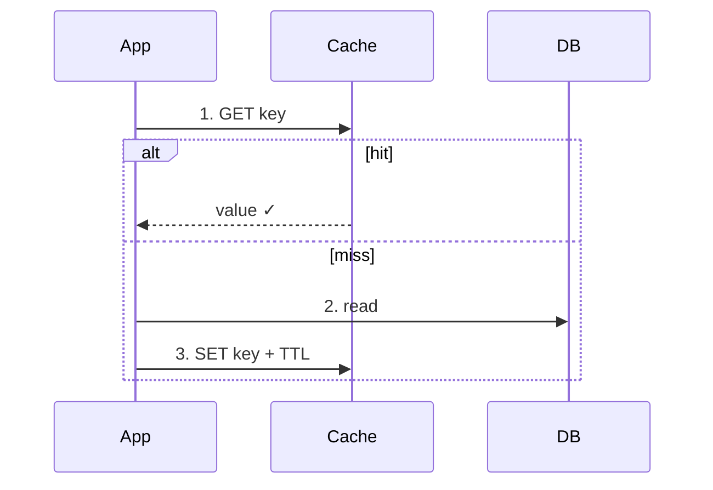

# <Topic Title>

- **Researched:** <YYYY-MM-DD>
- **Target:** <role, e.g. Senior Software Engineer> at <company, if known>
- **Sources freshness:** <e.g. mostly 2025–2026>

## TL;DR

- <Max 5 bullets. The whole topic in 30 seconds.>

## Key Concepts

<Explain each core concept simply, as if to an intelligent beginner. Short paragraphs. One `###` subsection per concept. Include a small TypeScript/SQL snippet where it helps. For the 2–3 most important flows, add a Mermaid diagram — never ASCII line art (it breaks in markdown viewers). Use `flowchart` for architecture, `sequenceDiagram` for flows, with a one-line caption above. Example:>



## What's Current (<year>)

<What changed recently: new patterns, tool versions, deprecations, shifts in best practice. State the year for each claim so freshness is obvious.>

## Likely Interview Questions

<For each question: the question, then a model answer outline framed in the user's stack (React, Next.js, GraphQL, Prisma, PostgreSQL). Outline = the 3–5 points a strong answer hits, not a script to memorize.>

### Q: <question>

**Answer outline:**
- <point 1>
- <point 2>
- <point 3>

## Tradeoffs to Be Ready For

<Senior interviews are won on tradeoffs. List the "X vs Y" decisions in this topic and when you'd pick each. Example: "Hasura vs hand-written GraphQL server: Hasura wins on speed-to-CRUD, loses on custom business logic — put logic in Actions/remote schemas or move that domain to your own server.">

## Real-World Cases to Cite

<4–6 well-documented company examples relevant to the topic. Naming real cases is a senior signal. Format:>

- **<Company> — <topic tag>:** <what they did and when to cite it. Example: "Stripe — idempotency: every payment API call takes an Idempotency-Key header, so a retried charge applies exactly once.">

## Cheatsheet

> **Visual version:** open [<topic-slug>-cheatsheet.html](<topic-slug>-cheatsheet.html) in your browser — concept cards, diagrams, numbers, decision verdicts, and real cases, all visible at a glance with progress ticks. (See `notes/system-design-cheatsheet.html` for the reference implementation. Rule: no hidden/flip content — everything readable without tapping.)

<Quick-recall section — skimmable 10 minutes before the interview. Use whichever of these fit the topic:>

**One-liners** (definition in one sentence each):

- **<Term>** — <one sentence>.
- **<Term>** — <one sentence>.

**At a glance** (comparison table):

| | Option A | Option B |
|---|---|---|
| Best for | ... | ... |
| Weakness | ... | ... |
| Pick when | ... | ... |

**Snippet to remember:**

```ts
// The 5-line version of the pattern
```

**Memory hooks:**

- <Analogy or mnemonic. Example: "GraphQL resolver waterfall = ordering each dish separately; DataLoader = giving the kitchen the whole order at once.">

## Sources

- [<Title>](<url>) — <publication date>
- [<Title>](<url>) — <publication date>
